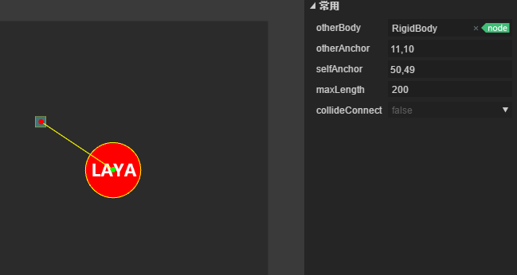

# 焊接关节，绳索关节，鼠标关节

### 1. 焊接关节

​        焊接关节`WeldJoint`：使两个物体不能相对运动，两个刚体的相对位置和角度都保持不变，像一个整体。

##### 属性说明

##### otherBody

[首次设置有效]关节的连接刚体。

##### anchor

[首次设置有效]关节的链接点，是相对于自身刚体的左上角位置偏移。

##### frequency

弹簧系统的震动频率，可以视为弹簧的弹性系数。

##### damping

刚体在回归到节点过程中受到的阻尼，取值0~1

##### collideConnect

[首次设置有效]两个刚体是否可以发生碰撞，默认为false

#### 实例演练

​        焊接关节比较简单，就是把两个刚体在一个点固定起来，像焊接一样（注意，这个焊接也是有弹性的 ）

我们新建一个场景，在场景中拖入一个box拉成长条作为地面，并添加boxcollider，将刚体类型设置为static静态类型。再拖入一个三角形和一个梯形并添加polycollider，并设置好碰撞尺寸（多边形需要自行设置形状），如图:

 保存场景后运行，我们会看到受到重力及碰撞效果

做好这一步之后，我们给三角形添加一个焊接关节：并将梯形拖入关节的otherbody中

这样就把两个刚体焊接在一起了，保存运行，我们将看到效果：

### 2.绳索关节

​     绳索关节`RopeJoint` ：限制两个点之间的最大距离。即使在很大的负载下也阻止连接的物体之间的拉伸。

##### 属性说明

##### otherbody

[首次设置有效]关节的连接刚体。

##### anchor

[首次设置有效]关节的链接点，是相对于自身刚体的左上角位置偏移。

##### frequency

弹簧系统的震动频率，可以视为弹簧的弹性系数。

##### damping

刚体在回归到节点过程中受到的阻尼，取值0~1。

##### collideConnect

[首次设置有效]两个刚体是否可以发生碰撞，默认为false。

#### 示例演练

​              绳索关节的用法和距离关节类似，在场景中拖入一个方块和一个圆，添加相应的boxcollider 和circlecollider，给圆形添加一个绳索关节，并设置距离（设置的长度要大于两个物体的距离），我们会看到区别于距离关节的单摆效果，绳子是可以收缩，限制最大距离。

运行效果如下：  

​	

### 鼠标关节

​        鼠标关节`MouseJoint`：用于鼠标操控物体。它试图将物体拖向当前鼠标光标的位置。而在旋转方面就没有限制。

##### 属性说明

##### anchor

[首次设置有效]关节的链接点，相对于自身刚体的左上角位置偏移，如果不设置，则鼠标点击点作为连接点。

##### maxForce

鼠标关节在拖曳刚体bodyB时施加的最大作用力。

##### frequency

弹簧系统的震动频率，可以视为弹簧的弹性系数。

##### damping

刚体在回归到节点过程中受到的阻尼，取值0~1。

#### 示例演练

​     继续用之前的场景，在梯形节点添加一个鼠标关节，也可以加给其他对象，如图：

只需添加就有效果，最简单的关节就是鼠标关节，下面我们来运行，看一下这些关节的效果：

我们可以看到鼠标拖拽的作用下的效果，焊接关节，鼠标关节都是有弹力的。

附上组合效果图，更多组合请开发者自行完成.

更多问题请访问社区http://ask.layabox.com