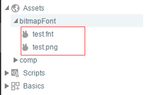
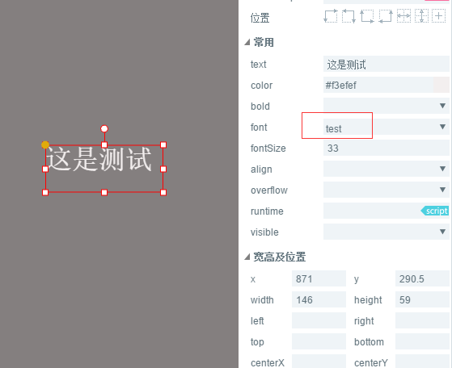

# 位图字体的制作与使用

用过Starling或者Cocos,甚至Unity的，大家对位图字体肯定不会陌生，简单的一张图片，放入自定义的文本，就可以在项目中做出好看的文本显示效果。在LayaAir 同样支持位图字体的使用与显示。下面是位图字体在LayaAir中的使用效果。

### 制作位图字体

1.将需要导出使用的文字写在一个txt文本内。

</br>

2.选择文件->另存为Unicode编码的txt文件。

</br>

3.下载安装 windows下免费的位图字体制作工具 Bitmap Font Generator。
 下载地址：[http://www.angelcode.com/products/bmfont/](http://www.angelcode.com/products/bmfont/install_bmfont_1.13.exe)

 4.打开软件，选择 Opotion->FontSetting，来设定需要导出的字体的常规设置，设置完毕后点击 OK 按钮保存。

</br>

**重要参数说明：**

 Font：导出的位图字体使用的字体。
 Size：设置导出的位图字体使用的字体大小。建议在使用时需要多大的字就在此处设置相同大小的字号。
 Height：设置字体的拉伸高度，保持默认的100%就可以。
 *注意：Charset的值选择Unicode。*

</br>

5.在选择菜单栏 Edit->Select chars from file，选中刚才创建的txt文件，如果有提示失败，请检查txt文件是不是unicode编码的文件以及字体是否包含文本内的字体。

</br>

 6.设置导出样式，选择菜单栏的 Options->Export Options ，打开Export Options 设置导出选项，设置完毕后点击OK按钮保存。

 Padding：文字的内边框，或者理解为文字的周边留空要多大。做后期样式时这个属性很重要，需要预留空间来给描边、发光等特效使用。比如预计要加一个2px的边框，然后加一个右下角2px的投影效果，所以设定了padding:2px 4px 4px 2px。
 Bit depth：必须32位，否则没有透明层。
 Presets：字体初始化预设的颜色通道设定，也就是说字体的初始颜色设定是什么样的，建议都用白色字，可以直接设定为White text with alpha，即白色字透明底。
 Font descriptor：字体描述文件，选择 xml。
 Textures：纹理图片格式，选择 png。

</br>

7.导出位图字体。选择菜单栏的 Options->Save bitmap font as…，导出生成的是一个字体描述文件（.fnt格式）和一个字体纹理图文件（.png格式）。


### 在LayaAir项目中使用位图字体

1.把资源放在项目的输出目录下。
 把制作导出的位图文件修改为同一名字（.fnt 文件和.png文件），然后放到LayaAir项目的bin/h5目录下。

</br>

如图：把test_0.png名字改为test.png,保证跟fnt文件同名。再把test.png和test.fnt文件放到H5目录下。

**位图字体在 LayaAir项目中的常规使用方法：**

1.创建位图字体对象。

2.加载位图字体，并侦听是否完成。

3.注册位图字体。

4.使用字体。

下面是一个完整的示例运行的效果。

</br>

完整代码如下所示：

```typescript
//初始化引擎
Laya.init(550,400);
//自定义文件名称
var mFontName = "diyFont";
var mBitmapFont = new Laya.BitmapFont();
//这里不需要扩展名，外部保证fnt与png文件同名
mBitmapFont.loadFont("res/test.fnt",new Laya.Handler(this,onLoaded));
function onLoaded(){
init();
}
function init(){
//如果位图字体中，没放空格，最好设置一个空格宽度
mBitmapFont.setSpaceWidth(10);
Laya.Text.registerBitmapFont(mFontName,mBitmapFont);
var txt = new Laya.Text();
txt.text = "asdfghjk";
//设置宽度，高度自动匹配
txt.width = 250;
//自动换行
txt.wordWrap = true;
txt.align = "center";
txt.color = "ff00ff";
//使用我们注册的字体
txt.font = mFontName;
txt.fontSize = 50;
txt.leading = 5;
Laya.stage.addChild(txt);
}
```

### **Text 类中相关接口：**

**registerBitmapFont () 方法**

public static function registerBitmapFont(name:String, bitmapFont:BitmapFont):void

注册位图字体。

参数

 name:String — 位图字体的名称。
 bitmapFont:BitmapFont — 位图字体文件。

**unregisterBitmapFont () 方法**

public static function unregisterBitmapFont(name:String, destory:Boolean = true):void

移除注册的位图字体文件。

参数

 name:String — 位图字体的名称。
 destory:Boolean (default = true) — 是否销毁当前字体文件。

### BitmapFont 类里的相关接口：

**loadFont () 方法**

public function loadFont(path:String, complete:Handler):void

通过指定位图字体文件路径，加载位图字体文件。

参数
 path:String — 位图字体文件的路径。
 complete:Handler — 加载完成的回调，通知上层字体文件已经完成加载并解析。

**parseFont () 方法**

public function parseFont(xml:XmlDom, texture:Texture):void

解析字体文件。

参数

 xml:XmlDom — 字体文件XML。
 texture:Texture — 字体的纹理。

**destory () 方法**

public function destory():void

销毁位图字体，调用Text.unregisterBitmapFont 时，默认会销毁。

**setSpaceWidth () 方法**

public function setSpaceWidth(spaceWidth:Number):void

设置空格的宽（如果字体库有空格，这里就可以不用设置了）。

参数

 spaceWidth:Number — 宽度，单位为像素。


### 在LayaAir IDE中使用位图字体

1.将字体文件放到 LayaAir IDE 项目的资源目录中（laya/assets/），要保证两个文件名相同，如 test.fnt、test.png，这样就自动注册了名为 test 的位图字体。

</br>

2.将要设置位图字体的文本组件的 font 属性值设置为已导入编辑器的位图字体的名称。

</br>

3.在程序代码里实例化使用了位图字体的页面之前，需要先创建并注册页面内使用到的位图字体。