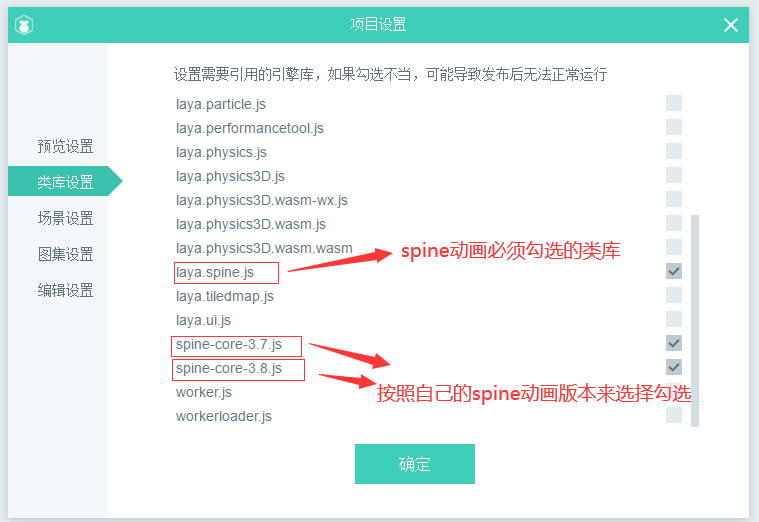
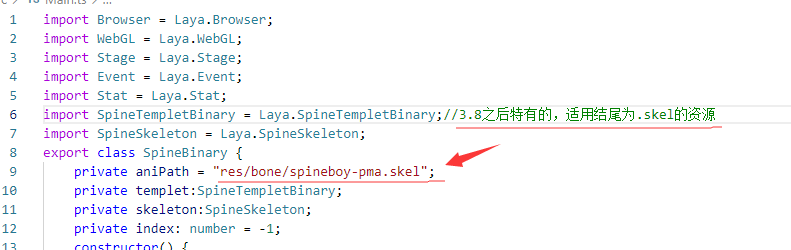

# LayaAir引擎适配版Spine骨骼动画使用

> *本篇采用LayaAirIDE 2.12.0版本截图说明，如有差异，请下载最新稳定版本的LayaAirIDE，并以最新版本为准。*

在2.12.1beta版的LayaAir中我们将免费开放Spine骨骼动画适配版，本篇文章我们将详细介绍如何在新版本中使用适配版Spine。


## 一、适配版Spine的介绍

### 1、适配版Spine格式

适配版Spine可以直接适配Spine，无需转换为LayaAir引擎格式，直接对spine的文件进行使用支持


### 2、适配版Spine版本的支持

适配版支持到3.4~3.8（含）以下的版本导出资源。


### 3、适配版Spine支持的功能列表

以下为适配版中支持的常用功能：

> - 支持图片裁剪功能。
> - 支持继承要同时选择旋转跟位移。
> - 支持动画的部位以及整体换色。
> - 支持路径动画。
> - 解除LayaAir引擎对骨骼数量255限制。
> - 解决美术制作动画对IK帧限制。
> - 支持 spine动画融合、蒙皮功能。
> - 支持spine插槽混合模式中除正常以外的另外三个“相加””相乘””滤色”。
> - 支持spine软件对插槽颜色和透明度的动画控制。

还有一些其他的功能也是可以使用的，但是未经过我们的测试，需要开发者自己去尝试


### 4、适配版Spine动画播放模式

在下面的示例代码中有一段代码

```typescript
this.skeleton = this.templet.buildArmature();
```

与内置版Spine动画播放模式不同的地方在于内置版我们需要传一个参数来确认使用哪种模式（三种模式中，0:不支持换装,1,2支持换装），而在适配版中我们使用的是Spine官方的适配方式，所以可以不用传参数了。


### 5、适配版Spine类库设置

在新版本之后使用适配版spine的时候，开发者需要在IDE中的引擎库中按照自己的需求勾选需要的类库spine-core-3.7.js或者spine-core-3.8js，不管是用的是3.8以后还是3.7之前的spine，都需要勾选上laya.spine.js。




在代码中使用时，我们在使用适配版Spine时需要引用指定的类有`Laya.SpineSkeleton`、`Laya.SpineTemplet`和`Laya.SpineTempletBinary`。

其中，`Laya.SpineSkeleton`是spine骨骼动画必须要引用的类，这里封装了spine的runtime库。

`Laya.SpineTemplet`和`Laya.SpineTempletBinary`是用于资源，它们的区别是：当使用资源为.json结尾的时候需要引用的是`Laya.SpineTemplet`，使用资源为.skel格式的时候需要引用的是`Laya.SpineTempletBinary`。

如图所示因为用到的是.skel结尾的资源，所以我们引用的是`Laya.SpineTempletBinary`。





## 二、适配版Spine的使用

### 1、适配版Spine动画模板

适配版Spine和内置版Spine在使用时也是需要模板这个概念，在LayaAir引擎中模板是一种特别的概念，表示一种数据结构，这种数据结构可以被复用。骨骼动画就使用到了模板，对于同一个动画来说，可以只创建一个动画模板，然后实例多个播放的实例，这样内存中就只有一份的动画数据，但是却可以在舞台上显示多个动画。

代码示例：

```typescript
class SpineBinary {
	constructor() {
		this.aniPath = "res/bone/spineboy-pma.skel";
		this.index = -1;
		Laya.init(Browser.width, Browser.height, WebGL);
		Laya.stage.scaleMode = Stage.SCALE_NOSCALE;
		Laya.stage.bgColor = "#232628";
		Stat.show();
		this.startFun();
	}
	startFun() {
		this.templet = new SpineTempletBinary();
		this.templet.loadAni(this.aniPath);
		this.templet.on(Event.COMPLETE, this, this.parseComplete);
		this.templet.on(Event.ERROR, this, this.onError);
	}
	parseComplete() {
		this.skeleton = this.templet.buildArmature();
		Laya.stage.addChild(this.skeleton);
		this.skeleton.pos(Browser.width / 2, Browser.height / 2 + 100);
		this.skeleton.scale(0.5, 0.5);
		this.skeleton.on(Event.STOPPED, this, this.play);
		this.play();
	}
	onError() {
		console.log("parse error");
	}
	play() {
		console.log("1111111111");
		if (++this.index >= this.skeleton.getAnimNum()) {
			this.index = 0;
		}
		this.skeleton.play(this.index, false, true);
	}
}
```

具体效果大家可以在官网引擎事例中查看。https://layaair2.ldc2.layabox.com/demo2/?language=zh&category=2d&group=Skeleton&name=SpineAdapted


