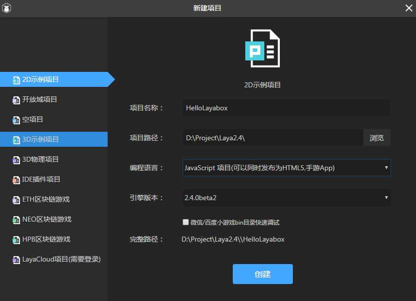
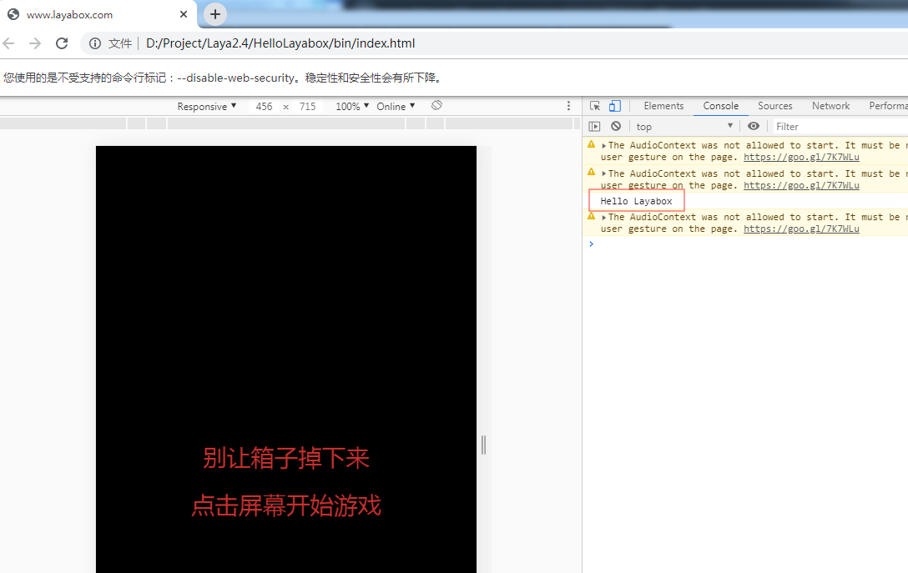
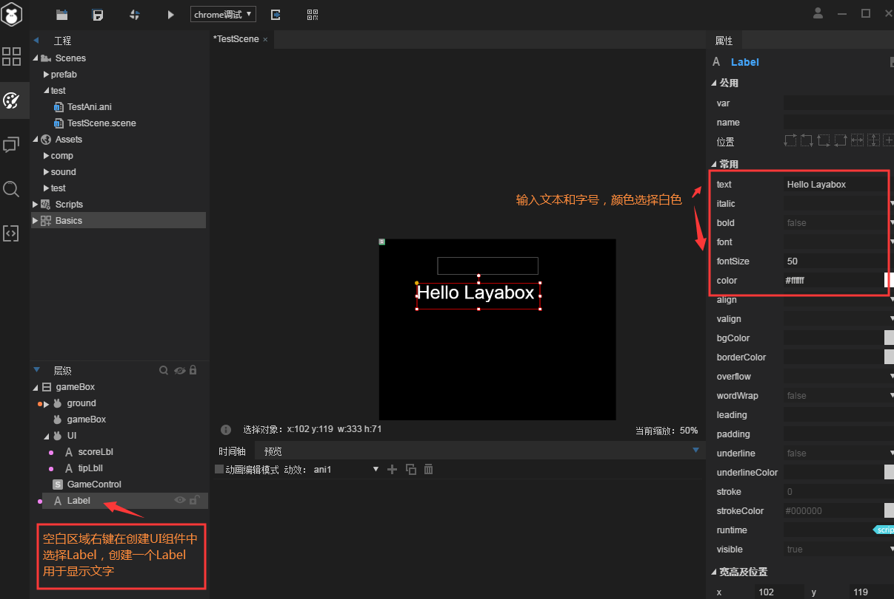

# 第一个程序：显示“Hello Layabox”

 **【提示】阅读本文前，必须先阅读《搭建开发环境（TS代码编译器）》和《创建TS项目并详解目录结构》两篇。**


​    **步骤一**：打开LayaAirIDE2.0以上版本，点击''新建''，设置好路径和项目名称选择Ts语言，创建一个2D示例项目：

​	<br/>

然后用VSCode打开文件夹，选择刚才创建的项目目录：


​         **步骤二**：点击打开src目录下的Main.ts，开始编写如下代码：

```typescript
onConfigLoaded(): void {
		//加载IDE指定的场景
		GameConfig.startScene && Laya.Scene.open(GameConfig.startScene);

		console.log("Hello Layabox");//写这一行代码，在控制台打印Hello Layabox
	}
```

​    

​     **步骤三**：编码完成后按Ctrl+S 保存，Mac电脑按Command + S保存，切换到LayaIDE编辑器，按F6编译运行，在弹出的页面里其实是一个2D打球示例，我们要在Chrome浏览器按F12，在控制台里看到打印信息：

​	<br/>
​	图（2）


​        **步骤四**：我们可以看到打印出了HelloLayabox，显示成功后，关闭显示窗口。我们继续打开IDE编辑器，点开左上角工程栏目，Scene下的test文件夹，双击‘TestScene.scene’ （引擎会默认启动当前场景），在左下方层级栏目创建一个“Label”，如图中步骤，并设置好文本内容HelloLayabox，字体大小以及颜色，本例为白色：

 

**步骤五**： 制作完成后，再次按F6编译运行，运行结果如下图所示：
​	<br/>
​	图（3）

**至此，如果您能跟随本篇入门教程，完成上图的显示，恭喜您入门成功，我们已经完成了第一个采用TypeScript语言开发的LayaAir引擎HTML5程序。更多LayaAir引擎开发的API使用方法，请前往官网Layabox开发者中心查看在线API与引擎示例。**

**TypeScript相关知识请访问[https://www.tslang.cn/docs/home.html](https://www.tslang.cn/docs/home.html) 中文网，此网址要保存，常用！很多问题都可以看这个来解决**