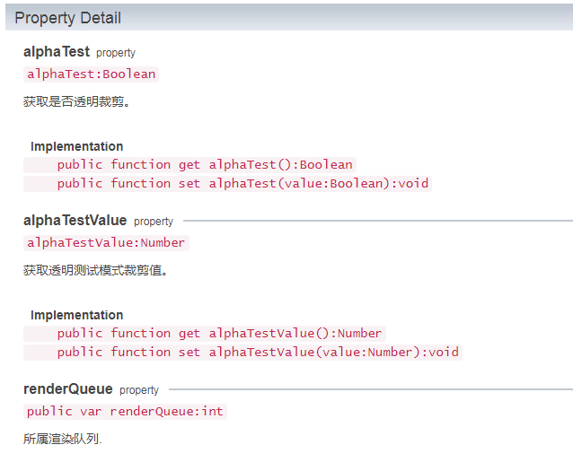

# BaseMaterial基础材质

###### *version :2.1.0beta   Update:2019-5-14*

`BaseMaterial`是所有材质的父类，他定义了一些常用的属性，如一些常用的渲染模式，对应的加载接口，还有常用的渲染模式。

 (图1)

常用的渲染模式有：**RENDERQUEUE_OPAQUE** 不透明，**RENDERQUEUE_ALPHATEST** 透明裁剪， **RENDERQUEUE_TRANSPARENT** 透明，这三种模式。

> 注意：子类材质的`rendermode`接口只是对父类BaseMaterial渲染模式的封装和实现，需要开发者自己查看对应的API接口。

讲完了材质的基础功能，后面我们再来详细介绍各种常用的材质。
