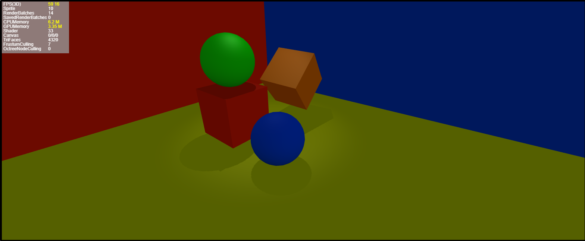

# 聚光灯实时阴影

###### *version :2.7.0beta   Update:2020-6-06*

在2.7.0beta LayaAir引擎中，新增了聚光灯的实时阴影，聚光灯实时阴影的使用方式和平行光实时阴影的使用方式是相同的。具体参数和属性，不再赘述，可参考技术文档《如何为灯光添加阴影》。

以下仅展示官网聚光灯实时阴影的示例代码和效果：

```typescript
 receaveRealShadow(scene3d)
 {
   var childLength = scene3d.numChildren;
   for(var i = 0;i<childLength;i++)
   {
     var childSprite = scene3d.getChildAt(i);
     if(childSprite instanceof MeshSprite3D)
     {
       //设置精灵接收阴影
       childSprite.meshRenderer.receiveShadow = true;
       //设置精灵可投射阴影
       childSprite.meshRenderer.castShadow = true;
     }
     else if(childSprite instanceof SpotLight)
     {
       //设置实时阴影的阴影模式
       childSprite.shadowMode = ShadowMode.Hard;
       //设置灯光产生阴影的范围
       childSprite.shadowDistance = 3;
       //设置阴影贴图的分辨率
       childSprite.shadowResolution = 512;
       //设置阴影贴图基于深度的偏移
       childSprite.shadowDepthBias = 1.0;
     }
   }
 }
```


聚光灯实时阴影效果如下图所示:



