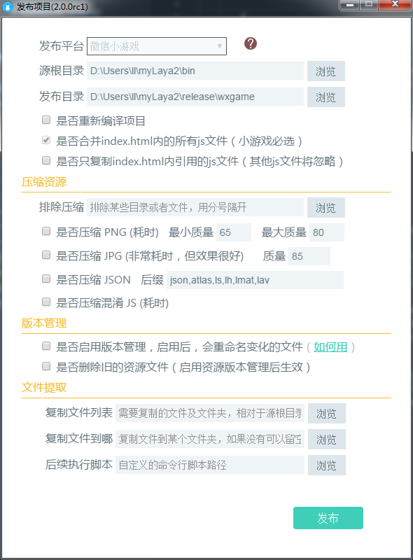

##资源版本管理功能介绍

从1.7.15beta开始，打开发布界面，最后一项是管理**是否启用版本管理**的功能。

 

​	启用版本管理之后，将会生成带hash的文件名，并生成一个version.json的文件名映射文件，在项目中可以通过使用ResourceVersion类进行版本控制，使用版本控制之后就会在加载时自动去加载带hash的文件名。

未打包的项目：

打包后的项目：


代码中通过ResourceVersion类加载管理资源版本

以下为具体的使用代码示例：

```java

		//初始化引擎
		Laya.init(600, 400);
		//设置版本控制类型为使用文件名映射的方式
		Laya.ResourceVersion.type = Laya.ResourceVersion.FILENAME_VERSION;
		//加载版本信息文件
		Laya.ResourceVersion.enable("version.json", Laya.Handler.create(this, beginLoad));
		
		function beginLoad()
        {
			//加载引擎需要的资源
			Laya.loader.load([{url: "res/atlas/comp.atlas", type: Laya.Loader.ATLAS}], Laya.Handler.create(this, onLoaded));
		}
		
		function onLoaded() 
        {
			//实例UI界面
			var testView:TestView = new TestView();
			Laya.stage.addChild(testView);
		}

```

程序运行实际的加载图
