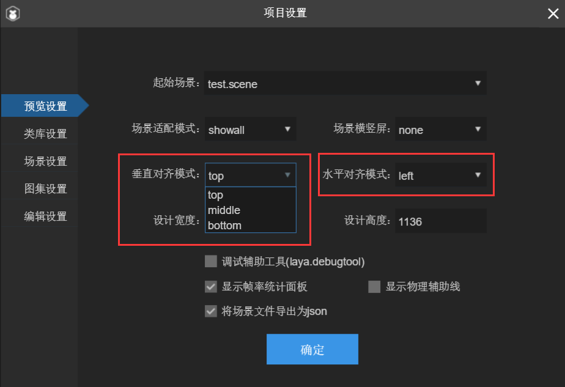

# 画布对齐模式：水平对齐与垂直对齐

> Author: Charley

关于对齐模式，引擎中的提供的alignH（水平对齐）与alignV（垂直对齐）是对画布进行对齐。这个对齐，只有在画布非全屏适配的模式（showall和noscale）里才有价值，否则设置了也看不到效果，因为全屏适配的情况下，画布已经铺满全屏了，如何设置已经没有了意义。所以本文的画布对齐千万不要混淆成舞台内的UI对齐。

> Tips: 舞台内的对齐，要使用UI的相对布局组件，具体使用请查看UI组件的相关文档与API

下面我们先了解一下API的参数说明，再通过示例代码进行介绍。

参数说明如图1所示：

​	 
​	图（1）屏幕适配的对齐模式

通过API，我们了解到，水平对齐与垂直对齐都分别有三个属性值参数。

当然，我们也可以通过常量值赋值给alignH与alignV。常量赋值的好处就是可以通过代码提示来编写。下面我们再看一下API中的画布对齐常量值，如图2所示。

​	 
​	图（2）对齐模式中的常量属性

在LayaAir 2.x的IDE中，其实在IDE也可以方便的去设置这个对齐。我们更建议在IDE里通过快捷键F9进入项目设置面板来设置。如图3所示。

 

​	图（3）IDE中的画布对齐模式设置

假如，开发者没有使用LayaAirIDE，也可以在代码中进行设置。

在引擎的官网示例中，我们不仅可以查看效果，也可以去改变参数值去感受变化。

示例链接如下：

[https://layaair2.ldc2.layabox.com/demo2/?language=zh&category=2d&group=SmartScale&name=Align_Contral](https://layaair2.ldc2.layabox.com/demo2/?language=zh&category=2d&group=SmartScale&name=Align_Contral	)	图（3）示例的运行结果