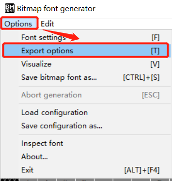
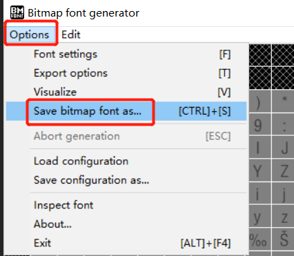
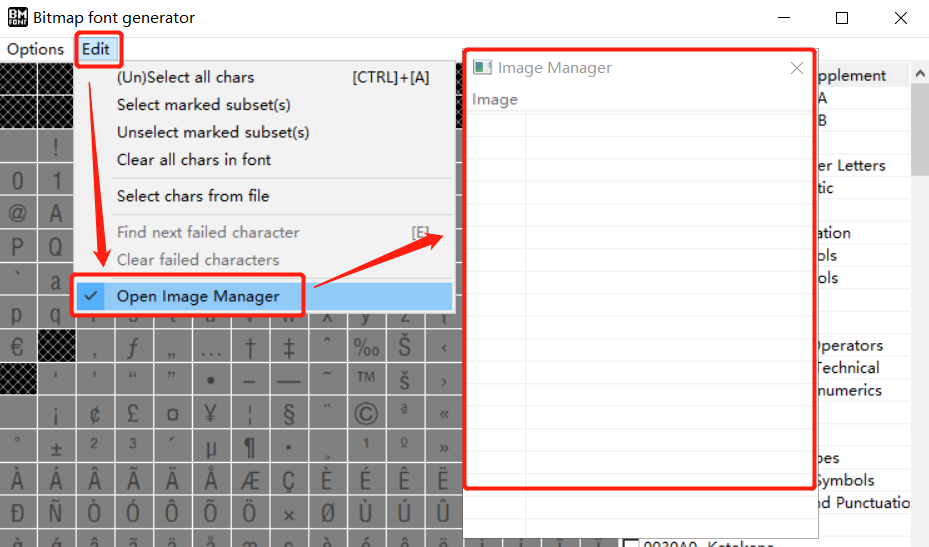
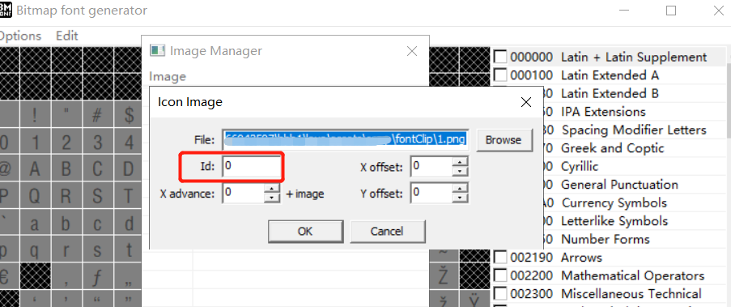
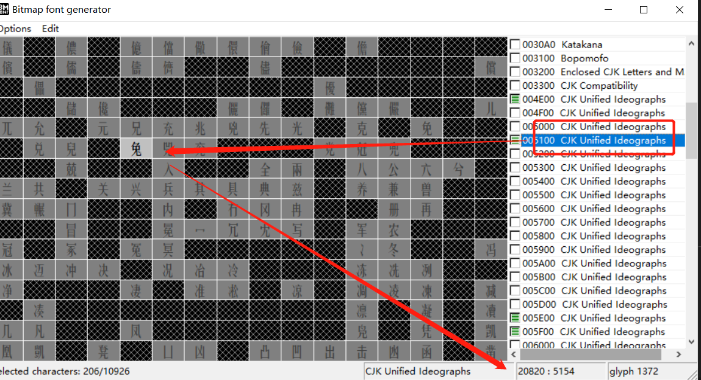
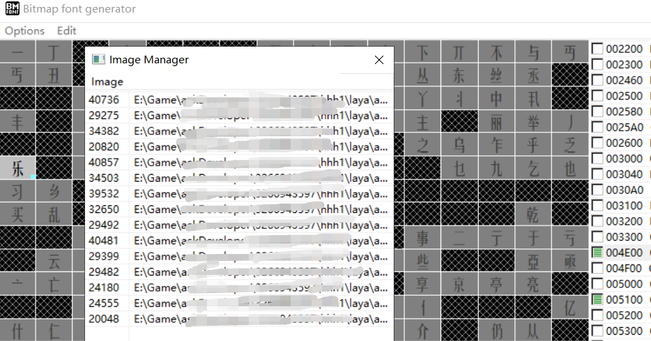
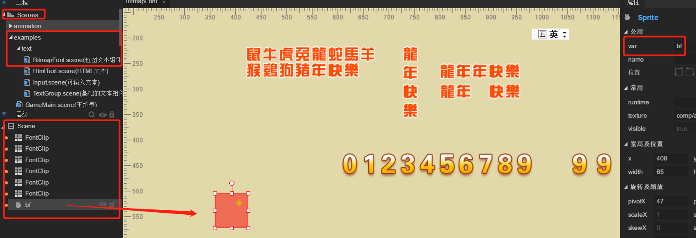

# 位图字体的制作与使用

> update: 2020-11-13

位图字体的本质是位图，就是以位图的形式去表现字体效果，这样，就可以解决到一些字体在不同平台由于用户没有安装而无法使用的问题，另外也有的字体，在不同浏览器或者平台也会有显示差异的问题，就是chrome浏览器，低版本与高版本也可能会存在像素级的显示偏移，这些全都属于字体的兼容性问题。而这些问题，当文本的复杂度要求不高时，都可以通过位图字体来解决。

> 像聊天室这种无法固定好文本内容的场景就不能适用了。

LayaAir引擎支持位图字体的使用与显示。本篇将引导开发者如何通过第三方工具 Bitmap Font Generator来制作位图字体并在LayaAir引擎中使用。

### 一、下载并安装字体制作工具

下载安装 windows下免费的位图字体制作工具 Bitmap Font Generator。
 下载地址：[http://www.angelcode.com/products/bmfont/](http://www.angelcode.com/products/bmfont/install_bmfont_1.13.exe)

>  Bitmap Font Generator工具当前仅支持window系统


### 二、使用字体库中的字体来制作位图字体

制作位图字体有两种方式，一是用字体库的字体来制作位图字体，二是用美术设计的位图美术字来制作位图字体。我们先来介绍用字体库中的字体来制作位图字体。

#### 第一步：准备好要用的字体文本

制作位图字体，因为不是把每一个字体都要导出为位图字体，那样的位图就太大了，也没有意义。所以就用多少准备多少。

把我们在游戏中可能用到的文本都放到一个`.txt`后缀的文本里就可以了。

例如下图所示：

 

#### 第二步： 改变为Unicode编码(**UTF-16 LE**)

txt文本必须要存为Unicode编码格式才可以，如果我们不能确认编码是不是正确的，那就另存为的时候选择一下编码类型。如下图所示。

 

这里提醒一下，有一些操作系统是没有Unicode编码的，那是因为windows后来系统升级后，旧系统的Unicode编码模式没有了。我们去选择**UTF-16 LE**也是可以的。

#### 第三步：字体的设置

在这一步里，我们要设置字体的导出配置项，当导出位图的时候要采用什么字体，字体的大小，源文本字符的编码等等，要在这一个步骤里配置。

我们打开打开软件，选择 `Opotion` -> `Font Settings`，如下图所示。

 

打开的设置面板如下图所示：

 

**`Font Settings`面板的重要参数说明：**

| 参数名称 | 说明                                                         |
| -------- | ------------------------------------------------------------ |
| Font     | 下拉选项中有当前windows系统中已安装好的字体，在这里选择使用要导出的位图字体 |
| Charset  | 这里必须要用Unicode，不得更改。                              |
| Size     | 设置导出的位图字体使用的字体大小。使用的时候需要多大，这里就设置多大。 |
| Height   | 设置字体的拉伸高度，保持默认的100%就可以。                   |

设置完以上这些，直接点OK，保存退出该界面。


#### 第四步：导入源字符文件

在这个步骤里，我们把之前保存为Unicode编码的txt文件，导入到位图字体制作的工具里。

菜单栏的操作步骤为：`Edit` -> S`elect chars from file`，如下图所示，选中之前输入了文字或字符准备要转换的txt文本文件。

 

如果有提示失败，请检查txt文件是不是unicode编码(**UTF-16 LE**)的文件，以及使用的字体是否包含了选中的txt文本文件内的内容。

#### 第五步：设置导出选项

 这是最后一个关键步骤，这里配置一些位图文本的导出样式效果，以及导出的格式。

我们先通过菜单栏的 `Options`->`Export Options` ，打开Export Options 设置导出选项，如下图所示：

 

打开后效果如下图所示：

 

在这个界面里，我们仍然来介绍一下重要的参数。

| 参数名称        | 说明                                                         |
| --------------- | ------------------------------------------------------------ |
| Bit depth       | 必须为32位，否则没有透明层。                                 |
| Presets         | 字体的初始颜色。如果用白色字，可以设定为`White text with alpha`，即白色字透明底。 |
| Width           | 导出的位图宽度                                               |
| Height          | 导出的位图高度                                               |
| Font descriptor | 字体描述文件，必须要选择 xml                                 |
| Textures        | 纹理图片格式，必须要选择 png                                 |

#### 第六步：导出位图字体

完成以上这些配置步骤后，就可以导出位图字体了。

选择菜单栏的 `Options`-> `Save bitmap font as…`，如下图所示：

 

在另存为的窗口，选择要保存位图字体文件的目录，起好文件名，点击保存即可导出生成一个字体描述文件（.fnt格式）和一个字体纹理图文件（.png格式）。

### 三、使用位图来制作位图字体

#### 第一步：准备好单张的位图

要通过位图来制作位图字体，那就要把想要使用的所有要用到的文本文字或字符都以单图的形式准备好，

单图效果如下所示：

 

#### 第二步：制作位图字体

在这个步骤里，我们要把位图导入工具，并对应好文本的ID信息。

打开Bitmap Font Generator工具，依次点击`Edit` -> `Open Image Manager`，打开字符ID绑定位图的界面，如下图所示：

 

在弹出的Image Manager面板里，点击Image菜单中的Import image选项，将需要用到的单张位图导入进来。

 

当选中其中一个位图后，会出现一个绑定该位图信息的面板，其中最核心的就是Id值，如下图所示：

 

这个Id值，在面板中就可以看到，如果是数字则比较好找。因为比较靠前，

但是中文汉字的话，那就多了。找起来也比较费劲。

这个时候，可以按上个小节里的导入文本txt方式，先把位图对应的文字或字符写到txt文本里，然后再通过分别点击菜单`Edit` -> S`elect chars from file`的操作方式。把txt文本导入到工具里。此时我们注意右侧绿色选中态的，其实就是对应着txt文件字符的文本，如下图所示：

 

正如上图箭头所指，当我们选中005100那一行之后，可以快速定拉到`兔`这个文本。然后我们将鼠标放到兔这个文本字符上，右下角箭头位置就显示出20820这个Id，这个Id就是兔的字符ID，用于绑定单张位图。

当我们把所有单张位图都绑定好字符Id后，效果如下图所示：

 

#### 导出注意事项：

在上面的步骤完成后，导出选项与导出位图字体和之前小节第五步与第六步一样，就不再重复介绍了，没记住的，可以上翻复习一下。

这里介绍几个注意要点，

##### 第一，要清理不需要的文本内容

如果之前为了辅助找到字符ID而导入了Txt文本字符，那需要在导出位图字体之前，先清除掉这些导入的源字符，否则导出后就如如下右侧蓝框中所示，不仅把位图绑定的字符生成出来，还会把导入的和选中的字符也生成出来。

 

清除的方式为：`Edit` -> `Clear all chars in font`，清除之后，再导出的位图文本就如上图左侧红框中所示效果了。

##### 第二，导出后，要把png的名字与fnt修改为同一个名字

由于该位图字体制作工具，一个fnt的其实是可以对应多张png图的，所以命名上，位图会以`xxx_0\1\2...`这样的格式命名，但引擎目前不支持多图，所以文字多的，可以在导出选项的设置上调整图的大小。然后将fnt与png图改为相同的名字，如上图红框中所示。

##### 第三，空格和标点的处理

Bitmap Font Generator相对于LayaAirIDE中的FontClip组件最大的优势就体现在这里了，由于FontClip是对图集进行等份切割的，所以哪怕是制作空格和标点都需要与文字占有相同的宽高空间。而Bitmap Font Generator就灵活太多了，由于他是单图绑定的，所以，标点与空格，可以按美术需求制作对应的大小，应用的时候，只会根据设计图的大小进行占位显示。

当然，对于空格等这种无关样式，或者无所谓样式的字符。也可以直接采用系统的字符。比如，在最上面000000区域里，我们选中下图中箭头所示的空格，当右侧显示出绿色选中态后，再进行导出。就可以在文本中使用空格了。

操作如下图所示：

 

### 四、用代码的方式使用位图字体

在这个小节里，我们引导开发者在LayaAir里创建一个场景节点，然后通过代码加载并注册位图字体，然后使用并添加到场景节点中。

#### 操作指引：

第一步：在LayaAirIDE中创建一个场景页（导出类型为分离模式），并为该场景添加Sprite空节点，并var命名bf。然后保存并F12导出。如下图所示。

 

第二步，选中Scene场景，创建一个空类，按下图所示，将该类拖入到场景的runtime属性栏上，然后保存并F12导出。


第三步，打开刚刚创建的类，继承该场景页，并编写位图字体加载和使用的代码。

完整代码如下所示：

```typescript
import { ui } from "./ui/layaMaxUI";

//继承BitmapFont的ui场景类
export default class AllText extends ui.examples.text.BitmapFontUI {
    //给自己注册的字体起个名
    private fontName: string = "diyFont";
    
    constructor() {super();}

    onAwake(): void {
        //加载位位图字体
        this.loadBitmapFont();
    }

    /**
     * 实例化位图字体类，并加载位图字体
     */
    loadBitmapFont(): void {
        let bitmapFont: Laya.BitmapFont = new Laya.BitmapFont();
        bitmapFont.loadFont("res/vvv.fnt", new Laya.Handler(this, this.onFontLoaded, [bitmapFont]));

    }

    /**
     * 位图字体加载完成后的回调方法
     * @param bitmapFont 实例后的位图字体对象
     */
    onFontLoaded(bitmapFont: Laya.BitmapFont): void {
        //如果采用系统字生成的位图字体，可以在这里控制空格的宽度,如果系统字里带有空格，也没必要设置了
        // bitmapFont.setSpaceWidth(10);  

        //注册位图字体
        Laya.Text.registerBitmapFont(this.fontName, bitmapFont);

        //使用注册完的位图字体来创建文本
        this.createText(this.fontName);
    }
    
    /**
     * 创建一个Text文本
     * @param font 注册的字体
     * @readme 当注册完成位图字体后，在这个方法里，使用位图字体和Text使用其它字体是一样的
     */
    createText(font: string): void {
        var txt: Laya.Text = new Laya.Text();
        //设置每行的显示宽度
        txt.width = 260;
        //开启自动换行
        txt.wordWrap = true;
        txt.text = "鼠牛虎兔龙蛇马羊猴鸡狗 猪年快乐";
        //使用注册后的字体
        txt.font = font;
        txt.leading = 15;
        //把文本添加到场景中的bf节点下
        this.bf.addChild(txt);
    }
}
```

除了上面的代码和注释说明，如果想了解更多关于位图字体相关的API，可以通过官网API文档查询。

#### **Text类中的相关接口：**

https://layaair2.ldc2.layabox.com/api2/Chinese/index.html?type=Core&category=display&class=laya.display.Text

#### BitmapFont类中的相关接口：

https://layaair2.ldc2.layabox.com/api2/Chinese/index.html?type=Core&category=display&class=laya.display.BitmapFont


## 本文赞赏

如果您觉得本文对您有帮助，欢迎扫码赞赏作者，您的激励是我们写出更多优质文档的动力。

 