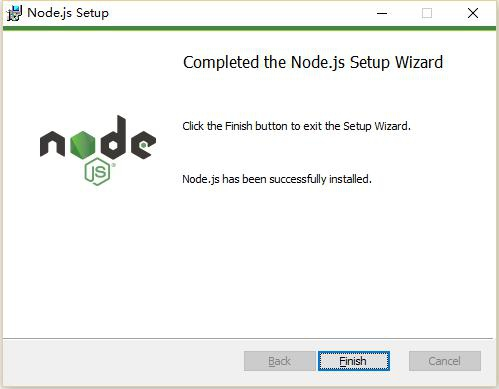
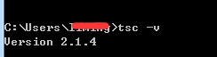

# 搭建开发环境（TS代码编译器）

> *author : charley        version: 2.0.1         update: 2019-4-8*

由于LayaAirIDE的需要安装TypeScript编译环境，所以本篇用于编译环境的安装指导，当编译环境有问题的时候阅读参照，如果已经安装过的，不需要重复安装。

## 1 、下载安装Node环境

#### 1.1 检查是否已安装node.js环境

使用TypeScript开发需要Node.js环境，如果没有安装过的，请前往官方下载(建议LTS版本)。

在安装前，如果不确定是否有现成的环境，可以先确认一下node环境是否已安装，打开命令行工具（windows是cmd），输入指令 `npm -h` 

```
npm -h
```

按回车键后，如果能看到npm的命令说明、版本号，以及安装路径等信息，如图1-1所示（类似信息即可），那说明已经安装过了，如果不影响使用，可以跳过下载和安装node环境的步骤。

 

(图1-1)


#### 1.2 Node.js官网下载

如果没有安装环境，而直接前往node官网下载安装即可，推荐LTS版本，如图1-2所示，URL地址为：[https://nodejs.org/en/](https://nodejs.org/en/)

   （图1-2）上图仅作为参照使用，打开链接直接下载LTS版本即可。

> 注意：默认链接打开的是window(x64)，非64位的电脑，可以点击Other Downloads，下载对应的版本即可。

#### 1.3 、安装Node.js

找到刚刚下载的Node.js安装包，一步一步的安装即可，安装完全时界面如图1-3所示。

   <br/>（图1-3）

 安装完成之后，可以按1.1小节介绍的方式，在命令行下输入 `npm -h` 检查一下安装状态。


## 2、用npm命令安装TypeScript环境

Node环境没问题后，就可以使用npm来安装TypeScript编译环境了，

#### 2.1 下载安装

直接在命令行工具里输入指令“`npm install -g typescript`”，按回车键，如图2所示，即可开始下载并进行TypeScript环境的安装，此时一定要保持网络的畅通。

```typescript
npm install -g typescript
```

​ <br/>
（图2）

开发者如果安装时遇到图3的情况，通常是缓存冲突导致。（没遇到的直接跳过本步骤。）


（图3） 

这时候，可以使用缓存清理命令 `npm cache clean --force`，回车执行该命令，重新输入安装指令即可。

```
npm cache clean --force
```


#### 2.2 安装完成

当我们看到 “-- typescrip@ 版本号” 的时候，可以确认完成了 TypeScript 环境的安装，如图4所示，关闭命令行工具即可。 


 （图4）

图4中tsc目录中就是我们TypeScript编译环境的安装目录，有了这个，LayaAirIDE里就能通过这个Compiler将TypeScript编译成为JavaScript。

####  2.3 检查TypeScript编译环境版本

在命令行输入“tsc -v” 命令可查看当前TypeScript编译的版本，如图5所示。

```typescript
tsc -v
```

  

（图5）

如果显示出版本号，也可以说明TypeScript Compiler（tsc）安装成功。

> 图中实际的版本号是最新的截图，仅作参照，所以与之前安装时截图版本不一致。