# LayaAir 示例项目源码编译

> update : 2020-11-10

本篇文档，将引导开发者如何去使用Github上的DEMO。


### 一、克隆 LayaAir源码项目到本地

先安装好Git环境，不会的可以自行百度搜索一下，这里就不展开了。然后clone（克隆）LayaAir源码仓库到本地。

```
git clone https://github.com/layabox/LayaAir.git
```


### 二、通过npm安装LayaAiri源码环境依赖包

基础的Node环境npm，需要提前安装好。没安装好的，要看一下官网文档，进行安装：

https://ldc2.layabox.com/doc/?nav=zh-ts-1-0-0

因为我们需要用到npm安装一些LayaAir引擎源码开发编译的依赖环境。

当我们进入clone后的LayaAi源码本地根目录后，进入命令行环境，如下图所示：

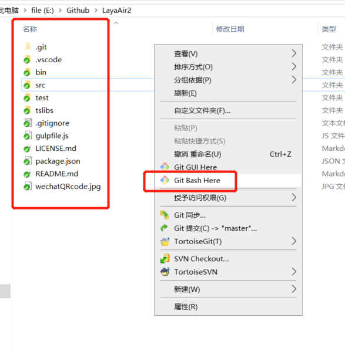  

然后在命令行下，执行`npm install`命令，如下图所示：

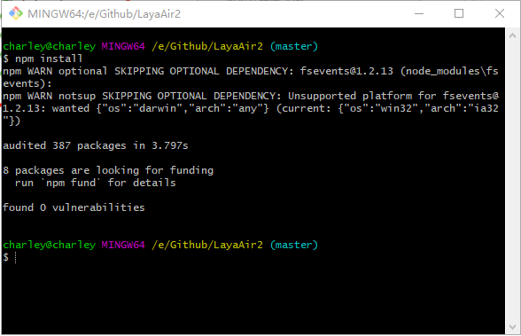 

由于引擎根目录中有package.json文件，所以`npm install`会自动执行安装package.json中指定的依赖包。

如上图所示，在安装的过程会有一个警告，那是安装依赖包所使用的第三方依赖，可以不用管。不影响使用。


### 三、引擎使用示例目录说明

引擎的源码目录可以用VSCode打开，示例目录位于 `源码根目录/src/samples/` 目录下，如下图所示。

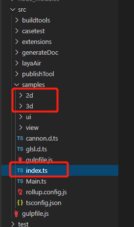 

在上图中，`index.ts`是示例的入口文件，`2d`与`3d`目录分别对应着引擎的2D与3D示例。

> 由于引擎源码是TS语言的，所以示例也是基于TS源码的示例。如果想看AS3与JS示例，可以前往官网的开发者中心，查看线上示例。

示例的资源文件位于`源码根目录/bin/res/`，如下图所示：

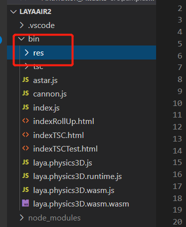 


### 四、如何运行查看LayaAir引擎示例

为了验证我们的编译与项目环境没有问题，我们先把默认的示例给编译运行起来看一看。

由于引擎源码目录中，已经配置好gulp任务，可以直接在VSCode中通过  `Ctrl + Shift + B`  运行gulp任务（`gulp:LayaAirBuild`），启动编译。如下图所示：

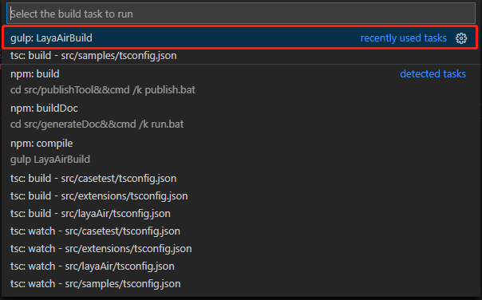 

当然，我们也可以在VSCode中通过`F5`或者`Ctrl + F5`，自动启动gulp任务，进行代码的编译。

效果如下图所示：

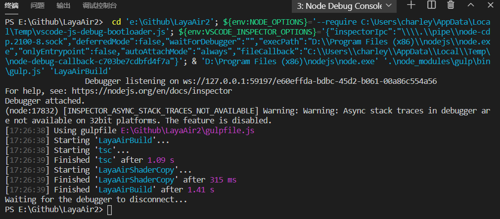 

无论哪种方式，编译完成之后，

我们从VSCode终端命令行，通过 `cd bin`进入bin目录，然后通过`anywhere`命令启动一个web服务器。

操作如下图所示：

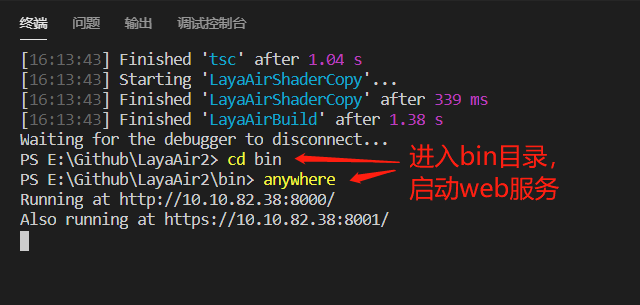 

web服务启动后，会弹出浏览器，打开web服务的根目录bin，效果如下图所示：

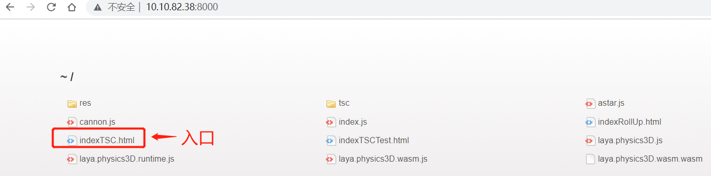 

`indexTSC.html`是入口页面，直接点击就可以打开我们默认的示例。

效果如下图所示：

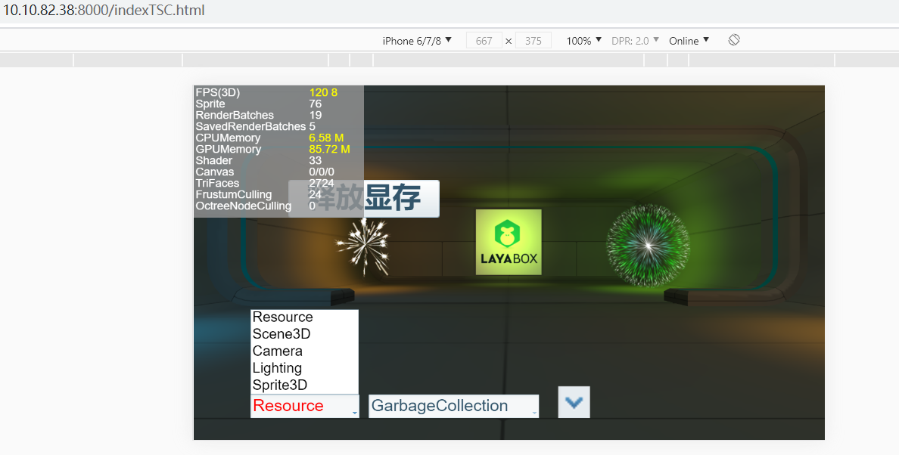 

如果我们编译没有问题，打开`indexTSC.html`页面，就会看到上图一样的示例效果。

点击两个效果列表，我们就可以切换查看到别的示例。点击下拉列表右侧的下箭头按钮，可以快捷切换到下一个示例效果。

### 五、切换官方的3D和2D示例

默认的示例，我们通过切换查看示例效果，会发现官网上的3D示例效果全都有，为什么没有2D的呢？

其实是有的，需要修改代码，切换到2D示例，就可以查看了。

由于运行的代码入口是index.ts，打开后会发现只有两行

```typescript
import { Main } from "./Main";
new Main(); 
```

通过代码，我们可以看出，默认引入了示例目录下的`main.ts`，并实例化了Main类。

这个类，其实包括了Layabox官网上所有的2D与3D线上示例。

我们只需要在实例化Main类的时候，传入构造方法的参数，就可以切换为2D示例效果。

index.ts修改后的代码如下所示：

```typescript
import { Main } from "./Main";
new Main(false); 
```

再次编译运行后，效果如下图所示：

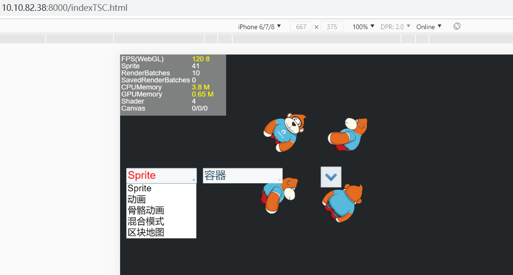 

### 六、切换到指定示例或者自己的示例

如果我们想调试某个指定的示例，或者自己写的示例。

那直接在入口*index.ts*中实例化对应的类就可以了。

例如，实例化反射探针的示例，我们就直接去`new ReflectionProbeDemo();`即可，

编码效果如下图所示：
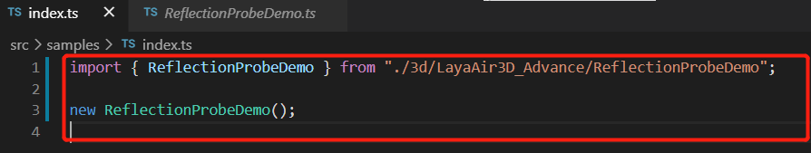 

然后，再次编译运行，效果如下图所示：


    

### 七、如果出现引用路径错误的解决方案

在编写自定义示例时， 如果出现VSCode自动引用路径错误的现象，如下图所示：

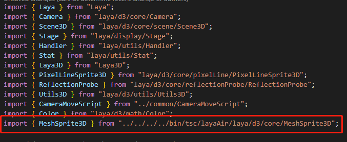 

需要检查 TypeScript版本，如下图所示：
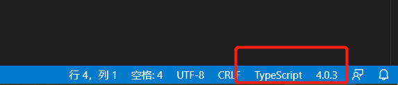 

推荐使用 3.7.X 版本的TypeScript，可以自动引用补全正确路径。


## 本文赞赏

如果您觉得本文对您有帮助，欢迎扫码赞赏作者，您的激励是我们写出更多优质文档的动力。

