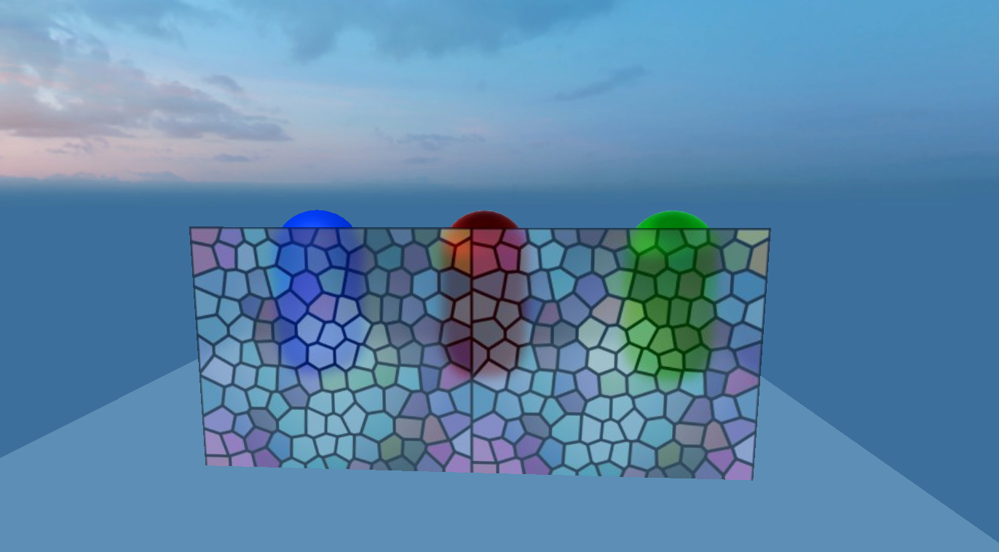
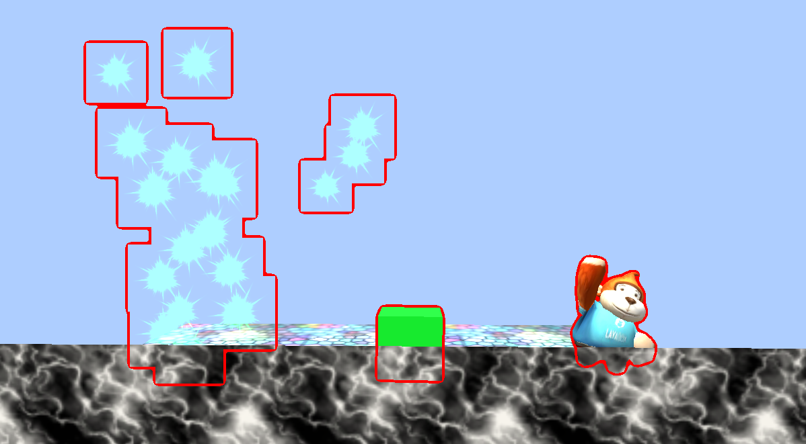

## CommandBuffer使用文档

> Engine Version : 2.9.0 beta  Update : 2020-11-03

### 1、简介

CommandBuffer为渲染命令缓冲区，保存了渲染命令列表。当我们将一些渲染指令添加到CommandBuffer后，可以实现对渲染流程的控制，将这些指令在我们想要的时机进行执行。

CommandBuffer是一个高阶的3D渲染功能，用来拓展LayaAir引擎渲染管线的渲染效果。在实现毛玻璃（玻璃透明模糊感）、轮廓透视描边或者边缘光效、沙滩脚印、景深等等效果时非常好用，懂的人都明白，CommandBuffer非常强大，也是3A级大作经常用到的渲染功能，并且不会有额外的功能损耗，甚至某些效果比其它方案更省性能，是一种小游戏平台中也可以用来加强3D渲染效果的渲染扩展功能。

 

### 2、使用步骤

#### 1、创建好CommandBuffer后，添加渲染指令给CommandBuffer

添加代码接口如下：

```typescript
var buf:CommandBuffer = new CommandBuffer();

buf.setRenderTarget(renderTexture);

buf.drawRender(renders[i],materials[i],0);
```


#### 2、需要将CBuffer绑定到Camera的渲染事件中，目前laya支持的Camera事件如下：

```typescript
BeforeForwardOpaque = 0,//在渲染非透明物体之前

BeforeSkyBox = 2,//在渲染天空盒之前

BeforeTransparent = 4,//在渲染透明物体之

BeforeImageEffect = 6,//在后期处理之前

AfterEveryThing = 8,//所有渲染之后
```

添加CommandBuffer到相机事件的接口如下：

```typescript
this.camera.addCommandBuffer(this.cameraEventFlag,this.commandBuffer);
```

删除CommandBuffer的接口如下：

```typescript
this.camera.removeCommandBuffer(this.cameraEventFlag,this.commandBuffer);
```

CommandBuffer是一个渲染指令集，组成这个渲染指令集的是一个一个的独立的渲染指令

```typescript
setShaderData//设置shader数据，可以设置shader中的texture vector number等 

setGlobalShaderData//设置全局数据，可以用于所有的shader

blitScreenQuad//通过全屏四边形将源纹理渲染到目标渲染纹理指令。

blitScreenQuadByMaterial//通过全屏四边形将源纹理渲染到目标渲染纹理指令

setRenderTarget//设置指令渲染目标，调用后，所有的渲染都会渲染到方法绑定的图片上

clearRenderTarget//清理绑定的渲染纹理

drawMesh//渲染一个Mesh

drawRender//渲染一个Render
```

可以组合不同的渲染指令然后放入不同的渲染流程，下面具体分析官方示例来更好的理解一下CommandBuffer的用法。

### 3、使用示例

#### 3.1、BlurryGlass示例（毛玻璃示例）

##### 效果图

  

##### 示例原理

毛玻璃属于透明材质，后面的三个胶囊体都是非透明材质，所以我们需要每帧将毛玻璃模型后面的所有渲染物体全部拿出，进行模糊，再将图片按屏幕uv采样到毛玻璃上面，便可以实现这样的效果

##### 示例代码

```typescript
createCommandBuffer(camera:Camera){

    //当需要在渲染透明物体之前拿到摄像机渲染结果，所以调用下面的属性true

    camera.enableBuiltInRenderTexture = true;

    //创建CommandBuffer

    var buf:CommandBuffer = new CommandBuffer();

    //创建需要模糊使用的屏幕RenderTexture

    var viewPort:Viewport = camera.viewport;

     //创建新的RenderTexture

    var renderTexture = RenderTexture.createFromPool(viewPort.width,viewPort.height,RenderTextureFormat.R8G8B8,RenderTextureDepthFormat.DEPTHSTENCIL_NONE);

    this.texture = renderTexture; 

    //将当前渲染的结果拷贝到创建好的RenderTexture

buf.blitScreenTriangle(null,renderTexture);

    //获得模糊shader

    var shader:Shader3D = Shader3D.find("blurEffect");

    //设置模糊参数

var shaderValue:ShaderData = new ShaderData();

    //down Sample level设置降采样等级

    var downSampleFactor:number = 4;

    var downSampleWidth:number = viewPort.width/downSampleFactor;

    var downSampleheigh:number = viewPort.height/downSampleFactor;

    //设置模糊材质参数

    var texSize:Vector4 = new Vector4(1.0/viewPort.width,1.0/viewPort.height,viewPort.width,downSampleheigh);

    shaderValue.setNumber(BlurEffect.SHADERVALUE_DOWNSAMPLEVALUE,1);

    shaderValue.setVector(BlurEffect.SHADERVALUE_TEXELSIZE,texSize);

    //创建降采样RenderTexture1

    var downRenderTexture = RenderTexture.createFromPool(downSampleWidth,downSampleheigh,RenderTextureFormat.R8G8B8,RenderTextureDepthFormat.DEPTHSTENCIL_NONE);

    //降采样命令流

    buf.blitScreenTriangle(renderTexture,downRenderTexture,null,shader,shaderValue,0);

    //创建降采样RenderTexture2

    var blurTexture:RenderTexture = RenderTexture.createFromPool(downSampleWidth,downSampleheigh,RenderTextureFormat.R8G8B8,RenderTextureDepthFormat.DEPTHSTENCIL_NONE);

    blurTexture.filterMode = FilterMode.Bilinear;

    //Horizontal blur

    buf.blitScreenTriangle(downRenderTexture,blurTexture,null,shader,shaderValue,1);

    //vertical blur

    buf.blitScreenTriangle(blurTexture,downRenderTexture,null,shader,shaderValue,2);

    //Horizontal blur

    buf.blitScreenTriangle(downRenderTexture,blurTexture,null,shader,shaderValue,1);

    //vertical blur

    buf.blitScreenTriangle(blurTexture,downRenderTexture,null,shader,shaderValue,2);

    //至此  模糊图片已经生成在downRenderTexture中

    //设置全局uniform变量 

    var globalUniformNameID:number = Shader3D.propertyNameToID("u_screenTexture");

    //将全局变量u_screenTexture赋值为模糊图片

    buf.setGlobalTexture(globalUniformNameID,downRenderTexture);

    //将commandBuffer加入渲染流程

    camera.addCommandBuffer(CameraEventFlags.BeforeTransparent,buf);

    //回收用过的RenderTexture

    RenderTexture.recoverToPool(downRenderTexture);

    RenderTexture.recoverToPool(blurTexture);

    return;

  }
```

 

#### 3.2、OutLine示例（轮廓线描边）

##### 效果图：

 

##### 示例原理：

在渲染完成之后，绑定另外一个黑色的Rendertexture，重新画好粒子，Box，猴子为纯红色，再将图片模糊，模糊图片颜色减去没模糊的图片，就能得到渲染边框，最后将渲染边框重新加到渲染好的画布上面，便可实现轮廓效果

##### 代码如下

```typescript
createDrawMeshCommandBuffer(camera:Camera,renders:BaseRender[],materials:Material[]):CommandBuffer{

    var buf:CommandBuffer = new CommandBuffer();

    //当需要在流程中拿摄像机渲染效果的时候 设置true

    camera.enableBuiltInRenderTexture = true;

    //创建和屏幕一样大的Rendertexture

    var viewPort:Viewport = camera.viewport;

    var renderTexture = RenderTexture.createFromPool(viewPort.width,viewPort.height,RenderTextureFormat.R8G8B8A8,RenderTextureDepthFormat.DEPTHSTENCIL_NONE);

    //将RenderTexture设置为渲染目标

    buf.setRenderTarget(renderTexture);

    //清楚渲染目标的颜色为黑色，不清理深度

    buf.clearRenderTarget(true,false,new Vector4(0,0,0,0));

    

    //将传入的Render渲染到纹理上

    for(var i = 0,n = renders.length;i<n;i++){

      buf.drawRender(renders[i],materials[i],0);

    }

    //创建新的RenderTexture

     var subRendertexture = RenderTexture.createFromPool(viewPort.width,viewPort.height,RenderTextureFormat.R8G8B8A8,RenderTextureDepthFormat.DEPTHSTENCIL_NONE);

    //将renderTexture的结果复制到subRenderTexture

     buf.blitScreenQuad(renderTexture,subRendertexture);

    //设置模糊的参数

     var downSampleFactor:number = 2;

     var downSampleWidth:number = viewPort.width/downSampleFactor;

     var downSampleheigh:number = viewPort.height/downSampleFactor;

    var texSize:Vector4 = new Vector4(1.0/viewPort.width,1.0/viewPort.height,viewPort.width,downSampleheigh);

    //创建模糊材质

    var blurMaterial:BlurMaterial = new BlurMaterial(texSize,1);

    

    //创建降采样RenderTexture1

     var downRenderTexture = RenderTexture.createFromPool(downSampleWidth,downSampleheigh,RenderTextureFormat.R8G8B8,RenderTextureDepthFormat.DEPTHSTENCIL_NONE);

    //降采样 使用blurMaterial材质的0SubShader将Rendertexture渲染到DownRendertexture

     buf.blitScreenQuadByMaterial(renderTexture,downRenderTexture,null,blurMaterial,0);

 

     //创建降采样RenderTexture2

    var blurTexture:RenderTexture = RenderTexture.createFromPool(downSampleWidth,downSampleheigh,RenderTextureFormat.R8G8B8,RenderTextureDepthFormat.DEPTHSTENCIL_NONE);

    blurTexture.filterMode = FilterMode.Bilinear;

 

    //Horizontal blur 使用blurMaterial材质的1SubShader

    buf.blitScreenQuadByMaterial(downRenderTexture,blurTexture,null,blurMaterial,1);

    //vertical blur 使用blurMaterial材质的2SubShader

    buf.blitScreenQuadByMaterial(blurTexture,downRenderTexture,null,blurMaterial,2);

    //Horizontal blur 使用blurMaterial材质的1SubShader

    buf.blitScreenQuadByMaterial(downRenderTexture,blurTexture,null,blurMaterial,1);

    //vertical blur  使用blurMaterial材质的2SubShader

    buf.blitScreenQuadByMaterial(blurTexture,downRenderTexture,null,blurMaterial,2);

    //在命令流里面插入设置图片命令流，在调用的时候会设置blurMaterial的图片数据

    buf.setShaderDataTexture(blurMaterial._shaderValues,BlurMaterial.SHADERVALUE_SOURCETEXTURE0,downRenderTexture);

    buf.setShaderDataTexture(blurMaterial._shaderValues,BlurMaterial.ShADERVALUE_SOURCETEXTURE1,subRendertexture);

    //caculate edge计算边缘图片

    buf.blitScreenQuadByMaterial(blurTexture,renderTexture,null,blurMaterial,3);

    //重新传入图片

    buf.setShaderDataTexture(blurMaterial._shaderValues,BlurMaterial.SHADERVALUE_SOURCETEXTURE0,renderTexture);

    //将camera渲染结果复制到subRendertexture，使用blurMaterial的4通道shader

    buf.blitScreenQuadByMaterial(null,subRendertexture,null,blurMaterial,4);

    //将subRenderTexture重新赋值到camera的渲染结果上面

    buf.blitScreenQuadByMaterial(subRendertexture,null);

    return buf;

  }

```