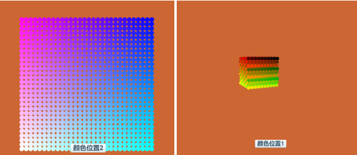
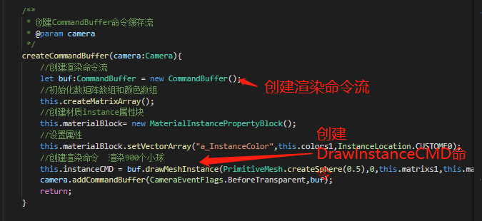
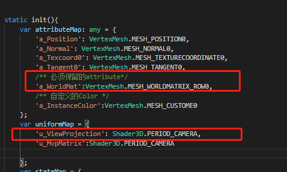
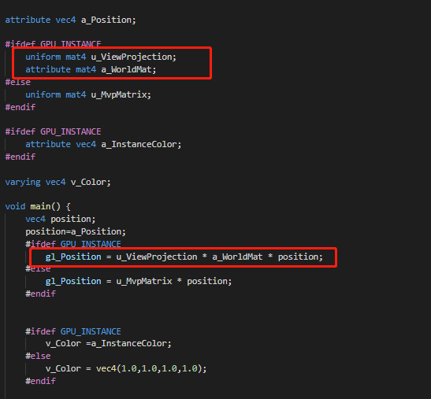
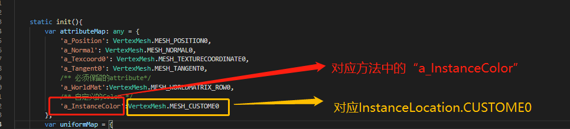
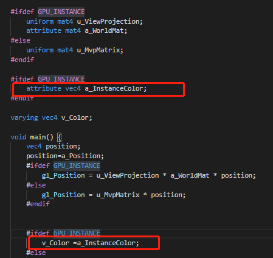
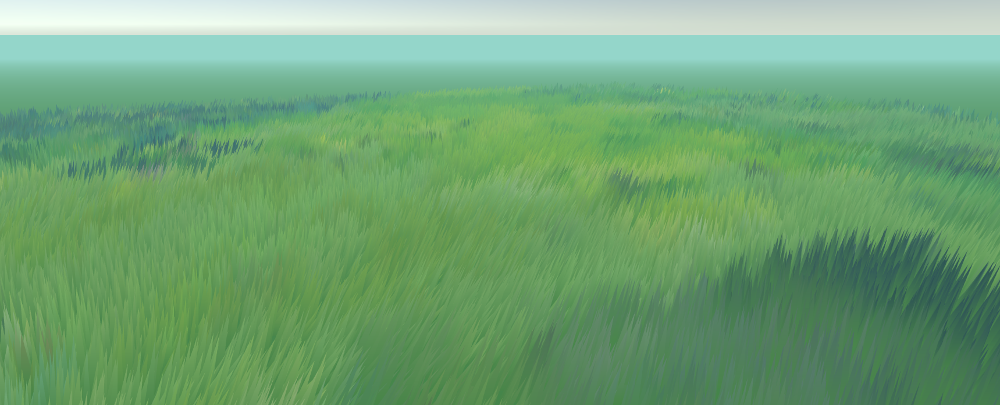

## drawMeshInstance渲染指令的使用说明

> LayaAir 引擎版本>=2.11   update : 2021-2-1


LayaAir2.11beta版本开始，新增了一个重磅功能。那就是在CommandBuffer中增加了渲染指令drawMeshInstance，还有增加了DrawMeshInstancedCMD渲染命令类。本文就是针对新功能的使用，结合官网示例进行介绍说明。

> **提示**：
>
> 1、本文中涉及的代码，均会省略大量代码，仅为介绍功能使用的核心代码，
>
> 2、代码的API使用方式为基于引擎源码的使用方式，与开放下载版本的Laya.xxx的写法不同，
>
> 3、各不同语言引擎版本API的使用方式、以及完整的示例代码请前往Layabox官网示例栏目查看。


增加渲染指令drawMeshInstance后，开发者可以用来渲染自定义instance属性，进行instance渲染。这种渲染相比普通的渲染**会较大的提高渲染性能。**

例如官网示例中的CommandBuffer_DrawCustomInstance就是自定义instance的优化示例，示例中自定义了小球的颜色，并且实现了用一个渲染批次画出900个**颜色不同的**小球效果，体现了渲染优化的能力。

 

(图1)

#### 1、如何添加drawMeshInstance渲染命令

由于drawMeshInstance渲染命令在CommandBuffer中集成，所以当开发者实例化创建好CommandBuffer后，直接调用CommandBuffer的drawMeshInstance()方法在渲染命令流中添加DrawMeshInstanceCMD渲染指令。

流程如图2所示：

 

(图2)

#### 2、自定义的材质属性MaterialInstancePropertyBlock类以及Shader的写法

drawMeshInstance命令流需要设置对应的世界矩阵Matrix数组和材质、描述自定义Instance属性的MaterialInstancePropertyBlock类、以及渲染个数drawNums。

##### 2.1 世界矩阵Matrix数组和材质

当大量渲染同一个Mesh的时候，需要用世界矩阵数组来描述每个Mesh的位置，引擎会更新对应的世界矩阵buffer，来保证每一个实例都能得到正确的worldMatrix。

在自定义材质中，声明attributeMap中需要写死a_WorldMat：VertexMesh.Mesh_WORLDMATRIX_ROW0，这样在shader中就可以接收到参数传入的矩阵。如图3所示。

 

（图3）

按上面的步骤完成后，在顶点shaderVS中就可以对应使用了，使用的代码如图4所示。

 

（图4）

##### 2.2 如何自定义Mesh在材质中的不同属性

我们先回顾一下前文中创建MaterialInstancePropertyBlock的代码：

```typescript
//创建材质instance属性块
this.materialBlock= new MaterialInstancePropertyBlock();
```

在前文使用drawMeshInstance的时候，MaterialInstancePropertyBlock类用来描述instance自定义属性，比如给每一个Mesh分配一个不同的颜色。当然也可以是金属度，粗糙等任何材质描述属性。

由于受限于attributeLocation的原因，LayaAir引擎只为开发者留下了四个自定义属性的槽位，分别是

- InstanceLocation.CUSTOME0
- InstanceLocation.CUSTOME1
- InstanceLocation.CUSTOME2
- InstanceLocation.CUSTOME3

开发者可以按下表中对应的方法来设置更新对应类型的自定义属性数据：

| 方法名            | 类型    |
| ----------------- | ------- |
| setVectorArray()  | Vector4 |
| setVectorArray()  | Vector3 |
| setVector2Array() | Vector2 |
| setNumberArray()  | number  |

当我们想渲染每一个Mesh的时候，就需要传入一个不同的颜色，而每一个颜色是一个Vector4的属性。

所以我们要传入一个Vector4的数组，或者是Vector4转换好的Float32Array，来设置shader中的CUSTOME0槽位名字为a_InstanceColor的instance属性，

示例代码为：

```typescript
//改变900小球的颜色
this.materialBlock.setVectorArray("a_InstanceColor",this.currentColor,InstanceLocation.CUSTOME0);
```

要注意的是，每一个槽位和属性名字是一一对应的，属性名字和槽位也要对应声明shader中的顶点槽位，

例如图5中shader顶点Attribute声明。

  

（图5）

然后，我们再看一下在Shader中的应用，例如图6所示。

 

（图6）

至此，自定义的属性就应用在我们的shader中了。

##### 2.3 如何高性能的修改渲染个数drawNums、位置、自定义Instance属性

通过drawMeshInstance的示例，我们看到，可以性能很高的修改900个小球的颜色以及位置，这就用到了这个功能另外的方法。

首先，我们要更新修改位置，就需要调用DrawMeshInstanceCMD类的`setWorldMatrix(worldMatrixArray:Matrix4x4[]))`方法，然后传入最新的矩阵数组。

如果要更新修改渲染个数，我们还需要调用DrawMeshInstanceCMD类的`setDrawNums(drawNums:number)`方法，传入需要渲染的个数。但是渲染个数（drawNums）不可以超过最大drawInstance数（DrawMeshInstancedCMD.maxInstanceCount）。

maxInstanceCount默认值为1024，开发者可以动态的修改。官网示例中的草地示例GrassDemo，就将这个值改为了1000000，草地示例效果如图7所示。

  

（图7）

除了修改渲染个数与位置外，如果我们要动态修改自定义Instance属性，我们需要调用MaterialInstancePropertyBlock中的方法setVectorArray、setVector3Array、setVector2Array、setNumberArray来设置更新类型为Vector4，Vector3，Vector2，number的自定义属性的数据，但是name和attributeLocation必须和之前设置的自定义属性匹配。