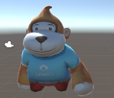

# 从Unity中编辑并导出模型动画

###### *version :2.1.0beta   Update:2019-6-13 插件版本：2.1.0*

游戏角色蒙皮骨骼动画在3D游戏中有大量的运用，可将角色动画模型导入unity中编辑，然后导出到LayaAir中使用。

> 这里我们使用的蒙皮骨骼动画猴子作为示例

#### 导入模型

在unity资源管理器中，右键导入（Import New Assets）FBX格式模型资源、贴图资源，并将模型拖拽至场景中，调整好材质贴图并保存，本例中保存场景名为“monkey”。

 (图1)

#### 创建动画控制器

在unity资源管理器中，右键点开菜单创建（Create）动画控制器（Animator Controller）,并根据动画取名，本例中取名为"LayaMonkeyController"。

 (图2)

#### 编辑动画控制器

双击打开动画控制器，视图区会出现动画控制器编辑界面；点开导入的模型右侧“小三角”，其中“播放标志”文件为模型的动画文件，默认名为“Take 001”，拖拽它至动画控制器编辑界面（图3），保存完成。

 

（图3）

#### 绑定动画控制器

选择场景中的角色模型，将角色动画控制器赋予到选中模型的动画组件上（图4），如果没有动画组件，需要给角色绑定一个，否则导出的动画不能播放。

 （图4）

​	经过以上步骤，我们完成了角色动画在unity中的编辑，点击unity中运行按钮，这时我们就可以看到动画播放了。如果动画播放没有问题，就可以按之前“unity插件工具使用”教程方法导出LayaAir所需资源。

**Tips：其他的动画在unity中处理方式也一致，都需要以下步骤：场景模型上添加动画组件——创建动画控制器——将动画加入动画控制器中——动画控制器添加入模型的动画组件中。**

### 动画导出时需要注意

##### 动画文件相关

​	多个动画文件不能有重名情况。

##### 刚体动画相关

​	使用刚体动画时，动画对象的Animator Controller不要加添加 Avatar

##### 蒙皮骨骼动画相关

​	1.骨骼节点相关一个对象的骨骼中不能有同名的节点。

​	2.动画类型只支持Generic类型。

​	3.不要勾选 Optimize Game Object 选项

 (图6)

