## 一篇学会使用3D摄像机

> Author : Charley         Date：2022-1-10   

我们都知道，电影是通过摄像机将故事与画面呈现给观众。

虚拟的3D世界，也需要通过虚拟的摄像机，将三维画面及情节呈现给用户或者玩家。

在LayaAir引擎中，我们可以有一个摄像机，也可以有多个摄像机同时工作，这取决于我们开发者的实际需求。

本篇，我们来学习如何控制LayaAir引擎3D摄像机，以及日常使用摄像机的功能介绍。

### 一、从Unity中导出并使用摄像机

由于LayaAir引擎插件支持在Unity中编辑场景并导出，所以导出摄像机是常用的做法。毕竟可视化调整摄像机位置和角度更加方便。

> Unity导出插件使用说明：https://ldc2.layabox.com/doc/?nav=zh-ts-4-2-0

#### 1.1 Unity中可导出的属性介绍

首先，我们先了解一下，LayaAir支持哪些Unity的摄像机属性，如图1所示。

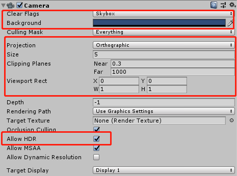

(图1)

##### 1.1.1 Clear Flags 清除标志

每个摄相机在渲染时，都会先将颜色和深度信息存储起来，也就是ColorBuffer与DepthBuffer，然后下一帧直接读取缓冲区中颜色和深度信息，而不是实时计算的。

当使用多个摄像机时，由于每一个摄像机都将自己的颜色和深度信息存储在缓冲区中，那将积累大量的渲染数据。

所以，Clear Flags（清除标记）可以决定是否清除当前渲染之前存储起来的缓冲区信息，该属性功能有四个选项（Skybox、Solid Color、Depth only、Don’t Clear），是起到具体清除什么缓冲信息的作用。LayaAir插件全都支持导出，下面分别介绍。

##### Skybox 天空盒

天空盒是默认选项，

表示着**清除**当前渲染之前的全部摄相机缓冲区的**颜色与深度信息**，使用天空盒代替，如图2所示。如果没有指定天空盒，则会显示默认背景色（Background属性的颜色）。

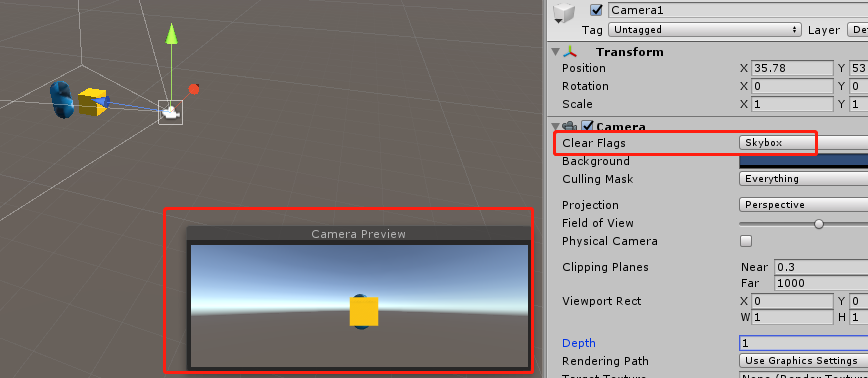

(图2)

##### Solid Color 纯色

表示着**清除**当前渲染之前的全部摄相机缓冲区的**颜色与深度信息**，使用背景色（Background属性的颜色）代替，屏幕上的任何空的部分都将显示当前摄像机的背景色。如图3所示。

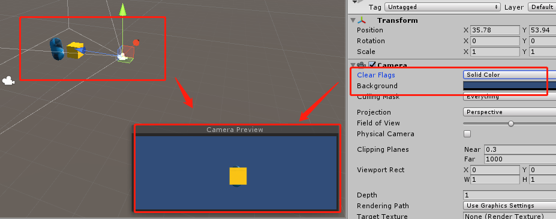

(图3)

##### Depth only 仅深度

表示着**只清除**当前渲染之前的全部摄相机缓冲区的**深度信息**，**保留**全部摄相机缓冲区的**颜色信息**。

这个功能非常实用，要想将多个摄像机的画面，渲染到同一个画面，就可以通过Depth only选项来实现，如图4-1所示。

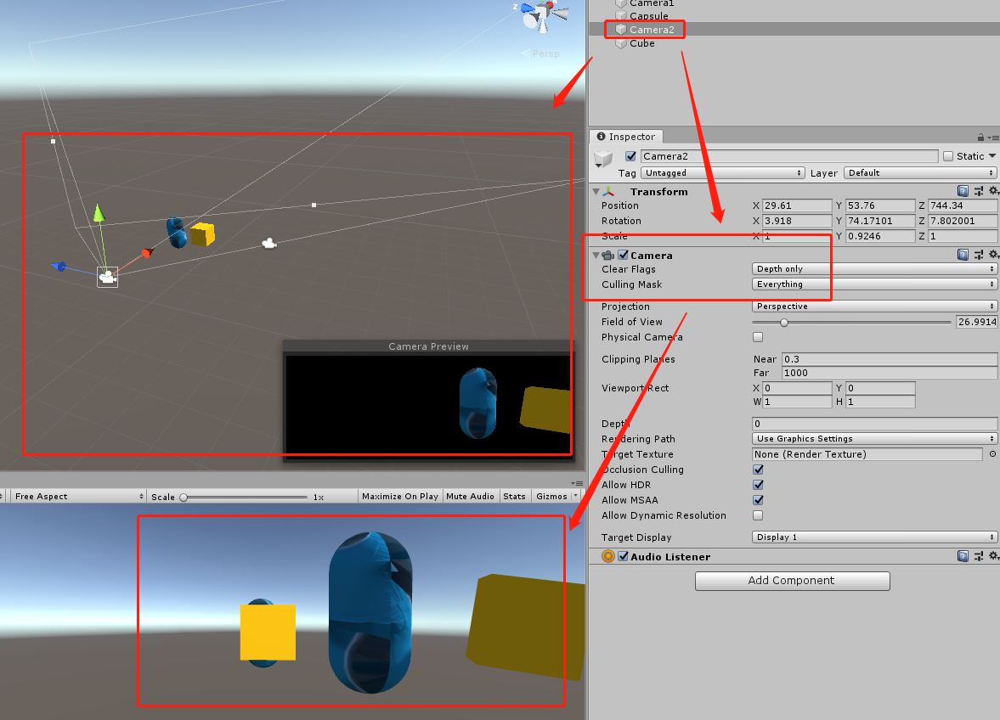

(图4-1)

讲到这里，我们还要了解一下LayaAir与Unity的区别，

在Unity里，深度通过摄像机的Depth属性控制，而LayaAir引擎插件没有将Depth导出。那LayaAir引擎是怎么处理Depth only的效果呢？

当Clear Flags的Depth only开启后，LayaAir引擎会通过摄像机的渲染顺序来控制。默认的渲染顺序就是节点的渲染顺序，开发者也可以通过LayaAir引擎摄像机的renderingOrder来改变渲染顺序。

如果第一摄像机的Clear Flags设置的是Skybox，那第二摄像机的Clear Flags设置Depth only，

这时需要第一摄像机的渲染顺序在第二摄像机的渲染顺序之前，如图4-2所示，Camera1节点在Camera2节点之上，所以两个摄像机的渲染画面才会合并到一起，出现图4-1的效果。

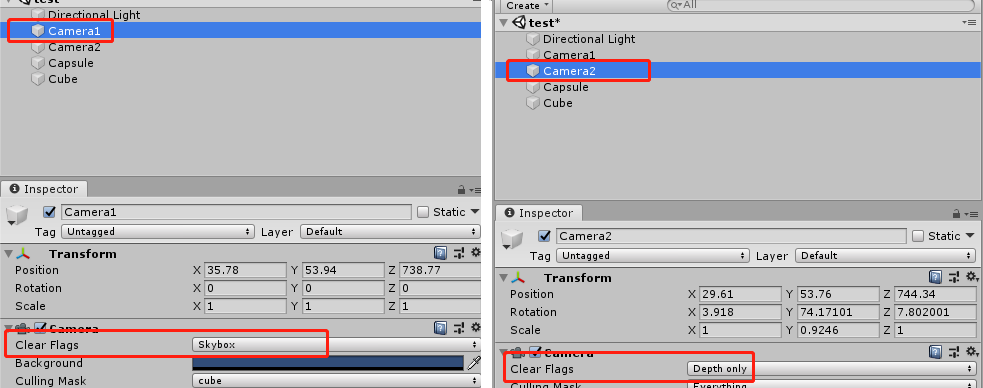

(图4-2)

如果顺序反了，

Camera2先渲染的话，虽然只清理了深度信息保留了颜色信息。但后渲染的Camera1会把前面所有缓冲区深度和颜色的都清理掉，所以就没办法看到合并到一起的画面了。

另外，再顺便提一下`Culling Mask`（剔除遮罩），

在Unity中，可以为每个节点设置所属的Layer(层)，不设置就是默认的Default层。

Culling Mask就是针对层的渲染剔除进行设置，通常会与Depth only搭配使用。例如，将Cube节点设置到一个独立的cube层上，Culling Mask选择cube层，那渲染的时候，将会剔除该摄像机其它的节点物体，像遮罩效果一样，只保留cube层上的节点物体，这样，摄像机合并显示的时候，就只合并保留层上的节点物体。

插件支持文档和本文前面的摄像机可用属性介绍里提到了，LayaAir引擎插件不支持Culling Mask导出。但是，LayaAir引擎是有对应的属性的，摄像机基类里的cullingMask就对应了Culling Mask，并且默认值相当于Unity里Culling Mask的Everything（不剔除，渲染显示每个层）。如果想进行单个层的设置，那可以在Layer那里设置层（LayaAir插件只会导出层ID），然后在LayaAir引擎的API中，通过cullingMask指定可渲染显示的层ID。

> 设置cullingMask可以指定单层，也可以多层混合，例如：
>
> xx.cullingMask=Math.pow(2,0)|Math.pow(2,1); //该代码表示为第0层和第1层渲染显示。

##### Don't Clear 不清除

表示该选项**不清除**摄相机缓冲区的信息，**颜色与深度信息**全都保留着。这样做会导致每帧渲染的结果都会叠加在下一帧之上。如动图5所示。

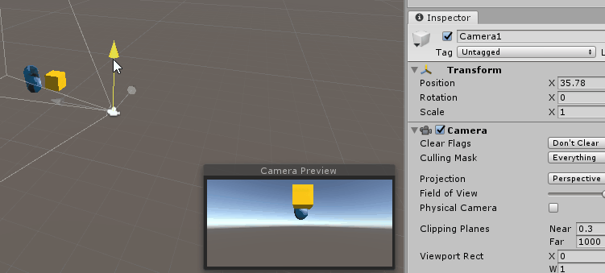

看起来这选项没有存在的必要，事实上的确不常用，但在一些特定场合还是用的上，例如结合自定义shader来使用。

##### 1.1.2 Projection 投影方式

摄像机成相效果的投影方式有两个选项，分别是默认值透视模式Perspective和正交模式Orthographic。

##### Perspective 透视模式

透视投影的观察体是视锥体，它使用一组由投影中心产生的放射投影线，将三维对象投影到投影平面上去。

透视模式，是一种模拟了人眼近大远小视觉效果的摄像机成相模式，如图6-1所示。


(图6-1)

###### Field of view 视野范围

透视模式有一个关联属性`Field of view`，用于设置透视模式下的视野范围，可直接在Unity中预览效果用LayaAir插件导出。

##### Orthographic 正交模式

正交投影模式的观察体是规则的长方体，它使用一组平行投影，将三维对象投影到投影平面上去。

正交模式没有透视感，如图6-2所示，常用于一些2D与3D混合的游戏或模型查看器等。


(图6-2)

###### Size 视野大小

正交模式有一个关联属性`Size`，用于设置正交模式下的视野大小，可直接在Unity中预览效果用LayaAir插件导出。

##### 1.1.3 Clipping Planes  剪裁平面

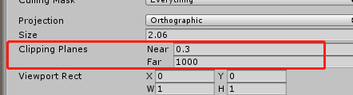

(图7)

剪裁平面是与摄像机视野方向垂直的平面。通过近裁剪面与远裁剪面两个子参数来设置摄像机渲染的范围，超出范围的部分不会被渲染显示，犹如被剪裁掉的效果。

###### Near近裁面，

是指离摄像机视野方向最近的剪裁面，小于Near距离值的不渲染。

###### Far远裁面，

是指离摄像机视野方向最远的剪裁面，大于Far距离值的不渲染。

##### 1.1.4 Viewport Rect 视图矩形

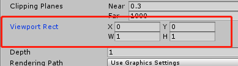

 (图8-1)

视图矩形是通过`X\Y\W\H`四个数值来控制摄像机的视图在屏幕中的位置和大小的功能。这四个数值均使用屏幕坐标系，数值范围是0～1，可以设置小数。

具体的参数说明为：

- X：水平位置起点
- Y：垂直位置起点
- W：宽度
- H：高度

需要注意的是，X和Y设置为0，Unity中表示为屏幕左下角(0,0)位置，而在LayaAir中表示屏幕左上角(0,0)位置。

假如我们将屏幕水平位置起点X设置为0.3，屏幕垂直位置起点Y设置为0.1，在LayaAir中效果如图8-2所示。

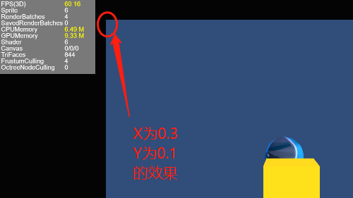

(图8-2)

宽高也比较容易理解，图8-3的效果是X与Y均设置为0.3，W与H均设置为0.5的效果。

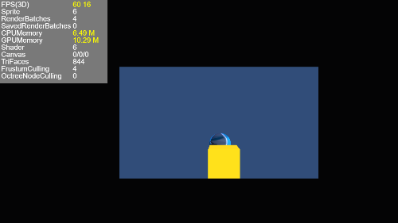

(图8-3)

Viewport Rect 视图矩形功能常用于多摄像机的视图画中画，或者并列的多视窗同屏对战游戏需求。在本文后面还会进行详细的介绍。

##### 1.1.5  Allow HDR 允许高动态光照渲染

高动态范围图像（High-Dynamic Range）简称HDR。HDR相比普通的图像，可以提供更多的动态范围和图像细节，它能够更好的反映出真实环境中的视觉效果。

Allow HDR 用于开启摄像机的高动态范围渲染功能，在Unity中，默认是勾选状态，代表默认开启了HDR。

由于HDR需要基于webGL 2.0，但是webGL 2.0并没有在各个平台中普及，尤其是一些小游戏的平台。所以，当我们在某些不支持webGL 2.0的平台中发布产品。需要将这里的 Allow HDR选项去掉。或者在引擎里将摄像机的HDR关闭。


> 开启HDR，还会导致LayaAir引擎抗锯齿功能无效，需要开启抗锯齿功能的，也不能开启HDR

#### 1.2 使用LayaAir插件导出的Unity摄像机

摄像机我们可以通过场景导出和预设导出的方式来使用。

> 不会导出的，请前往《[unity资源导出插件使用说明](https://ldc2.layabox.com/doc/?nav=zh-ts-4-2-0)》文档查看

##### 1.2.1 场景导出的摄像机使用

如果使用场景导出，那我们加载完成3D场景后，直接通过摄像机节点名称用LayaAir引擎提供的getChildByName方法来获取摄像机节点即可，在Unity中设置的摄像机相关属性会自动生效。

示例代码如下：

```typescript
//3d场景加载
Laya.Scene3D.load("xx/xx.ls",Laya.Handler.create(null,function(scene:Laya.Scene3D){
    //加载完成后，把加载回调中返回的完整场景scene添加到舞台
    Laya.stage.addChild(scene);
    //获得摄像机节点
    let camera = <Laya.Camera>scene.getChildByName("Camera1");
  	//关闭HDR
    camera.enableHDR = false;
}));
```

##### 1.2.2 预设导出的摄像机使用

预设导出有两种形式，一种是把所有一级节点都导出成一个预设，另一种是每个一级节点导出成为一个独立的预设。

###### 默认导出

默认是导出成一个预设，这时我们只能看到一个lh文件，预设的方式除了不包括场景信息，开发者需要用引擎创建一个3D场景，其它的使用方式基本与场景导出相同。

示例代码如下：

```typescript
//用引擎API创建3D场景，添加到舞台节点下
let scene3d = Laya.stage.addChild(new Laya.Scene3D) as Laya.Scene3D;
//加载预设
Laya.loader.create('Conventional/test.lh', Laya.Handler.create(this, (test:Laya.Sprite3D) => {
    //把导出的预设添加到3D场景节点下
	scene3d.addChild(test);
    //获得摄像机节点
	let camera = <Laya.Camera>test.getChildByName("Camera1");
    //关闭HDR
	camera.enableHDR = false;
}));
```

###### 批量导出一级节点

如果我们在导出插件中勾选了`批量导出一级节点`选项，以预设的方式进行导出后，

在一级节点的摄像机，可以直接被加载使用，不需要用getChildByName的方式查找节点获得。

使用的示例代码如下：

```typescript
let resource: Array<any> = [
	"Conventional/Cube.lh",
	"Conventional/Camera1.lh",
];
//3d预设加载
Laya.loader.create(resource, Laya.Handler.create(this, () => {
    //用引擎API创建3D场景，添加到舞台节点下
	let scene3d = Laya.stage.addChild(new Laya.Scene3D) as Laya.Scene3D;
	//获得摄像机节点
	let camera = <Laya.Camera>Laya.loader.getRes("Conventional/Camera1.lh");
    //关闭HDR
	camera.enableHDR = false;
    //用引擎API,重设清除标志选项
	camera.clearFlag = Laya.CameraClearFlags.DepthOnly;
	//用引擎API创建平行光
	let directionLight = new Laya.DirectionLight();
	//用引擎API设置平行光颜色
	directionLight.color = new Laya.Vector3(1, 1, 1);
    //用引擎API设置平行光的方向
	directionLight.transform.rotate(new Laya.Vector3( -3.14 / 1, 0, 0));
    //添加d平行光到3d场景节点下
	scene3d.addChild(directionLight);
    //添加摄像机节点到3D场景节点下
	scene3d.addChild(camera);
    //获得导出的cube预设，添加到3D场景节点下
	scene3d.addChild(Laya.loader.getRes("Conventional/Cube.lh"));
}));
```

### 二、实战摄像机的移动与旋转

摄像机的移动与旋转是最基础的3D需求之一，这样才可以形成主角视角，观察到全部的场景。

LayaAir的摄像机是继承于3D精灵节点（Sprite3D）的，所以也具有精灵节点的属性。开发者可以用3D精灵节点的变换（transform），对摄像机进行移动和旋转控制。

#### 2.1 摄像机移动

##### 2.1.1  平移API ：`translate()`

摄像机的水平移动，是比较常见和基础的需求。

打开LayaAir引擎API的Transform3D类，我们可以看到平移变换的方法`translate()`可以实现节点在3D空间各个轴的水平移动，如图9所示。该方法有两个参数，分别是`移动距离的三维向量值`和`是否为局部空间的布尔值（true表示为移动距离值是在局部空间坐标,false表示为移动距离值是在世界空间坐标）`。

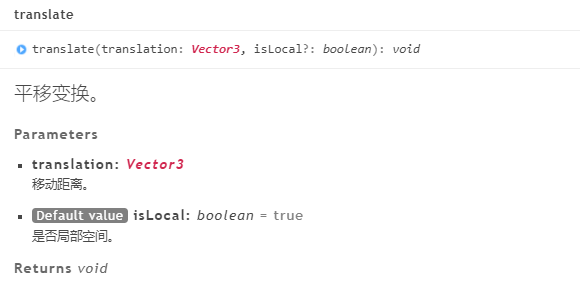   

(图9-1)

translate的使用示例代码为：

```typescript
//3d场景加载
Laya.Scene3D.load("xx/xx.ls",Laya.Handler.create(null,function(scene:Laya.Scene3D){
    //加载完成后，把加载回调中返回的完整场景scene添加到舞台
    Laya.stage.addChild(scene);
    //获得摄像机节点
    let camera = <Laya.Camera>scene.getChildByName("Camera1");
	//移动摄相机，设置摄相机向z轴正方向移动0.3。false是指世界坐标。
	camera.transform.translate(new Laya.Vector3(0, 0, 0.3),false);
}));
```

通过代码的注释，我们可以看到平移的控制还是比较简单的，只要对各轴设置带方向的值，就会产生空间位置的变换，在上面的示例中，如果将Vector3的值改为`Laya.Vector3(0, 0, -0.3)`，那就是向z轴负方向移动0.3。

LayaAir引擎采用的是右手坐标系，其移动方向也是依据右手坐标系，至于是按世界空间的坐标系还是局部空间的坐标系来移动，那就依据translate第二个参数的设置了。

##### 2.1.2 摄像机移动实战

为了更深入的理解API的使用，我们通过实战流程和代码来加深认知。

###### 用键盘按键向固定方向移动

控制摄像机的移动，依据设备的不同，通常是键盘和虚拟摇杆两种，这里先以键盘为例。

结合之前的知识点，我们知道translate的第一个参数是带方向的移动距离。距离比较直观好理解，移动方向就是所处空间的右手坐标系的轴方向。

但是这里需要强调一下，由于摄像机是对着场景物体拍摄，所以，要想获得正确的移动效果，通常是与坐标系反向移动。如果z轴正方向是向前，那摄像机就要向z轴负方向移动，才会有向前移动时拉近变大的视感。但是要注意的是，只有前后左右，才需要反向移动摄像机。上下移动是不需要摄像机反向移动的。

我们就以PC游戏里常用的键盘WASDQE快捷键举个栗子，

在下面的示例代码里，先初始化定义摄像机各个按键对应的固定移动方向以及移动距离。

TS示例代码如下：

```typescript
/**摄像机脚本，要继承Script3D */
export class cameraScript extends Laya.Script3D {
    /**按键W:向前移动，z轴负方向 0.2 */
    private translateW: Laya.Vector3 = new Laya.Vector3(0, 0, -0.2);
    /**按键S:向后移动，z轴正方向 0.2 */
    private translateS: Laya.Vector3 = new Laya.Vector3(0, 0, 0.2);
    /**按键A:向左移动，x轴负方向 0.2 */
    private translateA: Laya.Vector3 = new Laya.Vector3(-0.2, 0, 0);
    /**按键D:向右移动，x轴正方向 0.2 */
    private translateD: Laya.Vector3 = new Laya.Vector3(0.2, 0, 0);
    /**按键Q:向上移动，y轴正方向 0.2 */
    private translateQ: Laya.Vector3 = new Laya.Vector3(0, 0.2, 0);
    /**按键W:向下移动，y轴负方向 0.2 */
    private translateE: Laya.Vector3 = new Laya.Vector3(0, -0.2, 0);
}
```

初始化之后，只需要两个步骤就可以完成水平移动的效果。

一是让不同的按键事件对应好不同的刚刚定义好的移动行为属性。二是在每帧刷新的时候去更新这个逻辑。

按键的对应，LayaAir引擎提供了`Laya.KeyBoardManager.hasKeyDown()`方法，直接传入指定的按键值，就可以确认是否按了该键。

每帧更新处理就更简单了，直接在脚本的onUpdate生命周期方法里去执行按键对应行为的逻辑就可以了。

我们直接查看示例代码以及注释，

补充后的TS示例代码如下：

```typescript
/**摄像机脚本，要继承Script3D */
export class cameraScript extends Laya.Script3D {
    /**按键W:向前移动，z轴负方向 0.2 */
    private translateW: Laya.Vector3 = new Laya.Vector3(0, 0, -0.2);
    /**按键S:向后移动，z轴正方向 0.2 */
    private translateS: Laya.Vector3 = new Laya.Vector3(0, 0, 0.2);
    /**按键A:向左移动，x轴负方向 0.2 */
    private translateA: Laya.Vector3 = new Laya.Vector3(-0.2, 0, 0);
    /**按键D:向右移动，x轴正方向 0.2 */
    private translateD: Laya.Vector3 = new Laya.Vector3(0.2, 0, 0);
    /**按键Q:向上移动，y轴正方向 0.2 */
    private translateQ: Laya.Vector3 = new Laya.Vector3(0, 0.2, 0);
    /**按键W:向下移动，y轴负方向 0.2 */
    private translateE: Laya.Vector3 = new Laya.Vector3(0, -0.2, 0);
    /** 摄像机节点 */
    private camera:Laya.Camera;

    /**
     * 生命周期方法，
     * 在onUpdate之前执行，只执行一次
     */
    onStart(): void {
        //将脚本所属的节点，绑定到脚本内的camera属性
        this.camera = <Laya.Camera>(this.owner);
    }

    /**
     * 当键盘按下时的逻辑方法
     * @tips onKeyDown 在3D里不是生命周期方法
     */
    onKeyDown(): void {
        //当按下对应的键盘按键后，执行摄像机平移逻辑
        Laya.KeyBoardManager.hasKeyDown(Laya.Keyboard.W) && this.camera.transform.translate(this.translateW);
        Laya.KeyBoardManager.hasKeyDown(Laya.Keyboard.S) && this.camera.transform.translate(this.translateS);
        Laya.KeyBoardManager.hasKeyDown(Laya.Keyboard.A) && this.camera.transform.translate(this.translateA);
        Laya.KeyBoardManager.hasKeyDown(Laya.Keyboard.D) && this.camera.transform.translate(this.translateD);
        Laya.KeyBoardManager.hasKeyDown(Laya.Keyboard.Q) && this.camera.transform.translate(this.translateQ);
        Laya.KeyBoardManager.hasKeyDown(Laya.Keyboard.E) && this.camera.transform.translate(this.translateE);
    }

    /** 每帧更新时执行 */
    onUpdate(): void {
        //每帧都需要执行onKeyDown，进行不间断的实时反馈
        this.onKeyDown();
    }

}
```

至此，在不考虑碰撞避障逻辑的情况下，一个简单的摄像机控制脚本就完成了，我们为摄像机添加上这个脚本即可查看效果。

添加摄像机脚本的TS示例代码如下：

```typescript
//3d场景加载
Laya.Scene3D.load("xx/xx.ls",Laya.Handler.create(null,function(scene:Laya.Scene3D){
    //加载完成后，把加载回调中返回的完整场景scene添加到舞台
    Laya.stage.addChild(scene);
    //获得摄像机节点
    let camera = <Laya.Camera>scene.getChildByName("Camera1");
	//添加摄像机控制脚本，脚本类的引用此处已省略
	camera.addComponent(cameraScript);
}));
```

动图10的效果，就是摄像机移动控制脚本在实际场景的应用效果。

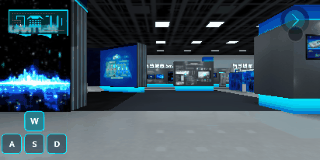

（动图10）

> 动图10中，按键的2D UI相关显示，不在本文介绍范围内，开发者可自行控制对应的2D显示逻辑。

###### 用摇杆的方向去控制摄像机移动

在移动端的时候，通常会用虚拟摇杆来自由控制摄像机向各个方向移动。

这种移动的自由度更大，相对于固定方向移动，从代码的角度看，

摄像机的基础移动API是一样的


##### 2.1.3 场景大范围跳转


#### 2.2  摄像机旋转

Transform的旋转方式有很多种，世界旋转rotation、旋转变换rotate、世界空间的旋转角度rotationEuler、


旋转摄像机节点是通过变换的旋转方法`rotate()`实现，该方法有三个参数，如图9-2所示。

分别是`旋转坐标的三维向量值`、`是否为局部空间的布尔值（true为局部空间false为世界空间）`、`是否弧度制的布尔值（true为弧度制false为角度制）`。

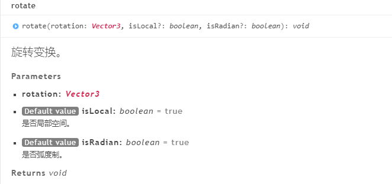

(图9-2)

rotate的使用示例代码为：

```typescript
//3d场景加载
Laya.Scene3D.load("xx/xx.ls",Laya.Handler.create(null,function(scene:Laya.Scene3D){
    //加载完成后，把加载回调中返回的完整场景scene添加到舞台
    Laya.stage.addChild(scene);
    //获得摄像机节点
    let camera = <Laya.Camera>scene.getChildByName("Camera1");
	//以角度制的方式，在世界坐标，向y轴负方向旋转摄相机45度，向z轴正方向旋转相机90度。
	camera.transform.rotate(new Laya.Vector3(0, -45, 90),false,false);
    //以弧度制的方式，在局部空间坐标，向z轴负方向旋转弧度3.14    
	//camera.transform.rotate(new Laya.Vector3(0, 0, -3.14));
}));
```
