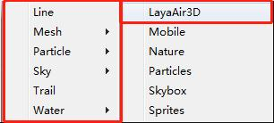

# 从Unity中导出材质

###### *version :2.1.0beta   Update:2019-5-14*

在导出场景和预设的会跟随一起导出材质。

如图1，这里是我们导出的一个场景：

 (图1)

***.lmat**文件就是材质文件： Json文件，包含光照，贴图，渲染模式等基本材质信息。

#### 关于材质导出支持的部分

​	支持Shader列表中LayaAir3D目录中的所有Shader。

​	如果使用非LayaAir3D Shader会强制转换为LayaAir3D的默认Shader，之后可能会出现无法预知的错误。

 (图2)