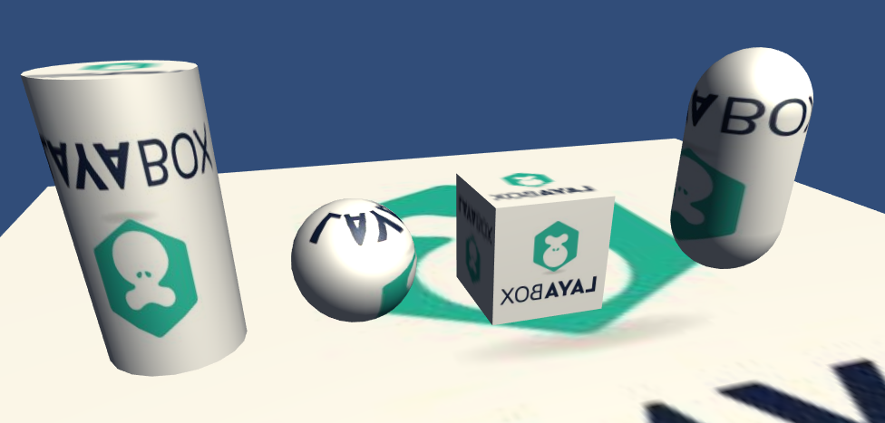
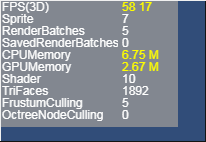

# 静态合并

###### *version :2.2.0beta   Update:2019-8-28*

在材质篇有简单的讲解过静态合并的基本条件：使用同材质的模型。

场景在加载场景时会对物体进行合并处理。

#### 如何使用静态合并

在Unity中对需要使用静态合并的模型勾选 Static 静态选项导出即可。

 (图1)

在导出后，正常使用导出后的场景（或预设）就能使用静态合并功能。

我们先来看一个简单的场景：

 (图2) 场景内容

然后针对这个场景，我们来看下使用了静态合并和没使用的效果对比图（通过Stat面板查看数据比对）。

 (图3) 未使用静态合并

 (图4) 使用了静态合并

通过对比我们可以明显的看到，RenderBatches渲染批次减少了，Shader提交次数减少了。
