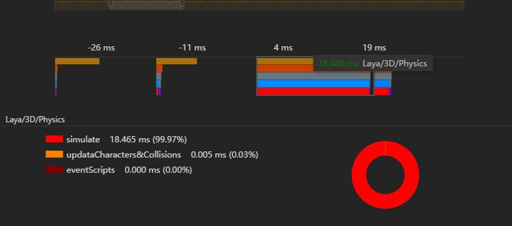

# LayaAir 3D性能分析工具

> Engine \ IDE Version : 2.12       Update Date: 2021-04-19

在LayaAir2.12版本，LayaAir引擎更新了性能分析工具，工具集成在LayaAirIDE中，同时也提供了简易的性能查看方案。

## 1、性能分析工具概述

在游戏开发过程中，游戏性能是非常重要的。需要用到性能分析工具，Laya的性能分析工具可以提供给开发者某些官方关键函数的占用时间以及开发者可以自定义查看开发过程中的某个函数的占用时间，以此来分析游戏运行时的关键卡顿点，最终达到性能优化的目的，这个工具集成在IDE内部，可以很方便的分析PC，安卓，iOS，以及小游戏平台的游戏性能。

这里要特别注意，性能分析工具需要在LayaAir2.12版本或者更高的版本才可以使用

## 2、如何打开并连接性能分析工具

### 2.1 如何使用性能分析工具

#### 2.1.1  引入性能分析库

开发者需要在IDE中，按下F9，出现项目设置界面

 

随后在类库设置中找到laya.performancetool.js

 

按下F8重线编译代码，便会引入性能分析工具库

#### 2.12 打开性能分析工具页面

点击IDE的左上角图标，在下拉菜单中找到工具栏，并在子列表中找到性能分析工具

 

点击后会出现性能分析面板

 

#### 2.13 代码连接工具

在代码中，我们需要用代码来开启或者关闭性能分析工具。

```typescript
//设置性能分析工具
Laya.PerformancePlugin.setPerformanceDataTool((Laya as any).PerformanceDataTool.instance);
//开启性能分析
Laya.PerformancePlugin.enable = true;
// 项目地址为外网或者内嵌在别的应用中（如微信小游戏）时，需要设置性能分析器所在机器的局域网ip
// (Laya as any).PerformanceDataTool.setDataExportHost('局域网ip，如10.10.20.25');         
//开启性能数据传输（没有打开性能分析器的时候是没用的）
Laya.PerformancePlugin.enableDataExport = true;
```


#### 2.14 在工具中分析数据

在打开的性能分析工具中打开开始录制便可以得到实时的性能数据


### 2.2 性能分析工具面板介绍

性能分析工具可以分为四个小块，数据选择区、功能区、曲线分析区、帧数据分析区

#### 2.2.1 数据选择区


在这个区域中，你可以选择你想查看的性能曲线，列表中会显示你所查看的性能分析组中的代码函数种类，以及在曲线分析区中的颜色，下面两张图分别显示了Laya3D物理和Laya3D渲染的性能曲线。


你也可以在左边的列表中点击颜色来控制这个功能块在图表中的显示和隐藏，方便你单独查看这个数据的曲线

#### 2.2.2 功能区


##### 开始录制/停止录制

当数据开始传输。我们可以点击开始录制，来让工具接受数据的传输，并实时分析，当你觉得数据足够时，再点击这个按钮就可以停止数据接收，然后来详细分析已经接受的数据

##### 保存/打开

保存功能可以把接收好的数据保存为一个文件，等需要时再利用打开功能，将数据导入

##### 设备选择区

当你多个设备同时运行了这个项目的时候，你可以在设备选择区选择设备来分析，例如你同时在小游戏平台，浏览器平台开了打开了性能分析传输功能的项目，你可以在设备选择区的列表中选择你需要分析的设备。非常的实用

#### 2.2.3 曲线分析区


##### 曲线显示区

在这个区域，性能分析器会显示数据分析区中罗列方法的性能曲线，能大致的看到随着时间的推移，性能的变化，以及性能的所占时间，工具还提供了30帧、60帧的时间线来方便开发者对所查看的功能块有个大致的性能印象，曲线越高，证明性能越差

##### 帧数据选择区

帧数据选择区可以在区域中，选择多少帧，曲线显示区会做相应的变化

##### 单帧分析区

 

##### 帧数据选择区


可以在数据分析中选择有兴趣某一帧或者某一区域块来查看数据

##### 帧数据时间显示区/饼图分析区

 

数据分析区可以具体分析每个功能块的实际占用时间以及所占的百分比

饼图区域更加直观的看出每个功能块的占用比例


## 3、简易分析工具面板介绍

有的时候，为了方便，开发者可能只想简单的了解一下某个函数的性能，基于这个考虑，我们也为开发者准备了简易的性能分析方式，简易性能分析无需IDE，也无需绑定分析工具，短短几行代码便可以直接显示在渲染面板上面。

```
        //设置性能分析工具
        Laya.PerformancePlugin.setPerformanceDataTool((Laya as any).PerformanceDataTool.instance);
        //开启性能分析
        Laya.PerformancePlugin.enable = true;
        //分析PerformancePlugin.PERFORMANCE_LAYA_3D性能块
        PerformancePlugin.showFunSampleFun(PerformancePlugin.PERFORMANCE_LAYA_3D)
```

这时就会在面板上面显示性能分析面板，如下图所示

 

这里  上面那条白色曲线，是每帧真实消耗的时间，下面那条彩色曲线便是在showFunSampleFun函数调用的性能块的时间消耗时间，绿色直线是60帧时间线，红色直线是30帧时间线，我们可以通过简易的分析判断到底是哪个函数造成了性能压力。

## 4、自定义性能分析

为了更加方便开发者测试自己想要测试的模块，我们这里为开发者提供了强大的自定义功能

首先我们还是必须要绑定我们的性能开发工具

```typescript
//设置性能分析工具
Laya.PerformancePlugin.setPerformanceDataTool((Laya as any).PerformanceDataTool.instance);
//开启性能分析
Laya.PerformancePlugin.enable = true;
```

### 4.1 利用工具获得某个函数的调用时间

如下我们想知道UpdateAllScripte这个函数的具体调用时间，我们可以采用下面的方式

```typescript
update(){
    //开始记录调用
    Laya.PerformancePlugin.begainSample("updateAllScript");
    UpdateAllScripte()
    //计算结束的调用
    let time = Laya.PerformancePlugin.endSample("updateAllScript");
    //这里的time便是这次调用所消耗的时间
    console.log(time);
}
```

我们只需要简单的调用BeginSample  endSample  便可以记录函数的调用时间，如果每帧中多次调用，会重复累加调用时间，此调用时间在性能分析工具中也可以统计到

也可以直接调用showFunSampleFun("updateAllScript")来用简易的性能分析工具分析。

### 4.2 利用性能分析工具自定义分析数据

开发者想利用分析工具来直接分析某个函数某几个模块分别占用函数调用的比例，我们工具也提供了功能来让开发者轻易的实现，直接看下面代码

```typescript
//此示例中我们想查看UpdateAllScripte、Render、ReSiteState的性能分析
update(){
    //开始记录调用
    Laya.PerformancePlugin.begainSample("Update");
    
    Laya.PerformancePlugin. begainSample("Update/updateAllScript");
    UpdateAllScripte();
    Laya.PerformancePlugin.endSample("Update/updateAllScript");
    
    Laya.PerformancePlugin. begainSample("Update/Render");
    Render();
    Laya.PerformancePlugin.endSample("Update/Render");    
    
    Laya.PerformancePlugin. begainSample("Update/Render");
    ReSiteState();
    Laya.PerformancePlugin.endSample("Update/Render");    
    
    Laya.PerformancePlugin. endSample("Update");
    //这里的time便是这次调用所消耗的时间
    console.log(time);
}
```

是的 我们会根据路径自动分组，并记录数值，在性能分析工具中显示，方便开发者组织自己的性能分析块。