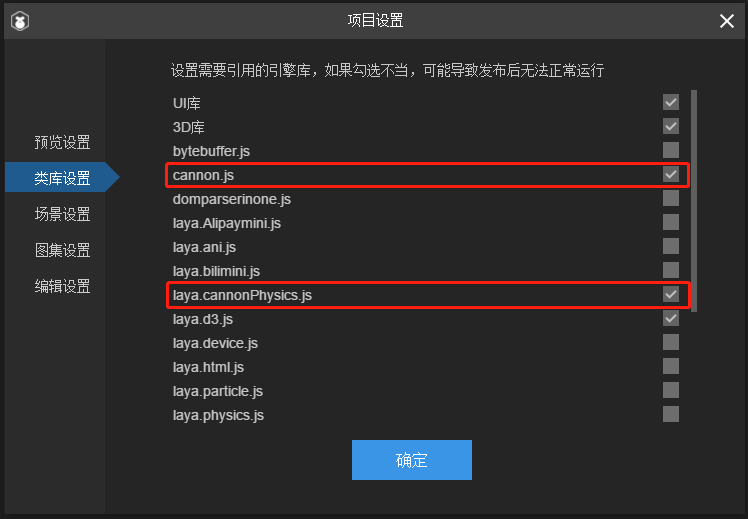

# 基于Cannon.js的物理系统

###### *version :2.7.0beta   Update:2020-6-08*

[Cannon.js](https://github.com/schteppe/cannon.js) ：完全使用 JavaScript 编写的优秀 3D 物理引擎，包含简单的碰撞检测、各种形状的摩擦力、弹力、约束等功能。在LayaAir 2.7.0beta中，完成了对其基本功能的支持，并逐步在后续的版本中完善对Cannon.js功能的支持。

**以下为LayaAir 2.7.0beta中，支持的Cannon的功能：**

- 1.CannonRigidbody3D 刚体

​	碰撞检测，碰撞过滤，运动学刚体，触发器等功能

- 2.CannonColliderShape 碰撞形状

​	CannonBoxColliderShape盒型，CannonSphereColliderShape球型以及CannonCompoundColliderShape复合形状。

- 3.碰撞事件

​	onCollisionEnter、onCollisionStay、onCollisionExit、onTriggerEnter、onTriggerStay、onTriggerExit。

- 4.物理属性(通过刚体进行设置)

​	restitution弹力、friction摩擦力、mass质量、linearDamping线性阻尼、angularDamping角阻尼、linearVelocity线速度、angularVelocity角速度、isSleeping是否处于休眠状态等。

- 5.rayCast射线检测功能

​	rayCast、rayCastAll。


**在LayaAir中使用Cannon.js**

- 1.创建盒型MeshSprite3D

```typescript
var box: MeshSprite3D = this.scene.addChild(new MeshSprite3D(PrimitiveMesh.createBox(sX, sY, sZ))) as MeshSprite3D;
```

- 2.为精灵添加CannonRigidbody3D组件

```typescript
var rigidBody: CannonRigidbody3D = box.addComponent(CannonRigidbody3D);
```

- 3.设置碰撞器形状

```typescript
//创建盒子形状碰撞器
var boxShape: CannonBoxColliderShape = new CannonBoxColliderShape(sX, sY, sZ);
//设置盒子的碰撞形状
rigidBody.colliderShape = boxShape;
```

- 4.设置刚体的属性(刚体的属性设置和使用bullet作为物理引擎时保持了一致，所以可以参考官网demo，包括以bullet为物理引擎的demo和以Cannon为物理引擎的demo)

```typescript
//设置刚体的质量
rigidBody.mass = 10;
//设置刚体摩擦力
rigidBody.friction = 1;
...
```

- 5.碰撞事件和触发事件的使用(和使用bullet作为物理引擎保持了一致都需要开发者编写继承自Script3D的脚本,将脚本作为组件添加到精灵上。)

```typescript
class colliderCheck extends Script3D{
	/**
	 * 开始触发时执行
	 * 此方法为虚方法，使用时重写覆盖即可
	 */
	onTriggerEnter(other: PhysicsComponent): void {
		console.log("triggerEnter");
	}

	/**
	 * 持续触发时执行
	 * 此方法为虚方法，使用时重写覆盖即可
	 */
	onTriggerStay(other: PhysicsComponent): void {
		console.log("triggerStay");
	}

	/**
	 * 结束触发时执行
	 * 此方法为虚方法，使用时重写覆盖即可
	 */
	onTriggerExit(other: PhysicsComponent): void {
		console.log("triggerExit");
	}

	/**
	 * 开始碰撞时执行
	 * 此方法为虚方法，使用时重写覆盖即可
	 */
	onCollisionEnter(collision: Collision): void {
		console.log("collisionEnter");
	}

	/**
	 * 持续碰撞时执行
	 * 此方法为虚方法，使用时重写覆盖即可
	 */
	onCollisionStay(collision: Collision): void {
		console.log("collisionStay");
	}

	/**
	 * 结束碰撞时执行
	 * 此方法为虚方法，使用时重写覆盖即可
	 */
	onCollisionExit(collision: Collision): void {
		console.log("collisionexit");
	}
}


//为精灵添加脚本
box.addComponent(colliderCheck);
```

- 6.射线检测功能

```typescript
mouseDown(){
  		//获取鼠标点击位置的屏幕坐标
		this.point.x = MouseManager.instance.mouseX;
		this.point.y = MouseManager.instance.mouseY;
		//由点击的屏幕坐标产生射线
		this.camera.viewportPointToRay(this.point, this.ray);
  		//创建CannonHitResult对象来存储射线检测结果
		var out: CannonHitResult = new CannonHitResult();
  		//进行射线检测
		this.scene.cannonPhysicsSimulation.rayCast(this.ray,out);
  		//CannonHitResult对象的succeeded属性中会存储本次射线检测是否成功
		if(out.succeeded)
		{
			//获取射线检测到的精灵对象
			var selectSprite3D:MeshSprite3D = <MeshSprite3D>out.collider.owner;
			(<BlinnPhongMaterial>selectSprite3D.meshRenderer.sharedMaterial).albedoColor = this.colorRed;
			if(this.oldSelectMesh)
			if(selectSprite3D!=this.oldSelectMesh)
			(<BlinnPhongMaterial>this.oldSelectMesh.meshRenderer.sharedMaterial).albedoColor = this.colorWrite;
			this.oldSelectMesh = selectSprite3D;
          
          	//输出碰撞点的坐标
			console.log(out.point.x);
			console.log(out.point.y);
			console.log(out.point.z);
			//输出碰撞点的的法线信息
			console.log(out.normal.x);
			console.log(out.normal.y);
			console.log(out.normal.z);
		}
		
	}
```


**在LayaAir IDE中使用Cannon.js物理引擎库**

需要手动勾选Cannon相关的两个库cannon.js和laya.cannonPhysics.js

如图所示：




**官网示例展示效果：**

- 1.基于cannon的物理系统--基础碰撞器


- 2.基于cannon的物理系统--碰撞事件


- 3.基于cannon的物理系统--物理属性


- 4.基于cannon的物理系统--射线检测


