## 一篇上手LayaAir的3D物理引擎

> *Author: Charley    Date: 2021-01-05       Engine&IDE Version : 2.9.0*

LayaAir引擎集成了世界三大物理引擎之一的Bullet引擎，当在Unity中使用了物理组件，用LayaAir的Unity插件导出后，默认就是采用的Bullet引擎。当然，LayaAir引擎也支持使用比较轻量的Cannon物理引擎的基础功能。本篇针对LayaAir引擎的初学者，全面介绍了3D物理引擎使用的基础能力。方便开发者快速上手。

> 阅读本篇时，除非是Cannon物理引擎的专属章节，或者注明是cannon物理引擎，默认介绍都是基于LayaAir封装的Bullet引擎。

[TOC]

### 一、刚体

#### 1.1 什么是刚体

无论是2D，还是3D，物理的开篇，都需要先了解刚体（RigidBody），这是物理引擎的基础之一。

大家都知道，自然界一切有形体的物质，都可以叫物体。

刚体是力学中为了体现物体特性的一种科学抽象概念，也是一种理想状态的力学表达模型，**是指在运动中和受到力的作用后，形状和大小不变，而且内部各点的相对位置不变的物体。** 

然而，现实中不可能存在这种理想模型，物体在受力之后，会根据力、材料、弹性、 塑性等综合因素，决定是否改变或改变多少。 如果物体本身的变化不影响整个运动过程，为使被研究的问题简化，仍将该物体当作刚体来处理而忽略物体的体积和形状，这样所得结果仍与实际情况相当符合。 

#### 1.2 常用的刚体属性

##### `isKinematic`是否为运动刚体

3D的刚体，默认是动力学刚体。受力的影响，可以位移。

一旦我们把刚体设置为运动刚体类型后，即将`isKinematic的值设置为true`。

那么将只会触发物理反馈（例如其它物体撞击后引起其它物体的反弹），但自己不会受力的影响，不会产生受力位移，位移只能通过transform改变节点。

> 与2D的运动学类型刚体不同，3D的运动刚体脱离了物理引擎运动，即使设置速度也不可以使其位移。这样做的好处是减少了物理运算，节省了性能。

##### `mass`质量

质量是物质的量的量度，Bullet引擎中的质量单位为kg。

刚体的质量越大，运动状态改变越难，比如，不同质量的两个物体相撞，质量大的一方改变更小一些，如动图1的右侧所示：

 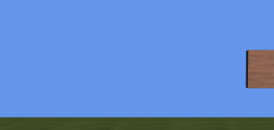 

（动图1）

> 静态刚体和运动刚体就相当于无限大质量，不受力的影响。

##### `gravity` 重力

自然界中物体受地心吸引的作用而受到的力叫重力，物理引擎中也同样模拟了重力，

动力学刚体在同等的质量下，重力越大，下落的加速度越大。对比效果如动图1-1。

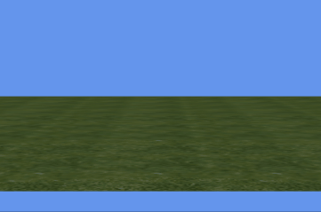 

（动图1-1）

##### `angularVelocity` 角速度

刚体的angularVelocity属性是角速度， 角速度简单理解就是单位时间的角位移，以弧度每秒进行旋转 。当我们设置动力学刚体angularVelocity属性为正值的时候，则按顺时针旋转位移。angularVelocity属性为负值的时候，则按逆时针旋转位移。属性值的绝对值越大，旋转位移速度越快。

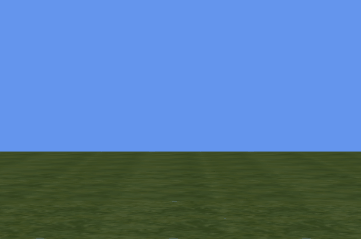 

（动图1-2）

angulaVelocity属性的值是3维向量`Vector3`类型值，Bullet使用欧拉角来描述物体的旋转，3D向量的每个分量代表绕x、y、z轴旋转的速度，单位是**弧度/秒**。动图1-2，就是在x轴分别设置了3.14与31.4的对比效果。

#####  `angularDamping` 角阻尼

刚体的角阻尼相当于是为角速度旋转方向施加了相反的力，使得旋转速度衰减。动图1-3，是在同样的31.4角速度下，左侧为1的的角阻尼值，右侧为0.9的角阻尼值，对比效果。

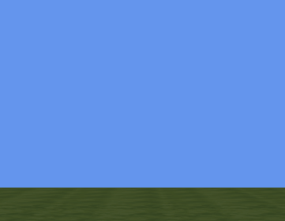 

（动图1-3）

##### `linearVelocity` 线性速度

刚体的linearVelocity属性称为线速度或者线性速度，是指物体的直线运动速度。

动力学刚体的线速度是3维向量`Vector3`类型值，向量的方向即速度的方向，向量的长度即速度的大小。

动图1-4，是动力学刚体在同样重力值为0的情况下，没有设置线速度和y轴设置了线速度值的对比效果。

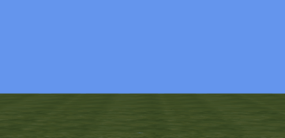 

（动图1-4）

##### `linearDamping` 线性阻尼

刚体的linearDamping属性，是指线性速度的阻尼系数，使得线性速度衰减。

动图1-5，是动力学刚体在重力为0并且y轴设置了同样为-1的线速度值情况下，左侧为0.9线性阻尼值和右侧为1线性阻尼值的对比效果。

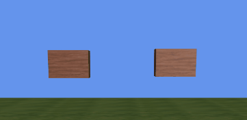 

（动图1-5）


### 二、物理碰撞

碰撞是物理引擎中最基础、最常用的功能。在这个小节里，我们对物理碰撞进行全面的认知。

#### 2.1 碰撞器与触发器

对于检测物理碰撞的方式，有碰撞器与触发器两种。我们先从概念认知开始。

##### 2.1.1 碰撞器 

在LayaAir引擎2D物理的时候，通过封装的不同形状的碰撞体，就可以直接实现带范围的物理碰撞。

而LayaAir引擎的3D物理，形状不再是最主要的特征，只是用于不同类型碰撞器依据三维形状来检测碰撞范围。

完整的3D碰撞器，由碰撞器和碰撞器形状组成。

3D碰撞器根据特点的不同，分为静态碰撞器、刚体碰撞器、角色碰撞器。

而这些碰撞器必须要添加三维碰撞器形状（例如：盒形、球形、圆锥形、圆柱形、胶囊形、平面、混合、模型网格），才可以实现有范围的物理碰撞。

 

（图2）

图2是胶囊形状角色碰撞器的编辑预览效果。

##### 2.1.2 触发器

LayaAir 3D物理的触发器相当于2D物理里的传感器。

触发器是碰撞器的一个属性，任何碰撞器的触发器属性设置生效后，当前的碰撞器即转变为触发器（比如，静态碰撞器设置触发器后可称为静态碰撞触发器）。即使发生物理碰撞，也不再产生碰撞的物理反馈。例如，碰撞后会无视物理引擎，直接穿透而过，如动图3-1右侧所示。

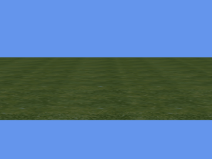 

（动图3-1）

但是，设置触发器可以激活触发器的碰撞生命周期方法，用于检测碰撞的发生。

> 激活触发器生命周期也有特定的情况除外，具体规则会在下面的碰撞生命周期章节介绍

当触发器`isTrigger`设置为true时，或者在Unity的碰撞体组件那里勾选`Is Trigger`并导出使用时。触发器即可设置生效。默认值是关闭的。

通过代码设置触发器的方式：

```typescript
/*
……省略若干代码
*/

//创建盒型MeshSprite3D
let box = scene.addChild(new Laya.MeshSprite3D(Laya.PrimitiveMesh.createBox(sX, sY, sZ))) as Laya.MeshSprite3D;
//创建静态碰撞器
let staticCollider:Laya.PhysicsCollider = box.addComponent(Laya.PhysicsCollider);
//设置为触发器,取消物理反馈
staticCollider.isTrigger = true;

/*
……省略若干代码
*/
```

在Unity中设置触发器的方式，如图3-2所示：

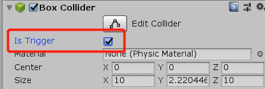 

（图3-2）


#### 2.2 理解各种碰撞器

##### 2.2.1 静态碰撞器 `PhysicsCollider`

LayaAir的3D物理碰撞器类是`PhysicsCollider`，为了便于记忆和理解，我们叫他静态碰撞器类。因为它的特性是不受力，不会产生物理移动。

当其与动态刚体碰撞器和角色碰撞器发生物理碰撞后，可以触发物理碰撞生命周期方法，但不会产生物理的受力位移。

这种碰撞器可以用于不需要物理受力位移的物体，只需要触发碰撞逻辑的应用场景。例如墙体，撞墙后判定游戏结束。

在Unity中，如果我们添加了某种Collider组件，但并没有添加Rigidbody组件，那导出后就是`PhysicsCollider`。

##### 2.2.2 刚体碰撞器  `Rigidbody3D `

LayaAir的2D物理刚体与碰撞体是独立的，而3D物理的刚体与碰撞器是整合的，`Rigidbody3D`类即是刚体也是碰撞器，我们可称为刚体碰撞器。

默认情况下，`Rigidbody3D`是**动力学类型**的刚体碰撞器，这是可以受力影响的刚体类型碰撞器，所以我们通常用动力学刚体碰撞器进行受力的交互反馈。例如，撞击后的反弹、飞出或者倒下，放在空中会受重力影响而掉落，等等。

当我们将`Rigidbody3D`类的运动刚体`isKinematic`启用后，那么默认的动力学刚体碰撞器就转变为运动刚体碰撞器。

运动刚体碰撞器从表象上看，与静态碰撞器基本上没有什么区别。都是不受重力、不受速度、不受其它力的影响，在物理世界中永远处于静止，只能通过transform去改变节点坐标来移动。但实质上，运动刚体有物理特性，它可以是施力物体，可以对非运动刚体产生力，例如通过控制节点去移动运动刚体，推着动力学刚体移动。而静态碰撞器的应用场景就是要永远不动，也无法施加力。并且，通过节点去移动静态碰撞器，也比较消耗性能。如果有移动的碰撞器需求，例如来回移动的跳板或障碍，使用运动刚体碰撞器就可以了。

通过代码设置运动刚体的方式：

```typescript
/*
……省略若干代码
*/

//创建刚体碰撞器
let _rigidBody = sphere.addComponent(Laya.Rigidbody3D) as Laya.Rigidbody3D;
//开启运动类型刚体
_rigidBody.isKinematic = true;

/*
……省略若干代码
*/
```

在Unity中设置运动类型刚体的方式，如图4所示：

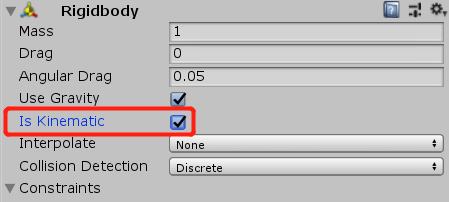 

（图4）

由于LayaAir的3D物理中有了静态碰撞器`PhysicsCollider`，所以并没有在`Rigidbody3D `中去实现静力学类型的刚体碰撞器。有静止的碰撞反馈需求，直接使用静态碰撞器即可。

##### 2.2.3 角色碰撞器 `CharacterController`

角色控制器类`CharacterController`常用于对第一人称和第三人称游戏角色的控制，可以方便的控制角色的跳跃、跳跃速度、降落速度、行走、等。

由于角色控制器继承于`PhysicsComponent`，也具有碰撞器的特性，可以添加三维碰撞形状，产生碰撞的反馈，因此也称为角色碰撞器，属于碰撞器之一。

与静态碰撞器和刚体碰撞器都继承自物理触发器组件`PhysicsTriggerComponent`不同，角色控制器直接继承于物理组件的父类`PhysicsComponent`。所以，角色控制器是无法设置为触发器的。但是，角色碰撞器与触发器进行接触，仍然可以激活触发器的生命周期方法。

#### 2.3 碰撞形状

碰撞形状是用于检测碰撞接触的范围，只有添加了形状，碰撞器和触发器才能触发物理反馈和生命周期。

LayaAir引擎支持8种3D碰撞形状，分别为：

盒形`BoxColliderShape`、球形`SphereColliderShape`、圆柱形`CylinderColliderShape`、胶囊形`CapsuleColliderShape`、圆锥形`ConeColliderShape`、平面形状`StaticPlaneColliderShape`、复合形状`CompoundColliderShape`、网格形状`MeshColliderShape`。

##### 2.3.1 Unity中可导出的碰撞形状

Unity中的盒形碰撞体`Box collider`、球形碰撞体`Sphere Collider`、胶囊形碰撞体`Capsule Collider`、网格碰撞体 `Mesh Collider`，这4种组件是可以通过LayaAir导出插件直接导出使用的。

这些组件包括了碰撞形状，无需通过引擎代码添加碰撞形状，所以对于盒形、球形、胶囊形、网格形、以及由以上基础形状碰撞体组合而成的复合碰撞形状。都建议在Unity里编辑导出使用。

> 需要注意的是，这些碰撞体组件的节点如果没有添加刚体组件，那导出后在LayaAir引擎属于静态碰撞器，加上Rigidbody组件后，在LayaAir引擎属刚体碰撞器。

下面我们简单介绍一下这些碰撞体形状的基础属性设置

###### 盒形碰撞形状

盒形碰撞形状是通过设置XYZ调整长宽高的长方体（含立方体）形状。常用于盒子外形的长方体物体，如图5-1所示。

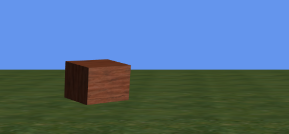 

（图5-1）
在Unity中，为物体节点对象添加`Box Collider`组件，设置XYZ各轴的大小，如图5-2所示，导出后即可使用。

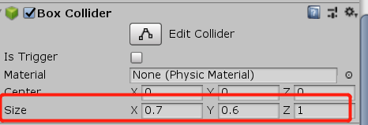 

（图5-2）

###### 球形碰撞形状

球形碰撞形状是通过设置半径调整球体大小的碰撞形状。常用于球形外观的物体，如图6-1所示。

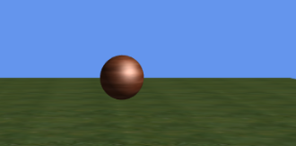 

（图6-1）

在Unity中，为物体节点对象添加`Sphere Collider`组件，设置半径，如图6-2所示，导出后即可使用。

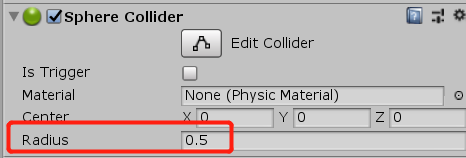 

（图6-2）

###### 胶囊形碰撞形状

胶囊形碰撞形状是由两个半球和一个圆柱体组成，需要通过设置球体半径和圆柱体的高来组成胶囊形状。常用于角色碰撞器。如图7-1所示。

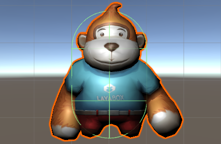  

（图7-1）

在Unity中，为物体节点对象添加`Capsule Collider`组件，设置半径和高，如图7-2所示，导出后即可使用。

  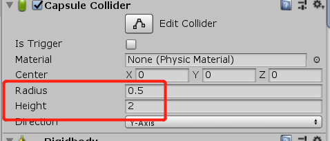 

（图7-2）

###### 网格形碰撞形状

网格形碰撞形状是利用模型网格资源构建的形状，如图8-1的蜥蜴所示。相对于其它固定规则的碰撞形状（LayaAir内置的3D碰撞基础形状），网格形碰撞形状属于自定义任意外观的碰撞形状，可以适用于任何模型网格。

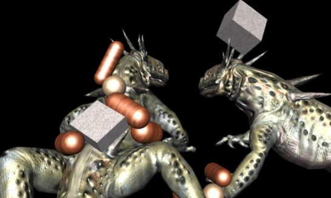 

（图8-1）

在Unity中，为物体节点对象添加` Mesh Collider`组件，设置模型网格，如图8-2所示，导出后即可使用。

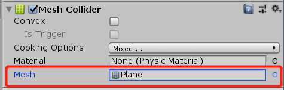 

（图8-2）

###### 复合碰撞形状

复合碰撞形状是由多个基础形状组合而成的碰撞器形状。例如桌子或者凳子等，可以由多个盒形碰撞形状组成，如图8-3所示。

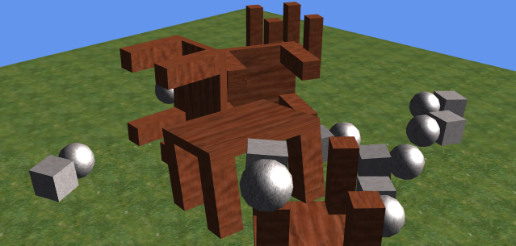 

（图8-3）

LayaAir引擎的复合碰撞形状，其实Unity中并没有直接对应的组件。但是，开发者在Unity中，对同一个节点对象添加多个基础的碰撞体，例如同时添加`Box Collider`组件和`Sphere Collider`组件，如图8-4所示，那通过LayaAir的导出插件导出后，会自动识别为复合碰撞形状。

 

（图8-4）

##### 2.3.2 Unity没有的LayaAir碰撞形状

除了Unity碰撞体组件支持的一些形状外，LayaAir引擎中还内置了一些基础的3D碰撞形状。这些只能通过代码的方式进行添加。

分别是：圆柱形、圆锥形、平面形状。

###### 圆柱形碰撞形状

圆柱形碰撞形状是由两个大小相等、相互平行的圆形（底面）以及连接两个底面的一个曲面（侧面）围成的几何体形状，通过设置底面半径和连接高度来调整碰撞形状的大小。常用于场景的柱子等圆柱形外观的物体碰撞。如图9-1所示。

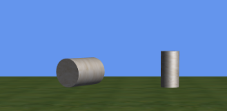  

（图9-1）

项目代码里，通过创建一个`CylinderColliderShape`实例的方式，传入半径和高，即可返回一个圆柱形碰撞形状对象，将这个对象添加给碰撞器的colliderShape属性即可。API说明如图9-2所示。

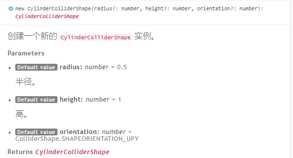 

（图9-2）

###### 圆锥形碰撞形状

圆锥形碰撞形状是以直角三角形的直角边所在直线为旋转轴，其余两边旋转360度而成的曲面所围成的几何体形状。需要设置底面半径和锥体高来调整碰撞形状大小。常用于锥体外观的物体碰撞。如图10-1所示。

 

（图10-1）

项目代码里，通过创建一个`ConeColliderShape`实例的方式，传入半径和高，即可返回一个圆锥形碰撞形状对象，将这个对象添加给碰撞器的colliderShape属性即可。API说明如图10-2所示。

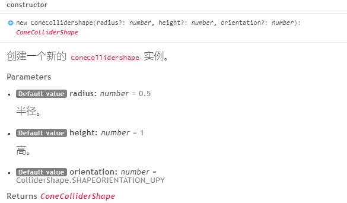 

（图10-2）

###### 平面碰撞形状

平面碰撞形状，是一种无限大的2D平面碰撞形状。通常用于整个场景地面的碰撞形状。通过法线来确定在3维世界的平面朝向，可以通过偏移值来调整距离原点的偏移多少。API说明如图11-1所示。

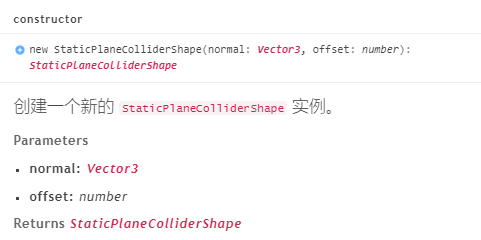 

（图11-1）

通过API，我们可以看到normal是一个3维向量值，表示着平面的法线。例如这个值为`Vector3(0, 1, 0)`，则表示法线位于Y轴正方向，平面碰撞形状就是处于其垂直的X轴无限大水平面。

图11-2是法线同样位于Y轴正方向，偏移值offset分别为0（左侧）和为1（右侧）的效果对比。

 

（图11-2）

##### 2.3.3 碰撞器的形状添加示例

###### 使用Unity导出的碰撞组件

Unity导出的碰撞组件使用起来最简单，由于组件已经整合了碰撞器和碰撞形状，直接加载就可以使用了。某些情况下甚至可以不写代码，所以我们介绍一下使用Unity的节点对象和刚体，通过代码添加碰撞形状的示例。

在Unity中，是可以直接创建圆柱体这种基础3D对象的，但是Unity没有圆柱形碰撞组件，创建的圆柱体默认是胶囊碰撞体组件`Capsule Collider`，所以，我们删除圆柱体对象的胶囊碰撞体组件，添加刚体组件（Rigidbody）导出，编写代码如下所示：

```typescript
   /*
    ……省略若干代码
   */
Laya.Scene3D.load("Conventional/SampleScene.ls", Laya.Handler.create(null, function (_Scene3D: Laya.Scene3D) {
    		//添加3D场景到舞台
			Laya.stage.addChild(_Scene3D);
			let _camera = _Scene3D.getChildByName("Main Camera") as Laya.Camera;
			_camera.clearFlag = Laya.CameraClearFlags.Sky;
			//从场景中找到圆柱对象
			let _cylinder = _Scene3D.getChildByName("Cylinder");
			//从圆柱对象上获得刚体碰撞器（对应Unity的刚体组件）
			let cyRigid = _cylinder.getComponent(Laya.Rigidbody3D) as Laya.Rigidbody3D;
    		//创建圆柱体形状（通常与圆柱对象的大小保持一致）
    		let cyShape = new Laya.CylinderColliderShape(0.5,2);
    		//为刚体碰撞器添加碰撞形状
			cyRigid.colliderShape = cyShape;
		}));
   /*
    ……省略若干代码
   */
```

###### LayaAir内置的基础碰撞形状使用示例

内置的碰撞器使用思路为，创建节点对象，创建碰撞器，创建碰撞器形状，为碰撞器添加碰撞形状。

我们以创建圆锥形刚体碰撞器为例，编写代码如下所示：

```typescript
   /*
    ……省略若干代码
   */

/**增加圆锥形刚体碰撞器 */
	private addCone(): void {
        //生成随机值半径和高
		let raidius = Math.random() * 0.2 + 0.2;
		let height = Math.random() * 0.5 + 0.8;
		//创建圆锥形3D模型节点对象
		let cone = new Laya.MeshSprite3D(Laya.PrimitiveMesh.createCone(raidius, height));
		//把圆锥形3D节点对象添加到3D场景节点下
		this.newScene.addChild(cone);
		//设置随机位置
		this.tmpVector.setValue(Math.random() * 6 - 2, 6, Math.random() * 6 - 2);
		cone.transform.position = this.tmpVector;
		//为圆锥形3D节点对象创建刚体碰撞器
		let _rigidBody = <Laya.Rigidbody3D>(cone.addComponent(Laya.Rigidbody3D));
		//创建圆锥形碰撞器形状（使用节点对象的值，保持一致性）
		let coneShape = new Laya.ConeColliderShape(raidius, height);
		//为刚体碰撞器添加碰撞器形状
		_rigidBody.colliderShape = coneShape;
	}
    
    /*
    ……省略若干代码
   */
```

> 其它基础形状的创建可参考官网的引擎示例

###### 复合碰撞形状的使用示例

虽然可以通过Unity导出复合的碰撞形状，这里也有必要单独介绍一下复合碰撞形状如何通过代码添加。

复合碰撞形状主要就是可以添加多个不同的子形状，理解后其实也是非常简单。

创建复合碰撞形状的方式并不复杂，先实例化复合碰撞形状`CompoundColliderShape()`，再通过复合碰撞形状对象的addChildShape方法添加基础碰撞形状子对象即可。

我们继续通过代码和注释来理解。编写代码如下所示：

```typescript
   /*
    ……省略若干代码
   */
Laya.Mesh.load("res/threeDimen/Physics/table.lm", Laya.Handler.create(this, function(mesh:Laya.Mesh) {
    //读取Unity导出的桌子模型节点对象，添加到3D场景节点下，
    var table = scene.addChild(new Laya.MeshSprite3D(mesh)) as Laya.MeshSprite3D;
    //给桌子节点对象添加刚体碰撞器
    var rigidBody = table.addComponent(Laya.Rigidbody3D) as Laya.Rigidbody3D;
    //实例化一个复合碰撞形状对象
    var compoundShape:Laya.CompoundColliderShape = new Laya.CompoundColliderShape();
    
    //创建盒形碰撞形状
    var boxShape:Laya.BoxColliderShape = new Laya.BoxColliderShape(0.5, 0.4, 0.045);
    //获取本地偏移
    var localOffset:Laya.Vector3 = boxShape.localOffset;
    //修改偏移
    localOffset.setValue(0, 0, 0.125);
    boxShape.localOffset = localOffset;
    //为复合碰撞形状对象添加子形状（刚刚创建的盒形碰撞形状）
    compoundShape.addChildShape(boxShape);
    
    //后面的代码都是类似，把一个个的子形状都添加到复合碰撞形状对象上。子形状也可以是别的形状，例如球形、圆柱形等，根据模型节点的实际情况来。
   /*
    ……省略若干boxShapeXX类似的代码，只保持到boxShape4
   */    
    var boxShape4:Laya.BoxColliderShape = new Laya.BoxColliderShape(0.1, 0.1, 0.3);
    var localOffset4:Laya.Vector3 = boxShape4.localOffset;
    localOffset4.setValue(0.2, 0.153, -0.048);
    boxShape4.localOffset = localOffset3;
    compoundShape.addChildShape(boxShape4);
    
    //把组合好的复合碰撞形状添加给刚体碰撞器的碰撞器形状属性
    rigidBody.colliderShape = compoundShape;
    
}));
   /*
    ……省略若干代码
   */
```


#### 2.4 碰撞生命周期方法

生命周期是从开始到结束的完整周期过程，有主动触发的主干生命周期方法，例如`onAwake()`、`onEnable()`、等。也有被动触发的事件类生命周期虚方法，这种只有在某个条件达到时才会自动激活，例如，本小节要讲的物理事件相关的方法。

##### 2.4.1 物理事件的生命周期方法说明

前文介绍过，检测物理碰撞的方式有两种，那物理事件的方法，也对应着两种。分别是碰撞事件生命周期方法和触发事件生命周期方法。

###### 碰撞事件生命周期方法说明：

碰撞器之间发生碰撞后，自动激活的事件虚方法。

| 碰撞事件生命周期方法名称 | 碰撞事件生命周期方法说明                                     |
| ------------------------ | ------------------------------------------------------------ |
| onCollisionEnter         | **刚发生物理碰撞时**，也就是碰撞事件生命周期内的第一次进入碰撞，自动执行的生命周期虚方法，该方法只会执行一次。 |
| onCollisionStay          | **持续的物理碰撞时**，也就是碰撞事件生命周期内的第二次碰撞到碰撞离开前，自动执行的生命周期虚方法。该方法在持续碰撞期间，每帧都会执行。 |
| onCollisionExit          | **物理碰撞结束时**，自动执行的生命周期虚方法，该方法只会执行一次。 |

###### 触发事件生命周期方法说明：

设置为触发器之后，因物体接触而自动激活的事件虚方法。

| 触发事件生命周期方法名称 | 触发事件生命周期方法说明                                     |
| ------------------------ | ------------------------------------------------------------ |
| onTriggerEnter           | **刚发生物体接触时**，也就是触发事件生命周期内的第一次进行接触，自动执行的生命周期虚方法，该方法只会执行一次。 |
| onTriggerStay            | **持续的物体接触时**，也就是触发事件生命周期内的第二次接触到接触离开前，自动执行的生命周期虚方法。该方法在持续接触期间，每帧都会执行。 |
| onTriggerExit            | **物体接触结束时**，自动执行的生命周期虚方法，该方法只会执行一次。 |

###### 特别说明：

- 碰撞事件的生命周期方法永远不会与触发事件的生命周期方法同时激活，只能是碰撞事件或者是触发事件。并且，如果有一方是触发器，那两方一定无法进入碰撞事件，只有进入触发事件的可能。
- 无论是碰撞事件还是触发事件的生命周期方法，从进入到离开的顺序皆为“Enter,Stay,Stay,……,Exit”。

##### 2.4.2 碰撞事件生命周期方法的触发条件

根据碰撞器的类型不同，并不是所有碰撞器之间，都会触发碰撞的反馈，以及激活相应的生命周期方法。

下面通过表格的方式，对应了各碰撞器之间是否可触发碰撞事件的生命周期虚方法。

|                  | 静态碰撞器 | 动力学刚体碰撞器 | 运动刚体碰撞器 | 角色碰撞器 |
| ---------------- | ---------- | ---------------- | -------------- | ---------- |
| 静态碰撞器       | ✘          | ✔                | ✘              | ✔          |
| 动力学刚体碰撞器 | ✔          | ✔                | ✔              | ✔          |
| 运动刚体碰撞器   | ✘          | ✔                | ✘              | ✔          |
| 角色碰撞器       | ✔          | ✔                | ✔              | ✔          |

###### 总结：

通过上面的表格，我们发现，静态碰撞器和运动刚体碰撞器，只能与动力学刚体碰撞器或者是角色碰撞器碰撞才可以触发碰撞器生命周期方法，静态碰撞器和运动刚体碰撞器彼此之间，是无法触发碰撞器生命周期的。

而动力学刚体碰撞器和角色碰撞器，和任意的碰撞器发生碰撞都可以触发碰撞器生命周期方法。

##### 2.4.3 触发事件生命周期方法的触发条件

碰撞器是只能与碰撞器之间碰撞，才有可能进入碰撞器的生命周期，

而触发器则不然，触发器不仅与触发器之间有可能进入触发器的生命周期，当触发器与碰撞器之间接触，也有可能进入触发器的生命周期，所以，我们分成两个表来理解。

###### 触发器与触发器之间：

|                  | 静态触发器 | 动力学刚体触发器 | 运动刚体触发器 |
| ---------------- | ---------- | ---------------- | -------------- |
| 静态触发器       | ✘          | ✔                | ✔              |
| 动力学刚体触发器 | ✔          | ✔                | ✔              |
| 运动刚体触发器   | ✔          | ✔                | ✔              |

###### 触发器与碰撞器之间：

|                  | 静态触发器 | 动力学刚体触发器 | 运动刚体触发器 |
| ---------------- | ---------- | ---------------- | -------------- |
| 静态碰撞器       | ✘          | ✔                | ✔              |
| 动力学刚体碰撞器 | ✔          | ✔                | ✔              |
| 运动刚体碰撞器   | ✔          | ✔                | ✔              |
| 角色碰撞器       | ✔          | ✔                | ✔              |

###### 总结：

通过上面的两个表格，我们发现，无论是触发器与触发器之间，还是触发器与碰撞器之间，只有静态碰撞器与静态触发器彼此之间碰撞或者接触，是无法进入生命周期的。

而其它类型之间接触，哪怕碰撞器没有开启触发器，甚至没有触发器属性（角色碰撞器），只要有任意一方是触发器，那也会自动进入触发器的生命周期。

##### 2.4.4 使用生命周期方法

###### 创建**Script3D**脚本

生命周期的方法，只能在脚本类里使用，所以，我们需要创建一个脚本，3D游戏必须要继承3D的脚本**Script3D**。空脚本的示例代码如下：

```typescript
/**
 * TypeScript语言的3D脚本示例
 */
export default class TSDemo extends Laya.Script3D {
    constructor() { super(); }
}
```

> 2D脚本与3D脚本不要混用，如果是用IDE创建的脚本模板，需要将继承的2D脚本类（Laya.Script）改为3D脚本类（Laya.Script3D），

###### 添加物理脚本

只有为节点添加了我们自定义的脚本，我们才可以让该节点使用生命周期方法。

添加的方式很简单，直接在代码中，用节点的`addComponent()`方法，就可以轻松的把继承了脚本类的3D脚本添加到节点上。

例如，我们创建一个3D盒子，并为其绑定刚刚创建的TSDemo脚本。示例代码如下：

```typescript
//引入自定义脚本TSDemo
import TSDemo from "./TSDemo";
/**
 * TypeScript语言示例
 */
export default class GameUI extends ui.TestSceneUI {
    /*
    ……省略若干代码
    */
    private addBox(): void {
		//创建盒型MeshSprite3D
		let box = this.newScene.addChild(new Laya.MeshSprite3D(Laya.PrimitiveMesh.createBox(0.75, 0.5, 0.5))) as Laya.MeshSprite3D;
		//设置材质
		box.meshRenderer.material = this.mat1;
        //设置空间位置
		let transform = box.transform;
		let pos = transform.position;
		pos.setValue(1, 6, 0);
		transform.position = pos;
		//创建刚体碰撞器
		let _rigidBody = box.addComponent(Laya.Rigidbody3D) as Laya.Rigidbody3D;
		//创建盒子形状碰撞器
		let boxShape = new Laya.BoxColliderShape(0.75, 0.5, 0.5);
		//设置盒子的碰撞形状
		_rigidBody.colliderShape = boxShape;
        
        //添加自定义脚本组件TSDemo
        box.addComponent(TSDemo);
    }
    /*
    ……省略若干代码
    */
}
```

###### 重写物理生命周期方法

之前介绍过有哪些物理生命周期方法，分别为三个碰撞器生命周期方法和三个触发器生命周期方法。我们在使用的时候，重写这些虚方法即可，当物理行为触发了对应的生命周期方法就会自动执行。

重写生命周期方法的示例代码如下：

```typescript
/**
 * TypeScript语言的3D脚本示例
 */
export default class TSDemo extends Laya.Script3D {
    constructor() { super(); }

    onTriggerEnter(): void {
        /*
   	 	……省略若干逻辑代码
    	*/
        console.log("触发器生命周期onTriggerEnter");
    }
    onTriggerStay(): void {
        /*
   	 	……省略若干逻辑代码
    	*/
        console.log("触发器生命周期onTriggerStay");
    }    
    onTriggerExit(): void {
        /*
   	 	……省略若干逻辑代码
    	*/
        console.log("触发器生命周期onTriggerExit");
    }

    
    onCollisionEnter(): void {
        /*
   	 	……省略若干逻辑代码
    	*/
        console.log("碰撞器生命周期onCollisionEnter");
    }
    onCollisionStay(): void {
        /*
   	 	……省略若干逻辑代码
    	*/
        console.log("碰撞器生命周期onCollisionStay");
    }
    onCollisionExit(): void {
        /*
   	 	……省略若干逻辑代码
    	*/
        console.log("碰撞器生命周期onCollisionExit");
    }
}
```

#### 2.5 碰撞分组与过滤碰撞组

当我们产生复杂的碰撞需求时，例如，想碰哪个，不碰哪个。这时候就需要进行分组，并指定可以与哪个碰撞组进行碰撞。另外，设置碰撞组过滤，还可以优化性能。

各种碰撞器从物理组件父类`PhysicsComponent`那里继承了collisionGroup与canCollideWith属性，用以实现碰撞分组和指定碰撞组。

##### 2.5.1 碰撞组 collisionGroup

碰撞组的值，我们通常设置为2的N次幂值。如果应用场景比较复杂，需要用到的碰撞分组比较多，记不住太多2的N次幂值，也可以直接使用LayaAir引擎内置的碰撞组工具类。

LayaAir引擎内置了17个碰撞组属性值，用于过滤不需要的碰撞。

引擎内置的碰撞组工具类为`Laya.Physics3DUtils`。

###### 全部可碰撞的组

由于碰撞组之间的碰撞依据是位运算的按位与，按位与的计算结果非0则可以碰撞，为0则不可碰撞。

Physics3DUtils工具类的`COLLISIONFILTERGROUP_ALLFILTER`属性值为-1，-1与任何2的幂值进行按位与都非0，所以取该属性值为分组时，则所有的碰撞组都可碰撞。
使用示例为：

```typescript
//指定xxx碰撞器所属哪个碰撞组（-1组与LayaAir任何内置组都可碰撞）
xxx.collisionGroup = Laya.Physics3DUtils.COLLISIONFILTERGROUP_ALLFILTER;
```

###### 自定义碰撞分组

LayaAir内置的碰撞组，不包括刚刚讲的-1（COLLISIONFILTERGROUP_ALLFILTER），我们可以用的还有10个，分别是`COLLISIONFILTERGROUP_CUSTOMFILTER1......10`。全都是2的幂，从64到32768。

为了方便记忆，我们可以不记实际值，记住CUSTOMFILTER后1到10的ID号区别即可。

使用示例为：

```typescript
//指定xxx碰撞器所属哪个碰撞组（COLLISIONFILTERGROUP_CUSTOMFILTER2对应的值为128）
xxx.collisionGroup = Laya.Physics3DUtils.COLLISIONFILTERGROUP_CUSTOMFILTER2;
```

###### 特定的碰撞分组

除了以上的分组外，LayaAir也对接了一些Bullet物理引擎预留的特定分组，用于比较简单的碰撞过滤需求。

例如，当前场景我们只有动态刚体碰撞器，静态碰撞器，运动学刚体碰撞器，只是对这几种碰撞器之间作碰撞过滤，那么我们就可以分别使用对应的默认碰撞组、静态碰撞组、运动学刚体碰撞组。

具体的预留分组属性说明如下：

| 碰撞组属性名                         | 属性值 | 说明             |
| ------------------------------------ | ------ | ---------------- |
| COLLISIONFILTERGROUP_DEFAULTFILTER   | 1      | 默认碰撞组       |
| COLLISIONFILTERGROUP_STATICFILTER    | 2      | 静态碰撞组       |
| COLLISIONFILTERGROUP_KINEMATICFILTER | 4      | 运动学刚体碰撞组 |
| COLLISIONFILTERGROUP_DEBRISFILTER    | 8      | 碎片碰撞组       |
| COLLISIONFILTERGROUP_SENSORTRIGGER   | 16     | 传感器触发器     |
| COLLISIONFILTERGROUP_CHARACTERFILTER | 32     | 字符过滤器       |

> 以上的属性是原样对接了Bullet物理引擎，例如碎片碰撞组和字符过滤器的概念，当前的引擎版本还没有。开发者想用也可以，但建议不采用，推荐使用自定义碰撞分组，以ID为分组标记更便于记忆。

##### 2.5.2 过滤碰撞组 canCollideWith

###### 指定碰撞单个组

碰撞器的`canCollideWith`属性可以用于指定与哪个组碰撞，指定哪个，就可以与哪个碰撞。其它的都不可以碰撞，起到了过滤其它碰撞组的效果。

使用示例为：

```typescript
//指定xxx碰撞器可以与其发生碰撞的碰撞组(本例只与自定义组1碰撞)
xxx.canCollideWith = Laya.Physics3DUtils.COLLISIONFILTERGROUP_CUSTOMFILTER1;
```

###### 指定碰撞多个组

如果我们想碰撞多个组，可以采用位运算的按位或`|` ，去指定多个可以与其发生碰撞的碰撞组。

使用示例为：

```typescript
//指定xxx碰撞器可以与其发生碰撞的碰撞组(本例只与自定义组1、2、5进行碰撞)
xxx.canCollideWith = Laya.Physics3DUtils.COLLISIONFILTERGROUP_CUSTOMFILTER1 | Laya.Physics3DUtils.COLLISIONFILTERGROUP_CUSTOMFILTER2 | Laya.Physics3DUtils.COLLISIONFILTERGROUP_CUSTOMFILTER5;
```

> 关于位运算用于碰撞的基础原理，如果不明白的可以参考[2D物理的碰撞分组详解：https://ldc2.layabox.com/doc/?nav=zh-ts-3-5-5](https://ldc2.layabox.com/doc/?nav=zh-ts-3-5-5)

###### 指定不可碰撞的组

如果存在多个碰撞分组的情况下，我们只想排除掉某个或者某几个碰撞组不与其发生碰撞，与其它所有的碰撞组发生碰撞如何处理呢？

这时候可以通过异或运算符`^`来实现。用 `-1`去异或`^`任何2的幂值，那该值的碰撞组就不会被碰撞。

使用示例为：

```typescript
//指定不可以与其发生碰撞的碰撞组(本例将不与自定义组2、5进行碰撞，除自定义2与5组之外，都可以发生碰撞)
xxx.canCollideWith = Laya.Physics3DUtils.COLLISIONFILTERGROUP_ALLFILTER ^ Laya.Physics3DUtils.COLLISIONFILTERGROUP_CUSTOMFILTER2 ^ Laya.Physics3DUtils.COLLISIONFILTERGROUP_CUSTOMFILTER5;
```


### 三、物理约束

在物理世界中，有些物体的运动会受到其它物体的影响，例如：人体关节、钟摆、链条、滑轮组、等等。

这种限制物体运动，避免其运动超出一定限度的物理方法就是约束。由于其还具有着关节的特性表现，所以有些引擎也称为关节。

#### 3.1 LayaAir支持哪些约束

目前在LayaAir引擎中只支持两种，分别是固定约束`Fixed Constraint`和可配置约束`Configurable Constraint`。

Unity里的固定关节组件`Fixed Joint`可导出对应**固定约束**`Fixed Constraint`，可配置关节组件`Configurable Joint`可导出对应**可配置约束**`Configurable Constraint`。

**固定约束**是比较常用的约束，而**可配置约束**可以模拟任意**约束**的效果，所以这两种约束可以满足绝大多数的常用需求。

#### 3.2 固定约束`Fixed Constraint`

固定约束将对象的移动限制为依赖于另一个对象，一个物体产生位移变化 ，另一个与其约束的物体也会随之变化 。有些类似父子节点关系，但它与父子节点不同，位移不是通过transform实现，而是基于物理引擎。

固定关节类似2D物理（Box2D）里的焊接关节，适用于游戏中的物体对象永久或暂时粘在一起的需求，最好是两个没有父子关系的物理一起运动。好处是不必通过脚本更改对象的层级视图来实现所需的效果。代价是所有使用固定关节的对象都必须使用刚体。

LayaAir引擎支持Unity中固定关节`Fixed Joint`的三个属性（Connected Body、Break Force、Break Torque）是支持导出使用的。如下图12所示。

 

（图12）

##### 3.2.1 设置连接刚体 setConnectRigidBody

Unity中的`Connected Body`对应LayaAir的设置连接刚体`setConnectRigidBody`，

`setConnectRigidBody`用于指定固定约束要连接的刚体，若不指定，则该约束连接到世界。

##### 3.2.2 断开力 breakForce

Unity中的`Break Force`对应LayaAir的断开力` breakForce`，

`breakForce`用于设置破坏固定约束需要施加的最大力。

##### 3.2.3 断开力矩 breakTorque

Unity中的`Break Torque`对应LayaAir的断开力矩 `breakTorque`，

`breakTorque`用于设置破坏固定约束需要施加的最大力矩。

#### 3.3 **可配置约束**`Configurable Constraint`

可配置约束可实现各种约束类型的所有功能，比如上文介绍过的固定约束，也可以通过可配置约束来实现，并且提供更强大的角色移动控制。

当开发者想要自定义布娃娃的运动并对角色强制实施某些姿势时，这种约束特别有用。使用可配置约束还可以将约束修改为开发者自行设计的高度专业化约束。

LayaAir引擎支持Unity中可配置关节的属性如图13的红框中所示。下面将逐一详细介绍。

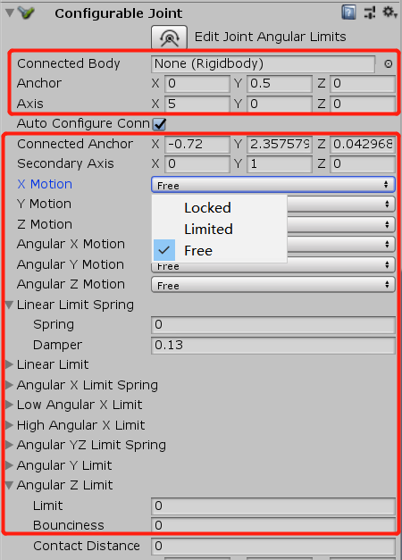 

（图13）

> Unity的可配置关节Configurable Joint里的断开力Break Force和断开力矩Break Torque在LayaAir中也是支持的，由于上个小节已介绍，本小节不再重复介绍。所以图14中也没有体现。

##### 3.3.1 设置连接刚体 setConnectRigidBody 

Unity中的`Connected Body`对应LayaAir的设置连接刚体`setConnectRigidBody`，

`setConnectRigidBody`用于指定固定约束要连接的刚体，若不指定，则该约束连接到世界。

#####  3.3.2 锚点  anchor  

Unity中的`Anchor`对应LayaAir的锚点`anchor` ，

锚点`anchor` 是用于定义自身刚体约束中心的点。物理模拟会使用此点作为计算的中心点。

#####  3.3.3  主轴 axis

Unity中的`Axis`对应LayaAir的主轴 `axis` ，

主轴 `axis`用于基于物理模拟来定义对象自然旋转的局部轴，该轴决定了对象在物理模拟下自然旋转的方向。

##### 3.3.4 连接锚点 connectAnchor 

Unity中的`Connected Anchor` 对应LayaAir的连接锚点`connectAnchor` ，

连接锚点`connectAnchor` 用于设置所连接刚体的约束锚点。

例如自己是车轮，连接的刚体是车身。那锚点就是车轮的约束中心点，连接锚点就是所连接的车身约束中心点。

##### 3.3.5  副轴 secondaryAxis

Unity中的`Secondary Axis` 对应LayaAir的副轴`secondaryAxis`,

副轴`secondaryAxis`的作用是与主轴`axis`共同定义了约束的局部坐标系。第三个轴会与这两个轴所构成的平面相垂直。

##### 3.3.6  沿XYZ轴平移约束模式 (X\Y\Z)Motion

Unity中的`X Motion, Y Motion, Z Motion` 对应LayaAir的 `XMotion, YMotion, ZMotion`,

 (X\Y\Z)Motion是表示沿 X、Y 、Z 轴平移约束的模式，根据属性设置的不同，约束的模式也不同。可以设置的值分别是：自由移动`Free`、锁定移动 `Locked`、限制性移动 `Limited`。

自由移动`Free`就是不作限制的沿某轴移动。

锁定移动 `Locked`是没有运动，完全固定住。

限制性移动 `Limited`是平移运动受限于用户定义的约束。

##### 3.3.7 绕XYZ轴旋转的角运动约束模式angular (X\Y\Z)Motion

Unity中的`Angular X Motion, Angular Y Motion, Angular Z Motion` 对应LayaAir的 `angularXMotion, angularYMotion, angularZMotion`，

angular (X\Y\Z)Motion是表示绕X、Y 、Z 轴旋转的角运动约束模式，也是根据自由移动`Free`、锁定移动 `Locked`、限制性移动 `Limited`三种值的设置来区别约束模式，与(X\Y\Z)Motion类似，只是运动形式的线性平移和角运动旋转的区别。

##### 3.3.8 弹簧线性限制 （linearLimitSpring、linearDamp）

Unity中的 `Linear Limit Spring` 是当对象超过了限制位置时要拉回对象而施加的弹簧力。该项有两个配置参数，弹簧力`Spring`与阻尼`Damper`。

###### 弹簧力Spring

其中的弹簧力`Spring` 在LayaAir引擎中对应线性限制的弹簧力`linearLimitSpring`，如果此处的值设置为零，则无法逾越限制；零以外的值将使限制变得有弹性。

###### 阻尼Damper

其中的阻尼`Damper`在LayaAir引擎中对应线性阻尼`linearDamp`，设置为大于零的值可让约束抑制振荡（否则将不断的进行振荡）。

##### 3.3.9 线性移动限制（minLinearLimit、maxLinearLimit、linearBounce）

Unity中的**Linear Limit** 是关节线性移动的限制，LayaAir导出插件只支持该项的限制`Limit`与反弹力`Boundciness`设置。

###### 限制Limit

其中的`Limit`是从原点到限制位置的距离。在LayaAir引擎中需要分别设置线性移动限制的最小值`minLinearLimit`和线性移动限制的最大值`maxLinearLimit`。

###### 反弹力Boundciness

其中的反弹力 `Bounciness` 是当对象达到限制距离时，要将对象拉回而施加的弹力。在LayaAir引擎中对应线性反弹力`linearBounce`。

##### 3.3.10 弹簧角运动限制（angularLimitSpring、angularDamp）

在Unity中，弹簧的角运动旋转限制分为**X轴旋转限制**`Angular X Limit Spring`以及**Y轴和Z轴旋转限制**`Angular YZ Limit Spring`。这些限制都是当对象超过了约束的限制角度时要反向旋转对象而施加的弹簧力矩，只是轴的区别。而且他们都有弹簧力`Spring`与阻尼`Damper`两个配置项，

###### 弹簧力Spring

其中的弹簧力`Spring` 在LayaAir引擎中对应角运动旋转限制的弹簧力`angularLimitSpring`，如果此处的值设置为零，则无法逾越限制；零以外的值将使限制变得有弹性。

###### 阻尼Damper

其中的阻尼`Damper`在LayaAir引擎中对应角运动旋转阻尼`angularDamp`，设置为大于零的值可让约束抑制振荡（否则将不断的进行振荡）。

##### 3.3.11 角运动限制（minAngularLimit、maxAngularLimit、angularBounce）

在Unity中，关于角运动旋转的限制有X轴旋转的下限`Low Angular X Limit`、X轴旋转的上限`Hight Angular X Limit`、Y轴旋转的限制`Angular Y Limit`、Z轴旋转的限制`Angular Z Limit`。这些限制项，LayaAir导出插件只支持限制`Limit`与反弹力`Boundciness`设置。

###### 限制Limit

其中的`Limit`是限制旋转角度，设置对象旋转角度的下限值。在LayaAir引擎中需要分别设置旋转角度限制的最小值`minAngularLimit`和旋转角度限制的最大值`maxAngularLimit`。这两个值都是3D向量值。

旋转限制最小值的X对应X轴旋转的下限`Low Angular X Limit`值，Y对应Y轴旋转的限制`Angular Y Limit`值取负，Z对应Z轴旋转的限制`Angular Z Limit`值取负。

旋转限制最大值的X对应X轴旋转的上限`Hight Angular X Limit`值，Y对应Y轴旋转的限制`Angular Y Limit`值，Z对应Z轴旋转的限制`Angular Z Limit`值。

###### 反弹力Boundciness

其中的反弹力 `Bounciness` 是当对象的旋转达到限制角度时在对象上施加的反弹力矩。在LayaAir引擎中对应角度反弹力矩`angularBounce`。

### 四、物理射线

#### 4.1 什么是物理射线

射线的定义是只有一个端点无限延长形成的直的线。LayaAir引擎的数学对象`Laya.Ray()`就是只有起点和方向的射线。

在LayaAir引擎中，射线常用于基础的碰撞检测，所以具有射线的发射特性，但用于碰撞检测功能的射线称为物理射线。

> 需要注意的是，射线可以用于物理射线检测，但是物理射线并不等同于射线。

#### 4.2 创建射线

LayaAir引擎提供了创建3D空间射线的类`Laya.Ray()`，以及通过摄像机从屏幕空间点去生成这个射线的方法`viewportPointToRay()`。

示例代码如下所示：

```typescript
/*
……省略若干代码
*/
//创建一个屏幕点
let point = new Laya.Vector2();
//创建一个射线 Laya.Ray(射线的起点，射线的方向)
let ray = new Laya.Ray(new Laya.Vector3(0, 0, 0), new Laya.Vector3(0, 0, 0));
//以鼠标点击的点作为原点
point.x = Laya.stage.mouseX;
point.y = Laya.stage.mouseY;
//计算一个从屏幕空间生成的射线
_camera.viewportPointToRay(point, ray);
/*
……省略若干代码
*/
```

#### 4.3 使用物理射线

在LayaAir 3D中实现射线检测是使用物理模拟器类`PhysicsSimulation`。

射线检测的方法有4个，分别为射线检测第一个碰撞物体的方法`raycast` 和 `raycastFromTo`以及射线检测所有碰撞物体的方法`raycastAll`和`raycastAllFromTo`。

检测一个和所有的区别比较容易理解，就是碰到第一个物体后射线立即结束，和射线可穿透所有碰撞物体一直不结束，这两种区别。如图15-1所示。


（图15-1）

那为什么同样的功能名称还有带FromTo和不带FromTo两种，又有什么区别呢？

与数学对象的射线所不同的是，用于检测碰撞的物理射线是有长度的，或者是需要设置世界空间的结束位置。

带FromTo的是使用两个点（射线的起始位置点和结束位置点）作为参数。

而不带FromTo的则是直接使用已经创建好的射线，不需要设置射线的结束位置点，但需要设置长度，如果我们不设置长度，则采用默认值长度`2147483647`。

如果是不带FromTo的射线检测，我们可以沿用上个小节创建射线的示例，稍加补充一下，具体代码如下所示：

```typescript
/*
……省略若干代码
*/
//创建一个屏幕点
let point = new Laya.Vector2();
//创建一个射线 Laya.Ray(射线的起点，射线的方向)
let ray = new Laya.Ray(new Laya.Vector3(0, 0, 0), new Laya.Vector3(0, 0, 0));
//以鼠标点击的点作为原点
point.x = Laya.stage.mouseX;
point.y = Laya.stage.mouseY;
//计算一个从屏幕空间生成的射线
_camera.viewportPointToRay(point, ray);
//拿到3D场景中射线碰撞的物体
_scene3D.physicsSimulation.rayCastAll(ray,this.outs);
//如果射线碰撞到物体
if (this.outs.length !== 0) {
    for (let i = 0; i < this.outs.length; i++){
        //在射线击中的位置添加一个立方体
        this.addBoxXYZ(this.outs[i].point.x, this.outs[i].point.y, this.outs[i].point.z );
    }        
}
/*
……省略若干代码
*/
```

带FromTo的射线检测使用示例，具体代码如下所示：

```typescript
/*
……省略若干代码
*/
/*进行射线检测,检测所有碰撞的物体
//_scene3D.physicsSimulation.raycastAllFromTo(this.from, this.to, this.outs);
//检测所有物体的射线使用与上个示例类似
*/

//进行射线检测,检测第一个碰撞物体
_scene3D.physicsSimulation.raycastFromTo(this.from, this.to, this.out);
//将射线碰撞到的物体设置为红色
((this.out.collider.owner as Laya.MeshSprite3D).meshRenderer.sharedMaterial as Laya.BlinnPhongMaterial).albedoColor = new Laya.Vector4(1.0, 0.0, 0.0, 1.0);
/*
……省略若干代码
*/
```

#### 4.4 使用异形物理射线

常规的物理射线是用一条射线来检测碰撞，LayaAir引擎中也提供了与物理射线检测类似的功能，但采用的是自定义碰撞器形状检测来代替物理射线，相当于异形的射线检测功能。

与普通的射线检测一样，异形射线也是有检测第一个和检测所有两个检测方法，分别是`shapeCast`和`shapeCastAll`。

 

（图15-2）

图15-2的示例，就采用球形射线来实现碰撞检测，具体代码如下所示：

```typescript
//创建球型碰撞器
var sphereCollider:Laya.SphereColliderShape = new Laya.SphereColliderShape(0.5);

//通过按钮this.castAll状态切换是采用检测全部还是检测第一个
if (this.castAll) {
    //采用球形碰撞器进行形状检测,检测所有碰撞的物体
    this.scene.physicsSimulation.shapeCastAll(sphereCollider, this.from, this.to, this.outs);
    for (let i = 0; i < this.outs.length; i++){
        ((this.outs[i].collider.owner as Laya.MeshSprite3D).meshRenderer.sharedMaterial as Laya.BlinnPhongMaterial).albedoColor = new Laya.Vector4(1.0, 0.0, 0.0, 1.0);
} else {
    //采用球形碰撞器进行形状检测,检测第一个碰撞物体
    if (this.scene.physicsSimulation.shapeCast(sphereCollider, this.from, this.to, this.out))
        ((this.out.collider.owner as Laya.MeshSprite3D).meshRenderer.sharedMaterial as Laya.BlinnPhongMaterial).albedoColor = new Laya.Vector4(1.0, 0.0, 0.0, 1.0);
}
```

#### 4.5 设置射线碰撞组

无论是普通射线还是异形射线，都可以设置碰撞组，以及指定射线可碰撞的组。

如何设置碰撞组值collisonGroup和如何指定可发生碰撞的组值canCollideWith在前文中已经介绍过，

我们将值带入射线检测对应的方法即可实现射线的选择性碰撞。

> 射线检测里用于指定检测碰撞组的传参名collisionMask对应的是canCollideWith


### 五、Cannon.js物理引擎的使用

之前的章节一直在介绍LayaAir基于Bullet物理引擎封装的物理引擎API。Bullet虽然强大，但是有些开发者对于物理精度要求不高，物理功能的使用也比较基础，只对物理引擎库的体积有要求（Cannon物理引擎库不足200k）。那或许Cannon.js可以考虑。

#### 5.1 如何切换使用Cannon.js物理引擎库

如果想使用`Cannon.js`物理引擎库，要引入物理引擎库`cannon.js`以及LayaAir引擎封装的物理API库`laya.cannonPhysics.js`。

采用LayaAirIDE创建项目的开发者，可以直接在IDE中通过F9打开项目设置的类库设置，如图16进行勾选即可。

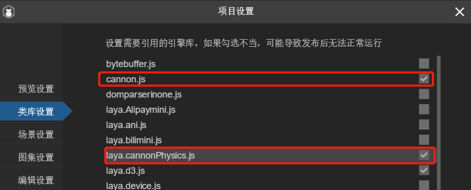 
（图16）

> 如果不打算使用Bullet物理引擎，Physics3D相关的物理库不需要勾选。

引用了`cannon.js`与`laya.cannonPhysics.js`引擎库后，就可以直接使用Cannon.js物理引擎的API了。

在LayaAir封装的物理API的设计上，基本上与Bullet引擎保持了一致，只是在命名前增加了Cannon标识，例如3D刚体`Rigidbody3D`在Cannon物理引擎的使用时变为了`CannonRigidbody3D`。

毕竟Cannon.js物理引擎与Bullet物理引擎本身存在差异，以及对于Cannon.js的基础物理功能使用的定位，Bullet中有很多API，在Cannon.js中是没有的。关于这些，开发者可以通过下一小节进行详细了解。

#### 5.2 Cannon.js物理引擎中可以使用的API

Cannon.js物理引擎与Butllet的使用方式基本相同，只是类名称会有所不同，本小节列出常用的API供开发者参考。

##### 5.2.1 碰撞器

| 名称                  | 说明                                                         |
| --------------------- | ------------------------------------------------------------ |
| CannonPhysicsCollider | 物理碰撞器，也叫静态碰撞器                                   |
| CannonRigidbody3D     | 刚体碰撞器，默认是动力学刚体碰撞器，也可以设置为运动刚体碰撞器 |

##### 5.2.2 常用的刚体物理属性

| 名称            | 说明                                                       |
| --------------- | ---------------------------------------------------------- |
| angularVelocity | 角速度                                                     |
| angularDamping  | 角阻尼                                                     |
| linearVelocity  | 线速度                                                     |
| linearDamping   | 线性阻尼                                                   |
| mass            | 质量                                                       |
| isSleeping      | 是否处于休眠状态                                           |
| friction        | 摩擦力，该属性继承于Cannon物理组件类CannonPhysicsComponent |
| restitution     | 弹力，该属性继承于Cannon物理组件类CannonPhysicsComponent   |

##### 5.2.3 碰撞器形状

| 名称                        | 说明         |
| --------------------------- | ------------ |
| CannonBoxColliderShape      | 盒形碰撞形状 |
| CannonSphereColliderShape   | 球形碰撞形状 |
| CannonCompoundColliderShape | 复合碰撞形状 |

##### 5.2.4 常用的碰撞器属性

| 名称           | 说明                                                         |
| -------------- | ------------------------------------------------------------ |
| isTrigger      | 是否为触发器，该属性继承于Cannon物理触发器组件类CannonPhysicsTriggerComponent |
| collisionGroup | 所属碰撞组，该属性继承于Cannon物理组件类CannonPhysicsComponent |
| canCollideWith | 可碰撞的碰撞组，基于位运算，该属性继承于Cannon物理组件类CannonPhysicsComponent |

##### 5.2.5 射线检测

射线检测基于Cannon物理模拟器类`CannonPhysicsSimulation`

| 名称             | 说明                                                     |
| ---------------- | -------------------------------------------------------- |
| raycastFromTo    | 射线检测**第一个**碰撞物体，需设置射线开始与结束位置     |
| raycastAllFromTo | 射线检测**所有**碰撞的物体，需设置射线开始与结束位置     |
| rayCast          | 射线检测**第一个**碰撞物体，使用已有射线，可设置射线长度 |
| rayCastAll       | 射线检测**所有**碰撞的物体，使用已有射线，可设置射线长度 |

##### 5.2.6 碰撞生命周期

LayaAir引擎的3D物理碰撞生命周期，适用于Cannon.js引擎与Bullet引擎，参考前文的碰撞生命周期方法即可。


## 本文赞赏

如果您觉得本文对您有帮助，欢迎扫码赞赏作者，您的激励是我们写出更多优质文档的动力。

