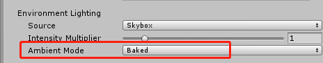
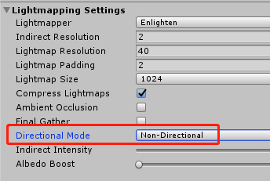
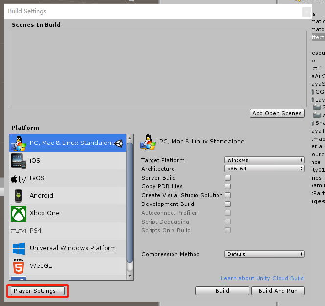
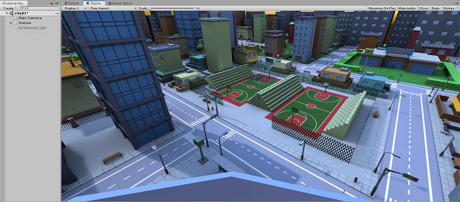

# 光照贴图

###### *version :2.7.0beta Update:2020-6-11*

​	在3D游戏场景中，依赖灯光与模型即时渲染产生投影及颜色影响，是非常耗性能。特别是在移动平台上，手机的显卡功能并不强大，如果全部使用即时光影，性能开销是非常大的，游戏也会变得卡顿。

​	场景光照贴图就是为了解决这个问题，其优点就是可以通过较少的性能消耗使静态场景看上去更加真实，丰富，更具有立体感。缺点就在于不能实时的处理动态光照。

​	光照贴图建议通过 unity3D 编辑器烘焙好光照贴图之后导出使用。在加载场景时，引擎会自动加载光照贴图，这样场景就可以达到在Unity中预览的效果了。

 (图1) 未使用光照贴图

 (图2) 使用了光照贴图

### **导出时需要注意的事项:**

#### 1.关于 Lighting--setting

**1.** 环境光只支持 Baked 类型

 （图3）

**注意：**

在 **2.5.0** 之前因为Bug的原因只支持 **Realtime** 模式， 而且改模式下的烘培会导致整体场景会更亮。

在 **2.5.0** 之后已经修复了这个问题 。

**2.**场景设置中的灯光设置 **Directional Mode** （在LayaAir2.6.0版本及其之后版本，Directional和 Non-Directional都支持， 在2.6.0之前的版本只支持Non-Directional）。

 （图4）

#### 2.关于 GameObject 设置

烘焙光照贴图的GameObject需要勾选 static。

 （图8）

#### 3.关于 Build Setting

使用2.5.0之后版本的开发者可以忽略该条设置。

在 LayaAir 插件2.5.0之前的版本中，使用 Unity2018 时 **Lightmap Encoding** 只支持 **Normal Quality** 。

新版本已经支持了默认的**High Quality** 模式。

 （图5）

 （图6）

 (图7)

#### 4.关于灯光的设置

烘焙光照贴图的灯光需要设置 **mode** 为 **Baked** 模式

 (图9)

### **简单烘焙光照贴图:**

光照贴图的优点是非常突出的，当然要烘焙出好看的场景效果可能还是需要专业的美术来处理。在这里只是介绍下如何简单的烘焙一个场景。

##### 1.调整场景表现效果

首先我们需要一个场景，我们将灯光调整到合适的地步（图10 ）。

 （图10）添加好灯光，并且调整到了自己需要的场景效果

##### 2.烘焙场景

在调整好灯光效果之后，我们打开 **Lighting Setting** 面板，修改 **Environment** 中的 **Ambient Mode** 为 **Baked** 模式（这里因为我们没有勾选 **Realtime Lighting** 所以只能为 **Baked** 模式）。设置好之后点击 **Generate Lighting** 开始烘焙场景。

 （图11） 

开始烘焙之后，我们可以在Unity右下角看到当前的烘焙进度。烘焙光照贴图可能需要点时间，请耐心等待。

 （图12）

烘焙完成后，就可以直接导出场景在LayaAir中运行查看效果了。

Unity中烘焙后的场景预览效果：

 （图13）

LayaAir中烘焙后的场景预览效果：

 (图14)