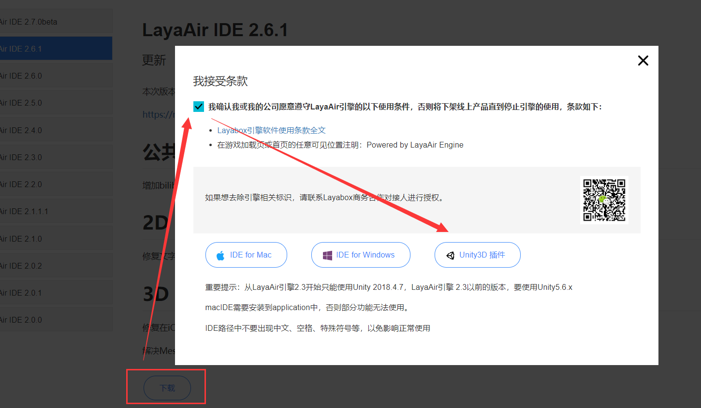

# LayaAir引擎unity插件介绍

###### version :2.6.1   Update:2020-06-08

> ### 重要提示：从LayaAir引擎2.3开始只能使用Unity 2018.4.7，LayaAir引擎 2.3以前的版本，要使用Unity5.6.x

### 1、3D场景编辑工具Unity3D 

Unity3D是由Unity Technologies开发的一个让玩家轻松创建诸如三维视频游戏、建筑可视化、实时三维动画等类型互动内容的多平台的综合型游戏开发工具，是一个全面整合的专业游戏引擎，LayaAir为了减少美术人员的学习成本,让熟悉Unity的开发者能快速上手。

LayaAir引擎的3D场景编辑，建议采用Unity作为3D场景的编辑工具（不支持2D在unity中编辑导出，2D的UI等，仍然需要在LayaAirIDE中进行编辑），然后通过LayaAir提供的unity资源导出插件，将Unity里编辑好的场景等资源，导出到LayaAir引擎3D项目中使用。

#### 1.1关于Unity版本的选择与下载

Unity2018.4.7下载地址为：[https://unity3d.com/get-unity/download/archive](https://unity3d.com/get-unity/download/archive)

如果Unity官方打不开的话，我们在Github上也留了一份存档，可以前往下载

https://github.com/layabox/layaair-doc/tree/master/tools

另外，

有开发者想了解，其它2018或者2019的版本是否可以使用。如果是用unity 2019开发好的unity旧项目，想直接导出，那问题可能会很多。但是对LayaAir引擎和unity插件特别了解的开发者，新建的项目，只是用到了LayaAir引擎支持的功能。那理论上不是2018.4.7的版本也可以。

然而实际上，我们的LayaAir引擎unity插件在发版本测试时，仅针对于Unity2018.4.7，所以建议还是要采用我们指定的版本。这样会稳定一些。

#### 1.2 插件的下载

LayaAir引擎unity插件下载地址：请点击[插件地址](https://ldc2.layabox.com/layadownload/?type=layaairide) ，跳转到下载链接,如图1所示。

 (图1)

##### 这里需要提醒的是，

Unity插件的版本，一定要对应LayaAir引擎的版本，而不是LayaAirIDE的版本，有一些开发者以为升级LayaAirIDE就好了，并不是这样。如果想使用最新版Unity插件，那在LayaAirIDE里`项目 -> 类库管理 -> 下载并选中引擎库版本 -> 应用`切换引擎类库。否则引擎版本与Unity插件不对应就会导致使用报错。

### 	2、安装LayaAir引擎unity插件

#### 1、已有的Unity项目导出注意

有一些开发者，想把原有的Unity项目资源直接导出成为LayaAir引擎资源。这里不建议这样去操作，非常可能会因为在导入插件的过程中，产生报错，导致无法正常导入LayaAir引擎unity插件。

正确的做法是，新建一个Unity项目，先导入LayaAir引擎unity插件，然后把Unity旧项目的资源（Assets目录里的那些）复制到新的Unity项目的Assets目录。

除此之外，一定要对应版本，比如LayaAir2.3引擎以下，要对应Unity5.6.x的系列版本。

而从LayaAir2.3开始要使用Unity2018.4.7，但是对于旧的项目，由于已经开发完了，如果是Unity2018的其它版本，理论上也没有什么大的问题，可以直接复制Assets目录的资源，到新建的Unity项目内就可以。然后去除引擎不支持的功能即可导出。

但是，对于非2018版本，比如2019，那建议先把2019的旧项目，降级到Unity2018（最好是Unity2018.4.7），再复制Assets目录的资源到新的Unity项目目录，否则很有可能，就会出现效果丢失等问题出现。

#### 2、LayaAir引擎unity插件的导入与升级

无论真的是新项目，还是要导入老的unity项目，我们都要新建项目。下面我们就正式开始介绍如何开始导入LayaAir引擎unity插件，从Unity中导出资源给LayaAir引擎使用。

启动unity，新建个项目，并导入游戏需要的资源与材质、贴图等，项目名称可以按照自己的需要来命名。ctrl+s保存我们的场景，我们这里保存名字叫truck。

在资源管理界面(Assets)右键`import Package-> custom Package`选择LayaAir引擎unity插件，或者直接拖拽LayaAir引擎unity插件到资源管理界面Assets目录下。即可开始导入LayaAir引擎unity插件，最终会弹出一个导入确认的窗口，默认是全选的，不用动，直接点击import按钮，完成导入过程即可。

> 插件版本会随着LayaAir引擎功能的增加而更新，但导入的方法是完全一致的。

**插件版本升级时需要注意：** LayaAir引擎unity插件版本升级之后，需要将项目目录下的 LayaAir3D 与 StreamingAssets 文件夹删除。然后再安装新版本Unity插件。如果项目中没有老版本插件可以忽略这一步。

另外，需要提醒刚接触的开发者，LayaAir引擎unity插件，不是一次导出所有项目通用。每次创建项目后，都要重复这个导入插件的过程。

#### 3、LayaAir引擎unity插件功能菜单介绍

导入插件工具包成功后，在资源管理界面中会出现名为LayaAir3D与StreamingAssets两个文件夹，同时在unity菜单栏中也会出现导出插件菜单LayaAir3D。如动图2：

 

点击菜单栏LayaAir3D，会出现导出设置面板，在这我们将详细为大家讲解。

点击菜单LayaAir3D后，下拉菜单中出现了更多的子项

##### Account(VIP会员帐号)

登录帐号之后，购买VIP会员，可以解锁VIP会员才可以使用的一些功能。更多关于VIP会员功能的介绍以及购买，可以查看VIP帐号相关的文档：

https://ldc2.layabox.com/doc/?language=zh&nav=zh-ts-0-3-3

##### LayaAir Export（资源导出面板）

LayaAir Export是指导出资源的设置面板，也是插件工具最核心的功能，可以把它拖拉到unity3D的界面的适合位置上，下次打开这个项目时，它会保持在设定的位置。(图3所示)

(图3)

##### shortcuts（快捷操作）

在shortcuts中，有个`Switch to LayaAir3D Shader`功能菜单，这是材质转换的快捷操作。Unity的材质是不能直接导出使用的，否则就会有问题。需要手工替换成LayaAir引擎的材质。而这里，是将Unity里的材质自动都替换为LayaAir引擎的BlinnPhongMateria材质，如果开发者想要用PBR材质等其它材质，还是要手工替换一下。

##### help（帮助菜单）

帮助菜单里的`Demo、Study、Ansewers`，是外链。会分别链接到引擎官方示例、文档、开发者社区。

**Tutorial** 是插件支持功能的本地文档。因为Unity工具的功能，LayaAir引擎不会全部兼容支持，仅用于常用和通用的资源类型和场景等导出。所以开发者需要先了解哪些支持导出，哪些不支持。看这里就好了，或者在官方文档中看也可以。

**About LayaAir**是插件的版本号，如果想知道当前插件用的是哪个版本，可以点击这里查看，再次提醒要和引擎版本对应。

##### setting(设置)

在设置里，目前只有一个功能，就是切换语言版本，当前有英文和中文两种可选项。

#### 4、LayaAir引擎unity插件的资源导出面板介绍

插件准备好后，我们来看下插件的面板：

 (图4)

##### (1) Scene

​	**Scene类别**是指的整个场景，无论场景中的模型、材质、贴图、动画、还是光照贴图全部导出，主要用于场景制作，文件扩展名是.ls，需要用Scene类或它的继承类加载。

##### (2) Sprite3D

​	**Sprite3D类别**比场景少了光照贴图的导出，经常用于角色或游戏中活动物品的单独资源导出，文件扩展名的是.lh，要用Spite3D加载。

它们的加载和使用我们将在后续的 **场景** 与 **精灵** 介绍。

##### (3) GameObject Setting

游戏物品节点设置

`Ignore Not Active Game Objects `
导出时忽略在unity场景中未激活的节点。

`Batch Make The First Level Game Objects ` **（必须选择sprite3D才会有） **
批量导出场景中所有一级节点。

##### (4) MeshSprite3D Setting

网格数据的导出设置，它们的可起到压缩模型网格lm文件大小的作用，建议如项目中不用切线（不用法线贴图）与顶点色，请都勾选，可节省20%左右的模型资源大小。

`Ignore Vertices UV `                忽略UV贴图

`Ignore Vertices Color`           忽略顶点颜色信息

`Ignore Vertices Normal`         忽略法线

`Ignore Vertices Tangent`        忽略切线信息

`Compress`                                模型压缩

##### (5) Terrain Setting

unity地型导出设置

`Convert Terrain To Mesh `
如果场景中有地型，转换地型成网格模型。
untiy的地型制作非常方便，可以用笔刷绘制地型高度，如山川、河沟等，还支持笔刷绘制多张细节贴图，用于几种贴图的地表制作。LayaAir导出插件会把地型转化成Mesh，方便开发者使用。有区别的是材质和普通材质不同，包含了细节贴图。

##### (6) Animation setting

动画设置

`Compress`    动画压缩

##### (7) Assets platform

资源平台设置。

`IOS` 与 ` Android`	各平台的专属资源，由于部分资源不通用所以资源必须分多份。目前支持平台专属纹理压缩格式。

`Conventional`    通用平台，只是普通的JPG和PNG。

##### (8) Other Setting

其他设置

`Customize Export Root Directory Name `
自定义导出文件夹名字，默认的文件夹名字为“layaScene+场景名”。

##### (9) 导出设置

导出设置面板如图5所示。

**Run**       点击可使用LayaAir引擎直接运行该场景。

**Export**  导出当前资源，点击后，将导出当前场景或模型的数据到指定路径上。

**QRCode**  生成二维码。可以在手机端预览，需要在同一局域网内。

**Browse**    保存的文件路径。

**Revert  Config**   初始化配置。

**Config 1-5**  读取配置文件。

 (图5)

 (图6)