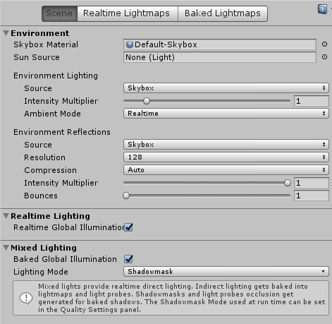

# Unity场景光导出支持的列表

以下为Unity 2018 4.7 插件中支持的导出属性列表，对应了LayaAir 引擎场景中全局光的设置。

Unity面板中要导出的场景光属性，如果包括在下面的列表属性中，就可以直接导出。如果没有包括，就代表LayaAir 引擎场景光中并不支持该属性的导出。

- ## Lighting  
      
    - Environment
      - Skybox Material
      - Sun Source
      - Environment Lighting
        1. Source
            - Skybox
            - Color
        2. Ambient Color
        3. Ambient Mode
            - Realtime
      - Environment Reflections
        1. Source
            - Skybox
            - Custom
        2. Resolution
        3. Intensity Multiplier
    - Other Settings
        1. Fog
            - Color
            - Mode
                1. Linear
            - Density