# Unity粒子系统导出支持列表

以下为Unity 2018 4.7 插件中支持的导出属性列表，对应了LayaAir 引擎粒子系统的功能。

Unity面板中要导出的粒子系统属性，如果包括在下面的列表属性中，就可以直接导出。如果没有包括，就代表LayaAir 引擎粒子系统中并不支持该属性的导出。

-  # Particle System
    - ### Main module
        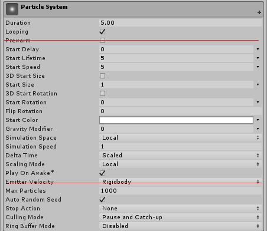
        1. Duration 粒子持续时间
        2. Looping 是否循环
        3. Start Delay 延迟
            - Constant 固定值 
            - Random between Two Constant 数值区间
        4. Start Life Time 生命周期
            - Constant 固定值
            - Random between Two Constant 数值区间
        5. Start Speed 粒子速度
            - Constant 固定值
            - Random between Two Constant 数值区间
        6. 3D Start Size 
            - Constant 固定值
            - Random between Two Constant 数值区间
        7. Start Size
            - Constant 固定值
            - Random between Two Constant 数值区间
        8. 3D Start Rotation
            - Constant 固定值
            - Random between Two Constant 数值区间
        9. Start Rotation
            - Constant
        10. Flip Rotation 随机旋转概率
        11. Start Color 开始颜色
            - Constant 固定值
            - Random between Two Constant 数值区间
        12. Gravity Modifier 重力修正
        13. Simulation Space 模拟空间
            - Local 
            - Hierarchy 
        14. Scaling Model 缩放模式
            - Hierarchy
            - Local
        15. Play On Awake
        16. Max Particls
        17. Auto Random Seed 
    - ### Emission module
        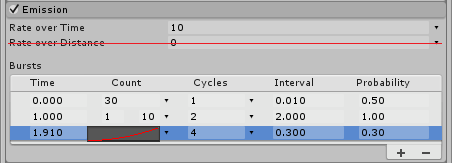
        1. Rate Over Time
            - Constant 固定值
            - Random between Two Constant 数值区间
        2. Bursts
    - ### Shape module
        1. Shape 
            - Sphere / Hemisphere  
              
                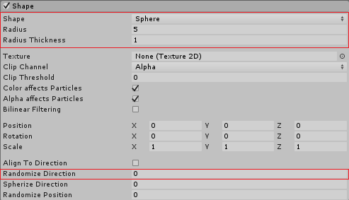
                1. Radius
                2. Radius Thickness  
                    数值只支持 ` 0 ` / ` 1 ` 两种数值  
                3. Randomize Direction

            - Cone

                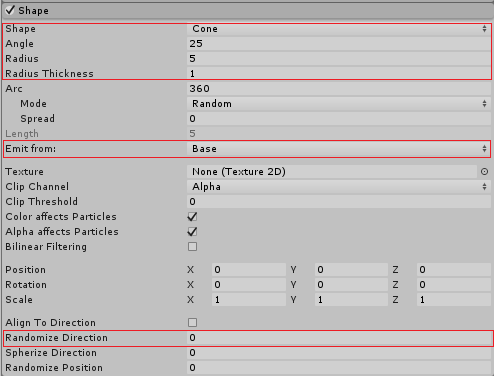
                1. Angle
                2. Radius
                3. Radius Thickness  
                    数值只支持 ` 0 ` / ` 1 ` 两种数值
                4. Emit form Shell
                    - Base
                    - Volume
                5. Randomize Direction
            
            - Box

                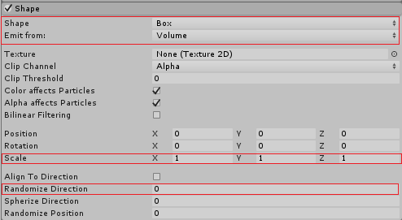
                1. Emit from
                    - Volume
                2. scale
                3. Randomize Direction
              
            - Circle

                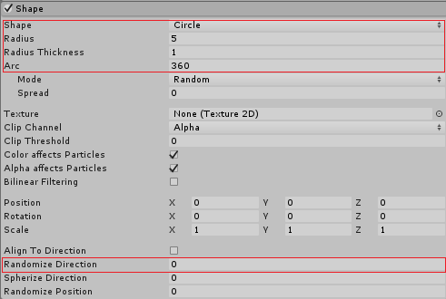
                1. Radius
                2. Radius Thickness  
                    数值只支持 ` 0 ` / ` 1 ` 两种数值
                3. Arc  
                    数值只支持 ` 0 ` / ` 360 ` 两种数值数值
                4. Randomize Direction
      
    - ### Velocity over Lifetime module
        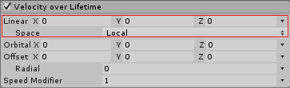
        1. Liner
            - Constant 固定值
            - Random between Two Constant 数值区间
            - Curve 曲线
            - Random between Two Constant 曲线区间
        2. Space
            - Local
            - World
    - ### Color over Lifetime module
        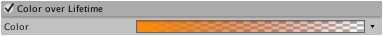
        1. Color
            - Gradient
            - Random form Two Gradient
    - ### Size over Lifetime module
        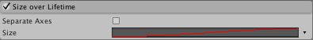
        1. Separate Axes
            - Constant
            - Curve
            - Random betweem Two Constants
    
    - ### Texture Sheet Animation module
        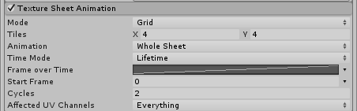
        1. Tiles
        2. Animation
            - Single Row
            - whole Sheet
        3. Animation
            - Single Row
              - Random Row
        4. Time Mode
            - Fram over Time
              - Contant
              - Curves
              - Random betweem Two Constants
        6. Start Frame
            - Contant
            - Random betweem Two Constants
        7. Cycles
        8. Affected UV Channels
            - UV0
    - ### Render module
        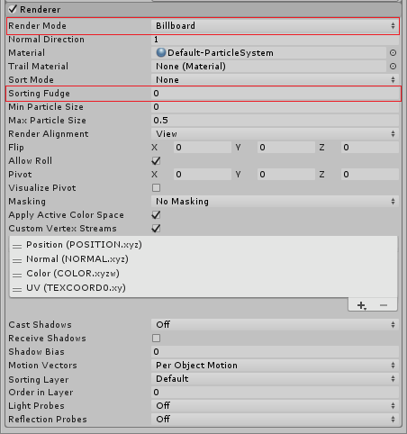
        1. RenderMode
            - Billboard
            - Stretched Billboard
                1. Camera Scale
                2. Velocity Scale
                3. Length Scale
            - Horizontal Billboard 
            - Vertical Billboard
            - Mesh
        2. Sorting Fudge
