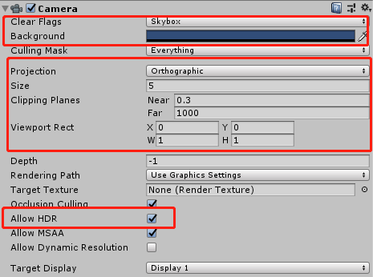

## 3D场景编辑-unity插件使用说明

> *version: 2.9.0beta    update: 2020-11-02       author: charley*

[TOC]

### 一、3D场景编辑器的研发规划

有开发者问过LayaAir引擎是否会有自己的3D场景编辑器，首先可以肯定的讲，一定会有。3D编辑器是LayaAir3.x引擎规划的基础组成部分（3.x正在研发中）。2.x阶段也会推出3D编辑器的测试版。

采用Unity插件方案的主要原因，一是可以让有Unity经验的优质开发者可以更低学习成本进入HTML5和小游戏产业中来。二是1.x和2.x引擎还处于功能丰富的阶段，引擎功能与Unity还有差距，所以这个阶段以完善3D引擎功能为主，让小游戏产业的众多3D游戏开发者可以使用更多3D渲染能力，让3D产品的表现更自由、更丰富、更炫酷。因此我们把更多精力先放到引擎功能的研发上。工具方面保障不影响开发者的开发工作流即可。

随着引擎功能越来越丰富，当前甚至拥有大量Unity也不具有的特色引擎功能，所以自有3D编辑器也在研发进行中，未来与LayaAir 3.x引擎一起推出。

本篇，我们将全面学习Unity的插件工具使用，以及LayaAir引擎支持Unity中的哪些功能。由于Unity的学习资料非常丰富，即便是没有用过Unity的开发者，在阅读本篇遇到不能理解的地方，也可以通过本篇中的关键字百度搜索答案。

> 如果是没有使用过Unity的开发者，不需要系统学习全部Unity工具功能与引擎。仅需通过本篇文档的支持列表，来了解LayaAir引擎支持的功能使用即可。

### 二、LayaAir的3D场景编辑环境配置

在当前，创建LayaAir引擎项目和编辑UI是基于自研的工具LayaAirIDE。而编辑3D场景是基于第三方工具Unity以及我们自研的LayaAir引擎Unity插件。所以本小节先引导大家安装好这些基础的工具与开发环境。

#### 2.1、下载Unity编辑器工具

LayaAir引擎的Unity插件不会支持导出Unity所有的功能，毕竟不是同一个引擎，具体支持哪些后面会详细介绍。

因此，我们的插件工具也不需要支持Unity所有的版本，开发者要根据引擎的版本来选择安装不同的Unity版本。

##### 2.1.1 Unity 5.6.x版本

在LayaAir 2.3版本之前（不含2.3）支持采用Unity5.6.x的版本进行3D场景的编辑。

国内下载地址：https://unity.cn/releases?signup=true

国际下载地址：https://unity3d.com/get-unity/download/archive

> 需要登陆，再找到对应的历史版本（国内打开国际地址需要翻墙）

##### 2.1.2 Unity 2018.4.7版本

从LayaAir 2.3版本开始（含2.3）支持采用2018.4.7进行3D场景的编辑。

有的开发者会问其他版本的行不行，例如Unity 2019或者2018的其他版本。

如果是小版本的差别，例如2018.4.x的其他系列版本，理论上是没有问题的，但是建议采用2018.4.7。因为2018.4.7版本是经过我们每次的插件发版测试的版本。但是，采用例如2019等其他版本，则有可能美术会使用到一些2018不支持的功能，导致报错或者在导出后LayaAir引擎运行效果与unity编辑效果不一致。所以尽可能采用我们推荐的Unity版本。

国内下载地址：https://unity.cn/releases?signup=true

国际下载地址：https://unity3d.com/get-unity/download/archive

> 需要登陆，再找到对应的历史版本（国内打开国际地址需要翻墙）

#### 2.2 、下载LayaAir的unity插件

##### 2.2.1 下载地址

LayaAir引擎unity插件下载地址：

[https://ldc2.layabox.com/layadownload/?type=layaairide](https://ldc2.layabox.com/layadownload/?type=layaairide)

##### 2.2.2 要对应的版本

**LayaAir引擎unity插件在下载时，一定要对应好引擎的版本号**，

例如，引擎采用的是2.6.1，那插件也需要去LayaAirIDE 2.6.1版本下载页面中去下载对应的`Unity3D插件`版本，如下图所示。否则可能因为引擎与插件的功能支持没有对应，导致运行报错。

 

**这里需要重点提醒的是**，

插件对应的是引擎版本，不是IDE版本。

有些开发者，以为升级了LayaAirIDE的版本，就是对应了引擎版本，并不是这样。

切换引擎版本，是在LayaAirIDE里点开左上角IDE图标，打开菜单`项目 -> 类库管理 -> 下载（并选中引擎库版本） -> 应用`切换引擎类库。

#### 2.3、 导入LayaAir的Unity插件

Unity里有一个导入自定义包的功能，通过这个功能，可以在Unity里导入LayaAir引擎提供的专属功能包，用来导出Unity里编辑好的场景和资源，然后再用以LayaAir引擎3D的开发。在Unity里导入这个自定义的LayaAir功能包的过程，我们可以视为安装了一个LayaAir引擎资源导出的Unity插件。本小节会针对这个过程进行详细介绍。

##### 2.3.1 创建一个空项目

除非是在已经安装过LayaAir3D插件的Unity项目上进行升级安装，否则，

我们建议去创建一个新的空项目。

因为直接打开一个Unity已有项目，可能会有冲突，会导致插件安装不成功。

如果想使用已有Unity项目的场景资源和编辑好的场景，建议在Unity空项目里安装好LayaAir引擎的插件，然后再把旧项目的资源目录（也就是Unity项目中的Assets目录）复制到新建的项目里。

> Tips: 旧项目中的其他文件对于导出插件而言都用不上，只复制Assets目录即可

##### 2.3.2 两种插件导入方式（项目中首次安装）

##### 菜单式导入

在资源菜单Assets或者资源面板的Assets，右键`import Package-> custom Package`，如下图所示。

 

(上图为从菜单导入)

 

(上图为从资源面板导入)

以上的两种导入方式，任选一种点开后，选择之前下载好的LayaAir引擎unity插件（xx.unitypackage）打开，如下图所示。

 

点击`打开`后，会有插件包含的内容列表展示，如果有我们不想要的功能，比如在Unity里直接预览这个功能不想要，也可以把相关默认的勾选去掉，但是我们建议全部导入（默认就是）。

所以，我们直接点击`Import`按钮，开始全部导入，即可。

  

导入完成后，我们可以看到菜单栏多出一个`LayaAir3D`，如下图所示。此时说明，已经导入成功。

 

##### 拖拽式导入

拖拽式安装的操作方式是把下载好的插件（xx.unitypackage）直接拖拽到Assets面板下，如下图所示。其他后续操作与菜单式安装一样。就不重复介绍了。


##### 插件导入安装的提醒

对于Unity还不太熟悉的开发者，需要提醒的是，LayaAir引擎Unity插件，不是一次导入所有项目通用，本质上这并不是真的为Unity安装工具插件，而是为项目导入自定义的功能包，虽然我们可以理解为工具插件，但要明白这个插件的本质。所以，在每次创建新的项目工程后，都要重复上面导入LayaAir插件包的过程。

##### 2.3.3 升级版本的安装

当LayaAir引擎与Unity插件出现了新版本，我们打算在已导入插件的项目上进行升级的时候，不仅要升级引擎，还要下载**对应引擎版本**的LayaAir引擎Unity插件。

然后，将资源目录（Assets）下的 `LayaAir3D` 与 `StreamingAssets` 文件夹删除，如下图所示。然后再按照首次安装的方式，去安装下载的新版本Unity插件。

  

但是，上述的安装方式，如果开发者有一些关联的配置信息，那会导致这些配置信息丢失。

所以2.9.0版本开始，插件的安装包里，提拱了专门用于升级的`LayaAir3D` 与 `StreamingAssets` 文件夹，把安装包里的这两个文件夹都复制到Unity项目的Assets目录下，替换`LayaAir3D` 与 `StreamingAssets` 这两个文件夹。

> 提醒，不要直接把这两个目录拖到Unity面板的Assets下，否则会导致重命名添加（会导致报错），而不是升级覆盖。

### 三、初识LayaAir的Unity插件功能模块

当LayaAir的Unity插件导入成功（安装）后，在Unity中能见到的主要是三个组成模块，我们先对这几个组成模板进行初步的了解。

#### 3.1、LayaAir3D菜单

成功导入插件包后，会在菜单栏看到LayaAir3D的菜单列表项，如下图所示。

 

##### 3.1.1 帐号 Account

插件工具的功能，一部分是免费的常用与通用功能，另一部分是不影响开发者使用，或者是可以自己找到第三方替代方案，但使用插件集成更方便或者效果更好的增值（VIP）功能。

当要使用VIP（增值）功能时，需要从LayaAir3D菜单项的Account登录帐号，购买或使用VIP功能。

> 关于VIP的具体功能，在后面会有详细介绍的部分，这里重点介绍帐号（Account）

点击LayaAir3D菜单项的Account，弹出登录界面如下图所示。如果已有社区（ask.layabox.com）开发者帐号的开发者可以直接登录，否则也可以点击这个界面的文本链接`注册`，跳转到注册网页。

 

当开发者登录后，界面如下图所示，如果是已购买VIP的帐号，在帐号名下会显示VIP到期时间。否则，会不显示到期时间，皇冠图标也是灰色的。

 

`充值`按钮用来购买VIP授权时间，或者续费延长时间。

> 首次充值，如果因网络原因，帐号权限未能即时刷新时，可以通过点击`刷新`或者`退出`重新登录来解决。

`发票`按钮可以跳转到发票申请的网页。

`VIP功能`的描述，为了不占用空间，显示的并不全，可以点击了解更多，跳转到全面介绍的文档（https://ldc2.layabox.com/doc/?nav=zh-ts-0-3-3）进行查看。

`绑定设备`是插件自动识别的，无需手动绑定，但如果设备绑定达到帐号上限，需要切换设备时，需要点击`解绑`，才能在其它的设备上登录该帐号。此时当前设备则无法再登录成功。每天最多只能解绑一次，需要谨慎操作。

> 需要提醒的事，插件允许不同设备通过解绑功能来切换使用，但如果频繁的在不同设备上进行切换，可能会导致该帐号进入黑名单，任何设备都不再可用。

##### 3.1.2 导出工具 Export Tool

点击菜单 `LayaAir3D` -->  `Export Tool`，会弹出如下图所示的导出工具面板。这个面板可以拖拽到我们习惯的位置上，这是开发者导出Unity中场景与资源的最核心面板，后面会有详细的介绍，这里就不多做阐述。

 

##### 3.1.3  快捷功能 shortcut

`LayaAir3D` 的菜单项`Shortcuts`是快捷功能，当前有两个快捷功能，如下图所示：

  

##### `Switch to LayaAir3D BlinnPhongMateria Shader` 

可以将Unity的材质一键转换成为LayaAir引擎BlinnPhong材质。

##### `Switch to LayaAir3D PBRStandardMaterial Shader` 

可以将Unity的材质一键转换成为LayaAir引擎PBRStandard材质。

##### 一键转换材质的重要提示：

1、Unity的材质是不能在LayaAir引擎中使用的，所以，开发者必须要使用LayaAir引擎中提供的材质。如何切换LayaAir的材质，本文后面还会有介绍，这里提供两种常用材质的一键转换功能，比较方便实用。在资源导出前，如果以上的材质符合项目需求，可以在这里快速的切换为LayaAir引擎的材质。

2、Unity自带的天空盒材质是没办法通过一键转换功能直接转换的，需要自己创建一个材质，手动把Unity的天空材质替换为LayaAir的天空材质。

##### 3.1.4 帮助 help

帮助菜单项里，下级菜单有`示例Demo`、`学习文档Study`、`问答社区Answsers`这些外链菜单项，方便开发者快速进入对应的官网页面中。还有`插件导出功能说明Tutorial`、`插件版本About LayaAir`，如下图所示。

 

帮助菜单项的下级菜单，这里就不去详细介绍了，基本上点开就能理解，其中的`插件导出功能说明Tutorial`是介绍了当前插件支持哪些Unity功能导出，如果不能理解的也没关系，在本文中还会有相关的介绍。

##### 3.1.5 设置 Setting

设置项，当前只有一个可配置功能，就是插件的语言（Language），默认是中文，如下图所示。

 

习惯了英文界面的开发者，可以在这里配置成为English语言。

#### 3.2、 资源面板Assets

插件导入成功后，开发者可以在Unity的Assets（资源）面板中，看到新增了两个目录，`LayaAir3D`和`StreamingAssets` 。如下图所示。

 

这两个目录开发者都不需要动，这里简单概述一下，开发者知道即可。

##### 3.2.1 LayaAir3D 目录

##### `LayaShader` 

LayaShader目录下是LayaAir引擎下的材质等Shader。

##### `LayaSupoortList`

LayaSupoortList目录下是插件支持的功能列表文档，不过建议看我的这篇，更全更细。

##### `LayaTool`

LayaTool目录是插件功能操作面板的功能实现目录

##### 3.2.2 StreamingAssets 目录

StreamingAssets目录下，只有一个LayaDemo目录，这里不是示例目录，是效果预览的anywher(本地Server)等环境目录。如果不需要在Unity里直接预览LayaAir引擎运行效果，该目录也可以删除，但建议保留。

**新手注意**:

对于刚接触LayaAir引擎新手，这里要重点强调一下，预览功能必须要先全局安装Node环境（推荐安装Node 10.x版本），我们看到上一个图中的StreamingAssets目录结构就可以看出，正常的目录结构需要node_modules，如果没有安装Node环境，目录结构与上图结构不符，预览功能也就无法正常使用。

当然，如果没有安装Node环境就直接预览（Run），插件工具也会提示下载安装Node环境，安装后需要重启Unity才会重生效，如果遇到重启Unity仍未生效的情况，建议重启电脑。

#### 3.3、导出工具操作面板

之前的小节有介绍过，通过顶部菜单的`Export Tool`，可以弹出一个导出工具面板，如下图所示。

> 之前是中文界面，下图换成了英文界面。

   

上图这个面板，就是插件最核心的导出操作模块，日常的插件导出资源或场景操作，VIP功能的使用等，全是通过这里完成，在这个小节里，我们先对主要的功能，有个概括的认知，在后续的章节里，我们再分别详细介绍。

##### 3.3.1 场景预览 Run、QRcode

在Unity中编辑好场景后，可以在不导出的情况下，直接基于LayaAir引擎快速预览，方便美术直接在Unity中查看运行效果。

预览功能有两个，一个是PC上查看运行效果的`Run（预览）`，另一个是在手机上查看运行效果的`QRCode（二维码）`。如下图所示。

 

> 场景中需要至少有一个Camera，调整好角度位置，在符合LayaAir引擎插件使用规范的情况下，基于LayaAir引擎的预览运行效果将会与Unity运行结果一致，如果不一样，需要检查是否使用了引擎不支持的功能。

##### 3.3.2 导出 Export

在符合LayaAir引擎插件使用规范的情况下，可以直接使用Export（导出）按钮，将Unity中编辑好的场景或者模型直接导出来。

需要提醒的是，工具只会遍历场景节点中用到的资源，并将其导出。不会将项目下所有的资源直接导出。

##### 设置导出路径

在首次使用导出功能前，需要先在插件的底部，在`Save Path（导出路径）`这一栏，点击Browse（浏览）选择好要导出的根目录位置。然后再点Export（导出）。如下图所示。

 

无论是导出场景还是导出预设，这里的操作都是一样的。 

##### 导出成功与导出信息

当点击`Export（导出）`后，要注意Console面板，导出过程完成后，可以在Console面板内看到`LayaAir3D UnityPlugin: Exporting Success`这样的文字，此时，说明`Export（导出）`完成了，如下图所示。

 

**导出完成并不是终点，是不是真的成功导出**，还要留意Console面板中，在导出时是否有**报错**或者**警告**，如果有，需要解决好报错和警告中提示的问题后再重新导出。否则运行效果可能与Unity中不同。

##### 自定义导出目录的名称

插件功能的下方有一个`Other Setting（其它设置）`，如果按从上至下的顺序介绍，应该最后讲。这里因为与导出设置关联紧密，我们就先来介绍一下。

`Other Setting（其它设置）`里，当前只有一个选项，叫`Customize Export Root Directory Name（自定义导出目录名称）`，如下图所示，我们的根目录`Save Path（导出路径）`这里设置的是`E:/Game/3D`，当自定义目录名为test时，最终导出的资源全路径实际为`E:/Game/3D/test`。

 

如果不勾选`Customize Export Root Directory Name（自定义导出目录名称）`，默认的资源目录名称为插件按`“LayaScene_ + 场景名”`这个规则自动生成。比如我们的场景名为AAA，那么最终导出的资源全路径实际为`E:/Game/3D/LayaScene_AAA`。

##### 3.3.3 场景导出与预设导出的区别

Scene3D与Sprite3D分别是场景导出的配置项和预设导出的配置项。如下图所示。

 

##### 场景 `Scene3D` 

采用`Scene3D(场景)`选项导出，会导出整个场景，无论场景中的模型、材质、贴图、动画、还是光照贴图全部导出。主要用于整个场景的制作导出和直接使用，导出后的文件扩展名是`.ls`。在LayaAir引擎中，需要用Scene类或它的继承类加载。

##### 预设`Sprite3D `

Sprite3D选项，是指的Unity中的预设导出，中文语言版本这里显示的就是预设，由于该项导出后需要以LayaAir引擎的Sprite3D类来加载，所以英文语言版一直采用Sprite3D来表示Unity中的预设导出项。

 Sprite3D选项的导出，相比场景的导出，没有了光照贴图的导出，常用于角色或游戏中活动物品的单独资源导出，文件扩展名的是`.lh`，需要用Spite3D类或它的继承类加载。

##### 3.3.4 导出配置项说明

导出配置中根据功能分成几个配置模块，分别是导出时需要进行配置的一些基础功能以及VIP功能的配置。下面分别进行说明。

#####  3.3.4.1 节点设置 GameObject Setting

  

###### 忽略未激活节点 `Ignore Not Active Game Objects` 

导出时，当如上图一样，勾选了`Ignore Not Active Game Objects` 之后，将不再导出Unity中未激活的节点，下图是在Unity中未勾选激活的节点对象。

 

###### 批量导出一级节点 `Batch Make The First Level Game Objects`

`Batch Make The First Level Game Objects`只有在预设（Sprite3D）配置里才有这个选项。

不勾选这个功能，会把所有的节点，合并生成一个`.lh`后缀的文件，

勾选这个功能后，会按一级节点分别生成多个`.lh`后缀的文件。

##### 3.3.4.2 模型设置 Mesh Setting

  

Mesh Setting（模型设置）是指模型网格数据的导出设置，功能翻译过来比较容易理解，分别是：

| English                   | 中文                                         |
| ------------------------- | -------------------------------------------- |
| `Ignore Vertices UV`      | 忽略顶点UV（忽略模型的UV贴图）               |
| `Ignore Vertices Color`   | 忽略顶点颜色（忽略模型的顶点颜色信息）       |
| `Ignore Vertices Normal`  | 忽略顶点法线（忽略模型的法线信息）           |
| `Ignore Vertices Tangent` | 忽略顶点切线信息（忽略模型的切线信息）       |
| `Compress`                | 模型压缩（VIP功能，降低3D模型文件尺寸约60%） |

勾选以上的任意选项后，会根据勾选忽略的顶点数据来节省模型资源大小。VIP专属的模型压缩功能，可以降低3D模型文件尺寸约60%。

以上这些功能都起到了减小模型网格文件（`XX.lm`）尺寸的作用，在当前网速环境下，减少游戏的加载尺寸，加快玩家进入游戏的速度，还是多数开发者比较常用的功能。

##### 3.3.4.3 地形设置 Terrain Setting

 

地形设置是指Unity中的地型导出设置，勾选`Convert Terrain To Mesh`后，如果场景中有地型，会转换地型为网格。

##### 3.3.4.4 动画设置  Animation setting

`Animation setting（动画设置）`当前有两个功能，分别是动画压缩`Compress`和预烘焙骨骼动画`Previously Skeletal Animation` 。

##### `Compress`动画压缩

 

当勾选动画压缩`Compress`后，插件导出Animator动画时会压缩动画文件，会降低3D动画文件尺寸约40%。用于加快玩家进入游戏的速度。`该功能属于VIP增值功能，需要购买授权才可以使用。`

##### `Pre Baked Bone Animation` 预烘焙骨骼动画

在使用普通的骨骼动画模式时，骨骼动画会受到设备性能的限制，比如在不支持JIT的iOS设备环境下，每24块骨骼就需要分mesh来渲染，否则会就出现发黑现象。

所以，插件中提供了`Pre Baked Bone Animation（预烘焙骨骼动画）`功能，如下图所示。

  

预烘培动画是把预先计算好的动画文件烘培到贴图以及instance动态合批等技术来减少GPU的性能压力，对比常规的骨骼动画模式，预烘焙骨骼动画模式从CPU到GPU性能都有显著的优化效果，尤其是CPU计算方面更为明显。由于减少了渲染批次，比如骨骼动画上，再也不需要通过分mesh来处理了。

尽管预烘焙骨骼动画模式优势明显，但是开发者也需要了解该方案的几个问题，再决定是否勾选使用。首先是该方案暂时还不支持动画融合；另外，当前也不支持多个Animator控制多个Mesh的动画；最后就是GPU显存的占用会明显多于原有的骨骼动画模式。上图中的`Bake FPS烘焙帧数`就会影响显存有占用，该值越大，相应的GPU显存占用也会越大。不过，值越大，动画数据保存的也越完整，开发者可根据自己项目的情况去取舍。

> 需要注意的是，不支持浮点数纹理的小游戏平台不可使用预烘焙骨骼动画功能。

另外，在上图中，`Keep Skeletal Add Point(保留骨骼挂点)`如果勾选后，由于插件会对骨骼进行精简。所以要想保留必要的动画数据，需要在导出前确定挂点位置，并在相应的挂点骨骼下添加非空节点，进行占位。 

关于预烘焙骨骼动画模式的使用，与普通的骨骼动画模式完全相同。注意文件后缀即可。

##### 3.3.4.5 发布平台 Assets platform

  

`Assets platform（发布平台）`是指纹理资源的发布配置。

默认的情况下，`Conventional`是必须勾选的。这里不允许取消，其作用是把没有透明通道需求的`.png`纹理资源自动转换成为`.jpg`纹理资源。这样可以避免浪费掉的文件尺寸。JPG质量(JPG quality)比较容易理解，100为最高质量，75是默认值，开发者可以根据项目需求自行调节。值越大需要加载的文件体积越大，但质量损失越少。

`Android`与`iOS`是指输出对应系统平台的纹理压缩格式文件，Android系统这里采用的是ETC1压缩方式，iOS采用的是PVR压缩方式。在使用时，要判断不同系统平台来分别加载对应的纹理压缩资源文件。如果勾选了这两个选项，默认的`Conventional`选项可以不用勾选。iOS质量(iOS quality)表示压缩级别，值越大需要加载的文件体积越大，但质量损失越少。

> 纹理压缩功能，勾选`Android`输出的是`.ktx`后缀文件，勾选`iOS`输出的是`.pvr`后缀文件。

对于一些新手，我们这里顺便普及一下纹理压缩的作用。

游戏中常见的纹理图片文件格式通常是PNG和JPG，这种类型的纹理图片需要先经过CPU解码，然后传送到GPU进行使用。图片资源的像素宽高是影响GPU内存占用大小的直接因素。而采用了纹理压缩的格式文件，无需解码即可直接被GPU读取并显示。所以，一方面是节省了大量的显示内存，另一方面也可以减少图片解码带来的CPU计算压力。

经过测试，这里的纹理压缩功能，大概会减少显存约75%，但是可能会增加文件的体积，所以这也是一种牺牲资源文件加载体积换取显存占用减少和CPU对于资源解码性能消耗的有损压缩方式。开发者可根据项目需要来选择使用。`该功能属于VIP增值功能，需要购买授权才可以使用。`

##### 3.3.5 其它设置

##### 批量导出场景

从LayaAir 2.9.0开始，插件中增加了`批量导出场景`的会员权益功能，购买会员权益后，可以享受一次性导出多个场景的更佳易用性体验。

  

需要提醒的是，批量导出的是Unity层级视图（Hierarchy）下的场景，如果需要导出，需要将场景添加到Hierarchy下。

##### 3.3.6 多配置保存与重置

以上介绍的导出配置项，默认是存到`config 1`中，其实插件一共提供了5个配置列表项，如下图所示。

 

通过切换列表项，开发者可以将不同的导出勾选配置，分别存在不同的配置列表项内。当项目资源存在多种导出配置需求时，该功能就比较实用。

配置项右侧的`Revert Config（恢复配置）`，点击后会重置当前配置列表项下的导出勾选配置，将其恢复为默认的初始配置。

### 四、LayaAir引擎插件导出支持列表

除了LayaAir引擎插件自身面板上的导出设置项，我们还要注意并且必须要了解Unity的功能面板有哪些是可以导出使用，哪些是不支持的。

因为LayaAir引擎的Unity插件并非是将Unity所有的功能全都支持导出。毕竟我们的LayaAir引擎设计与结构与Unity的引擎并不相同，虽然3D场景基于Unity编辑器进行编辑和导出，但我们需要按LayaAir引擎插件的支持规则来使用。

在本小节，我们就全面介绍LayaAir引擎与插件支持哪些Unity中的功能。如果在本小节支持清单中未提及的，都是当前不支持的。所以，如果是刚接触Unity的开发者，在学习Unity工具使用的时候，也不必要全部学习，可以把本小节中所涉及的支持内容，作为关键字搜索学习即可。

> LayaAir引擎插件也会不断在更新，当升级新的引擎版本后，可以关注版本更新日志以及该文档的变化。

#### 4.1 Inspector面板的基础属性

在Unity的Inspector面板中，可以查看和编辑Unity编辑器中几乎所有内容，下面我们先了解一下Inspector面板的基础通用属性。

 

在上图的基础属性里，LayaAir导出支持情况如下：

| Unity的Inspector基础属性    | LayaAir是否支持导出的说明                                |
| --------------------------- | -------------------------------------------------------- |
| GameObject Name（节点名称） | 支持                                                     |
| Static（静态）              | 只支持勾选 或 不勾选                                     |
| Layer（层）                 | 只支持层的序号导出，开发者也可以在LayaAir引擎中设置Layer |
| Position（位置）            | 支持（包括：X、Y、Z）                                    |
| Rotation（旋转）            | 支持（包括：X、Y、Z）                                    |
| Scale（缩放）               | 支持（包括：X、Y、Z）                                    |

> 对比上面的图和表格，我们看到`Tag`是不支持的。`Static`与`Layer`是部分支持。后续将不再提醒，关注表格中的支持状态即可。
>

这里特别说一下，静态Static勾选后是全选，也就是Everything，如下图所示。但实际上LayaAir引擎只支持了Lightmap Static和Batching Static，那开发者不选Everything，只勾选这两个行不行。当然是不行的，我们其实只认Static勾选或不勾选这个状态，如果此处单独选择，导出并没有效果。

 


#### 4.2 相机的属性

 

在上图中的Unity相机属性里，LayaAir导出支持情况如下：

| Unity的相机属性                     | LayaAir是否支持导出的说明                                    |
| ----------------------------------- | ------------------------------------------------------------ |
| Clear Flags（清除标志）             | 支持 （包括：Skybox天空盒、Solid Color纯色、Depth only仅深度、Don’t Clear不清除） |
| Background（背景）                  | 支持                                                         |
| Projection（投射方式）              | 支持（包括：Perspective透视（Field of View），Orthographic正交（size）） |
| Clipping Planes（剪裁平面）         | 支持（包括：Near近点、Far远点）                              |
| Viewport Rect（标准视图矩形）       | 支持（包括：X、Y、W、H）                                     |
| Allow HDR（允许渲染高动态色彩画面） | 支持                                                         |

#### 4.3 光照相关的属性

#####  4.3.1 灯光的属性Light

 

在上图中的Unity灯光属性里，LayaAir导出支持情况如下：

| Unity的灯光属性       | LayaAir是否支持导出的说明                                    |
| --------------------- | ------------------------------------------------------------ |
| Type（灯光类型）      | 部分支持（包括：Spot聚光（Range照射范围、Spot Angle聚光灯锥形角度）、Directional平行光、Point点光（Range照射范围）） |
| Color（灯光颜色）     | 支持                                                         |
| Mode（灯光模式）      | 部分支持（包括：Realtime实时灯光、Baked烘焙光照贴图）        |
| Intensity（灯光强度） | 支持                                                         |

> Tips：灯光的阴影不支持从Unity中导出使用，但是LayaAir引擎中有灯光阴影的API，具体阴影的使用，可以查阅LayaAir引擎相应的官方文档与API。

##### 4.3.2  反射探针的属性 Reflection Probe

   

当Unity中添加Reflection Probe（反射探针）组件后，LayaAir导出支持情况如下：

| Unity的反射探针相关配置属性                    | LayaAir是否支持导出的说明                                    |
| ---------------------------------------------- | ------------------------------------------------------------ |
| Type（类型）                                   | 部分支持（包括：Baked烘焙模式、Custom自定义模式）            |
| Runtime settings （运行时设置）                | 部分支持（包括：Importance权重参数、Intensity亮度、Box projection盒式偏移反射、Box Size反射探针大小、Box Offset反射探针偏移） |
| Cubemap capture settings（立方体贴图捕捉设置） | 支持                                                         |

#### 4.4  模型相关的属性

关于模型的属性，分别支持普通模型和骨骼模型。

##### 4.4.1 普通模型

普通模型需要Mesh Filter组件Mesh Render组件，下面分别进行介绍。

#####  网格过滤器Mesh Filter 

 

在上图中的Unity网格过滤器属性里，LayaAir导出支持情况如下：

| Unity的蒙皮网格渲染属性 | LayaAir是否支持导出的说明 |
| ----------------------- | ------------------------- |
| Mesh（网格）            | 支持                      |

##### 网格渲染器Mesh Renderer 

 

在上图中Unity的Mesh Render组件属性里，LayaAir导出支持情况如下：

| Unity的网格渲染属性              | LayaAir是否支持导出的说明                                    |
| -------------------------------- | ------------------------------------------------------------ |
| Materials（材质）                | 支持（包括：Size大小、Element材质球元素）                    |
| Lightmap Static（ 静态光照贴图） | 部分支持（包括：Lightmaps贴图（Baked Lightmap烘焙光照贴图（Lightmap Index、Tiling X、Tiling Y、Offset X、Offset Y））） |

> 对于新手，需要提醒的是，勾选这里的`Lightmap Static`，需要先勾选之前介绍的基础属性`Static`，同时还要将场景环境光的配置里的Amblent Mode（环境光照明模式）设置为Baked（烘焙），然后Generate Lighting获得烘焙光照贴图。

##### 4.4.2  骨骼模型

骨骼模型的Mesh与Mesh Renderer不再分开，合并在组件`Skinned Mesh Renderer`里，如下图所示：

 

在上图中Unity的Skinned Mesh Renderer组件属性里，LayaAir导出支持情况如下：

| Unity的蒙皮网格渲染属性 | LayaAir是否支持导出的说明                                  |
| ----------------------- | ---------------------------------------------------------- |
| Mesh（网格）            | 支持                                                       |
| Root Bone（骨骼根节点） | 支持                                                       |
| Bounds（包围盒）        | 支持（包括：Center中心（X、Y、Z）、Extent范围（X、Y、Z）） |
| Materials（材质）       | 支持（包括：Size大小、Element材质球元素）                  |

##### 4.4.3 材质

对于模型的材质，之前的小节中有提到过，必须要使用LayaAir引擎提供的材质，而且提供了两个一键切换Unity材质为LayaAir材质的快捷功能。这里我们介绍一下，如何在Unity界面中去手动切换LayaAir材质。

 

当在`Assets（资源）`面板中选中mat后缀的材质球后，Inspector面板中，`Shader`选项栏那里如果不是LayaAir3D的材质或者想改变材质，需要点开选项栏，在LayaAir3D里找到对应的材质然后点击切换。比如上图的箭头示意中，是将mesh（模型网格）材质BlinnPhon切换为为`Unlit（不受光）`材质。

>  除了LayaAir3D里提供的材质Shader外，Unity里的所有材质，都不能在LayaAir引擎中使用。
>
>  并且材质的分类都要对应起来，比如粒子材质就要使用粒子分类下的shurikenParticle，错用了Mesh的材质shader，导出的时候不会报错，实际运行是错的。

#### 4.5 纹理的属性

在`Assets（资源）`面板里，找到2D图片资源，可以为其设置纹理的属性。如下图所示。

 

在上图中的Unity纹理属性里，LayaAir导出支持情况如下：

| Unity的纹理属性                 | LayaAir是否支持导出的说明                                    |
| ------------------------------- | ------------------------------------------------------------ |
| Generate Mip Maps（生成Mipmap） | 部分支持（仅支持是否勾选的状态）                             |
| Wrap Mode（循环模式）           | 部分支持（包括：Repeat重复、Clamp强制拉伸）                  |
| Filter Mode（过滤模式）         | 支持（包括：Point点过滤、Bilinear双线性过滤、Trilinear三线性过滤） |
| Aniso Level（各向异性等级）     | 支持                                                         |

#### 4.6 动画的属性

在动画方面，LayaAir支持`Animator`组件和关联的`Animator Controller`面板的部分属性导出和使用。

##### Aniamtor组件

 

在上图中的Unity动画属性里，LayaAir导出支持情况如下：

| Unity的动画属性           | LayaAir是否支持导出的说明                                    |
| ------------------------- | ------------------------------------------------------------ |
| Controller（动画控制器）  | 支持                                                         |
| Culling Mode（ 剔除模式） | 部分支持（包括：Always Animate 总是播放、Cull Completely完全剔除） |

##### Animator Controller State

在Aniamtor组件属性中双击Controller打开动画控制器的面板，选中`State`(状态)，可以看到下图面板。

 

在上图中的Unity动画控制器State属性里，LayaAir导出支持情况如下：

| Unity的动画控制器State属性 | LayaAir是否支持导出的说明 |
| -------------------------- | ------------------------- |
| Motion（选定动画）         | 支持                      |
| Speed（动画播放速度）      | 支持                      |

#### 4.7 拖尾的属性

 

在上图中的Unity拖尾属性里，LayaAir导出支持情况如下：

| Unity的拖尾属性                     | LayaAir是否支持导出的说明                                    |
| ----------------------------------- | ------------------------------------------------------------ |
| Materials（材质）                   | 支持（包括：Size大小、Element材质球元素）                    |
| Time（拖尾效果持续时间）            | 支持                                                         |
| min Vertex Distance（最小顶点距离） | 支持                                                         |
| Width（拖尾宽度）                   | 支持                                                         |
| Color（拖尾渐变颜色）               | 部分支持（包括：Mode模式（Blend渐变色、Fixed固定色）、Color颜色值、Alpha透明度、Location颜色位置） |
| Alignment（对齐）                   | 支持（包括：View朝向相机、Transform Z朝向自身局部坐标Z）     |
| Texture Mode（纹理模式）            | 部分支持（包括：Stretch拉伸）                                |

#### 4.8 地形的属性

关于地形，我们正在丰富，近期会完善。当前仅支持部分Terrain组件属性（支持地表，不支持植被），导出时会转换为静态模型Mesh。


当前地形仅支持上图中Terrain组件的Mesh Resolution属性导出，具体在LayaAir中的支持情况如下：

| Unity的Terrain组件Mesh Resolution属性 | LayaAir是否支持导出的说明 |
| ------------------------------------- | ------------------------- |
| Terrain Width（地形宽）               | 支持                      |
| Terrain Length（地形长）              | 支持                      |
| Terrain Height（地形高）              | 支持                      |
| Detail Resolution（细节分辨率）       | 支持                      |

##### 需要重点说明的地形材质

地形的材质不支持LayaAir引擎当前自带的材质Shader，导出的地形的静态网格（模型Mesh）后，开发者需要通过LayaAir的接口自定义材质shader来为地形网格添加材质。

#### 4.9 物理相关的属性

在3D物理方面，当前支持刚体Rigidbody组件、盒形碰撞体Box Collider组件、球形碰撞体Sphere Collider组件、胶囊碰撞体Capsule Collider组件、网格碰撞体Mesh Collider组件、固定关节Fixed Joint组件、可配置关节Configurable Joint组件。下面我们分别进行介绍。

##### 4.9.1 刚体组件 Rigidbody

 

在上图中的Unity刚体属性里，LayaAir导出支持情况如下：

| Unity的刚体属性              | LayaAir是否支持导出的说明                                    |
| ---------------------------- | ------------------------------------------------------------ |
| Mass（质量）                 | 支持                                                         |
| Use Gravity（使用重力）      | 支持                                                         |
| Is Kinematic（是运动学刚体） | 支持                                                         |
| Constraints（约束）          | 支持（包括：Freeze Position冻结位置（X、Y、Z）、Freeze Rotation冻结旋转（X、Y、Z）） |

##### 4.9.2 盒形碰撞体组件Box Collider

 

在上图中的Unity盒形碰撞体属性里，LayaAir导出支持情况如下：

| Unity的盒形碰撞体属性  | LayaAir是否支持导出的说明 |
| ---------------------- | ------------------------- |
| Is Trigger（是触发器） | 支持                      |
| Center（中心点位置）   | 支持（包括：X、Y、Z）     |
| Size（大小）           | 支持（包括：X、Y、Z）     |

##### 4.9.3 球形碰撞体组件Sphere Collider

 

在上图中的Unity球形碰撞体属性里，LayaAir导出支持情况如下：

| Unity的球形碰撞体属性  | LayaAir是否支持导出的说明 |
| ---------------------- | ------------------------- |
| Is Trigger（是触发器） | 支持                      |
| Center（中心点位置）   | 支持（包括：X、Y、Z）     |
| Radius（半径）         | 支持                      |

##### 4.9.4 胶囊碰撞体组件Capsule Collider

 

在上图中的Unity胶囊碰撞体属性里，LayaAir导出支持情况如下：

| Unity的胶囊碰撞体属性   | LayaAir是否支持导出的说明            |
| ----------------------- | ------------------------------------ |
| Is Trigger（是触发器）  | 支持                                 |
| Center（中心点位置）    | 支持（包括：X、Y、Z）                |
| Radius（半径）          | 支持                                 |
| Height（高度）          | 支持                                 |
| Direction（高度的方向） | 支持（包括：X-Axis、Y-Axis、Z-Axis） |

##### 4.9.5 网格碰撞体组件Mesh Collider

 

在上图中的Unity网格碰撞体属性里，LayaAir导出支持情况如下：

| Unity的网格碰撞体属性  | LayaAir是否支持导出的说明 |
| ---------------------- | ------------------------- |
| Is Trigger（是触发器） | 支持                      |
| Mesh（网格）           | 支持                      |

##### 4.9.6 固定关节组件Fixed Joint

 

在上图中的Unity固定关节属性里，LayaAir导出支持情况如下：

| Unity的固定关节属性          | LayaAir是否支持导出的说明 |
| ---------------------------- | ------------------------- |
| Connected Body（连接的刚体） | 支持                      |
| Break Force（断开力）        | 支持                      |
| Break Torque（断开扭矩）     | 支持                      |

##### 4.9.7 可配置关节组件Configurable Joint

  

在上图中的Unity可配置关节属性里，LayaAir导出支持情况如下：

| Unity的可配置关节属性                           | LayaAir是否支持导出的说明                       |
| ----------------------------------------------- | ----------------------------------------------- |
| Connected Body（连接的刚体）                    | 支持                                            |
| Anchor（锚点）                                  | 支持（包括：X、Y、Z）                           |
| Axis（主轴）                                    | 支持（包括：X、Y、Z）                           |
| Connected Anchor（连接锚点）                    | 支持（包括：X、Y、Z）                           |
| Secondary Axis（副轴）                          | 支持（包括：X、Y、Z）                           |
| X Motion（沿X轴平移运动）                       | 支持（包括：Locked锁定、Limited受限、Free自由） |
| Y Motion（沿Y轴平移运动）                       | 支持（包括：Locked锁定、Limited受限、Free自由） |
| Z Motion（沿Z轴平移运动）                       | 支持（包括：Locked锁定、Limited受限、Free自由） |
| Angular X Motion（绕 X 轴旋转的角运动）         | 支持（包括：Locked锁定、Limited受限、Free自由） |
| Angular Y Motion（绕 Y 轴旋转的角运动）         | 支持（包括：Locked锁定、Limited受限、Free自由） |
| Angular Z Motion（绕 Z 轴旋转的角运动）         | 支持（包括：Locked锁定、Limited受限、Free自由） |
| Linear Limit Spring（弹簧线性限制）             | 支持（包括：Spring弹簧、Damper阻尼）            |
| Linear Limit（线性限制）                        | 部分支持（包括：Limit限制、Bounciness反弹力）   |
| Angular X Limit Spring（弹簧X轴旋转限制）       | 支持（包括：Spring弹簧、Damper阻尼）            |
| Low Angular X Limit（X轴旋转的下限）            | 部分支持（包括：Limit限制、Bounciness反弹力）   |
| Hight Angular X Limit（X轴旋转的上限）          | 部分支持（包括：Limit限制、Bounciness反弹力）   |
| Angular YZ Limit Spring（弹簧Y轴和Z轴旋转限制） | 支持（包括：Spring弹簧、Damper阻尼）            |
| Angular Y Limit（Y轴旋转的限制）                | 部分支持（包括：Limit限制、Bounciness反弹力）   |
| Angular Z Limit（Z轴旋转的限制）                | 部分支持（包括：Limit限制、Bounciness反弹力）   |
| Break Force（断开力）                           | 支持                                            |
| Break Torque（断开扭矩）                        | 支持                                            |

#### 4.10 粒子系统的属性

粒子系统的属性比较多，我们在这个小节，分成主模块、Emission模块、Shape模块、Velocity over Lifetime模块、Color over Lifetime模块、Size over Lifetime模块、Texture Sheet Animation模块、Render模块分别进行介绍。

##### 4.10.1 粒子系统主模块

 

在上图中的Unity粒子系统主模块属性里，LayaAir导出支持情况如下：

| Unity的粒子系统主模块属性           | LayaAir是否支持导出的说明                                    |
| ----------------------------------- | ------------------------------------------------------------ |
| Duration（粒子持续时间）            | 支持                                                         |
| Looping（是否循环播放）             | 支持                                                         |
| Start Delay（延迟多久开始）         | 支持（包括：Constant固定值、Random between Two Constant随机在两个常量之间） |
| Start Lifetime（生命周期）          | 部分支持（包括：Constant 固定值、Random between Two Constants随机在两个常量之间） |
| Start Speed（初始速度）             | 部分支持（包括：Constant 固定值、Random between Two Constants随机在两个常量之间） |
| 3D Start Size（3D初始大小）         | 部分支持（包括：X、Y、Z、Constant 固定值、Random between Two Constants随机在两个常量之间） |
| Start Size（初始大小）              | 部分支持（包括：Constant 固定值、Random between Two Constants随机在两个常量之间） |
| 3D Start Rotation（3D初始旋转方向） | 部分支持（包括：X、Y、Z、Constant 固定值、Random between Two Constants随机在两个常量之间） |
| Start Rotation（初始旋转方向）      | 部分支持（包括：Constant 固定值）                            |
| Flip Rotation（随机翻转的概率）     | 支持【特别说明：这里和Unity效果不同，LayaAir中是指随机翻转的概率，随机种子是0和1，0不翻转，1翻转】 |
| Start Color（开始颜色）             | 部分支持（包括：Color固定颜色、Random between Two Colors随机在两个颜色之间） |
| Gravity Modifier（重力修正）        | 部分支持（包括：Constant 固定值）                            |
| Simulation Space（模拟空间）        | 部分支持（包括：Local本地、World世界）                       |
| Scaling Model（缩放模式）           | 部分支持（包括：Hierarchy受节点层级关系的缩放影响、Local仅受自身缩放影响） |
| Play On Awake（唤醒时播放）         | 支持                                                         |
| Max Particls（最大粒子数量）        | 支持                                                         |
| Auto Random Seed（自动随机种子）    | 支持                                                         |

##### 4.10.2 发射 Emission 

 

在上图中的Unity粒子发射属性里，LayaAir导出支持情况如下：

| Unity的粒子发射属性                | LayaAir是否支持导出的说明                                    |
| ---------------------------------- | ------------------------------------------------------------ |
| Rate Over Time（发射速率 [个/秒]） | 部分支持（包括：Constant 固定值、Random between Two Constants随机在两个常量之间） |
| Bursts（粒子爆裂）                 | 部分支持（Time时间、Count数量（Constant 固定值、Random between Two Constants随机在两个常量之间）） |

##### 4.10.3 发射的形状 Shape

关于`Shape形状`当前支持Sphere、Hemisphere、Cone、Box、Circle，由于选项的不同，会导致属性的不同，我们分别截图说明。

##### 球体、半球 （Sphere、Hemisphere）

 

在上图Unity粒子形状的球体与半球属性里，LayaAir导出支持情况如下：

| Unity粒子形状的球体与半球属性       | LayaAir是否支持导出的说明                                    |
| ----------------------------------- | ------------------------------------------------------------ |
| Shape（粒子发射形状）               | 部分支持（包括：Sphere球体、Hemisphere半球、Cone锥体、Box盒子、Circle圆形） |
| Radius（发射的半径）                | 支持                                                         |
| Radius Thickness（半径厚度）        | 支持【注：LayaAir中只支持 `0` / `1` 两种数值】               |
| Randomize Direction（是否随机方向） | 支持                                                         |

##### 锥体 Cone

 

在上图Unity粒子形状的球体与半球属性里，LayaAir导出支持情况如下：

| Unity粒子形状的球体与半球属性       | LayaAir是否支持导出的说明                                    |
| ----------------------------------- | ------------------------------------------------------------ |
| Shape（粒子发射形状）               | 部分支持（包括：Sphere球体、Hemisphere半球、Cone锥体、Box盒子、Circle圆形） |
| Angle（发射锥体的角度）             | 支持                                                         |
| Radius（发射的半径）                | 支持                                                         |
| Radius Thickness（半径厚度）        | 支持【注：LayaAir中只支持 `0` / `1` 两种数值】               |
| Length（长度）                      | 支持                                                         |
| Emit form:（发射自：）              | 支持（包括：Base从底部随机点发射、Volume锥体内部圆底上方随机点发射） |
| Randomize Direction（是否随机方向） | 支持                                                         |

##### 盒子Box

 

在上图Unity粒子形状的盒子属性里，LayaAir导出支持情况如下：

| Unity粒子形状的盒子属性             | LayaAir是否支持导出的说明                                    |
| ----------------------------------- | ------------------------------------------------------------ |
| Shape（粒子发射形状）               | 部分支持（包括：Sphere球体、Hemisphere半球、Cone锥体、Box盒子、Circle圆形） |
| Emit form:（发射自：）              | 部分支持（包括：Volume内部随机点发射）                       |
| Scale（改变发射器形状的大小）       | 支持（X、Y、Z）                                              |
| Randomize Direction（是否随机方向） | 支持                                                         |

##### 圆形Circle

 

在上图Unity粒子形状的圆形属性里，LayaAir导出支持情况如下：

| Unity粒子形状的圆形属性             | LayaAir是否支持导出的说明                                    |
| ----------------------------------- | ------------------------------------------------------------ |
| Shape（粒子发射形状）               | 部分支持（包括：Sphere球体、Hemisphere半球、Cone锥体、Box盒子、Circle圆形） |
| Radius（发射的半径）                | 支持                                                         |
| Radius Thickness（半径厚度）        | 支持【注：LayaAir中只支持 `0` / `1` 两种数值】               |
| Arc（环形弧度）                     | 支持【注：LayaAir中只支持 `0` / `360` 两种数值】             |
| Randomize Direction（是否随机方向） | 支持                                                         |

##### 4.10.4 生命周期内的速度 Velocity over Lifetime

 

在上图Unity粒子生命周期内的速度属性里，LayaAir导出支持情况如下：

| Unity粒子生命周期内的速度属性 | LayaAir是否支持导出的说明                                    |
| ----------------------------- | ------------------------------------------------------------ |
| linear（线性运动速度）        | 支持（Constant固定值、Curve 曲线、Random between Two Constants随机在两个常量之间、Random between Two Curves随机在两个曲线之间） |
| Space（速度空间）             | 支持（Local本地、World世界）                                 |

##### 4.10.5 生命周期内的颜色  Color over Lifetime

  

在上图中的Unity生命周期内的颜色属性里，LayaAir导出支持情况如下：

| Unity的生命周期内的颜色属性 | LayaAir是否支持导出的说明                                    |      |
| --------------------------- | ------------------------------------------------------------ | ---- |
| Color（生命周期颜色 ）      | 支持（包括：Gradient渐变色、Random form Two Gradients随机在两个渐变色之间） |      |

##### 4.10.6 生命周期内的大小Size over Lifetime

 

在上图中的Unity生命周期内的大小属性里，LayaAir导出支持情况如下：

| Unity的生命周期内的大小属性 | LayaAir是否支持导出的说明                                    |
| --------------------------- | ------------------------------------------------------------ |
| Separate Axes（分离轴）     | 支持（包括：Constant固定值、Curve 曲线、Random between Two Constants随机在两个常量之间、Random between Two Curves随机在两个曲线之间） |
| Size（大小）                | 支持（包括：Curve曲线、Random between Two Constants随机在两个常量之间、Random between Two Curves随机在两个曲线之间）【注：默认是Size，勾选Separate Axes后Size项变为XYZ】 |

##### 4.10.7 生命周期内的旋转 Rotation over Lifetime

  

在上图中的Unity生命周期内的旋转属性里，LayaAir导出支持情况如下：

| Unity粒子生命周期内的速度属性 | LayaAir是否支持导出的说明                                    |
| ----------------------------- | ------------------------------------------------------------ |
| Separate Axes（分离轴）       | 支持（包括：Constant固定值、Curve 曲线、Random between Two Constants随机在两个常量之间、Random between Two Curves随机在两个曲线之间） |
| Angular Velocity（角速度）    | 支持（包括：Constant固定值、Curve 曲线、Random between Two Constants随机在两个常量之间、Random between Two Curves随机在两个曲线之间） |

##### 4.10.8 纹理动画 Texture Sheet Animation

 

在上图中的Unity粒子纹理动画属性里，LayaAir导出支持情况如下：

| Unity的粒子纹理动画属性                | LayaAir是否支持导出的说明                                    |
| -------------------------------------- | ------------------------------------------------------------ |
| Tiles（纹理平铺 ）                     | 支持（包括：X、Y）                                           |
| Animation（动画类型）                  | 支持（包括：Whole Sheet整层、Single Row单行）                |
| Random Row（随机行）                   | 支持【注：选中单行类型才有此选项】                           |
| Frame over Time（时间帧）              | 支持（包括：Constant常量、Curve曲线、Random between Two Constant随机在两个常量之间、Random between Two Curves随机两个曲线之间） |
| Start Frame（开始帧）                  | 支持（包括：Constant常量、Random betweem Two Constants随机在两个常量之间） |
| Cycles（循环次数）                     | 支持                                                         |
| Affected UV Channels（受影响的UV通道） | 部分支持（包括：Everything）【注：此处Everything只代表一种默认值状态，不代表UV0-3的选项勾选】 |

##### 4.10.9 粒子渲染器 Renderer 

 

在上图中的Unity粒子渲染器属性里，LayaAir导出支持情况如下：

| Unity的粒子渲染器属性     | LayaAir是否支持导出的说明                                    |
| ------------------------- | ------------------------------------------------------------ |
| Render Mode（渲染模式）   | 部分支持（包括：Billboard广告牌、Stretched Billboard拉伸广告牌（Speed Scale速度缩放、Length Scale长度缩放）、Horizontal Billboard水平广告牌、Vertical Billboard垂直广告牌、Mesh网格） |
| Material（粒子材质）      | 支持                                                         |
| Sorting Fudge（排序校正） | 支持                                                         |

##### 4.10.10 LayaAir粒子面板特别说明

购买插件功能企业版与服务版会员权益的开发者，可以选择使用LayaAir面板，LayaAir面板中仅显示LayaAir引擎中支持的配置参数。可以避免因美术或者技美在调粒子效果时，因不熟悉LayaAir插件的导出规则而导致运行效果不对，等等不必要的沟通成本。

 

> Tips: 当前优先支持粒子系统的LayaAir专属面板，未来会支持更多专属面板，提升插件的易用性。

#### 4.11 场景渲染配置的属性

在3D场景的渲染配置里，目前支持导出的主要是环境相关的（例如，环境光照，环境反射等）以及场景雾效等。下面我们分别进行介绍。

##### 4.11.1 环境相关配置 Environment

 

在上图中的Unity环境相关配置属性里，LayaAir导出支持情况如下：

| Unity的环境相关配置属性             | LayaAir是否支持导出的说明                                    |
| ----------------------------------- | ------------------------------------------------------------ |
| Skybox Material（天空盒材质）       | 支持                                                         |
| Sun Source（太阳光照来源）          | 支持                                                         |
| Environment Lighting（环境光照）    | 部分支持（包括：Source环境光来源（Skybox天空盒、Color单色）、Ambient Color环境光颜色值、Ambient Mode环境光照明模式（Realtime实时光、Baked烘焙到光照贴图）） |
| Environment Reflections（环境反射） | 部分支持（包括：Source环境反射来源（Skybox天空盒（Resolution环境反射贴图分辨率）、Custom自定义（cubemap立方体贴图纹理））、Intensity Multiplier环境反射强度强化） |

自定义的立方体纹理需要重点说明一下，当我们创建的新Cubemap，除了六张纹理外，只支持Face Size与 Readable这两个属性的设置与生效。

 

##### 4.11.2 场景雾效 Fog

 

在上图中的Unity场景雾效属性里，LayaAir导出支持情况如下：

| Unity的环境相关配置属性 | LayaAir是否支持导出的说明        |
| ----------------------- | -------------------------------- |
| Color（雾效颜色）       | 支持                             |
| Mode（雾效衰减模式）    | 部分支持（包括：Linear线性模式） |
| Start（开始）           | 支持                             |
| End（结束）             | 支持                             |


> 特别提醒：
> 如果用到了不在以上导出清单中的功能，可能会引起报错，或者效果无效，可以通过查看导出的报错信息，对照以上的功能清单进行修改。
>
> 以上清单仅代表着可以在Unity中进行编辑设置和导出使用的功能属性，并不代表引擎的全部功能，更多引擎的能力可以通过查看官网的文档和引擎API进行使用。

##### 4.11.3 反射探针的属性 Reflection Probe

   

当Unity中添加Reflection Probe（反射探针）组件后，LayaAir导出支持情况如下：

| Unity的反射探针相关配置属性     | LayaAir是否支持导出的说明                                    |
| ------------------------------- | ------------------------------------------------------------ |
| Type（类型）                    | 部分支持（包括：Baked烘焙模式、Custom自定义模式）            |
| Runtime settings （运行时设置） | 部分支持（包括：Importance权重参数、Intensity亮度、Box projection盒式偏移反射、Box Size反射探针大小、Box Offset反射探针偏移） |
| Cubemap capture settings（）    |                                                              |


### 五、模型的导出文件与加载显示

当了解完插件的功能和使用规则后，我们就可以在Unity中进行编辑并导出了，但是导出后的文件名分别代表着什么，又是怎么进行加载使用的。本小节开始为大家介绍。

#### 5.1 导出文件类型的说明

| 文件的后缀 | 导出文件类型的说明                                           |
| ---------- | ------------------------------------------------------------ |
| .ls        | **场景文件**，选择导出`场景Scene3D`类别时生成的文件类型。会导出完整的场景信息，其中包含了场景需要的各种数据、光照贴图、模型、位置等。所以，需要导出场景相关的设置时，必须要使用Scene3D类别导出，就可以看到`.ls`后缀的文件。 |
| .lh        | **预设文件**，选择导出`预设Sprite3D`类别时生成的文件类型。相对于`.ls`后缀的场景文件，会缺少环境光、环境反射、场景雾效等等与场景渲染相关的信息。 |
| .lm        | **模型数据文件**，通常是FBX格式的转换而成。                  |
| .lmat      | **材质数据文件**，是在unity中为模型设置的材质信息。加载`.ls`或`.lh`文件时会自动加载.lmat文件来产生材质。可以使用 **BaseMaterial** 类来加载。 |
| .lani      | **动画数据文件**，如果模型上有动画，导出后将生成的动画配置文件，其中包含了动画帧数据。加载可以使用 **AnimationClip** 类来加载。 |
| .ltc       | **天空盒文件**，文件中记录了六张图片，分别对应天空盒的六个面。 |
| .ltcb.ls   | **特效文件**，纪录了场景的反射信息。在插件2.8以前的版本导出`.ltcb`后缀，为了兼容小游戏平台，2.8版本开始改为了`.ltcb.ls`后缀。 |
| .lanit.ls  | **预烘焙骨骼文件**，纪录了骨骼动画的预烘焙信息。             |
| .jpg       | JPEG格式的纹理图片文件。                                     |
| .png       | PNG格式的纹理图片文件。                                      |
| .ktx       | 采用ETC1格式进行纹理压缩图片文件（在Android平台下使用）。    |
| .pvr       | 采用PVR格式进行纹理压缩图片文件（在iOS平台下使用）。         |

#### 5.2 加载显示

导出的Unity资源，在不考虑其它逻辑的情况下，要通过LayaAir引擎显示出来，就需要先加载资源再显示了。

下面我们就分别就常用的导出加载进行介绍。

##### 5.2.1 场景加载与使用 (.ls）

加载场景，也就是加载`.ls`后缀的场景文件，我们需要通过`Scene3D.load()`方法去加载场景文件，然后整个导出的场景中相关模型、环境等文件也会自动加载进来。无需逐个进行加载。

场景加载的示例代码如下：

```typescript
//3d场景加载
Laya.Scene3D.load("xx/xx.ls",Laya.Handler.create(null,function(scene){
    //加载完成后，把加载回调中返回的完整场景scene添加到舞台
    Laya.stage.addChild(scene);
    //获取摄像机
    var camera = scene.getChildByName("Main Camera");
    /**
    ** 省略其它代码若干，可前往Layabox官网示例或相关文档中查看
    */
}));
```

##### 5.2.2 预设的加载与使用(.lh)

有一些模型或者动画，不想一开始就显示在场景中，这时候，通常会通过预设的方式导出，再依据游戏逻辑动态添加到舞台上。对于单个预设的加载，也就是`.lh`后缀的预设文件加载，我们需要使用`Sprite3D.load()`方法。

预设加载的示例代码如下：

```typescript
//加载3D预设（3D精灵）
Laya.Sprite3D.load("xx/xx.lh",Laya.Handler.create(null, function(sp){
    //加载完成后，把加载回调中返回的预设sp添加到Scene场景的子节点
    var layaMonkey = scene.addChild(sp);
    /**
    ** 省略其它代码若干，可前往Layabox官网示例或相关文档中查看
    */
}));
```

##### 5.2.3 批量预加载

虽然加载`.ls`场景后会自动把其它相关的都加载好，或者我们可以按需动态加载预设等资源。但是，如果这些资源不大还好，如果比较大，并且数量多，那进入场景或者打开资源，就会需要加载等待。

通常开发者会把比较大的资源在进入游戏之前，就批量预加载，通过进度条让开发者对加载有一个统一的感知，然后在游戏过程中畅快的体验游戏本身玩法，避免因加载问题打断游戏本身的体验。

在加载2D资源的时候，通常使用`Laya.loader.load()`方法预加载，而预加载3D资源必须要用`Laya.loader.create()`方法。在加载完成后，可以直接使用`Laya.loader.getRes()`这个方法来获取加载完成的资源。

批量预加载的示例代码如下：

```typescript
var resource:Array<any> = [
    "xx.ls",
    "xx/xx.lh", 
    "xx/xx.lmat",
    "xx/xx.png",
    "xx/xx.lm",
    "xx/xx.ltc",
    "xx/xx.lani",
];
//批量预加载
Laya.loader.create(resource, Laya.Handler.create(this, this.onLoaded));

onLoaded(): void {
//加载完成后的处理逻辑……
}
```

使用预加载资源的示例代码如下：

```typescript
//获取预加载的3D场景资源对象
var _Scene3D: Laya.Scene3D = Laya.Loader.getRes("xx.ls");
//把场景添加到舞台
Laya.stage.addChild(_Scene3D);

/**
 ** 省略其它代码若干，可前往Layabox官网示例或相关文档中查看
 */

//获取预加载的3D预设资源对象
var sp: Laya.Sprite3D = Laya.Loader.getRes("xx/xx.lh");
//添加预设对象到_Scene3D场景的子节点
var layaMonkey2 = _Scene3D.addChild(sp);
layaMonkey2.transform.localScale = new Laya.Vector3(4, 4, 4);
layaMonkey2.transform.translate(new Laya.Vector3(-20, 13, 0));

//获取动画组件
var xxAni = layaMonkey2.getChildAt(0).getComponent(Laya.Animator); 
//获取动画资源对象
var xxClip = Laya.Loader.getRes("xx/xx.lani");	
//创建动作状态
var state1 = new Laya.AnimatorState();
//动作名称
state1.name = "hello";
//动作播放起始时间
state1.clipStart = 0 / 581;
//动作播放结束时间
state1.clipEnd = 581 / 581;
//设置动作
state1.clip = xxClip;
//设置动作循环
state1.clip.islooping = true;
//为动画组件添加一个动作状态
xxAni.getControllerLayer(0).addState(state1);
//播放动作
xxAni.play("hello");

/**
 ** 省略其它代码若干，可前往Layabox官网示例或相关文档中查看
 */
```

##### 5.2.4 不常用的3D资源加载

通常，预加载，场景加载，预设加载，可以满足日常加载使用需求。当然，开发者也可能需要动态加载替换网格、材质、纹理等需求，最后再简单介绍一下这些不常用的3D资源加载。

##### 网格Mesh加载

 单个网格加载使用 `Mesh.load()` 方法，示例代码如下：

```typescript
//加载Mesh
Laya.Mesh.load("xx/xx.lm", Laya.Handler.create(null,function(mesh) {
    var layaMonkey = scene.addChild(new Laya.MeshSprite3D(mesh));
/**
 ** 省略其它代码若干，可前往Layabox官网示例或相关文档中查看
 */
}));
```

##### 材质Material加载

 单个材质加载使用`BaseMaterial.load()`方法，示例代码如下：

```typescript
//加载材质,省略若干代码,仅为加载示例
Laya.BaseMaterial.load("xx/xx.lmat", Laya.Handler.create(null,function(mat) {
	 //获取相机的天空渲染器
    var skyRenderer:Laya.SkyRenderer = camera.skyRenderer;
    //创建天空盒的mesh
    skyRenderer.mesh = Laya.SkyBox.instance;
    //设置天空盒材质
    skyRenderer.material = mat;
}));
```

##### 纹理Texture加载

 单个纹理加载使用`Texture2D.load()`方法，示例代码如下：

```typescript
//加载纹理,省略若干代码,仅为加载示例
Laya.Texture2D.load("xx/xx.png", Laya.Handler.create(null, function(Texture) {
    //使用纹理
    var earth1 = scene.addChild(new Laya.MeshSprite3D(PrimitiveMesh.createSphere(5, 32, 32)));
    earth1.transform.translate(new Laya.Vector3(10, 20, -8));
    var earthMat = new Laya.BlinnPhongMaterial();
    earthMat.albedoTexture = Texture;
    earthMat.albedoIntensity = 1;
    earth1.meshRenderer.material = earthMat;
}));
```


## 本文赞赏

如果您觉得本文对您有帮助，欢迎扫码赞赏作者，您的激励是我们写出更多优质文档的动力。

 