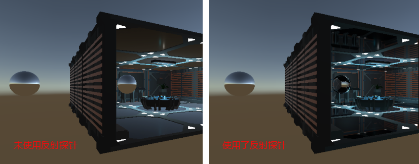
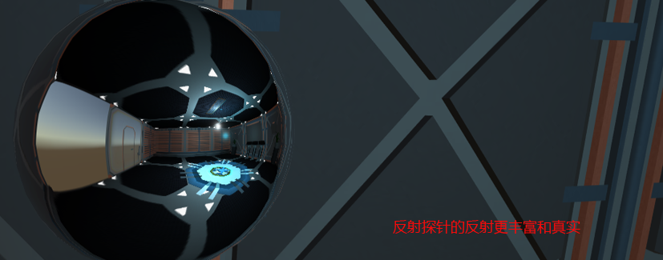
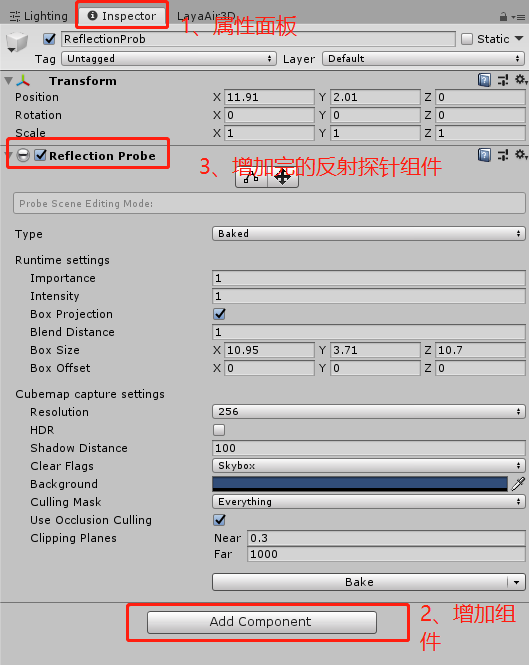
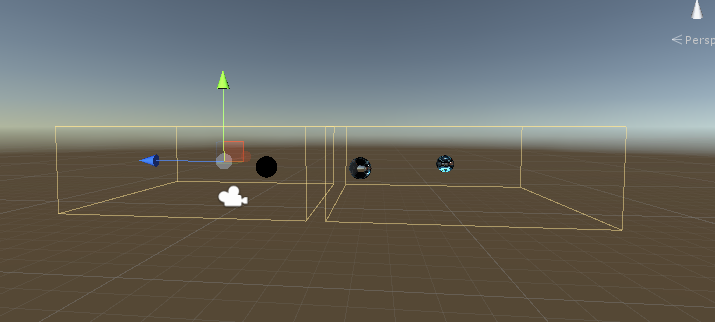
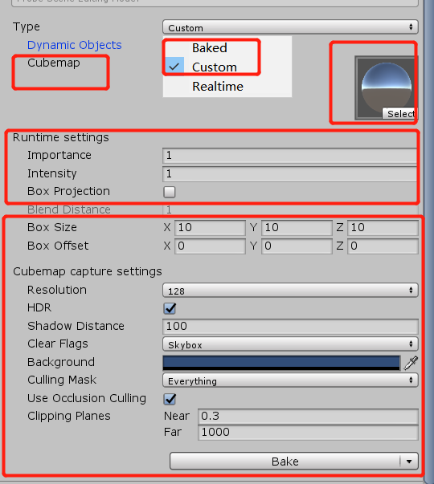

## 关于反射探针功能的使用说明

> Engine Version 2.9.0beta  Update:2020-11-02

反射探针是用来模拟反射周边物体的光照信息的一种解决方案，让物体受周围物体的光照或材质影响的一种模拟光照效果。简单来说，就是为了在不同的区域，可以得到不同的反射而实现的区域反射功能。

### 功能阐述

大家都知道LayaAir的PBR材质中的IBL的环境反射是基于场景的，在没有探针之前，所有PBR材质物体使用的反射的立方体贴图（textureCube），都来自于场景设置的反射立方体贴图，立方体贴图对应LayaUnity插件导出的ltcb或ltcb.ls文件。设置scene3D反射纹理的代码在Scene3D类中的reflection属性。

有反射探针之后，开发者可以根据不同的区域来烘培不同的反射天空盒，以此来得到更多更丰富的反射效果，如下图所示：

  

并且反射探针的Box Project反射（后面会具体阐述）会在一些情况下增加反射的真实度，可以得到更加好的场景效果，如下图所示：

  

### 使用Unity插件导入反射探针

反射探针功能从LayaAir引擎2.9.0beta开始，请使用2.9.0beta或者更高的版本。

#### 第一步：将模型导入unity

将layaair引擎插件导入Unity组织好场景，Layaair引擎Unity插件可以在laya官网下载好直接导入Unity就可以，LayaairUnity插件必须是2.9.0或以上版本，Unity版本建议2018.4.x，插件使用请参照插件使用的相关文档。

#### 第二步：设置好反射探针区域以及反射探针的属性

按区域去设置需要使用反射探针的地方，直接在unity中创建一个空节点，在空节点的Imspector中增加一个Reflection Probe的组件，如下图所示：

  

可以在场景中增加任意多的反射探针，如下图，在场景中增加了两个反射探针。

  

在LayaAir引擎中，反射探针的Type只支持`Bake`模式与`Custom`模式。另外，由于图片槽数对于小游戏来说非常的紧张，LayaAir引擎也没有做反射探针的blend（混合模式）支持，只是简单的simple模式和off模式。除了这两点，其它的Unity反射探针属性，LayaAir引擎中都是支持的。如下图所示，红框内都是支持导出使用的属性。

   

一些常规的属性使用就不在这里介绍了，重点说一下Box Projection（是否支持盒式偏移反射），该选项允许在距探针有限距离处创建反射立方体贴图，从而允许对象根据它们与立方体贴图墙壁的距离，显示不同大小的反射。周围立方体贴图的大小由探针效果区域决定。例如，如果一个探针在房间内部反射，应使设置的大小与房间的尺寸匹配。

开启和关闭Box Projection的效果如下图所示。

 

当我们我们设置完相关属性值之后，就可以进行下一步。

#### 第三步：烘培反射探针

需要注意的是，和全局光照一样，**反射探针只会反射静态的物体**，所以要先把需要反射的物体设置成静态物体。

所以，我们可以直接点击反射探针面板最下面的Bake按钮，

或者，在Unity的菜单栏Window-->Rendering-->Lighting Settings打开Lighting面板，点击最下方的Generate Lighting按钮。

然后导出场景。在LayaAir中直接加载`.ls`文件，就可以很方便的看到你搭建的反射探针场景。

>  当前的版本，使用了反射探针的物体不能进行静态合并以及instance动态合并，未来的引擎版本会优化。

### 小提示

注意：新手在第一次使用时容易犯一个小错误，即将反射探针组件所在的空物体当做物体。其实不然，在场景中能看到是为了方便操作，在运行时是不会看到的。所以，如果要看到反射探针的效果的话，可以在反射探针范围内创建一个物体将材质的透明度提到最高即可）

