## VSCode高效开发工作流配置指南

> *Author：charley                Date：2019-11-25*

LayaAirIDE 2.4将VSCode剥离出去，其主要目的是让开发者编码工作流更加自由。比如 ，可以即时体验到新版本的升级，无需受限于LayaAirIDE。可以通过VSCode来灵活配置自己的开发工作流等。

本篇从最简单的LayaAirIDE与VScode工作流配置开始，由浅入深，逐步介绍一些开发工作流的常用配置方式。

[TOC]

### 一、前置准备

开发工作流，自然离不开工具的支撑，这里罗列出基础的必备环境准备。如果都已准备好，可以跳过本小节。

#### 1.1、下载安装LayaAirIDE

哪怕是将VSCode剥离出去，LayaAirIDE仍然需要下载安装，这不仅是因为UI与场景的编辑以及项目创建需要用到LayaAirIDE。游戏发布的gulp配置js以及平台配置json也必须是由LayaAirIDE生成的，哪怕是用命令行发布，对于不同平台的js发布脚本及json配置 ，也是需要先在LayaAirIDE中生成一次，所以一定要下载LayaAirIDE。（本篇文档是基于2.4.0beta版IDE介绍）

LayaAirIDE 下载地址：

 [https://ldc2.layabox.com/layadownload/?type=layaairide]( https://ldc2.layabox.com/layadownload/?type=layaairide ) 

#### 1.2、下载安装Node.js

 Node.js 是一个基础环境，比如TypeScript编译、npm都需要依托于 Node.js。

 如果没有安装，直接前往node官网下载安装即可，

 Node.js 官网下载地址：

[https://nodejs.org/en/](https://nodejs.org/en/ ) 

截止到本篇文档撰写时，当前的12.x版与Gulp环境冲突，会导致本文中的命令行编译无法执行，所以，如果开发者没下载安装nodejs的，请直接下10.x版本。如果已安装12.x的，请卸载本地版本。重新下载10.x版本进行安装。

Node.js 10.x版本下载地址为：

 https://nodejs.org/download/release/latest-v10.x/ 

#### 1.3、下载安装VSCode

VSCode是一个应用广泛的编码工具，是本篇主要介绍的工具，对于TS与JS项目，推荐使用该工具。

VSCode官网下载地址：

 [https://code.visualstudio.com/Download](https://code.visualstudio.com/Download) 

#### 1.4、下载安装chrome

chrome浏览器是LayaAir引擎推荐的运行调试环境，对于这个，开发者一般都会安装。如果没有，请下载安装好。

chrome官网下载地址：

 [https://www.google.cn/intl/zh-CN/chrome/]( https://www.google.cn/intl/zh-CN/chrome/ ) 

### 二、LayaAirIDE与VSCode关联设置

假如前置准备的工具我们都安装好，这时，我们只需要做一个IDE的关联，即可完成一个完整的开发工作流的配置。

#### 2.1 最基础的LayaAir工作流（面向VSCode新手）

关于创建项目、打开项目（管理项目）、编译项目（F8）、运行调试项目（F6）、发布项目等都可以在LayaAirIDE中完成。

我们只需要把VSCode当成一个基础的编码工具，编译与调试，不推荐在VSCode中进行（具体原因后面还会讲）。

所以在开发的时候，需要打开两个软件，写代码在VSCode中进行，UI编辑与项目编译及运行调试在LayaAirIDE中进行，两个软件，快速切换一下，即可完成一个从编码到运行发布的完整工作流。

对于没有VSCode使用经验的开发者，这种模式是最容易理解和操作的工作流。

#### 2.2 在LayaAirIDE中关联VSCode

正常情况下，安装好VSCode后，LayaAirIDE能自动找到安装目录进行关联。然而也会有无法自动关联的情况出现。

> 注：MAC版本，当前的2.4.0beta版有个BUG，必定没办法自动关联。BUG已在2.4.0正式版中修复。

当无法自动关联的情况出现后，点击LayaAirIDE中的编辑模式按钮时，如下图所示，会弹出来`工具路径配置`的页面。

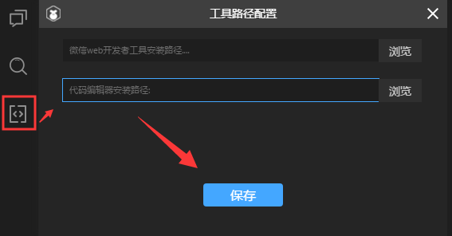 

点击浏览或者拖动VSCode安装目录的VSCode可执行文件，到工具路径配置面板的第二个输入框，再点保存。即完成了IDE与VSCode的关联。

如果是AS语言的开发者，可以拖动FB或FD的可执行文件进行关联。总之，第二行就是代码编辑器可执行文件的启动关联路径。开发者可根据自己的实际使用情况进行关联。

> 需要注意的是，在LayaAirIDE 2.4.0beta MAC版里目前有个BUG，点浏览可能会无法选中可执行文件。开发者可以采用拖入可执行文件到该输入框的方式进行配置关联。（该BUG已在2.4.0正式版中修复）
>

#### 2.3 修改IDE的关联

如果开发者不小心选择错误的目录或者可执行文件，保存后，点击LayaAirIDE左侧的编辑模式按钮，那就会直接打开错误的路径。

修改的方法如下图所示，在设计模式下，打开 `菜单` -> `文件` -> `工具路径配置`，即可重新拖入正确的可执行文件到对应的配置栏目。

 


### 三、VSCode中断点调试

LayaAirIDE剥离VSCode后，不再支持IDE内断点调试，只能是Chrome调试器中断点。

如果开发者想在代码编辑器中断点调试。需要在VSCode中配置好调试环境。

VSCode默认是没有配置调试环境的，如果开发者没有配置好，可根据本小节的指引，来安装chrome调试插件（扩展）和配置launch.json来配置好调试环境。

#### 3.1 安装Debugger for Chrome

点击左侧导航面板的扩展（EXTENSIONS）商店图标，然后在搜索栏中输入关键字`chrome`，找到`Debugger for Chrome`点击`Install`进行安装(已安装的不再显示)，操作流程的指引如下图所示。

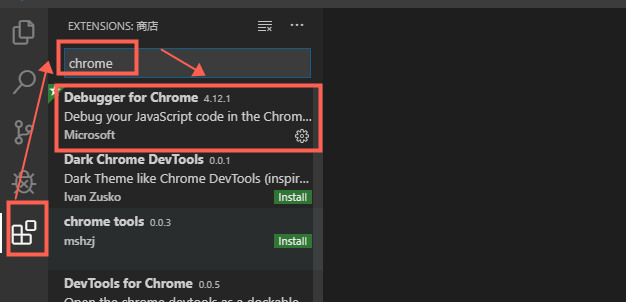  

如果有开发者想使用VSCode中文菜单的，也可以搜索chinese，找到中文插件进行安装，操作如下图所示。

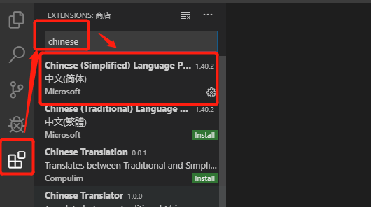 

> 注：本篇文档是基于已安装了中文插件的window版VSCode进行截图示例。

总之，以后想安装什么插件，都可以在插件扩展商店中搜索查找及安装。

#### 3.2 启动断点调试及运行项目的流程

安装完`Debugger for Chrome`插件后，

如果开发者采用的是LayaAirIDE 2.4.0beta 或更高版本创建的项目，LayaAirIDE在创建项目时会帮大家创建好VSCode调试配置文件 `.vscode/launch.json`  。

此时，先到LayaAirIDE里按快捷键F8编译一下，然后回到VSCode再按快捷键F5，即可启动VSCode中的断点调试，以及调起Chrome，显示运行效果。 

##### 问题解决经验汇总：

##### 3.2.1 一定要先编译再调试

这里重点强调一下开发者经常遇到的错误，那就是不编译，安装好`Debugger for Chrome`之后，直接F5调试，会出现如下图所示的报错。

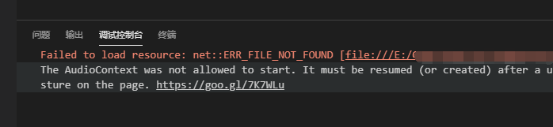 

这是由于F5只是调试的快捷键，必须要先使用LayaAirIDE的编译（F8），编译生成运行代码后，才能使用VSCode里的F5断点调试。

对于VSCode开发工作流不是特别熟悉的开发者，编译方面一定要使用LayaAirIDE提供的编译功能。不要使用VSCode中的tsc编译任务，因为VSCode中的tsc编译与LayaAirIDE的编译及发布流程不一致，所以会有很多地方都要修改，编译后才能运行成功，而且就算是在VSCode中运行成功了，如果修改的和LayaAirIDE流程不完全一致，也不能使用LayaAirIDE的项目发布功能。当使用LayaAirIDE提供的项目发布功能时，还是要用LayaAirIDE的编译再重新编译一次，才能发布成功。

##### 3.2.2 断点调试需要开启 sourceMap 

有一些开发者，调试环境安装好之后，也不能断点。那是因为LayaAirIDE2.2开始，创建项目时，默认关闭了sourceMaps，如果需要使用断点，开启sourceMaps的相关设置即可。如果不会设置的，可以参照官方文档的断点调试开启说明。

**sourceMaps开启文档** ：

 [https://ldc2.layabox.com/doc/?nav=zh-ts-3-0-7]( https://ldc2.layabox.com/doc/?nav=zh-ts-3-0-7 ) 

#### 3.3 配置launch.json

如果是LayaAirIDE 2.4.0beta版之前创建的项目，是没有调试配置文件的。所以，当编译后，在VSCode使用F5编译时，会提示选择调试环境，建议选择`Chrome`作为调试环境，如下图所示。

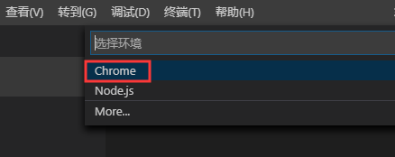 

选择之后，会自动创建调试配置文件 `.vscode/launch.json`  ，并有一些基础的配置信息。但这些并不够用。最简单的办法是用 LayaAirIDE 2.4.0beta或更高版本IDE创建一个示例项目，把 `.vscode/launch.json`  文件复制过来替换即可。

launch.json 内容如下：

```json
{
	"version": "0.2.0",
	"configurations": [ 
		{
			"name": "chrome调试",
			"type": "chrome",
			"request": "launch",
			"file": "${workspaceRoot}/bin/index.html",
			"runtimeArgs": [
				"--allow-file-access-from-files",
				" --disable-web-security"
			],
			"sourceMaps": true,
			"webRoot": "${workspaceRoot}",
			"userDataDir": "${workspaceRoot}/.laya/chrome",
			"sourceMapPathOverrides": {
				"src/*": "${workspaceRoot}/src/*"
			}		
		}
	]
}
```

如果不想创建项目复制`launch.json`的，直接在`.vscode`目录创建一个空文件`launch.json`，将上面的内容复制过去也是可以的。

在VSCode中打开`launch.json`，鼠标悬停到`launch.json`的属性名称上，可以查看当前属性描述。


### 四、在VSCode中调LayaAir命令行工具

在第三小节中，仅仅是实现了在VSCode中的断点调试，编译与发布还是要切到LayaAirIDE中进行。

有一些开发者，提出不切换，直接在VSCode中实现完整的编译、调试、发布的需求。本小节将继续进行指引。

#### 4.1 安装 layaair2-cmd 与 gulp

Layabox提供了layaair2-cmd命令行工具，通过这个工具，可以不打开LayaAirIDE，直接在VSCode终端命令行下对LayaAir引擎项目进行编译，以及项目发布（HTML5、微信、百度等小游戏版本）。

#####  4.1.1 安装 layaair2-cmd

layaair2-cmd安装的方式比较简单，由于我们前置准备已安装好了Node.js，所以直接在命令行终端模式下输入 `npm i layaair2-cmd -g` 回车即可，安装过程如下图所示。

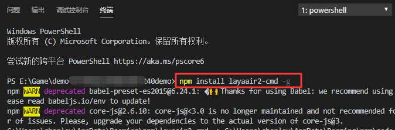  

##### 4.1.2 layaair2-cmd的成功与失败经验

##### 成功校验

正常情况下，layaair2-cmd会很顺利的安装，输入`layaair2-cmd -v`命令，回车能看到版本号，说明安装成功了。

##### 失败：环境变量注册失败

正常情况下，使用命令`npm i layaair2-cmd -g` 安装后，会自动注册全局环境变量。

如果输入`layaair2-cmd -v`提示：XX不是内部或外部命令，XXX。说明全局变量没注册成功。

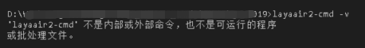 

没注册成功的环境，可以通过`npm config ls`查看node配置信息，找到prefix那一行，如下图所示。

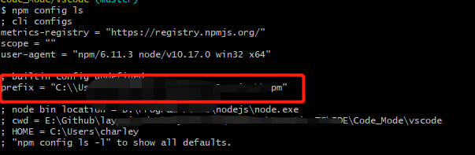 

找到  系统属性——高级系统设置——环境变量， 选中path点编辑，把prefix后的路径，添加到path（环境变量）后。即可完成环境变量的注册。

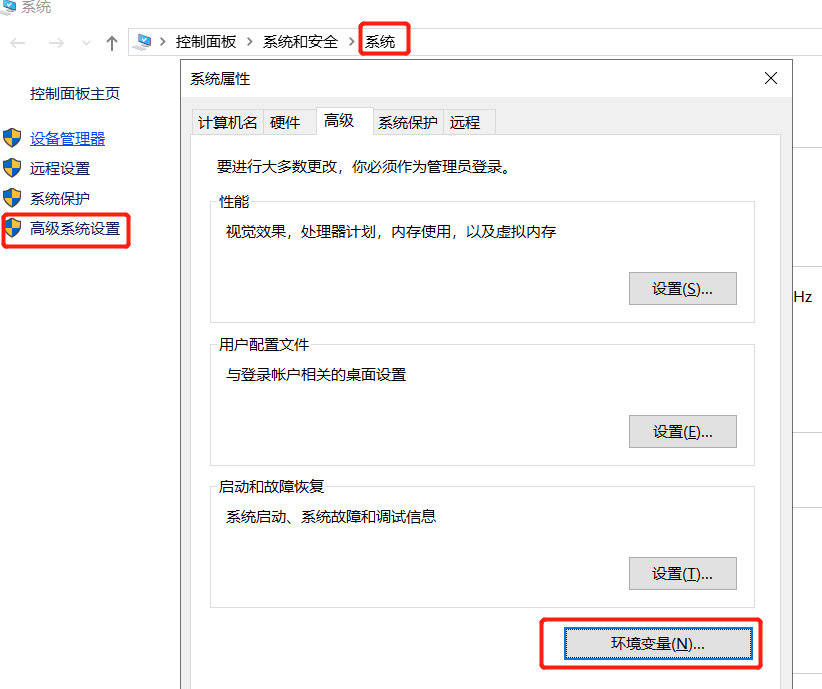

##### 失败：compile.js未BUG

如果使用了新版的`layaair2-cmd`，而本地IDE创建的compile.js未能与新版layaair2-cmd匹配好，则会报错。这个报错主要是体现在TS与TS实验版本上。目前哪怕是layaAirIDE 2.4beta，由于遗漏了更新也未解决，需要2.4正式版才可以解决。或者前往layabox社区。layabox社区上给出了已修复的编译库，大家可以前往下载替换。

compile.js编译脚本的layabox社区下载地址为：

 [http://ask.layabox.com/article/8]( http://ask.layabox.com/article/8 ) 

下面提供几张关于compile.js报错的相关错误截图，以作为问题判断的参照。

（layaAirIDE 2.4beta TS版）创建的项目报错信息如下图所示：

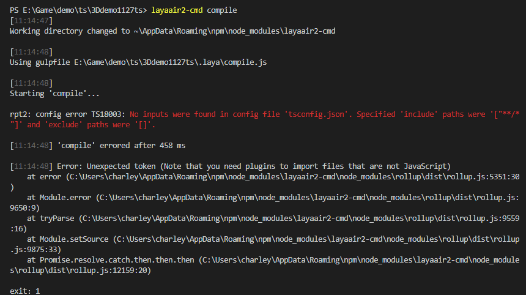 

（layaAirIDE 2.4beta TS实验版）创建的项目报错信息如下图所示：

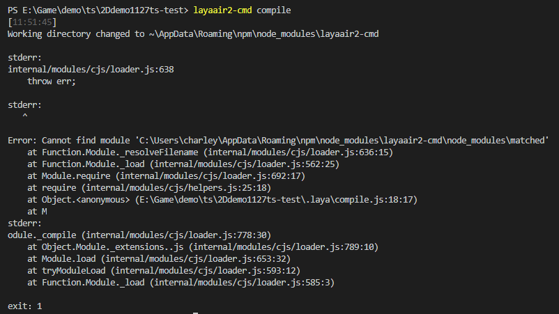 

（2.4之前的旧版IDE）创建的项目报错信息如下图所示：

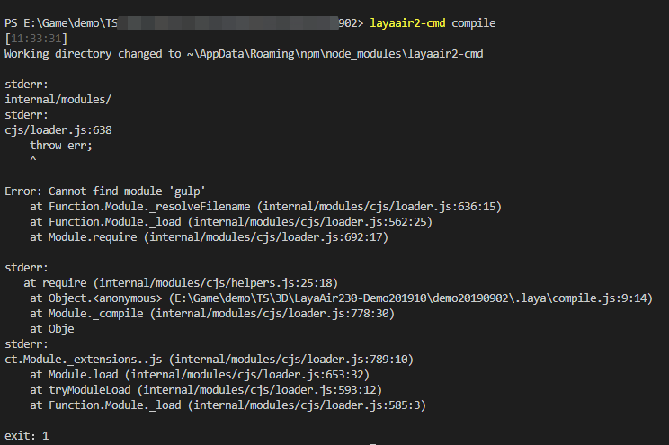 


#####  4.1.3 安装 gulp

要使用layaair2-cmd命令，没有gulp环境，是跑不起来的，下图的报错，正是不支持gulp导致。

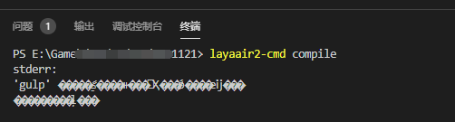 

所以，我们继续用npm来安装gulp，在命令行终端模式下输入`npm i gulp -g` 回车即可，安装过程如下图所示。

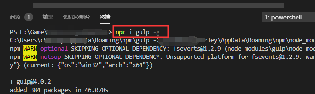 


#### 4.2 layaair2-cmd的使用

layaair2-cmd的使用很简单，目前只有两个功能参数， compile 与  publish ，分别是编译和发布。

##### 编译命令

当我们想编译项目时， 输入 `layaair2-cmd  compile` 回车即可。编译效果如下图所示。

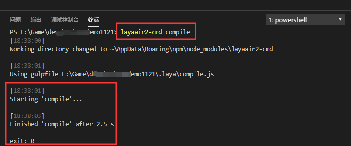 

> ##### 禁止运行脚本
>
> 如果输入编译命令后，出现类似“……禁止运行脚本……about execution policies”类似的报错。可以在命令行下通过输入 `Set-ExecutionPolicy RemoteSigned` 来解决，具体机制与命令可以参照下面这个链接。
>
> [https://docs.microsoft.com/zh-cn/previous-versions/windows/powershell-scripting/hh847748(v=wps.640)]( https://docs.microsoft.com/zh-cn/previous-versions/windows/powershell-scripting/hh847748(v=wps.640) ) 

##### 发布命令

不仅是编译，发布也可以通过命令行搞定。目前的发布类型为HTML5（web）、微信小游戏（wxgame）、百度小游戏（bdgame）、小米快游戏（xmgame）、OPPO小游戏（oppogame）、vivo小游戏（vivogame）、QQ小游戏（qqgame）。

各平台不同版本的发布命令为：

```js
//HTML5版本发布命令
layaair2-cmd publish -c web

//微信小游戏版本发布命令
layaair2-cmd publish -c wxgame

//百度小游戏版本发布命令
layaair2-cmd publish -c bdgame

//小米快游戏版本发布命令
layaair2-cmd publish -c xmgame

//OPPO小游戏版本发布命令
layaair2-cmd publish -c oppogame

//vivo小游戏版本发布命令
layaair2-cmd publish -c vivogame

//QQ小游戏版本发布命令
layaair2-cmd publish -c qqgame
```

未来有新的平台命令，可以通过官网文档中查看，文档链接为：

 [https://ldc2.layabox.com/doc/?nav=zh-ts-3-0-6]( https://ldc2.layabox.com/doc/?nav=zh-ts-3-0-6 ) 

##### 使用命令行发布的注意事项

使用命令行发布之前，我们一定要先在LayaAirIDE里发布一次，因为命令行发布功能需要依托于`.laya`目录下的各个平台的js发布脚本和平台json配置信息。比如排除，发布配置等信息，需要发布一次后，才会更新保存到对应的平台json配置中。如果对平台发布功能不熟悉的，可以打开之前提供的官网文档链接。

#### 4.3 不切IDE的工作流

学到此处，我们不仅可以在VSCode中用快捷键F5断点调试，也可以通过本小节学习到的命令行方式，直接通过VSCode终端，使用layaair2-cmd来编译和发布项目。

这样一来，对于日常的编码、编译、调试、发布，直接在VSCode中实现，不用在两个工具之间来回切换了。


### 五、配置VSCode的编译快捷键

尽管命令行模式的工作流可以在日常编码中脱离了来回切换IDE的繁琐，或许有一些开发者仍会觉得易用性不够，如何能实现LayaAirIDE那样，直接F8快捷键就编译，请继续看本小节的指引。

直接给命令行设置快捷键是通过VSCode做不到的。但是，我们可以在任务里去执行命令行的相关指令。然后修改执行任务的快捷键，并指定默认运行的任务名称，就可以实现VSCode快捷键的绑定。

#### 5.1 新建任务（task）

如果我们还没有创建过任务，可以在VSCode的`终端`菜单里，点击`配置任务`，如下图所示。

 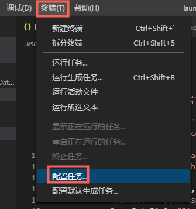

然后，点击选择 `使用模板创建tasks.json文件` 的选项，如下图所示。

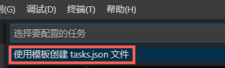 

之后再点击选择`运行任意外部命令的示例`选项，如下图所示。

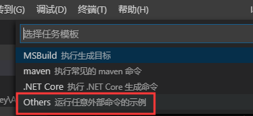 

这时，我们就可以看到，`.vscode`目录下，一个执行外部命令的任务模板`.vscode/task.json`创建成功了，我们只需要更改一下label（任务名称）和command（要执行的命令）即可。效果如下图所示。

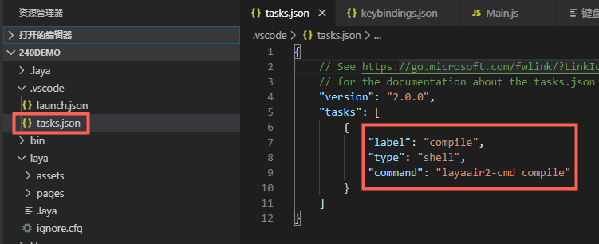 

修改后的`task.json`内容为：

```json
{
    "version": "2.0.0",
    "tasks": [
        {
            "label": "compile",
            "type": "shell",
            "command": "layaair2-cmd compile"
        }
    ]
}
```

#### 5.2 绑定快捷键

在`文件`菜单 -> `首选项` -> 打开 `键盘快捷方式`，或者直接先后连按快捷键`Ctrl+K Ctrl+S` 打开，如下图所示。

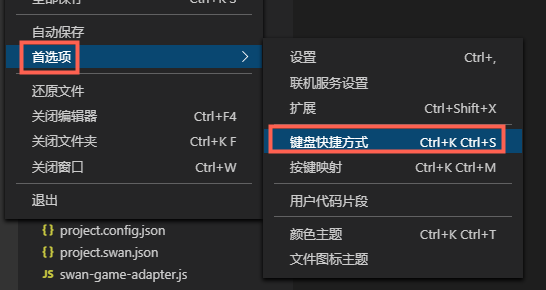 

打开键盘快捷方式后，先在顶部搜索task，找出任务相关的快捷方式，再找到 `运行任务（Run Task）`双击，设置快捷键 `Ctrl + F8`  （可按自己的习惯设置一个不冲突的快捷键即可），回车即完成运行任务的快捷键绑定。效果如下图所示。

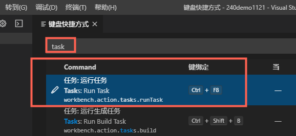 

然后，通过快捷键`Ctrl + Shift +P `调出命令面板，搜关键字 `open key`，找到 `打开键盘快捷方式（JSON）`的命令，如下图所示，点击打开。
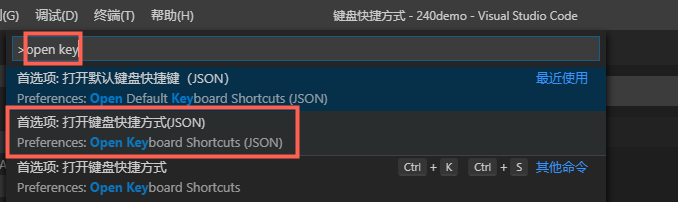 

点击后，我们看到快捷盘配置的JSON里，有刚刚绑定了快捷键的配置信息。这里，我们增加一个参数args，此处的值就是默认启动的任务，我们将之前创建的任务名称compile设置到这里即可，效果如下图所示。

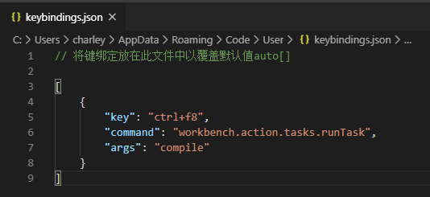 

有经验的开发者， 其实也可以跳过之前的步骤 ，不需要先在`键盘快捷方式`面板那里绑定，而是直接在keybindings.json中增加以下内容：

```json
[
    {
        "key": "ctrl+f8",
        "command": "workbench.action.tasks.runTask",
        "args": "compile"
    }
]
```

到这里，我们就完成了给编译命令绑定快捷方式的全部操作。以后，我们就可以在VSCode中直接使用Ctrl+F8编译，F5断点运行，这个快捷的编码工作流了。


### 六、用gulp监听，实现自动执行编译。

如果开发者觉得快捷键编译还不够，想实现实时编译，也是可以做到的。这一小节，我们以创建gulp任务的方式，为大家介绍如何实现自动编译。

#### 6.1 安装本地gulp环境

之前，我们以`npm i gulp -g` 命令安装过gulp全局环境。

如果要使用gulp监听等功能，还需要在项目的目录内安装本地gulp环境，

安装命令去掉全局参数`-g`即可，去掉后的命令为： `npm i gulp`，安装效果如下图所示。

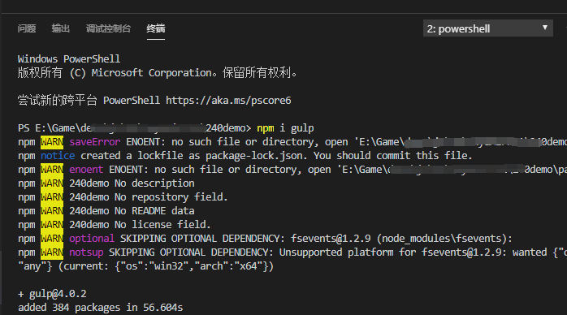 

安装完成后，我们可以看到项目目录内多了一个`node_modules`目录，如下图所示。

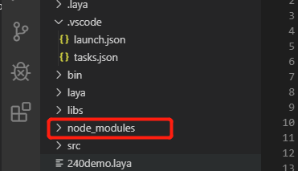 

#### 6.2 编写gulp任务脚本

我们在根目录创建一个gulpfile.js脚本文件，脚本内容参照如下：

```json
const {watch ,task } = require("gulp");
const {exec} = require("child_process");

function compile(cb) {
    //执行编译命令 layaair2-cmd compile 
    let process = exec("layaair2-cmd compile");

    process.stdout.on("data",(data)=>{
        console.log(data);
    });

    process.stderr.on("data",(data)=>{
        console.log(data);
    });

    process.on("exit",(code,signal)=>{
        console.log("success");
        console.log(code,signal);

        cb();
    })
}

//创建一个名称为compile的gulp任务
task("compile", function(){
    /**
     * @ 监听src目录下的所有子目录的所有文件，
     * @ 延迟1000毫秒，才执行下次监听，避免手欠的同学，因连续保存触发多次连续编译
     * @ 监听生效后执行的函数
     */
    watch('src/**/*.*', {delay:1000}, compile);
});
```

> 了解更多gulp任务监听，可以查阅gulp官方文档：
>
> https://www.gulpjs.com.cn/docs/getting-started/watching-files/

保存好`gulpfile.js`这个gulp任务脚本后，效果如下图所示。

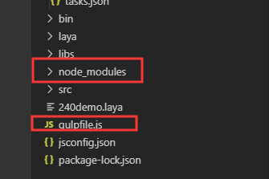 

然后，我们直接在终端命令行下，直接输入`gulp compile`即可执行名称为compile的gulp任务。如下图所示。

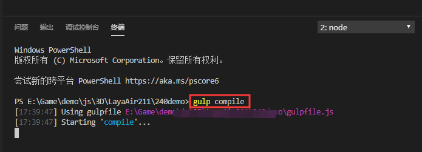 

只要这个任务不关，那这个任务的watch监听会一直执行下去，从而达到了自动编译的目标。


### 七、写在最后

至此，在VSCode中编码时，无论是编译、调试运行、还是发布，本篇都有涉及，以此为借鉴，开发者可以搭建一个流畅的开发工作流。

当然，VSCode自定义工作流的强大远不止于此，对于工作流的搭建，方式非常多。如果想更加深入了解的，可以不必局限于本篇。本篇仅仅为那些没有VSCode使用经验的开发者，提供一些基础的工作流搭建参照。

如果有什么问题或者不解，可以在开发者QQ群或者layabox官网社区进行交流。


## 本文赞赏

如果您觉得本文对您有帮助，欢迎扫码赞赏作者，您的激励是我们写出更多优质文档的动力。

