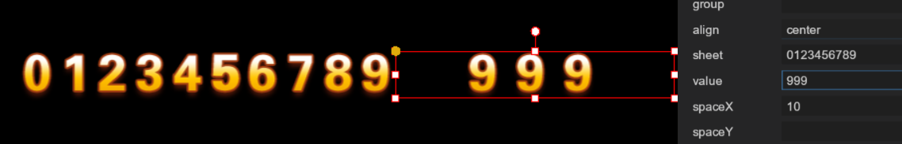
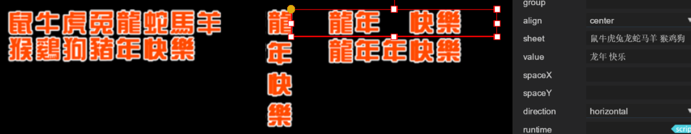
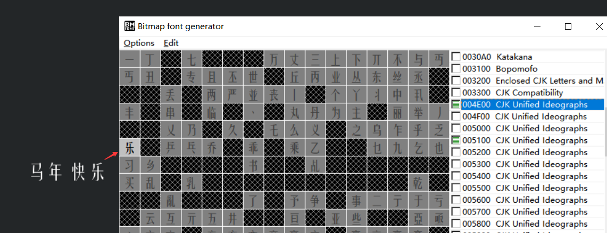
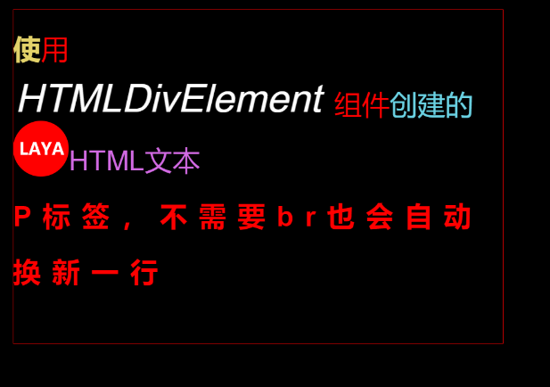
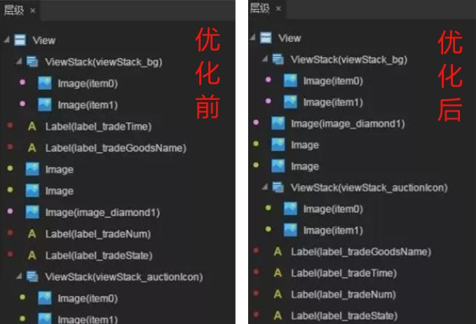

## 一篇了解所有的LayaAir文本组件

> Author: Charley      Updated Date: 2020-11-06       Engine Version：LayaAir 2.9.0beta

LayaAir引擎与IDE提供了丰富的文本组件，适用于各种文本应用场景。本篇分别就IDE中的显示文本组件、HTML文本组件、位图文本组件、可输入文本组件，这几个类型的组件进行介绍，让大家全面了解一下LayaAir引擎的各个文本组件。

### 一、显示文本组件

显示文本就是只能看，不能编辑修改的基础文本。LayaAir引擎提供了Text、FillText、Label这三种基础的显示文本。

#### 1.1、文本的底层渲染机制

LayaAir引擎在文本的底层渲染上，有两种方式。

分别是Text文本类的统一提交方式，和Graphics类的fillText文本绘制提交方式。

如果采用了Text文本，那每一个Text文本对象中的文本字符会一起形成小图集提交到大图合集中，比如游戏中某个文本对象有300字，其中一个字符发生改变，也会对该文本对象的300字整段文本图集重新提到大图合集中。

又假如，在一个剧情游戏中，两人在对话。那其中一个文本对象，要不断的重新取值和赋值操作，使得该文本对象的显示内容频繁发生改变。此时，Text文本对象，就会不断的向大图合集进行文本图集的提交，占满大图集后，又需要创建一个新的图集继续提交，而不用的旧图集，如果没达到GC条件，也会一直存在，所以如果此次查看内存占用统计信息，就可以看到会一直在涨内存，直到GC条件达到之后，才会被销毁。并且GC在清空垃圾内存的时候，还有可能会导致瞬间的卡顿。

而采用Graphics类的fillText文本绘制，则是按单个字符向大图合集中进行提交，并且大图合集中已经存在的字符不会重复提交。所以对于图集的利用率比较好，即便是发生文本改变的时候，也不会向Text文本那样，创建很多垃圾图集。

这样看来，是不是fillText就是最好用的呢？

如果文本不需要改变，那按单字提交图集的效率是不如一次性直接提交的。

所以，我们还是要看文本的类型，对应文本使用时的类型，选用相应的引擎API，才会更好。

#### 1.2、静态文本与动态文本

基于上一小节的文本渲染提交的机制，以及文本仅用于展示或用于交互的区别，我们分成两种概念，就是把仅用于显示，文本内容无需改变的文本叫静态文本。对于文本内容需要改变的文本叫动态文本。

Text和Label都属于处理静态文本的类，它们都是把文本的每次改动都统一提交大图集的渲染机制。

fillText、fillBorderText、strokeText等，都是Graphics类中用于单字符提交的文本绘制方法。

在LayaAirIDE中，Text和Label属于静态文本组件，FillText属于动态文本组件。而LayaAir引擎中Graphics类的fillBorderText、strokeText等文本绘制方法，在IDE中是没有封装为组件的，需要在项目代码中直接使用引擎的API。

#### 1.3、不同的文本组件使用区别与选择

如果我们已经理解了什么是静态文本和动态文本，那使用起来的选择就比较简单了，例如，一些导航和标签按钮等，他在UI上完全没有必要进行改变，完全可以使用静态文本。文字剧情和任务等，就需要动态文本了。

那静态文本组件有Text和Label两种，那是怎么选择呢。

其中Text是最基础的文本组件，他直接继承于Sprite，而Label继承于UIComponent再往上才是Sprite，从原理上，路径越短，性能自然越好。所以，比较简单的文本，当Text可以满足时，原则上优先使用Text，而Label由于属性非常丰富，适用于相对布局等等Text无法满足的应用场景。

而对于FillText组件，我们不仅要了解它的优势，也要了解他的不足。FillText文本由于是引擎自己绘制的，目前只适用于中英文等主流国家语言，对于泰国语、阿拉伯语等复杂的语言，显示可能会有异常。所以对于这些排版复杂的国际语言游戏，那只能是采用静态文本组件的系统字或者是位图字，尽可能减少文本动态修改的产品需求。

#### 1.4、使用时要注意的

静态的文本优先使用Text组件，因为只显示静态文本的时候性能最好。动态文本优先使用FillText，除非是国际化等需求不能满足的时候。

静态文本，对于有相对布局等复杂需求时，Label组件的功能比较强大。

具体的属性使用特别简单，IDE中的属性面板中都有说明，不需要写代码也可以直接运行查看效果，另外在官网的文档和视频教学中，对于每个组件的使用与属性效果也都有介绍，就不逐一介绍了，重点介绍一下FillText中font属性与其它几个文本font属性区别。

在Text与Label中，font仅仅是指系统字体，例如该文本是`Microsoft YaHei`还是`Arial`，选择或者输入对应的字体就可以。而FillText中，font是字体与字体大小的设置值，也可以把所有相关的文本样式（大小、字体、斜体、加粗）也在这里指定。

例如，当值为 `60px simHei` ，是将文本大小设置为60像素大小，采用simHei字体。如下图所示：


值为`60px simHei italic` 增加了斜体效果。如下图所示：

 

值为`bold 60px simHei italic` 增加了文本加粗效果。如下图所示：

 

> Tips:
>
> - 大小与字体是必须设置的，并且在字体必需要放到文本px大小的后面。
> - bold需要放到文本px大小的前面。
> - FillText组件在2.8版本之前只能添加在没有skin填充的空显示节点下，2.8开始，可以添加到任意UI节点下。

### 二、位图显示文本组件

位图显示文本，是一种基于位图的文本，虽然显示的是文本的内容，其本质还是位图。通常用于系统上不通用的字体或者美术设计的个性字体，通过位图的方式可以保障字体的兼容性与美观。对于文本效果与位置要求比较严格的游戏，建议采用位图文本。

> 普通的文本，在不同运行环境下，可能会存在像素级的位置偏移。比如Chrome低版本和高版本也存在位置偏移。所以要求高的静态UI文本，可以采用位图显示文本。
>
> 位图文本适用于文本单字总量不大需求，常用于第X关，X连击等标题性文本。对于文字剧情这种游戏，就不太适合。

#### 1、FontClip字体剪辑组件

FontClip组件是LayaAir基于等份切割原理将完整的位图切分成一个个独立的文本单元，然后任意剪辑拼接起来。效果如下图所示，

 

上图的0-9是美术原图效果的展示，999是FontClip组件效果。

在上图右侧的属性面板上，sheet值对应位图的9个数字，此时数字要完全对应起来，因为这个值不仅是引擎切割份数的参考依据，更是文本映射关系。只有对应起来，属性value中输入什么值就会显示什么值，例如上图的999。并且FontClip组件还可以控制切割后的位图文本间距等效果。

如果位图文本不是数字，是字母或者中文等，内容比较多，美术出图时也可以将文本多行排行，但是每个文本之间必须要等高等宽等距进行排列。此时用于映射的sheet值，要在每行结束位置加一个空格，让引擎知道这个位图文本是多行排行的。效果如下图所示：

 

通过上图，我们可以看出sheet属性值`鼠牛虎兔龙蛇马羊 猴鸡狗猪年快乐`对应了位图上的文本，并且在羊后加了一个空格，此时就可以在value输入位图上的文本字符了，而且我们还展示了竖向排版的效果，说明切割后的文本还可以排版控制的。

如果细心的开发者会发现，位图字是繁体的，sheet的值是简体的，但展示的效果并没有受到影响。这是因为sheet值只是起到映射关系的作用，哪怕这十二生肖的文本对应的就是生肖图片，那也会显示对应的生肖图。但是映射的文本与位图上的数量一定要是完整的，否则切片的份数不对，就会导致位图剪辑后的显示错误。

最后再说一下空格，当前的FontClip组件是面向单行的整句文本，是不支持空格的，如果在Value值里加一个空格，我们可以从上图中看出，空出一个完整的文本位置。其实不止是空格，所有sheet值中不存在的文本，都会以空的完整字符占位。

> 未来的版本，有计划支持空格与换行

#### 2、BitmapFont位图字体类

通常FontClip已经可以满足关卡、特效等单行位图文本的需求。如果有特殊情况，就是想要空格，那也可以通过BitmapFont位图字体类来实现，在LayaAir 2.x IDE里，当前的版本还不能可视化使用BitmapFont位图字体，可以通过代码调用实现，具体的使用方式，要描述的内容太多，就不在这里展开了，大家可以查看官网的位图字体技术文档。

 

BitmapFont不仅可以满足位图空格的需求，当使用那些需要在系统安装的商业或者免费字体时（例如：汉鼎字体、思源字体、站酷字体等等），也可以很方便的通过Bitmap Font Generator这个第三方的免费工具导出，然后在LayaAir中直接使用。

> Tips：
>
> Bitmap Font Generator 只有windows版，对于没有windows系统的，复杂度不高的需求，尽可能通过FontClip实现。

### 三、HTML文本组件

HTML文本是用于图文混排的文本组件，组件名为HTMLDivElement。该组件通常用于聊天室等动态文本场景需求，所以引擎也是采单字符提交图集的模式，与Graphics的文本绘制有些类似，但又不太一样，因为绘制采用的是系统字，并支持常见的HTML标签。

目前引擎支持的常见HTML标签如下：

| 标签名   | 标签说明                                                     |
| -------- | ------------------------------------------------------------ |
| `div`    | div容器标签，例如：`<div> 文本的最外层，可以通过style设置HTML文本的宽高 </div>` |
| `span`   | 行内元素标签，例如：`<span> 多个span之间不会自动换行，除非是达到了宽度限制</span>` |
| `h`      | h1 到 h6是标题标签，例如：`<h1>h1最大</h1>` …… `<h6>h6最小</h6>` |
| `p`      | 段落标签，例如：`<p>多个p标签之间会自动换行，每个完整的p标签是一个单独的段落</p>` |
| `br`     | 换行标签，例如：`<span>要</span>换行<br />`                  |
| `&nbsp;` | 空格标签，例如： `&nbsp;&nbsp;`                              |
| `style`  | 样式标签，例如：`<div style='width:880px;height:100px;font-family:SimSun;'><span style='font-weight:bold;font-size:70px;'>HTML文本</span></div></style>` |
| `img`    | 图片标签，例如：`</img>` |
| `color`  | 文本颜色标签，例如：`<span color='#e3d26a'>颜色</span>`      |

具体到style标签的属性支持如下：

| style标签属性示例              | 属性说明                    |
| ------------------------------ | --------------------------- |
| `italic:true｜false;`          | 是否是斜体                  |
| `bold:true｜false;`            | 是否是粗体                  |
| `letter-spacing:10px;`         | 字间距                      |
| `font-family:宋体;`            | 字体                        |
| `font-size:20px;`              | 字体大小                    |
| `font-weight:bold:none;`       | 字体是否是粗体，功能同bold  |
| `color:#ff0000;`               | 字体颜色                    |
| `stroke:2px;`                  | 字体描边宽度                |
| `strokeColor:#ff0000;`         | 字体描边颜色                |
| `padding:10px 10px 20px 20px;` | 边缘的距离(上右下左)        |
| `line-height:100px;`           | 行高（仅div中使用）         |
| `align:left｜right｜center`    | 水平对齐方式（仅div中使用） |
| `background-color:#ff0000;`    | 背景颜色（仅div中使用）     |
| `border-color:#ff0000;`        | 边框颜色（仅div中使用）     |
| `width:100px;`                 | 宽度（仅div中使用）         |
| `height:100px;`                | 高度（仅div中使用）         |

`下面的代码是运用的示例代码，`

```html
<div style='width:880px;height:600px;color:#ff0000;font-size:50px;font-family:SimSun;vertical-align:bottom;line-height:100px;border-color:#ff0000;'>
    <span color='#e3d26a' style='font-weight:bold;'>使</span>用<br/>
    <span style='color:#FFFFFF;font-size:70px;stroke:2px;italic:true;'>HTMLDivElement</span>&nbsp;&nbsp;组件
    <span color='#6ad2e3'>创建的</span><br/> 
    </img><span color='#d26ae3'>HTML文本</span>
    <p style='height:350px; bold:true;letter-spacing:20px;'>P标签，不需要br也会自动换新一行</p>
</div>
```

 当我们将以上代码复制到HTMLDivElement组件的innerHTML属性里，运行效果如下图所示。

 

### 四、可输入文本组件

可输入文本组件为单行输入组件TextInput和多行文本域组件TextArea。

从组件名字其实上就可以看出区别，

一个是不能换行，用于单行输入。比如注册信息上的那些单行输入框用TextInput。

另一个是能换行的多行文本组件TextArea，比如个人简介，备注说明等等。而且TextInput文本组件支持右侧的垂直滚动条，和底部的水平滚动条。

由于可输入文本组件的用法比较简单，组件也比较容易理解。这里就不详细介绍了，具体在使用过程中，可以看提示进行尝试或者直接看对应的组件属性说明文档。

### 五、关于文本的性能优化

#### 1、静态显示文本的优化

静态显示文本，上文介绍过，分别是Text与Label组件。

这两个组件，如果都是比较简单的单行文本，并且除了文本内容发生变化外，不对文本的属性（例如大小、颜色、粗细、斜体、对齐等等）作出任何改变的话。那我们可以使用changeText()来替换文本，这个方法会跳过排版直接修改该文本绘制的最后一条指令，从而优化了渲染效率。

示例代码如下：

```typescript
this.text.text="原text文本";
Laya.stage.addChild(this.text);
//不优化的写法是：this.text.text="替换的text文本"; 
this.text.changeText("替换的text文本");
```

#### 2、尽可能使用对应的文本组件

每个不同的组件都是有自己独特的作用，所以一定要充分了解组件的作用，对应特点来使用。

上文中也讲到过，静态显示文本Text组件的性能是最好的，所以，在项目开发时，能用Text尽可能要用Text组件。当Text组件不满足的时候再用Label。

对于无需改变内容的静态文本，当文本组件节点较多时，我们可以开启cacheAs，设置normal可以优化节点数，设置bitmap可以优化DrawCall数。

而当文本内容需要改变时，哪怕只改变一个字符，如果FillText可以满足需求的话，那尽可能优先使用FillText文本组件。FillText不能满足时，其次考虑位图文本组件是否可以满足，最后再考虑静态文本组件。

#### 3、尽可能避免使用文本描边

在运行时，设置了描边的文本比没有描边的文本多调用一次绘图指令。此时，文本对CPU的使用量和文本的数量成正比。因此，尽量使用替代方案来完成同样的需求。例如，字符量较少的时候，可以使用位图文本。

#### 4、被文本打断的DrawCall优化

在2D的UI布局时，如果开发者将文本与其它UI节点混合排列，那么必然会打断图集的合并渲染，增加DrawCall数量，产生不必要的性能开销。所以，有两个方案来优化。

一是，LayaAir IDE编辑布局时，将所有文本组件在节点中顺序排列，不要与其它UI组件穿插。如下图所示：

 

二是，LayaAir IDE中的组件中有一个drawCallOptimize属性，我们为所有文本的父级节点drawCallOptimize属性设置true值。当这样设置之后，引擎会自动启用文本合并优化，将所有的文本提取到最上层，而开发者无需再刻意调整图集资源和文本的排序，即可实现drawCall自动优化的目标，而且优化的更加干脆彻底。

> 需要提醒的是，drawCallOptimize优化方案由于会自动将文本提升显示层级，不适用于必须要将文本半遮挡的特殊需求。当然，绝大多数情况下文本是要处于全文显示的，如果有全隐藏的情况，可以直接设置隐藏属性。所以，建议开发者开启该优化方案。


