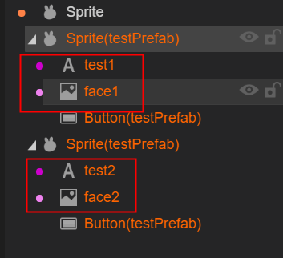

# 预设使用

在项目开发中，经常会出现这样的情况：

1.立项的时候，美术定义一系列标准的字体颜色，字号，在各个UI中应用，有一天美术突然说要更改默认的字体颜色，字号，苦逼的UI制作者就需要把所有界面都修改一次，这样会非常麻烦。**针对这种情况，使用默认属性设置或者预设就能轻松应付，只修改一个地方，就能影响全局。**

2.不同的界面，局部会有相同的模块，并且逻辑代码也是一样的，这种情况，**使用页面嵌+runtime（页面逻辑类）就能轻松应对**

3.不同的界面，局部有相同的布局，希望修改一次，多个界面相同布局跟着一起变化。**针对这种情况使用页面嵌套和预设就能轻松应对**

针对类似上面需求，LayaAirIDE提供了三种方案：

**1.资源默认属性设置** (给单个组件设置默认值，修改全局生效)

**2.UI组件预设** （把局部UI布局保存为预设，拖入别的页面使用，修改预设属性，全局生效）

**3.页面嵌套** （把局部UI保存为页面，然后拖入别的页面复用，加上runtime，还能复用逻辑）

接下来本文将介绍这三种预设如何使用。

### 一.资源默认属性设置

1.在资源面板中选中一个资源，双击打开资源属性设置面板，如动图一所示：

(图1)

2.在默认全局中预设组件属性值，如示例所示，直接给属性设置值即可（**注意：等号“=”前后不能有空格**）。如图2所示：

(图2)

显示效果如下：

(图3)

如果某一个地方不想用预设信息的话可以直接将预设组件拖拽到UI页面上在属性栏中修改对应的属性值，来覆盖默认值。

**该模式特性：可以给组件设置九宫格以及图片类型，可以设置某个字体颜色，字号，然后拖入多个地方使用**

**与其它模式差异：只能对单个的组件进行预设，不能对自定义组合的元素预设属性值**

### 二.UI组件预设

1、比如我们要制作一个自定义的Sprite预设组件，将页面中要制作成预设组件的元素设置好要用的属性值。如图4所示：

 

(图4)

2、点击右侧的保存预设按钮，将该Sprite节点下的全部组件保存为预设，修改名称后点击确定即可，如图5所示：

 

(图5)

点击`确定`保存后，在场景预设文件面板（prefab）中会生成一个.prefab为后缀的预设文件。同时场景界面中的组件颜色会发生改变（这个颜色代表该组件为自定义预设组件）。如图6所示。

(图6)

.prefab的预设文件可以在不同页面中直接拖入使用，如果想在某个界面中修改预设组件的属性值，也可以直接在该UI界面上对每个预设组件分别进行修改。如图7所示。

 

（图7）

**该模式特性：只能对当前节点以及子节点树设置为预设**

**与其它模式差异：可以在当前页面直接双击到子级修改属性。并且每个页面中对预设文件的组件属性修改，只会对自己有效，不会影响到其它预设组件**

### 三.页面嵌套

在项目开发中，有时会有一个UI页面在多处使用的功能（不使用代码添加的情况下）。在LayaAirIDE中可以直接一个UI页面拖拽到另外一个UI页面中去使用。如动图8所示：

 (动图8)

在图8中，我们将制作好的UI页面直接以拖拽的形式放到了另外一个UI页面中，这就是UI页面嵌套

**该模式特性：可以设置更加复杂的节点组件的组合**

**与其它模式差异：不能在某个页面上修改组件的属性,只能双击进入到UIView页面中去修改；一旦修改，所有用到的地方都会改变,**

**结束语：**

三种预设共同优点是减少重复修改的操作。如果在不同界面使用了预设组件（或页面），直接修改预设组件（或页面）即可，用到的地方都会发生改变。不用一个个的去修改