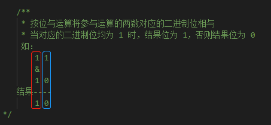
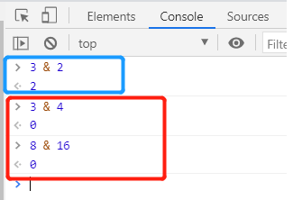
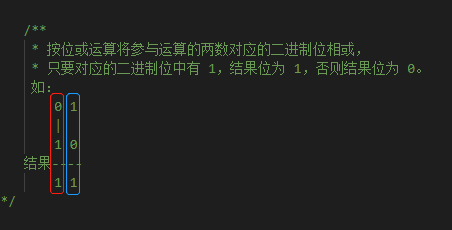
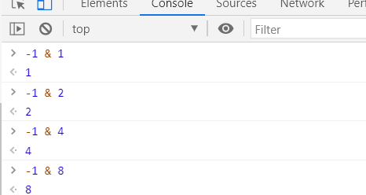
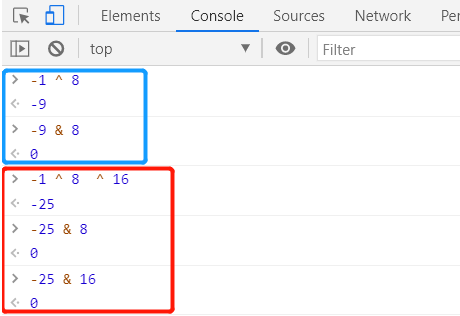
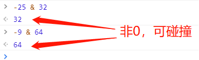

## 2D物理的碰撞分组详解

> Author：charley           Date：2020-12-08

2D游戏的开发时，对于双方碰撞接触后发生反馈的业务逻辑，采用物理碰撞，会让开发变的比较简单。因为引擎提供了碰撞生命周期的方法。

| 碰撞相关的生命周期方法 | 使用说明                                                     |
| ---------------------- | ------------------------------------------------------------ |
| onTriggerEnter         | 发生物理碰撞时，也就是碰撞生命周期内的第一次进入碰撞，自动执行的生命周期虚方法。 |
| onTriggerEnter         | 发生持续的物理碰撞时，也就是碰撞生命周期内的第二次碰撞到碰撞离开前，自动执行的生命周期虚方法。 |
| onTriggerExit          | 物理碰撞结束时，自动执行的生命周期虚方法。                   |

> 以上的方法是发生在每一次碰撞发生的完整生命周期内，例如，从进入到离开为“Enter,Stay,Stay,……,Exit”

我们为游戏的显示节点添加了刚体、碰撞体。只要碰撞条件成立，那就会自动执行相应的碰撞生命周期方法。

然而，在面对复杂的碰撞需求时，有一些开发者不是太理解如何处理碰撞关系，所以本文将详细来介绍一下碰撞分组的几个刚体属性。

### 基础分组 `group`

通过刚体的group属性，可以为物理碰撞指定分组。

这个分组的优先级也是最高的，其规则为：

- 如果两个对象的刚体group相等，并且group值大于零，它们将始终会发生碰撞。
- 如果两个对象的刚体group相等，并且group值小于零，它们将永远不会发生碰撞。

例如，飞机大战游戏，目标只有消灭敌机，把子弹和敌机的刚体group全都设置大于零的正整数值，那么只要碰到了，就可以通过生命周期方法（通常用onTriggerEnter）执行击中的游戏逻辑了。

如果，增加联机需求，永远不能击中友方战机，那子弹和友方战机都设置为小于零的负整数值即可。

但是，子弹的刚体group改为负数后，那按上面介绍的规则，也不能与敌机发生碰撞了。

所以，要想解决复杂的碰撞应用场景，记住group的第三个规则：

- 如果两个对象的刚体group值等于0或者group值不相等，则使用刚体的碰撞类别category和碰撞掩码mask来判断是否碰撞。

第三个规则，应用的场景非常丰富，但对于新手，也理解起来有些难度。下面将详细介绍。

### 碰撞类别  `category ` 与 碰撞掩码 `mask`

category与mask，只有在两个碰撞对象的刚体group值等于0或者group值不相等的时候，才会生效。

category是用于区分不同碰撞组的类别，mask是用于识别可以与哪个碰撞组发生碰撞关系的掩码。

那category与mask如何识别是否碰撞的呢?

是通过二进制位运算，来进行识别的。

mask值和category值，`按位与`的计算结果非0，就可以碰撞；为0，就不可以碰撞。

例如，mask设置为3（2进制是11），category设置为2（2进制是10），

进行二进制的`按位与`运算，如下图所示：

   

通过上图的示意说明，我们可以看到，10是11与10的二进制位运算结果，而10的十进制对应的值是2，不为0，所以，当mask值为3，category值为2的时候，就可以发生碰撞。

举一反三，如下图所示，为0的时候，就不可以碰撞。

 

category与mask的碰撞处理原理，到这里大家就明白了，

但category与mask的值到底如何设置，并不利用记忆，尤其是面对多个碰撞组的时候，我们又将如何去快捷的设置category与mask的值呢？

大家可以这样去理解记忆，我们将category的值，只设置为2的幂。从0次方开始，一直到2的31次方，也就是1到2147483648。可以设置32种不同的碰撞类别。

而mask值则是category`按位或`得来的值。例如（1|2）的`按位或`值为3，如下图所示：

  

通过上图的示意说明，我们可以看到，由于1的二进制为1，2的二进制是10，所1补位为01，对应起来按位或运算得到的值是11，二进制11的十进制为3。

举一反三，（8|32|128）的`按位或`值为168，（8|16|4）的`按位或`值为28，如下图所示：

 

> 为了便于记忆，mask值可以理解为要碰撞的类别`category`十进制数值的总和。
>
> 但要理解，实质是二进制位运算。

除了通过`按位或`得到mask的值，用于指定想要碰撞的组。我们还可以通过`异或`运算去排除不想碰撞的组。

首先，我们需要了解，-1与任何2的幂次方值`按位与`运算，都是幂值本身，是**非0**的，**可以碰撞**的。也就是说-1可以与所有组（2的幂次方值）进行碰撞。

 

那么我们用-1去`异或`运算任何2的幂次方值，得到的结果再与该幂次方值进行`按位与`运算，一定是**为0**，也就是**不可以碰撞**的。验证测试的过程，如下图所示。

 

> 转换为二进制的异或运算过程就不截图了，过程与之前按位与和按位或一样，只是异或运算的规则为：参与运算的两个数，对应位为“异”（值不同），则该位结果为1，否则为 0。

通过上图的验证流程，我们可以看到，通过-1去异或运算我们想排除的组，那该结果值就可以指定，不想去碰撞的组。除了这些指定的组（例如上图的8和16组），其它组都是可碰撞的，如下图所示。

 

> 为了便于直观计算，mask值可以理解为不想碰撞的类别category十进制数值求和+1，再取负。但要理解，实质是二进制的异或位运算。

理解完以上这些，再回顾之前举的栗子，就会觉得处理碰撞关系变的简单了。

## 本文赞赏

如果您觉得本文对您有帮助，欢迎扫码赞赏作者，您的激励是我们写出更多优质文档的动力。

