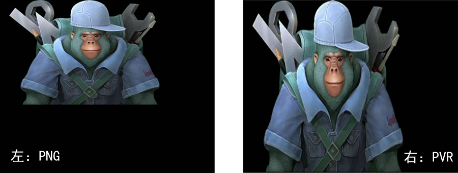
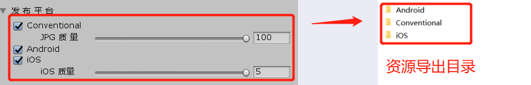
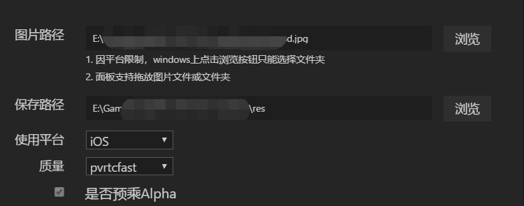
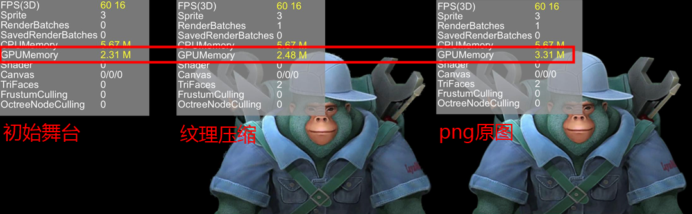
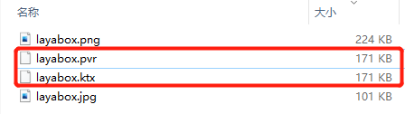

## 纹理压缩功能介绍与使用说明

> *Author：charley    Update：2020-09-29*  

### 一、初识纹理压缩

纹理是指物体表面的纹路样式和细腻程度等外观效果。在计算机图形学中，常用于描述三维模型表面图案的二维图形。

我们日常见到和使用的图片格式，主要为PNG和JPG，虽然在三维和二维的某些情况下，也会把这些图片称为纹理，但他们并不是纹理格式，不能被GPU直接读取并显示。因此，这些图片文件要先经过CPU解码成纹理格式，再传送到GPU进行使用。

而纹理格式，自然就是可以被GPU直接读取并显示的格式。所以，一方面，避免CPU解码可以减少运算带来的性能压力。另一方面，就是直接读取并渲染，也可以避免图像解压到内存的占用开销。

那纹理格式有哪些？在移动端，Android平台的主流纹理格式是ETC（Ericsson Texture Compression），iOS平台的主流纹理格式是PVRTC（PowerVR Texture Compression）。

需要特别说明的是，ETC1是不支持透明通道的，PVRTC是支持透明通道的，尽管在ETC2的时候，补全了ETC1不支持的透明通道，但是ETC2需要在OpenGL ES 3.0（对应webGL 2.0 ）的环境下，而当前尚未全面普及，所以LayaAir引擎及工具也只支持了ETC1的纹理压缩。未来，当小游戏平台大多数都支持webGL 2.0后，我们也会跟进支持ETC2。 

###  二、使用纹理压缩功能要注意的几个问题

尽管前文中描述了纹理压缩的好处，但我们如果不能充分的认知，做好准备。未必可以达到想要的效果。

#### 2.1、纹理压缩的源图宽高规范

由于不同系统平台对纹理格式的宽高像素要求不同，所以纹理压缩的源图（PNG\JPG）也要按规范做出对应的设计，否则就可能会导致拉伸变形。

这里，我们先看一下错误的示例。

图1 左侧是一张宽高为`512*313`的PNG图像，右侧是通过LayaAir引擎提供的纹理压缩工具导出的PVRTC格式图像。

 

（图1）

很明显，在运行后，纹理压缩后的图像被拉伸了。这就是由于iOS系统下，纹理压缩格式必须宽高相等且为2的幂次方。即便Android系统不需要纹理宽高相等，但宽高也必须是2的幂次方，否则工具也会自动强行拉伸。所以，美术在设计之初，就要沟通确认好哪些需要进行纹理压缩，然后将需要纹理压缩的源图按平台规范进行调整。

#### 2.2、LayaAirIDE与LayaAir Unity插件的差异

LayaAirIDE中的纹理压缩工具是面向2D纹理，LayaAir Unity插件中的纹理压缩工具是面向3D纹理。所以在进行工具使用的时候，还有所区别。下面分别进行介绍。

##### 2.2.1  LayaAir Unity插件纹理压缩功能

在LayaAir Unity插件，资源发布平台的选项中，每一个选项在导出后，会对应一个独立的完整目录，如图2所示。每一个目录内都有着完整的导出资源，只是纹理资源与相关路径信息的差异。

 

（图2) 

#### `Conventlonal`

图2中的Conventlonal这个选项是常规的导出方式，导出对应的目录内不会有任何纹理压缩的文件格式，原来的是JPG还是JPG，是PNG仍是PNG。用于发布web版和PC浏览器上调试效果。

JPG质量的参数设置是指在导出JPG格式图时的压缩比，100为最高。如果原图已经处理好，不想再改变质量，那就设置100。由于PNG是无损格式，所以这里没有PNG的质量设置项。

#### `Android`

Android选项是针对Android平台的纹理压缩，只要是JPG图和不带透明通道的PNG图，都会被转换为`.ktx`后缀的ETC1纹理。有透明通道的PNG图，则会直接导出PNG原图，不进行纹理压缩格式转换。

#### `iOS`

iOS选项是针对iOS平台的纹理压缩，无论是JPG还是PNG，都会被转换为`.pvr`后缀的PVRTC纹理。

有一些开发者不太理解iOS质量的用处和效果。这里一共5档，数值分别是1-5。数字越高，画面质量越高，数字低则压缩的画面损失越大。除了画面质量的影响，这个质量的数字还会影响纹理压缩转换的时长，  数字越高则纹理压缩转换的时间越长。

但是需要注意的是，不管画面质量选哪一档，显存占用都是一样的。这个质量数值只是影响显示效果与转换时长。所以，如果开发阶段可以采用低一些的数字，正式上线前建议选择空闲时间用高质量数值来导出。

#### 请注意

最后还要讲一点大家要注意的问题。在LayaAir Unity插件的纹理压缩功能里，无论是Android还是iOS选项，只要达到了转换条件，就会全部进行转换导出，比如某个纹理不能设计为2的幂次方，但是如果不处理，也会被转换导出，还会被拉伸。所以，对于不想被转换导出的纹理，其模型在场景中就不要被激活，这样就不会在场景（Scene3D）导出的时候被转换导出了。这种纹理需要采用预设（Sprite3D）分别导出，单独加载使用。

#### 2.2.2 LayaAirIDE纹理压缩功能

LayaAirIDE中依次点击 菜单 ->> 工具 ->> 纹理图片转换，可以打开图3所示界面。

 

（图3）

由于LayaAirIDE中的纹理压缩功能是针对2D的，所以直接拖拽纹理单图，或者点击浏览，选中某个需要转换的目录，再选择要转换的平台，点击确定，就可开始转换。

#### `使用平台`

与 LayaAir Unity插件所不同的是，当选择Android平台，只会转换JPG图片，PNG图片哪怕是没有透明通道的，当前工具也不会进行转换。

选择iOS平台，与插件中的功能一样，目录内的JPG和PNG都会进行转换。

#### `质量`

质量选项，Android不需要，所以是置灰不可选状态。

iOS分别是`pvrtcfastest\pvrtcfast\pvrtcnormal\pvrtchigh\pvrtcbest`，这和 LayaAir Unity插件中的1-5质量是一样的，也是质量与转换时间关联，pvrtcbest质量最高，需要的纹理压缩转换时间也最高（要时间充足的时候使用，否则会考验你的耐心）。显存占用都是一样。

#### 请注意：

##### 2D图集的问题

对于2D的图集，由于我们不太建议进行纹理压缩格式的转换，所以当前的版本并没有做好图集转换纹理兼容。但考虑到最近有开发者反馈，有图集的转换需求，所以我们决定从2.8.0正式版进行支持。如果是使用的是旧版的开发者，可以联系QQ群管理员或官网商务联系人，要一下该功能的升级补丁。

尽管引擎与工具决定对图集的纹理转换进行支持，但仍然要了解以下问题：

1、纹理压缩是有损压缩，如果对UI质量要求比较高的，建议静态2D UI不转换纹理压缩格式。2D的纹理压缩图常用于动态图，例如动画，或者3D纹理。

2、即便能接受转换后的质量损失，也只能是iOS平台可用，当前的ETC1纹理压缩格式，在Android不支持带透明通道的图集。

3、图集默认是不按幂次方生成，iOS平台不仅宽高需要幂次方还要是宽高相等的正方形幂次方。而图集工具勾选`限定2的幂次方`生成的图集也不能保障肯定是正方形，这个要注意一下。

##### 透明通道的Bug

由于纹理压缩文件在3D里不需要预乘Alpha，2D纹理转换工具遗漏了该参数，导致2D有透明通道的纹理，在iOS丢失了透明通道。所以在2.8.0正式版之前的版本，也需要联系QQ群管理员或官网商务联系人，要一下该功能的升级补丁。

### 三、优化效果到底怎么样

由于纹理压缩格式不需要CPU解码，那因解码而产生的瞬间性能压力就没有了，不过如果不是特别多的处理，这个过程并不是持续的，所以并不明显。

比较显著的优化还是在显存上。我们仍然举个例子来说明。

还是之前IDE里自带的那张图，我们将宽高改成`512*512`后，

当舞台上什么显示也没有的时候，初始显存占用是2.31M，使用纹理压缩格式，只增加170K，加上初始大小最终为2.48M。而原图则增加1024K，达到3.31M。如图4所示。所以显存优化效果还是非常明显的，减少约83%。

 

（图4）

有一些开发者，还不太理解显存的占用与文件的关系。我这里告诉大家一个简单的计算依据。如果是非纹理压缩的图片，比如PNG和JPG，你直接用图片像素的`宽*高*4`就是显存的占用。

所以有一些游戏，为了减少显存的占用，把图片的宽高像素做小，然后用缩放的方式，再显示放大。不过这种方式，虽然显存占用小了，但是质量的损失也大了。纹理压缩虽然也是有损压缩，但同样质量的情况下，显存占用更小，甚至和原图质量差不多的情况下，也比拉伸的方式内存占用小。所以纹理压缩是开发者比较常用的一种节省显存的方案。

那纹理压缩的显存占用，怎么计算呢，除了统计面板上的信息外，也有一种比较简单的统计方案。你直接查看纹理压缩文件的大小就好了，比如纹理压缩文件是170k，那显存占用也是170k。例如图5所示。

 

### 四、纹理压缩的使用示例

纹理压缩，除了在使用的时候，要区分资源，3D纹理、2D纹理、2D图集的使用，有些开发者不太会用，这里分别进行示例说明。

> 本篇示例代码采用TS语言，使用其它语言的需自行转换语法

#### 1、3D纹理的使用

3D的png或者jpg格式纹理加载，是使用的`Laya.Texture2D.load()`来加载纹理资源，如果要使用纹理压缩格式，则需要使用`Laya.loader.load()`来加载纹理资源。

示例代码如下所示：

```typescript
//检测安卓平台
if (Laya.Browser.onAndroid) {
    	//注意这里的加载
        Laya.loader.load("res/layabox.ktx", Laya.Handler.create(null, function (tex: Laya.Texture2D) {
                material.albedoTexture = tex;
        }));

} else {
    	//注意这里的加载
   		Laya.Texture2D.load("res/layabox.jpg", Laya.Handler.create(null, function (tex: Laya.Texture2D) {
                material.albedoTexture = tex;
        }));
}
```

另外，对于需要透明通道的iOS平台，还需要对材质设置透明混合`RENDERMODE_TRANSPARENT`。

示例代码如下所示：

```typescript
//检测iOS平台
if(Laya.Browser.onIOS){
	Laya.loader.load("res/layabox.pvr", Laya.Handler.create(null, function(tex:Laya.Texture2D) {
		material.albedoTexture = tex;
        //设置透明混合
        material.renderMode = Laya.BlinnPhongMaterial.RENDERMODE_TRANSPARENT;
	}));
} else if (Laya.Browser.onAndroid) {//检测安卓平台    	
        Laya.loader.load("res/layabox.ktx", Laya.Handler.create(null, function (tex: Laya.Texture2D) {
                material.albedoTexture = tex;
        }));
}else{
    Laya.Texture2D.load("res/layabox.png", Laya.Handler.create(null, function(tex:Laya.Texture2D) {
   	 material.albedoTexture = tex;
    }));
}
```

#### 2、2D纹理的使用

对于2D纹理，需要先预加载纹理文件，然后就可以直接使用。

示例代码如下所示：

```typescript
let textureFile: string = "";

if (Laya.Browser.onIOS) {
	textureFile = "res/layabox.pvr";
} else if (Laya.Browser.onAndroid) {
	textureFile = "res/layabox.ktx";
} else {
	textureFile = "res/layabox.png";
}
//预加载纹理文件
Laya.loader.load([textureFile], Laya.Handler.create(this, () => {
	this.aaa.skin = textureFile;
}));
```

#### 3、2D图集的使用

对于2D图集，预加载图集atlas文件即可，由于进行纹理压缩转换的时候，会自动在图集atlas中添加纹理压缩文件信息，所以引擎在加载图集的时候，会检测是否包含了纹理压缩转换的信息，如果包含，会自动识别平台并加载对应的纹理压缩格式文件，不需要开发者在代码里判断平台。

> 需要注意的是，图集转换后的pvr纹理压缩文件，要与图集atlas保持同级目录中

示例代码如下所示：

```typescript
Laya.loader.load(["res/atlas/comp.atlas"], Laya.Handler.create(this, () => {
	this.aaa.skin = "comp/image.png";
}));
```

通过示例代码，我们可以看到，图集的纹理压缩的代码使用是无感的，和普通的图集使用方式完全相同。


## 本文赞赏

如果您觉得本文对您有帮助，欢迎扫码赞赏作者，您的激励是我们写出更多优质文档的动力。


