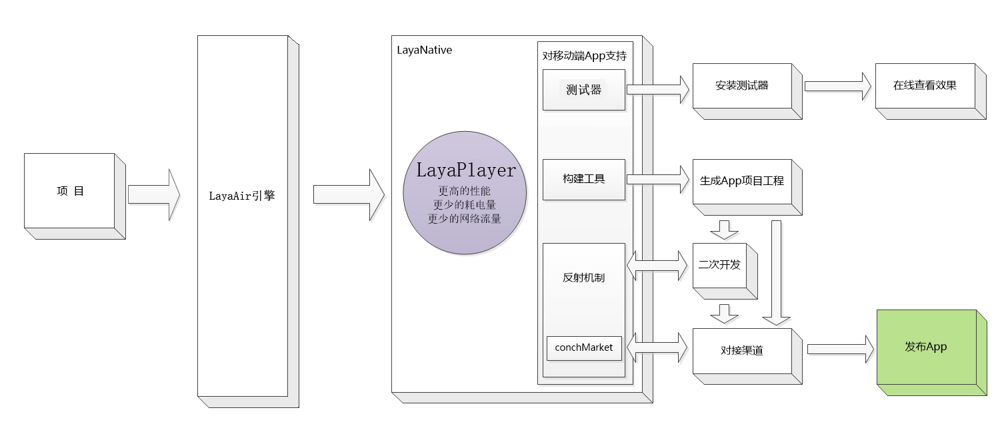

# LayaNative2.0

LayaNative2.0对开发者而言，最大的改进就是全面支持LayaAir3D，为开发者发布3D-App版本提供便利。另外，LayaNative2.0推翻了LayaBox延续5代的Native解决方案，目的是更快、更开放、更简单以及更好的支持3D为设计目标。LayaNative2.0采用WebGL+的专利技术设计理念，更先进、更开放，如同WebGL协议，只定函数不定规则，是一种小巧而且扩展性强的解决方案。下面从引擎结构、性能、功能、易用性四个层面做一下简单介绍。

## 一、引擎架构
开发者用LayaAir引擎开发的项目，既可以发布到浏览器中，也可以发布成原生的App，下图为引擎的结构图以及开发者开发流程图。

## 二、性能

LayaNative2.0经过代码重构，性能对比1.0版本有很大的提高。
1、对比LayaNative1.0

|       |2D   |3D     |
|:-----:|:----:|:-----:|
|Android|提高10%|提高90% |
|IOS    |提高13%|提高270%|

2、对比国内其他通用runtime引擎

|       |2D    |3D       |
|:-----:|:-----:|:--------:|
|Android|提高85%|提高90%  |
|IOS    |提高240%|提高270%|

## 三、扩展功能

1、LayaNative 2.0支持单线程和双线程两种模式，开发者根据自己项目的实际测试结果，决定选择使用哪种模式。

* 单线程模式：JS和Render运行在一个线程中。
    * 优点：操作无延迟（例如：touch、按键）。
    * 缺点：性能不如双线程模式。
* 双线程模式：JS和Render运行在各自的线程中。
    * 优点：性能比单线程版本高。
    * 缺点：操作会有半帧，最大到一帧的延迟（例如：touch、按键）。

2、支持显卡纹理压缩，不仅提高渲染效率还能减少显存的占用。

3、优化的二次开发，更容易理解，方便开发者使用，详见文档：
https://github.com/layabox/layaair-doc/tree/master/LayaAir2.0/Chinese/LayaNative/Secondary_Development  

## 四、易用性

### 1. 提供更方便的调试功能

1) Android平台可以真机调试JavaScript

在LayaNative1.0版本中，要调试项目中的JavaScript代码只能调用console.log或者alert函数。在layaNative2.0版本中正式支持使用Chrome浏览器调试JavaScript代码。可以在Chrome的调试器里对代码进行断点的添加，代码追踪等功能。

详见文档：
https://github.com/layabox/layaair-doc/tree/master/LayaAir2.0/Chinese/LayaNative/real_device_debugging  

2) 测试App支持扫码启动项目

为了让开发者能够更快的调试开发，新版本的测试App添加了扫码启动App的功能，免去了调试时需要手工输入URL的麻烦。

详见文档：
https://github.com/layabox/layaair-doc/tree/master/LayaAir2.0/Chinese/LayaNative/How_To_Use_Runtime  

### 2. 可以定制内容更加丰富的启动界面

LayaNative 2.0的loadingview是采用平台原生语言开发的，Android使用Java语言，IOS使用Objective-C语言。相较于1.0使用JavaScript语言开发的LoadingView，2.0提供了更加丰富的定制功能。不仅能够更换图片，开发者还可以使用平台语言实现自己想要的功能。

详见文档：
https://github.com/layabox/layaair-doc/tree/master/LayaAir2.0/Chinese/LayaNative/loading_view_new