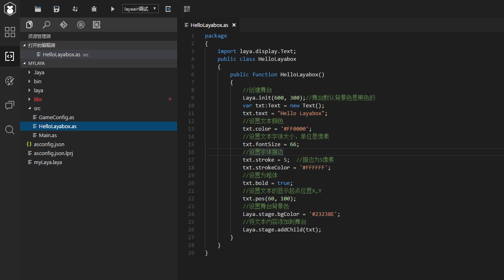
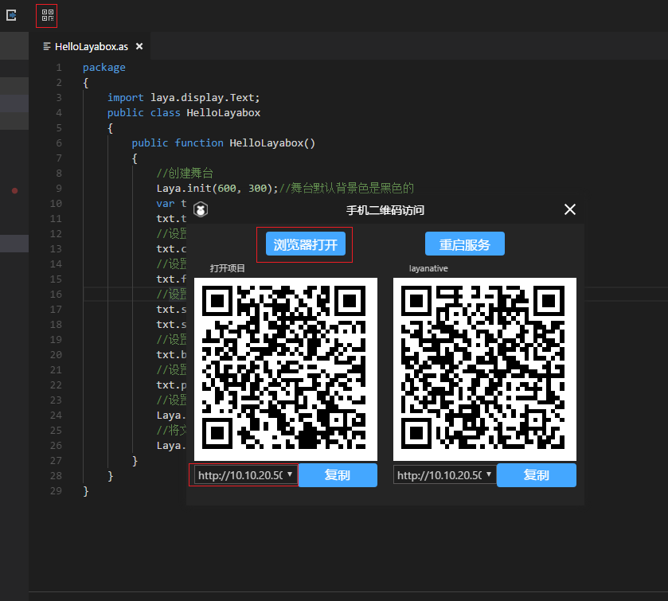

#  使用LayaNative运行LayaAir项目

相信当你看这篇文档的时候，你已经熟练掌握了LayaAir或对LayaAir有一定的了解，在LayaAir的文档中详细介绍过如何使用LayaIDE创建第一个程序“Hello LayaBox”。

<!-- TODO:更换链接地址 **Tips：输入项目地址后，如果发现屏幕上没有显示任何画面，有可能是因为项目没有正确设置横竖屏，请参考文档：https://github.com/layabox/layaair-doc/tree/master/Chinese/LayaNative/screen_orientation** -->

步骤一：目前我已经创建好了一个Hello LayaBox的简单项目，如图1所示：  

 
运行效果如图2所示：

 
图2

步骤二：点击LayaIDE右上角“二维码”菜单键，会显示二维码界面，界面左侧二维码下方显示一个http地址，实例中的地址为`http://10.10.20.50:8900/bin/h5/index.html`,如图3所示：

 
图3

步骤三：点击二维码界面中的，“浏览器打开”按钮，则会在浏览器中以`http://10.10.20.50:8900/bin/h5/index.html`方式打开，打开后画面如图4所示：  

 
图4

步骤四：打开已经安装到手机上的LayaBox测试App，打开后如图5所示：

 
图5

步骤五：点击App上面的蓝色二维码图标，扫描步骤二中右侧layaNative的二维码。

 
图6

 
图7

步骤六：扫码成功后，测试App会加载并运行Hello LayaBox的项目实例，如图7所示：

 
图8