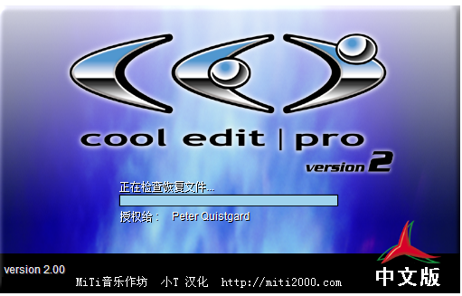

# 关于声音

在LayaNative中，声音分为背景音乐、音效两种模式。

## 1.背景音乐

在LayaNative中背景音乐只支持mp3格式，同时只能播放一个背景音乐。

## 2.音效

在项目中，音效都是高频发事件，为了确保运行效率，LayaNative使用openAL播放音效，因为mp3为流媒体格式，目前还无法解析。  
**Tips：**  
**1、LayaNative中的音效只支持wav和ogg格式。**  
**2、wav和ogg只支持8位和16位，尚不支持32位。**

**Tips:** wav和ogg建议使用22050采样率、16bit、单声道。

## 3.提示信息

如果调用`SoundManager.playSound()`，但是传入的文件格式是mp3，则会弹出提示信息，提示信息如下：  
`The sound only supports wav or ogg format,for optimal performance reason,please refer to the official website document.`  
这个时候需要把mp3转换成wav或者ogg格式。


## 4.解决兼容性

如果你的项目在网页版本中音效使用mp3格式，但是LayaNative中又使用wav格式。建议项目使用配置文件的方式进行加载，这样只用在加载配置文件的地方，增加一次判断是否为LayaNative运行环境的，伪代码如下所示：  

```javascript
if(window.conch)
{
    ...加载 "soundConfig-LayaPlayer.json"
}
else
{
    ...加载 "soundConfig-json"
}
SoundManager.playSound(soundJson[0].url,1);
....
SoundManager.playSound(soundJson[1].url,1);
```

**Tips**  
*1、conch只能LayaNative环境下调用，在网页版本中是没有conch定义的，所以需要判断一下是否存在。*  
*2、如果使用as语言开发的时候，可以通过 `Browser.window['conch'] `这种方式获得conch对象。*
*3、或者使用`if(Render.isConchApp )`进行判断都可以。*

## 5.使用Cool Edit Pro工具进行声音格式转换
现在有很多可以对MP3转换wav的工具，这里给大家简单介绍一款Cool Edit Pro工具，下面简单介绍下该工具在进行mp3转换wav的具体操作步骤：
1、首先自行下载并先安装好Cool Edit Pro工具，然后打开Cool Edit Pro程序；



2、点击左上角“文件”下的“批量转换”，进入“批量转换”子菜单  


**注意：建议按照批量文件转换下面的1、2、3、4步骤一步一步来进行操作**

3、选择文件来源：点击右侧增加文件。这里我们选择sound文件下的所有文件进行批处理，之后点击打开；  


4、转换采样类型：在重采样目录下点击改变目标格式，在这里选择我们所需要的采样率22050Hz、单声道、16位bit，然后点击确定；  


5、选择新的格式：输出格式选择我们需要的Windows PCM（*.wav），格式类型22050Hz，16位，单声道；


8、选择目标文件夹及文件名：这里就是简单的选择下输出目录就好了，然后点击“运行批处理”进行输出所要的文件，当出现“文件批量转换完成”提示，表示你已成功完成MP3转换wav的批量转换  


9、若在运行Cool Edit Pro工具进行批处理时出现下面的弹窗，只需要重新替换下Resample.xfm文件，再重新运行一下Cool Edit Pro就好了。


**出现这种情况，可以百度搜索一下 cool edit resample.xfm，或者购买正版cool edit，或者。。。(你懂的)**

**10、若网上下载的cool edit pro没有批量转换的话，可以先转一个就有批量转换了**
