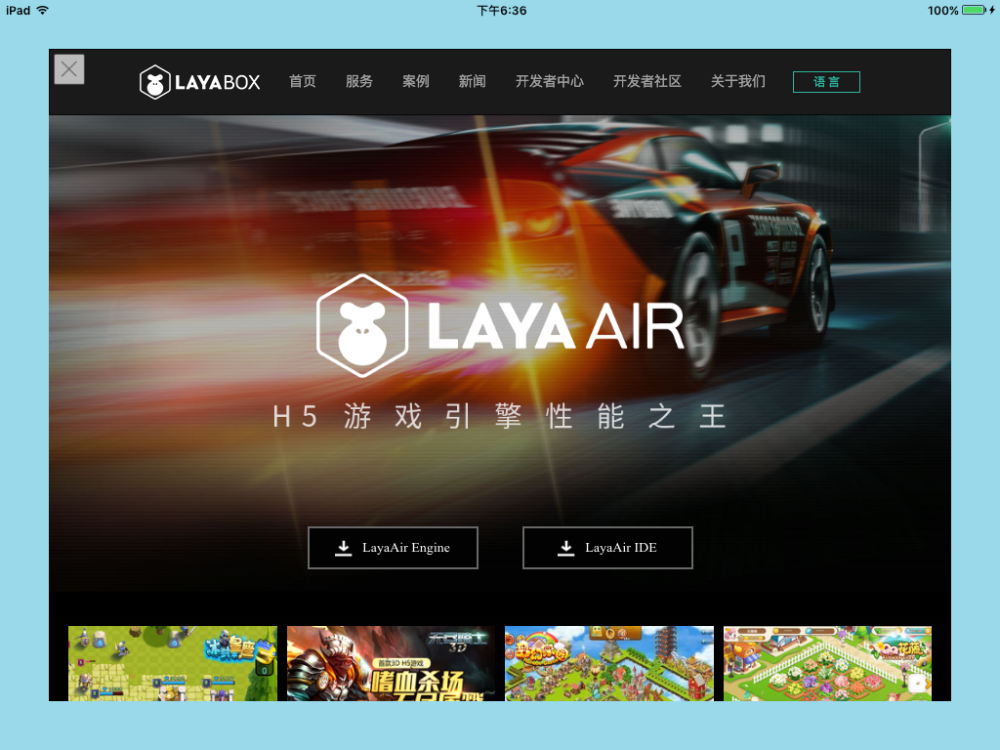

# webview

## 一、介绍

由于LayaNative不支持标准的html，有时候项目需要显示一个完整的html页面，这时候可以通过LayaNative提供的一个显示webview界面的接口来实现。  
### 1. 接口定义  

```typescript
    /**
     * 显示一个webview
     * @param url {string} 要显示的url地址。
     * @param posx {number} weview的左上角位置
     * @param posy {number} webivew的左上角位置
     * @param width {number} webview的宽度
     * @param height {number} webview的高度
     * @param canclose {boolean} webview是否可以被关掉。
     */ 
    setExternalLinkEx(url:string,posx:number,posy:number,width:number,height:number,canclose:boolean):void;
```

这个函数会在画布的最上层显示一个新的view，在其中显示url的内容。

`canclose`参数用来控制这个webview是否能被关掉：  
* 设置为`false`时:

    代码如下：

    ```typescript
    document.addEventListener('touchstart',()=>{
        if(conch){
            var l = 50;
            var t = 50;
            var w = window.innerWidth - l * 2;
            var h = window.innerHeight - t * 2;
            conch.setExternalLinkEx('http://www.layabox.com',l,t,w,h,false); // canclose设置为false
            //conch.setExternalLink('http://www.baidu.com');
        }
    });
    ```

    webview显示出来后就无法关闭，效果如下：  

    

    图1

* 设置为`true`时: 

    代码如下：

    ```typescript
    document.addEventListener('touchstart',()=>{
        if(conch){
            var l = 50;
            var t = 50;
            var w = window.innerWidth - l * 2;
            var h = window.innerHeight - t * 2;
            conch.setExternalLinkEx('http://www.layabox.com',l,t,w,h,true); // canclose设置为true
            //conch.setExternalLink('http://www.baidu.com');
        }
    });
    ```


    * 在ios下，会有一个小关闭按钮，点击这个按钮，就可以关闭webview。 效果如下：

        

        图2

    * 因为关闭按钮会覆盖部分页面内容，且Android设备上提供了后退键，因此Android设备上webview显示后没有关闭按钮，可以通过**后退键**关闭webview。如下图：


        

        图3  此时可以点击后退键关闭webview

### 2. 限制
1. 目前webview无法与app进行交互。
2. webview的实现依赖于系统，低版本的android可能无法显示。

**Tips**  
*1、conch只能LayaNative环境下调用，在网页版本中是没有conch定义的，所以需要判断一下是否存在。*  
*2、如果使用as语言开发的时候，可以通过 `Browser.window['conch'] `这种方式获得conch对象。*


## 二、如何在代码中动态关闭webview页面

调用下面的代码可以动态的关闭webview页面：

```javascript
conch.closeExternalLink();
```