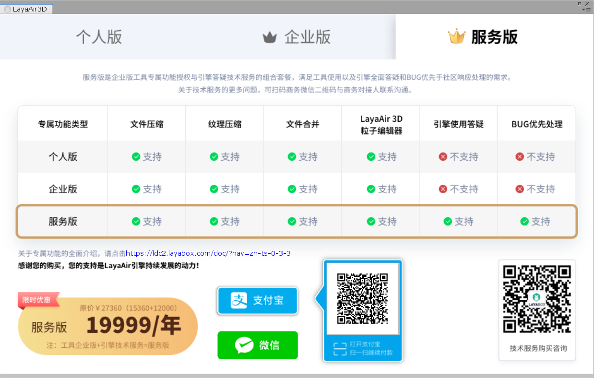
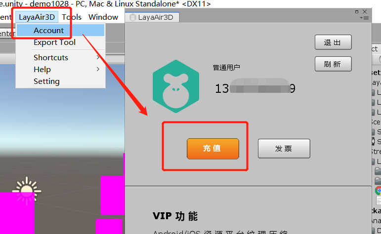
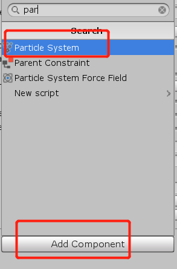
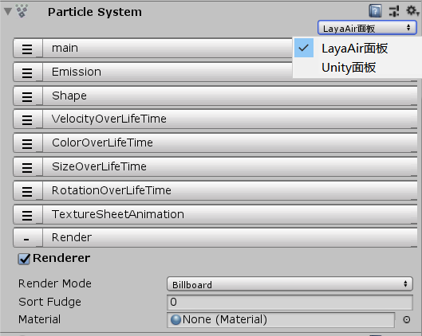

# LayaAir引擎工具会员专属功能与权益介绍

> *作者：charley    本文引擎与工具版本：LayaAir 2.9.0beta     本文更新时间 : 2020-11-02*

点击以下目录可直接跳转： 

[TOC]

## 一、LayaAir 2.0为什么要推会员专属权益

如果一个人想做好事，也一直在为此而努力。但是，如果他连赚钱养活自己的能力都没有，又如何去一直做善事呢？这一个很浅显的道理，相信大家都能理解。

LayaAir引擎从2016年正式推出以来，不仅2D在性能上有着非常不错的口碑，也有着大量过亿元收入的多平台产品案例，在H5与小游戏领域的3D市场上更是始终保持着90%以上的引擎占有率，成为3D引擎的首选。

然而，LayaAir引擎是一个开源引擎，免费的引擎，过去免费，未来也会免费，我们引擎团队并没有想过在引擎本身上收取开发者一分钱。我们希望打造一个行业中最好用的开源引擎，一个大家都觉得好用的免费引擎。但是，如果引擎团队没有任何收入，那不可能留住优秀的引擎研发人才，不可能去持续投入精力为整个游戏产业服务。

假如，引擎企业无法生存的时候，那对于绝大多数没有研发和维护引擎能力的游戏企业一定是个坏消息。

所以，我们必须要通过引擎周边的生态，找到引擎研发企业的价值，以及引擎可持续生存之道。当然，我们肯定要考虑到绝大多数企业的付费能力。让更多的开发者能用的起更好的服务。

所以，我们推出了工具会员增值功能，以及技术服务的业务，让大家选择使用。既便不采购这些服务，大家也可以免费使用引擎，但是成为了工具或者服务会员，一定会提升开发效率。

本文将全面介绍这些会员权益的功能与服务，以及如何购买和开票，还有如何使用和获得服务，建议大家认真阅读。


## 二、工具会员专属功能包括了哪些服务

工具会员主要是分成三个种类，个人版会员，企业版会员，服务版会员。

#### 2.1 服务时间

这三种会员的服务时间，全都是以年为单位，从购买日开始，360天后服务到期。

#### 2.2 功能权益的区别

| 权益名称                         | 个人版会员   | 企业版会员   | 服务版会员 |
| -------------------------------- | ------------ | ------------ | ---------- |
| 3D模型压缩（文件压缩）           | 支持         | 支持         | 支持       |
| 3D动画压缩（文件压缩）           | 支持         | 支持         | 支持       |
| 3D骨骼预烘焙压缩（文件压缩）     | 支持         | 支持         | 支持       |
| 纹理压缩（支持ETC1与PVRTC格式）  | 支持         | 支持         | 支持       |
| 文件合并（支持JSON与二进制格式） | 支持         | 支持         | 支持       |
| 插件中批量导出Unity 3D场景       | 支持         | 支持         | 支持       |
| LayaAir专属3D粒子编辑面板        | **`不支持`** | 支持         | 支持       |
| LayaAir引擎使用的日常答疑        | **`不支持`** | **`不支持`** | 支持       |
| LayaAir引擎BUG的优先处理         | **`不支持`** | **`不支持`** | 支持       |

#### 2.3 功能权益的简要说明

##### 2.3.1 文件压缩权益

文件压缩主要是包括3D模型文件的压缩、3D动画文件的压缩、3D骨骼预烘焙文件的压缩，三者功能的效果全都是是用于减少文件的大小尺寸，缩短加载的时长。在5G还没有普及的阶段，该功能还是比较有实际效果的。

在具体效果方面，如下表所示。

| 具体种类         | 作用                     | 大概效果  |
| ---------------- | ------------------------ | --------- |
| 3D模型压缩       | 降低模型文件尺寸         | 降低约60% |
| 3D动画压缩       | 降低3D动画文件尺寸       | 降低约40% |
| 3D骨骼预烘焙压缩 | 降低3D骨骼预烘焙文件尺寸 | 降低约50% |

##### 2.3.2 纹理压缩

##### 功能效果：

降低显存约75%，减少图片解码卡顿现象。

##### 功能简介：

在游戏中，不使用纹理压缩时，为了节省显存的占用。通常的做法是将原图按低分辨率的机型进行设计，然后在游戏中拉伸适配高分辨率的机型。这样就会导致游戏的马赛克现象（很多小游戏在安卓的某些高清分辨率机型上出现这种问题，一定是该问题导致），而纹理压缩的模式即使按高分辨率进行设计也占用较小的显存，所以在同等显存占用的情况下，在高分辨率的机型上，2D图片压缩效果和拉伸效果对比如图1所示。3D贴图在压缩后效果更好，压缩对于原图的损失在视觉效果上几乎可忽略不计。

 

（图1）

> 提醒：3D使用纹理压缩后，视觉上基本看不出来，所以推荐使用。但是2D 使用纹理压缩要慎重，静态图片（例如UI）尽量不要用纹理压缩功能，动态图片（2D角色动画等）则不会太明显，没有高清画质表现需求的可以使用。

游戏中常见的图片文件格式通常 是PNG和JPG等，这些图片需要先经过CPU解码，然后传送到GPU进行使用。而纹理压缩后的格式，是无需解码即可直接被GPU读取并显示的格式，所以，一方面是节省了大量的显存，另一方面也可以减少图片解码带来的CPU压力。

需要开发者注意的是。纹理压缩因为要依托于显卡的硬件加速，所以，只能是webGL模式可用。另外，就是不同平台（操作系统）的格式也有所不同。例如，我们在Android平台是`.ktx`后缀的ETC1格式，在iOS平台是`.pvr`后缀的PVRTC格式。

如果想对纹理压缩了解更多，以及具体的使用方法。可以打开链接：https://ldc2.layabox.com/doc/?nav=zh-ts-2-2-7   查看《纹理压缩功能介绍与使用说明》。

##### 2.3.3 文件合并（JSON + 二进制）

效果：可合并JSON类型和二进制类型的文本文件，大幅减少文件下载交互数量，提升游戏加载效率；

功能简介：

当游戏的小文件比较多时，会大量增加HTTP请求，使得加载变慢，而合并文件功能可以将Json类型的文件进行合并，这将减少文件的HTTP请求数，从而提高加载效率。当然，如果盲目合并，也会在打包后增加文件的一次性下载时长。所以，开发者要依据项目的实际情况来使用，尤其是在小文件多的时候再用。

> 提示：该功能只能在LayaAirIDE中使用

##### 2.3.4 批量导出3D场景

效果：可以提升场景导出的效率

功能简介：

2.9.0以前的LayaAir插件每次只能导出一个场景，2.9.0beta版开始支持批量导出场景，可以加快多场景的导出效率。需要提醒的是，批量导出的是Unity层级视图（Hierarchy）下的场景，如果需要导出，需要将场景添加到Hierarchy下。

> 提示：该功能只能在LayaAir的Unity导出插件中使用。

##### 2.3.5 LayaAir 3D粒子编辑面板

效果：大幅提升美术或者技美在使用3D粒子编辑器调粒子效果的开发效率。

功能简介：

用过LayaAir引擎Unity导出插件的都知道，LayaAir引擎虽然支持在Unity中编辑并导出，但是由于LayaAir引擎并非支持Unity中的所有属性，所以当不熟悉LayaAir引擎的导出规则时，可能会由于在Unity面板中使用了LayaAir引擎不支持导出的属性功能，从而使得运行效果与Unity中编辑的效果不一致。尤其是3D粒子这种由美术或者技术美术频繁调整的功能。很容易一不留神就使用了不支持的属性，导致要反复重调输出，影响开发效率。

2.9.0beta版开始，我们在插件中推出LayaAir自己的3D粒子编辑面板，选择使用LayaAir面板后，编辑面板中仅有LayaAir引擎支持的功能属性。美术在调整的时候再也会由于不小心或者不熟悉规则而出错了。

> 提示：该功能只能在LayaAir的Unity导出插件中，由LayaAir工具企业版或者服务版帐号会员使用。

##### 2.3.6 LayaAir引擎使用的日常答疑

LayaAir引擎是免费开源的，还提供了免费的官网文档、API、DEMO、视频以及开发者BUG反馈社区。但是如果仍然不能满足，可以采购LayaAir引擎的日常答疑技术服务。该服务可以提供引擎已有功能的使用答疑，帮助开发者快速定位问题，确认是否为引擎BUG，或者引擎某API如何使用等等。同时当发现引擎BUG后，会优先于社区进行处理。

不过需要说明的是，LayaAir工具会员的服务版所包含的技术服务是多人共享技术服务。每个帐号仅允许一个开发者进入服务群组享受技术服务。并且该群组是百人的共享服务群。

> 如果有30人共享群、12人共享群，或者企业一对一的更多技术服务需求，需要扫码商务对接人微信沟通。

 
（商务对接人微信二维码）

##### 2.3.7 LayaAir引擎BUG的优先处理

当开发者在社区反馈BUG后，我们的流程是对于有DMEO的帖子每天会有专人值守验证（无demo的帖子基本上没有专人会验证，这里顺便提醒一下，反馈BUG一定要上传可重现DEMO项目附件），当验证为BUG后，会提交到我们内部的BUG待修复列表，以及标注BUG影响的范围与影响的级别。我们会依据影响范围、级别、以及发现BUG的时间先后进行处理。

如果是采购了技术服务或者工具服务版的开发者，将会优先级提前。优先于社区反馈的等级，率先获得问题的维护版本。


## 三、工具会员的定价与购买方式及发票获得

### 3.1、VIP功能定价与登录授权

|                      | 个人版会员VIP     | 企业版会员VIP     | 服务版会员VIP              |
| -------------------- | ----------------- | ----------------- | -------------------------- |
| 价格                 | 1536元/360天      | 15360元/360天     | 19999元/360天              |
| 可同时登录的设备数量 | 1                 | 10                | 10                         |
| 最大可绑定设备数量   | 2                 | 20                | 20                         |
| 服务                 | QQ群号：739490368 | QQ群号：739490368 | 微信联系商务获得服务专属群 |



> 工具会员QQ群，仅提供工具会员购买咨询以及会员专属功能的使用答疑与沟通交流
>
> 技术服务相关，需扫码联系上文中的商务对接人微信二维码

### 3.2、购买方式

#### 3.2.1 官网页面中购买

链接地址为：[https://www.layabox.com/vip/](https://www.layabox.com/vip/)

步骤一：

选择购买的工具会员类型，然后点击网页购买那里的链接，

步骤二：

在购买页面中选择登录方式，帐号与社区中的帐号是共通的，但是一定要用`手机帐号登录`，输入手机号或用户名和密码，确认登录后，即可下单购买。

> 提示，会员购买必须要用手机帐号登录，一方面是由于微信帐号登录的，无法使用3D插件中的功能。二是当忘记帐号密码后，手机是找回帐号或者修改密码的唯一方式，如果遇到无法收到验证码的特别情况，可以联系上文中的商务对接人进行沟通
>

步骤三：

在下单界面，未点立即购买前，还可以切换选择购买的类型，以及支付的方式（微信还是支付宝），点击立即购买后，支付成功，即为购买成功。 

> 开发票可以在后台申请，个人年费是普通发票，企业年费可以申请专业增值税发票。发票相关在本文中也会有详细介绍。

步骤四：

购买成功后可以前往LayaAirIDE或者LayaAir的Unity插件中登录即可。如果是已登录的帐号没有及时更新状态，可以退出帐号，重新登录即可生效。

#### 3.2.2 LayaAirIDE中购买

步骤一：

下载最新版本的LayaAirIDE，点击右下角广告图或者右上角的个人中心（小人图标）按钮。登录后（也是社区中的帐号和密码），即可看到购买会员的按钮，如图2-1所示。直接点击该按钮即可进入购买界面。

 

（图2-1）

步骤二：

在充值页面里，选择好工具会员的类型，点击支付方式的按钮（支付宝或微信），会有对应的支付二维码，扫码支付即可成为VIP会员。购买成功后，退出帐号，重新登录即可生效。

#### 3.2.3 LayaAir的Unity导出插件中购买

步骤一：

检查是否是最新稳定版本的Unity3D插件，如果不是则建议更新。并且要检查引擎是否和插件版本号一至，否则旧版本引擎是无法识别新版插件，会导致部分功能不可用。

下载最新版本的Unity导出插件（[点击进入插件下载地址](https://ldc2.layabox.com/layadownload/?type=layaairide)），如下图3-1所示。


（图3-1） 

步骤二：

安装后，通过点击`LayaAir3D`菜单插件`Account`(帐号)中的`Recharge`(充值)按钮来进入工具会员购买界面。如图3-2所示。

 

（图3-2）

> 如果不知道怎么安装的，可以查看下面这个链接的文档：
>
> https://ldc2.layabox.com/doc/?nav=zh-ts-4-2-0

步骤三：

在工具会员购买界面内，选择好VIP会员的类型，点击支付方式的按钮（支付宝或微信），扫码支付后即可成为工具会员，购买成功后，退出帐号，重新登录即可生效。

 

（图3-3） 

### 3.3、开发票相关

#### 开发票的入口

登录并打开LayaAirIDE或者插件会员帐号的面板，点击发票按钮，

或者直接输入开发票网址：[https://developers.masteropen.layabox.com/dist/recharge_succ_list.html](https://developers.masteropen.layabox.com/dist/recharge_succ_list.html)

#### 选择开发票的记录

在开发票的后台里，选择已支付的消费记录，勾选后，点击下一步。如图4-1所示。


（图4-1）

#### 填写发票信息与快递收件信息

选好开票的消费记录并点击`下一步`后，会进入发票信息填写的页面，按图4-2中的选项和输入框填写真实无误的信息并`提交`即可（请自行核对信息的准确性，因提供信息错误而导致的发票开错，由填写方负责）。

  

（图4-2）

#### 开票周期提醒：

由于涉及到发票的税务周期性问题，

如果是每月20日之前提交开票申请的会在本月内（通常在提交申请一周左右）开具纸质发票并寄出。

如果是20日之后提交开票申请的需要在次月10日后（10日起一周左右）开具纸质发票并寄出。

以上周期，如遇节假日会顺延。

最后，如果有特别紧急的，可以联系商务对接人进行咨询。


## 四、VIP功能的使用方式

2D的VIP功能需要在LayaAirIDE里进行使用，3D的VIP功能，需要在LayaAir的Unity导出插件里用。我们先简单了解一下。

如图5-1所示。2D的VIP功能通过导航菜单的工具栏可以找到并使用。

  

（图5-1）

如图5-2所示，3D的VIP功能和普通的功能在一起的，可以直观的看到，只不过是需要登录验证VIP之后，才可以使用。


 （图5-2）
在VIP功能的使用方面，3D功能大多数比较容易理解，除了贴图纹理压缩需要注意之外，当前的模型压缩和动画文件压缩只是文件大小的改变，勾选功能后直接使用即可，不需要特别讲解如何使用，而2D的VIP功则需要有一些使用的注意事项。下面，我们就针对需要注意的一些功能进行详细一些的介绍。

### 4.1、纹理图片转换（纹理压缩）

打开LayaAirIDE的`纹理图片转换`功能界面， 

点击`浏览`选择要转换的图片所在文件夹（如果是单图，不想选文件夹，只能是拖拽到该功能面板中），

然而指定输出的目录和选择压缩后使用的平台（安卓或iOS）,如图6-1所示。

 

(图6-1)

正如上图6-1所示，我们支持JPG的纹理压缩，但带透明通道的PNG纹理压缩只能是iOS平台才可以。

对于2D图集，需要说明一下，我们只支持LayaAirIDE自己生成的atlas图集纹理压缩。第三方的图集，我们并不支持。

LayaAirIDE生成的图集，我们可以在图片路径那一栏，拖入.png后缀图片或.atlas图集文件，都可以被识别，然后压缩成功的。流程如图6-3所示。

 

（图6-3）

关于更多的2D与3D纹理压缩使用，我们有专门一篇文档《[纹理压缩功能介绍与使用说明](https://ldc2.layabox.com/doc/?nav=zh-ts-2-2-7)》大家可以通过链接，进入另一篇来查看：[https://ldc2.layabox.com/doc/?nav=zh-ts-2-2-7](https://ldc2.layabox.com/doc/?nav=zh-ts-2-2-7)

### 4.2、文件打包（JSON文件 + 二进制文件）

这个功能就是可以把多个零散的文件合并打包成为一个文件，支持json格式的文本文件合并和二进制文件合并，如图7所示。

 

（图7）

#### JSON格式文件合并的操作

打开`文本文件打包`VIP功能界面，如图7-1所示，点击色块区域，可以选择bin目录下的json格式文件进行合并（图集atlas、scene场景、预制体prefab等皆为json格式）。

 

（图7-1） 

合并规则可以设置多个，点击加`(+)`号在新的面板中可以新建一个合并规则，流程如图7-2所示。
  

（图7-2）

需要注意的是，图7-2中的文件名那个`.plf`是个伪后缀，最开始是真后缀，但是考虑到微信小游戏本地包并不识别.plf这个文件后缀，为了和二进制类型有所区别，大家记住这个类型（plf）就行了。最终生成的如图7-3所示，会是一个以.json为后缀的文件。

当所有的合并规则都设置好之后，点击确定。就可以看到图7-3的打包编译结果，点开`打开发布文件夹`按钮可以查看合并后的文件。

 

(图7-3) 

#### 二进制文件合并的操作

二进制文件合并和JSON格式文件合并的操作流程基本一样，无非就是json合并的是json格式文件，二进制合并的是二进制文件。另外就是json文件合并类型是plf，输出的是json后缀的文件。而二进制文件合并类型是plfb，输出的是.zip后缀的文件。所以，操作流程就不再详细讲了，通过两张图，大概描述一下使用流程与差异的地方。

 

(图7-4)注意类型是plfb

 

(图7-5)

一个文件合并规则对应一个zip文件，如3Dscene.plfb规则，生成的文件为3Dscene.zip文件。

这里提醒一下，这个zip后缀，并不是标准的zip格式，只是一个有着zip后缀的二进制文件，是为了应对微信小游戏不识别稀有后缀，所以只能在常用后缀里找了一个使用而已。大家不要尝试对合成输出后的zip文件进行解压，是无法解压成功的。

#### 合并后文件的使用

无论是图集也好，场景也好，合并前与合并后的用法没有什么不同，包括原来的图集或场景名的打开方式，都是和原来一样。唯一要注意的是，要使用合并前的图集或者场景，必须要保证合并后的文件要先加载完，所以，之前的加载使用逻辑要放到合并后的文件加载回调里。

JSON示例参照代码如下：

```typescript
//先加载plf类型的合并后文件Image.json
Laya.loader.load([{url: "res/Image.json", type: "plf"}], Handler.create(this, function():void {
	
    //在回调里，正常使用原来的图集
	Laya.loader.load("res/atlas/comp.atlas", Handler.create(this, function():void {
		var img:Texture = Laya.loader.getRes("comp/comp.png");
		var sp:Sprite = new Sprite();
		sp.graphics.drawTexture(img);
		Laya.stage.addChild(sp);
		}));
    
	Laya.loader.load("res/atlas/test.atlas", Handler.create(this, function():void {
		var img:Texture = Laya.loader.getRes("test/test.png");
		var sp:Sprite = new Sprite();
		sp.graphics.drawTexture(img);
		Laya.stage.addChild(sp);
		}));
}));
```

二进制示例参照代码如下：

```typescript
//先加载plfb类型的合并后二进制文件bone.zip
Laya.loader.load([{url: "res/bone/bone.zip", type: "plfb"}], Laya.Handler.create(this, function() {
            // 模板
            let template = new Laya.Templet();
            template.on(Laya.Event.COMPLETE, this, function() {
                let skeleton = template.buildArmature(0);
                Laya.stage.addChild(skeleton);
                skeleton.pos(300, 300);
                skeleton.scale(.5, .5);
                skeleton.play(0, true);
            });
            template.loadAni("res/bone/alien.sk");
        }));
```


一定要注意的就是，文本文件打包后加载的类型是plf（ `type: "plf"`）、二进制打包加载的类型是plfb（`type: "plfb"`）。

### 4.3 批量导出场景

在LayaAir3D的导出面板，其它设置里点击批量导出场景就可以导出多个Unity场景，但是只会导出Hierarchy面板下的场景，所以如果有多个场景要导出，一定要放到Hierarchy面板下。如下图所示。

 

### 4.4 LayaAir专属3D粒子编辑面板

LayaAir的粒子面板和普通的添加粒子系统的方式一样。如下图所示。

 

如果想切换到LayaAir专属的面板，直接在下图的面板右侧选取LayaAir面板，即可切换到LayaAir引擎专属的面板。如下图所示。

 

## 五、VIP功能问题沟通方式

最后，如果您是购买了个人版或者企业版的VIP专属功能授权的开发者，遇到了VIP专属功能的BUG或者使用疑问，欢迎到VIP功能沟通QQ群中交流。

QQ群号为：739490368

需要注意的是，引擎官方工作人员只在QQ群中解答VIP功能使用的相关问题、建议、BUG。

如果想获得引擎所有的问题答疑服务，需要购买会员专属功能的服务版。然后扫码添加下面的商务合作对接人，进行加群沟通。

 

（图）商务合作对接人 微信二维码

