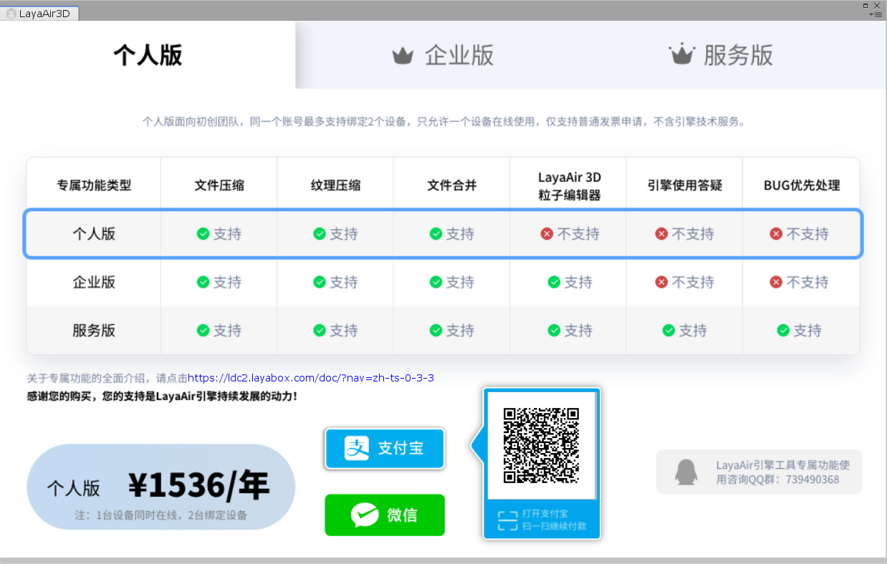
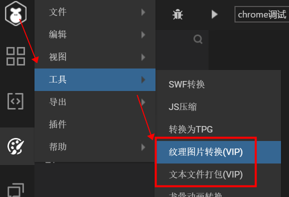
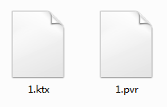
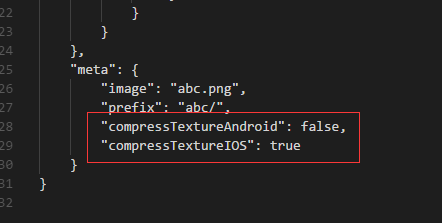
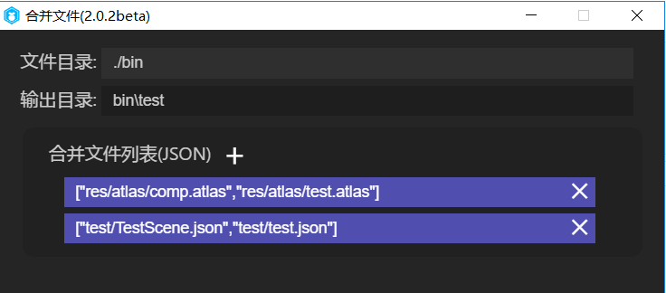
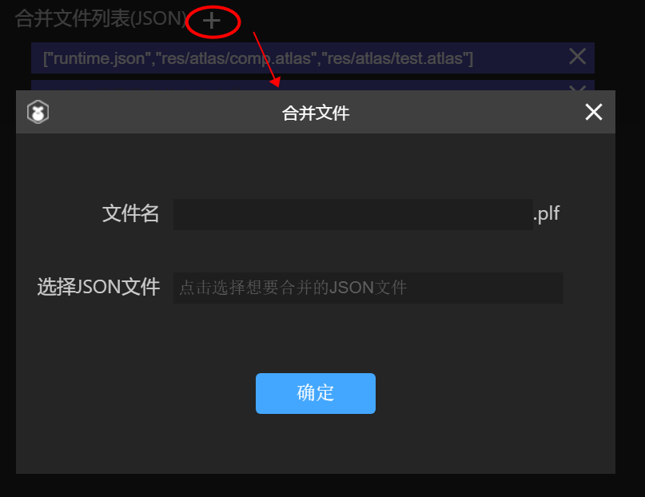
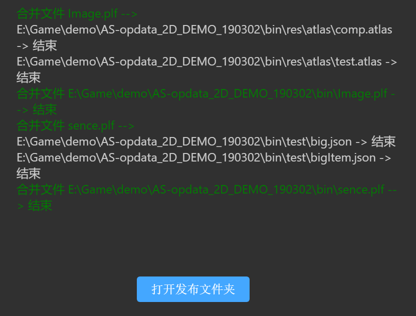
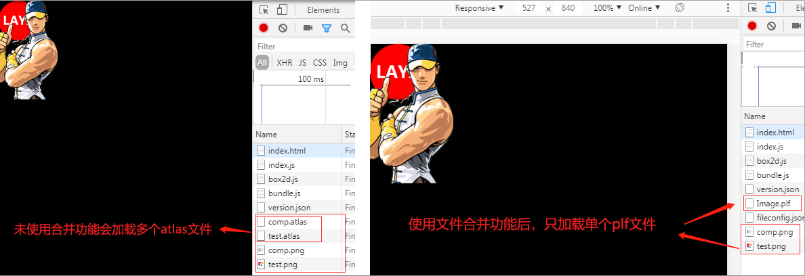

# LayaAir引擎VIP专属功能介绍

> 作者：charley    本文引擎与工具版本：LayaAir 2.0.1     本文更新时间 : 2019-03-15

点击以下目录可直接跳转： 

[TOC]

## 一、LayaAir 2.0为什么要推VIP专属功能

在LayaAir 1.0的时候，由于免费引擎没有盈利模式而导致引擎团队生存出现压力。为了减轻引擎团队的生存压力，只能对文档、社区等周边服务的人力投入进行收缩。然而这并非是引擎可持续发展之路，引擎全部业务如果永远免费只会让引擎陷入困境，假如引擎企业都无法生存的时候，那对于绝大多数没有研发和维护引擎能力的游戏企业一定是个坏消息。

所以在推出2.0之前，我们一直在思考一个平衡点，即要为开发者降低开发成本，免费使用引擎和低门槛高效率开发游戏，又找到让引擎可以生存的可持续发展之路。

因此，我们在LayaAir 2.0 引擎基础功能继续免费的前提下，在免费的2.0引擎和工具上继续加强引擎的高性能，强化引擎的易用性，不断完善引擎功能，尤其是3D引擎的成熟度。但同时也决定在引擎周边的几个增值服务上进行尝试收费，让引擎得已可持续发展。

当前的VIP专属功能收费是其中的一个尝试，VIP功能的收费比较低，哪怕是个人也能承受。而且不使用VIP功能也不会影响游戏的上线。当然，在使用后肯定会让游戏的效果更好或者得到优化。

最后，我们希望引擎周边的增值收费业务能得到开发者们的理解与支持，只有引擎企业解决了生存压力之后，才能更好的投入人力和精力到文档以及其它基础的免费服务上。让引擎可持续发展的生态更加繁荣。


## 二、VIP专属功能包括了哪些服务

既然是专属功能，那么VIP会员自然是拥有着非VIP开发者的没有的独特功能。功能目前提供为以下几个方面：

### 1、 3D模型文件压缩：

效果：降低模型文件尺寸约60%；

功能简介：3D游戏中模型是游戏体积的重要组成部分。所以减少模型文件的大小，会提升游戏的加载速度，在当前网速环境下，减少游戏体积还是比较重要的增值功能。

### 2、 纹理压缩（2D+3D）：

效果：降低显存约75%，减少图片解码卡顿现象。

在游戏中，不使用纹理压缩时，为了节省显存的占用。通常的做法是将原图按低分辨率的机型进行设计，然后在游戏中拉伸适配高分辨率的机型。这样就会导致游戏的马赛克现象（很多小游戏在安卓的某些高清分辨率机型上出现这种问题，一定是该问题导致），而纹理压缩的模式即使按高分辨率进行设计也占用较小的显存，所以在同等显存占用的情况下，在高分辨率的机型上，2D图片压缩效果和拉伸效果对比如图1所示。3D贴图在压缩后效果更好，压缩对于原图的损失在视觉效果上几乎可忽略不计。

 

（图1）

> 提醒：3D使用纹理压缩后，视觉上基本看不出来。但是2D 使用纹理压缩，静态图片（例如UI）尽量不要用纹理压缩功能，动态图片（2D角色动画等）则不会太明显，可以使用。

功能简介：

游戏中常见的图片文件格式通常 是PNG和JPG等，这些图片需要先经过CPU解码，然后传送到GPU进行使用。而纹理压缩后的格式，是无需解码即可直接被GPU读取并显示的格式，所以，一方面是节省了大量的显存，另一方面也可以减少图片解压带来的CPU压力。

需要开发者注意的是。纹理压缩因为要依托于显卡的硬件加速，所以，只能是webGL模式可用。另外，就是不同平台（操作系统）的格式也有所不同。例如，我们在Android平台是ktx格式，在iOS平台是pvr格式。

> 由于不同平台的格式不同，所以跨平台的游戏，使用纹理压缩在降低显存的同时，代价是增加了文件的大小，所以最终是要依据项目的情况来找到一个平衡点。

### 3、3D动画文件压缩：

效果：降低3D动画文件尺寸约40%；

功能简介：3D动画文件压缩与模型模型压缩一样，作用是减少文件的大小，提升游戏的加载速度。

### 4、JSON文件合并：

效果：可合并JSON类型的文本文件，大幅减少文件下载交互数量，提升游戏加载效率；

功能简介：

当游戏的小文件比较多时，会大量增加HTTP请求，使得加载变慢，而合并文件功能可以将Json类型的文件进行合并，这将减少文件的HTTP请求数，从而提高加载效率。当然，如果盲目合并，也会在打包后增加文件的一次性下载时长。所以，开发者要依据项目的实际情况来使用，尤其是在小文件多的时候再用。

### 5、其它：

未来将持续增加更多扩展模块（我们将持续收集会员急需功能，通过投票数量不断增加更多VIP模块）。

### 特别说明

#### 1、VIP功能不包括非VIP功能的技术服务

经常有一些开发者会提出这样的问题，购买VIP后，能不能帮我们解答一些引擎的问题。这里非常抱歉的回复大家，购买VIP提供的权益主要是专属功能本身，其次也提供VIP专属功能使用相关的答疑，比如VIP专属功能不会使用，或者使用过程中疑似BUG，以及对于VIP专属功能的建议和意见等，可以直接加入到VIP引擎专属功能沟通QQ群进行交流，QQ群号为：`739490368`

如果有技术服务的需求，由于这个对于人力成本要求较高，并非当前VIP专属功能的价格所能承受的。如果存在技术服务采购的需求，可以通过微信搜索 `399050` ，联系技术服务的商业合作负责人进行沟通或者了解。

#### 2、个人VIP与企业VIP的服务区别

企业VIP与个人VIP在功能的使用上是完全相同的，功能上并没有区别。

唯一的区别的，个人VIP帐号最大只能绑定2个终端，同一时间，帐号只能登录其中一个终端。企业VIP同一个帐号可以绑定20个终端， 同时可登录10个终端。这样可以方便企业帐号的管理维护，避免员工离职交接产生的问题。


## 三、VIP功能的定价与购买方式及发票获得

### 1、VIP功能定价

#### 个人VIP：

1024元/年/最大绑定2终端/同时登录1终端

#### 企业VIP:

 10240元/年/最大绑定20终端/同时登录10终端

### 2、购买方式

#### 官网页面中购买

链接地址为：[https://www.layabox.com/vip/](https://www.layabox.com/vip/)

步骤一：在官网的VIP介绍页面中点击成为会员，如图1-1所示，可进入购买页面。


（图1-1）

步骤二：在购买页面中选择登录方式，帐号与社区中的帐号是共通的，点击如图1-2所示的`手机或用户名登录`，输入手机号或用户名和密码，确认登录后，即可购买。


（图1-2）

步骤三：登录后，先选择个人会员还是企业会员类型，然后选择支付方式（微信或支付宝），最后点击立即购买，如图1-3所示。最终完成支付后，那么之前登录的帐号，即成为VIP会员帐号。使用VIP功能之前登录该帐号即可享受VIP专属功能。

 

(图1-3) 

#### LayaAirIDE中购买

步骤一：

下载最新版本的LayaAirIDE，点击右下角广告图或者右上角的个人中心（小人图标）按钮。登录后（也是社区中的帐号和密码），即可看到购买会员的按钮，如图2-1所次。直接点击该按钮即可进入购买界面。

 

（图2-1）

步骤二：

在充值页面里，选择好VIP会员的类型，点击支付方式的按钮（支付宝或微信），会弹出对应的支付二维码，如图2-2所示，扫码支付即可成为VIP会员，使用VIP功能之前登录该帐号即可享受VIP专属功能。


(图2-2)

#### LayaAir的Unity导出插件中购买

步骤一：

检查是否是最新版本的Unity3D插件，如果不是则建议更新（至少是2.0.1）。并且要检查引擎是否和插件版本号一至，否则旧版本引擎是无法识别新版插件，会导致部分功能不可用。

下载最新版本的Unity导出插件（[点击进入插件下载地址](https://ldc2.layabox.com/layadownload/?type=layaairide)），如图3-1所示。


（图3-1） 

步骤二：

安装后，点击任何一下VIP功能都会需要登录帐号验证权限。如图3-2所示。

 

（图3-2）

步骤三：

如果已经登录并且是VIP，那直接使用VIP的功能就好了。

假如还没有购买VIP的话，点击图3-2右侧的那些VIP功能，则会直接跳到VIP购买界面。选择好VIP会员的类型，点击支付方式的按钮（支付宝或微信），右侧扫码支付后即可成为VIP会员，如图3-3所示。使用VIP功能之前登录该帐号即可享受VIP专属功能。

 

### 3、开发票相关

#### 开发票的入口

开发票网址：[https://developers.masteropen.layabox.com/dist/recharge_succ_list.html](https://developers.masteropen.layabox.com/dist/recharge_succ_list.html)

#### 选择开发票的记录

在开发票的后台里，选择已支付的消费记录，勾选后，点击下一步。如图4-1所示。


（图4-1）

#### 填写发票信息与快递收件信息

选好开票的消费记录并点击`下一步`后，会进入发票信息填写的页面，按图4-2中的选项和输入框填写真实无误的信息并`提交`即可（请自行核对信息的准确性，因提供信息错误而导致的发票开错，由填写方负责）。

  

（图4-2）

#### 开票提醒：

由于涉及到发票的税务周期性问题，

如果是每月20日之前提交开票申请的会在本月内（通常在提交申请一周左右）开具纸质发票并寄出。

如果是20日之后提交开票申请的需要在次月10日后（10日起一周左右）开具纸质发票并寄出。

以上周期，如遇节假日会顺延。

最后，如果有特别紧急的，可以加入到VIP专属功能沟通QQ群（群号`739490368`）中联系管理员进行咨询。


## 四、VIP功能的使用方式

2D的VIP功能需要在LayaAirIDE里进行使用，3D的VIP功能，需要在LayaAir的Unity导出插件里用。我们先简单了解一下。

如图5-1所示。2D的VIP功能通过导航菜单的工具栏可以找到并使用。

  

（图5-1）

如图5-2所示，3D的VIP功能和普通的功能在一起的，可以直观的看到，只不过是需要登录验证VIP之后，才可以使用。


 （图5-2）
在VIP功能的使用方面，3D功能大多数比较容易理解，除了贴图纹理压缩需要注意之外，当前的模型压缩和动画文件压缩只是文件大小的改变，勾选功能后直接使用即可，不需要特别讲解如何使用，而2D的VIP功则需要有一些使用的注意事项。下面，我们就针对需要注意的一些功能进行详细一些的介绍。

### 1、纹理图片转换（纹理压缩）

打开LayaAirIDE的`纹理图片转换`功能界面， 

点击`浏览`选择要转换的图片所在文件夹（如果是单图，不想选文件夹，只能是拖拽到该功能面板中），

然而指定输出的目录和选择压缩后使用的平台（安卓或iOS）,如图6-1所示。

 

(图6-1)

#### jpg单图的纹理压缩

这里需要注意的是，纹理压缩的使用会区分平台，压缩后的安卓与iOS的文件后缀也有所不同。所以按图6-1操作后，点击`确定`会看到`.ktx`和`.pvr`两个不同后缀的文件，如图6-2所示。

 

（图6-2）

这两个文件分别用于不同的系统平台，其中的ktx用于安卓（Android）平台。pvr用于苹果的iOS平台。

我们可以把这两种不同后缀的文件放到`bin/res`目录下。 使用的方式和jpg及png资源没有区别，在使用的时候加个判断区分一下平台来调用不同的后缀即可。简单给个代码参照如下：

```typescript
//以下代码片段仅作参照
.......
    if (Browser.onAndroid) {
		this.extension = "ktx";
    } else if (Browser.onIOS) {
        this.extension = "pvr";
    }

    var sp:Sprite = new Sprite();
    sp.loadImage("res/1."+this.extension);
.......	
//以上代码片段仅作参照
```

#### PNG纹理压缩

由于Android平台不支持png格式转换为纹理压缩格式，所以，png格式的图片只能在iOS平台使用纹理压缩。工具的使用流程和jpg单图没有太大区别。一方面是要注意一下，Android平台无法进行纹理压缩的转换，只能继续用png格式资源。另一方面是要注意，PNG图的宽高必须要是2的幂次方。

如果是PNG的图集，还需要在atlas文件的meta中增加以下两个属性。

```json
"compressTextureAndroid": false,
"compressTextureIOS": true
```

效果如图6-3所示。

 

(图6-3)

##### 未来的优化计划：

关于图集手工增加属性这块，在后面的版本里，我们将会在工具中自动增加，不需要开发者手工增加了。
计划中调整的方式为：PNG图集的纹理压缩需要拖拽或选择图集的atlas文件，然后由工具来分析图集atlas中的PNG资源路径，然后进行压缩输出。

#### 3D贴图纹理压缩要注意的事项

3D贴图的纹理压缩的使用如图6-4所示，

 

(图6-4)

和2D一样，3D中的纹理压缩也是需要勾选Android和iOS。如果是PNG的贴图Android也是不用勾选，因为Android不支持。这些规则和之前介绍2D纹理压缩都是一样的。只不过3D使用起来更加的简单，不需要在文件中增加属性的操作。


### 2、文件文件打包（JSON文件合并）

这个功能就是可以把多个零散的json格式的文本文件合并打包成为一个.plf后缀的文件。

##### JSON格式文件合并的操作

打开`文本文件打包`VIP功能界面，如图7-1所示，点击色块区域，可以选择bin目录下的json格式文件进行合并（图集atlas、scene场景、预制体prefab等皆为json格式）。



（图7-1） 

合并规则可以设置多个，点击加号可以新建一个合并规则，如图7-2所示。每一个合并规则分别对应一个.plf格式文件。
 

（图7-2）

选择要合并的JSON文件后点击确定，即完成了合并规则的创建。再次点击色块区域也可以编辑修改之前的合并规则。所有规则都设置好之后，点击确定。就可以看到图7-3的打包编译结果，点开`打开发布文件夹`按钮可以查看合并后的文件。

 

(图7-3) 

> 需要特别提醒的是，考虑到plf格式在微信小游戏里并不被识别，所以计划在2.0.2版本开始，后缀改为json，加载的时候，通过传参来识别是否是合并后的json，所以新版本出来后，大家要重新看一下本篇文档。

##### 合并后文件的使用

无论是图集也好、场景也好，合并前与合并后的用法没有什么不同，包括原来的图集或场景名的打开方式，都是和原来一样。唯一要注意的是，要使用合并前的图集或者场景，必须要保证合并后的文件要先加载完，所以，之前的加载使用逻辑要放到合并后的文件加载回调里。

示例参照代码如下：

```typescript
//先加载合并后文件Image.plf
Laya.loader.load("res/Image.plf", Handler.create(this, function():void {
	
    //在回调里，正常使用原来的图集
	Laya.loader.load("res/atlas/comp.atlas", Handler.create(this, function():void {
		var img:Texture = Laya.loader.getRes("comp/comp.png");
		var sp:Sprite = new Sprite();
		sp.graphics.drawTexture(img);
		Laya.stage.addChild(sp);
		}));
    
	Laya.loader.load("res/atlas/test.atlas", Handler.create(this, function():void {
		var img:Texture = Laya.loader.getRes("test/test.png");
		var sp:Sprite = new Sprite();
		sp.graphics.drawTexture(img);
		Laya.stage.addChild(sp);
		}));
}));
```

这样运行后我们会看到两个小图被显示出来，并且资源列表里并没有加载图集文件atlas，只有Image.plf



同理，加载场景等也是这样，需要先加载合并后的文件，然后在回调里按原来的使用方式正常使用即可。

示例参照代码如下：

```typescript
Laya.loader.load("test/Scenes.plf", Handler.create(this, function():void {
	Scene.open("test/Test1.scene");
	Scene.open("test/Test2.scene");	
}));
```


最后，如果您是购买了VIP功能的开发者，遇到了VIP功能的问题，欢迎到VIP功能沟通群中交流。

QQ群号为：739490368

需要注意的是，引擎官方工作人员只在群中解答VIP功能使用的相关问题、建议、BUG。非VIP功能问题不提供答疑服务。

