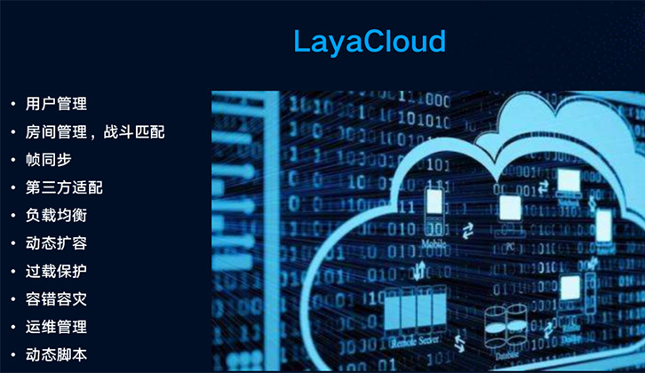

# 2D

- **核心库**

  解决cacheas=normal时缩放文字模糊的问题,以及文字相关优化

  解决修复Scene，Sprite的destroy可能报错的问题

  调整callLater延迟

  Loader解决自动判断文件类型可能不对的问题

  SceneLoader预加载sk文件时自动预加载.png文件

  解决Graphics.drawtexture带颜色滤镜不对的问题

  AudioSound销毁时增加销毁Pool中的对象，解决可能存在的声音无法释放问题

  Stage解决缩放模式可能不对的问题

  Animation解决多动画解析可能不对的问题

 - **UI库**

   List和Panel增加elasticEnabled属性，方便开启橡皮筋效果

   修复Dialog单例情况下，关闭动画未播放完毕的时候再次打开，导致打开失败的bug

 - **适配库**

   微信跟百度输入框支持正则使用

   修复3d项目资源加载特殊情况下出的问题

   修改声音缓存方案

# 3D

- **3D引擎**

  相机render函数增加replacementTag参数

  Shader框架增加SubShader概念

  增加程序化天空材质

  优化动画内存占用

  调整物理组件通过Transform更新变换机制

  精简自定义Shader配置参数,增强易用性

  优化骨骼动画模型文件尺寸大小和显存大小

  Animator动画支持倒序播放功能

  增加模型文件压缩功能

  优化camera layer相关接口

  调整Stat统计drawCall为RenderBatch

  调整PrimitiveMesh相关子类为Mesh通用类,创建方式改为静态工厂式PrimitiveMesh.createXX()方法,精简网格类。

  修复CharacterController销毁报错BUG

  修复某些模型顶点格式加载错误BUG

  修复刚体组件缩放BUG

  修复物理事件销毁物理组件可能导致崩溃BUG

  修复精灵设置castShadow后销毁可能崩溃BUG

  修复物理组件克隆后触发器属性错误BUG

  修复3D预设节点销毁后,再次加载为缓存节点BUG

  修复PixelLineSprite3D修改maxLineCount可能崩溃BUG

  修复动画融合BUG

  修复摄像机缩放导致显示不正常BUG

- **3DUnity插件**

  调整会员账户管理页面

  修复法线贴图导出BUG

  优化安卓平台纹理压缩速度

  优化LayaAirRun功能，移除cmd窗口

# IDE

- **新增功能**

  新增纹理图片转换工具，大大减少安卓和ios文件内存大小（vip服务）

  新增基于nodejs 新版发布系统，可以自己定制发布流程了，还可以使用命令行方式执行

  场景页面右键增加查找引用功能

  增加场景导出缓存优化，文件都不变时不导出，提高编译效率

  监听类文件修改，不修改不再进行编译，提高编译效率

  增加区块链项目（ETH、NEO、HPB）

# beta版日志
### beta1
​	

​	经过一年的准备，终于迎来了2.0测试版，从2.0开始，除了继续注重性能外，我们在引擎功能完善，易用性，扩展性等方面进一步发力：2D进行大量改进，增加了组件化支持，内置了物理系统，实现可视化物理编辑，3D进行了较大的升级，性能和功能都得到大幅提升，Native运行时也带来了性能的飞跃，同时支持3D加速，还有其他200多项细节改进。其中主要改进如下：

# 2D

1. **内置物理系统**

   ​	LayaAir1.0支持Matter物理引擎，但只是简单的支持，没有深度整合，在使用时不够方便直观。随着小游戏的开放，越来越多的游戏需要物理引擎的支持，所以从2.0开始，我们内置了box2d物理引擎，封装了物理组件，提供了IDE物理属性的可视化编辑，让制作物理游戏更加方便快捷。物理引擎从Matter更换到box2d，是因为Matter精度不是很高，并且没有防穿透支持，在制作一些类型的游戏时会出现莫名其妙的问题，而box2d相比而言更加完善。

   ​	

   ​

2. **组件化支持**

   ​	1.0我们提供了简单的脚本扩展支持，随着用户越来越广，需求越来越复杂，扩展成为常见需求。为了改进这一需求的体验，我们增加了组件化脚本的支持，官方提供的默认组件，如果满足不了需求，可以通过脚本扩展的方式来改进组件功能，从而实现个性化需求。组件化开发在功能抽象，复用及开发效率提升上也有帮助。同时我们保留了页面基类继承的处理方式，在处理UI逻辑时非常方便。

   ​	【小提示】脚本和页面继承相比，如果是页面级的逻辑，需要频繁访问页面内多个元素，使用继承式写法，如果是独立小模块，功能单一复用，建议用脚本方式实现。

   ​	更多组件化支持文档详见：https://ldc2.layabox.com/doc/?nav=zh-as-2-4-0

   ​	

   ​

3. **基于场景管理**

   ​	2.0我们提供了基于场景的管理方式，开发者只需要关注场景的创意设计，剩下的场景加载，切换，资源加载，图集使用，资源销毁等等，引擎都提供了完整的方案，原来需要主程做的事情，现在引擎也提供了，简化了开发成本，让大家把更多时间花在游戏设计上。

   ​	

   ​

4. **可定化编译调试**

   ​	2.0我们采用gulp自动化脚本来构建编译和测试流程，整个编译和调试过程，可通过脚本任务的方式串联，如果想在编译和调试中间插入自定义的新流程，比如copy;压缩等，只需用gulp文件内增加一个新任务即可，这样就能做到每个项目自定义化，智能化。

   ​	同时引擎默认支持了require，这样大量的第三方nodejs库就可以在引擎内直接使用了。

   ​	同时改进了微信小游戏调试方式，可以边开发边调试，无需再发布后调试。

   ​	后续的版本，发布面板也会采用脚本化定制方式重构，这样发布个性化需求就不愁了。

   

   ​

5. **3D编辑器**

   ​	2.0 开始，IDE增加对3D项目编辑支持，可以在IDE编辑3D场景，材质，物理等功能

   ​	由于目前还在改进中，测试版本暂时不开放使用

   ​	

   ​

6. **全新layacloud项目**

   ​	LayaCloud 游戏服务器集群基于快速开发多人对战类游戏进行设计，以高可靠性、易扩展为首要目标搭建，简化服务器开发成本。更多信息请参考https://wiki.cloud.layabox.com/

   

   ​

7. **全新的IDE**

   ​	2.0我们重新设计了IDE皮肤及布局，使其更加简洁漂亮，同时做了大量功能改进，进一步提高易用性，提高开发效率，可以在实际使用中进行提会。

   ​	

   ​

   ​

   ​

# 3D

1. **性能**
  ​     众所周知,LayaAir始终以性能著称,本次LayaAir3D2.0除了对功能、易用性进行了诸多增强和改进，对性能依然做出了大幅提升。对底层进行了大量重构升级,对静态模型和动态模型均做了大量优化,尤其大幅提升了静态场景性能。同时采用更先进的机制来减少JS和WebGL本地接口的调用次数以提升性能。

2. **材质系统**
   ​     LayaAir2.0对材质进行了诸多改进和提升，并在引擎中提供更多的官方材质 以及开放了更多自定义材质相关的功能,新增的主要官方材质包括PBRStandardMaterial、PBRSpecularMaterial以及UnlitMaterial材质等。PBR材质也就是近几年比较流行的基于物理渲染材质，采用更科学的shader算法表现更为真实的材质感。UnlitMaterial是简化版的无光照材质,一般用于技能特效等，通过加色法或者透明混合结合刚体动画可以实现诸多特殊效果。自定义Shader方面我们主要增加了多pass功能，比如实现卡通渲染需要的描边效果等，多pass会在shader渲染时渲染多次。材质开放了renderQueue接口，renderqueue是渲染精灵时的排序依据,开发者可通过指定renderQueue值来修改材质所属精灵的渲染顺序。

   1) 增加Shader多pass渲染
   2) 开放renderQueue,开发者可自定义渲染顺序
   3) 新增UnlitMaterial材质
   4) 新增Effect材质
   5) 新增PBRStandardMaterial材质
   6) 新增PBRSpecularMaterial材质

 

3. **纹理系统**
  ​     LayaAir2.0对纹理功能进行了提升和改进,增加了纹理的灵活性和可控性。 mipmap为是否生成多级理,format为纹理格式(例如R8G8B8和R8G8B8A8等),wrapModeU和wrapModeV为纹理寻址模式，filterMode为纹理过滤器模式、anisoLevel为各性异向过滤。增加了纹理上传像素的接口,开发者可自行上传自定义像素颜色来生成纹理。支持GPU纹理压缩(Android、IOS),具体为ETC、PVR，可大幅减少显存占用，增加游戏资源总量，提升游戏品质。

  1) 增加多种纹理参数配置(mipmap、format、wrapModeU、wrapModeV、filterMode、anisoLevel)
  2) 增加纹理上传像素接口
  3) GPU纹理压缩

4. **动画系统**
  ​     LayaAir2.0具备更完善的Animator动画系统,可支持更多的动画属性，支持动画过渡融合,动过切换更自然，避免两个非连贯的动作切换时出现闪切现象。Animator支持动画多层混合,可实现动画上下半身分离等功能，每一层均可独立控制某些骨骼。Animator动画调整为实时插值，可大幅减少内存并且在相同帧率下提升动画流畅度表现。

  1) 新增Animator动画融合功能crossFade
  2) 新增动画多层混合播放
  3) 动画更新机制调整为实时插值，大幅减少内存和动画流畅度表现
  4) 新增多种材质属性动画

 

5. **物理系统**
    ​     LayaAir1.0物理功能非常匮乏,2.0重点对物理系统进行了重构设计。新增多种物理组件，包括RigidBody、PhysicsCollider、CharacterController，开发者可根据项目需求选择不同的物理组件。新增多种Shape，开发者可任意添加一个或多个Shape进行物理组件的轮廓描述。

    1)新增刚体:RigidBody
    2)新增碰撞器:PhysicsCollider
    3)新增角色控制器:CharacterController
    4)新增碰撞器形状:BoxColliderShape、CapsuleColliderShape、CompoundColliderShape、ConeColliderShape、CylinderColliderShape、SphereColliderShape、MeshColliderShape
    5)新增辅助检测功能:shapeCast、shapeCastAll等

6. **精灵**
     ​     新增了拖尾精灵，用于实现拖尾的拉伸特效,三维特效中比较常用的几个精灵分别为粒子、Mesh加刚体动画，还有就是本次2.0中新增的拖尾。同时我们又新增了像素线精灵用于绘制像素线框，这个一般再游戏或一些开发过程中的调试模式都比较有用。

     1) 新增TrailSprite3D
     2) 新增PixelLineSprite3D
     

7. **脚本系统**
    ​     LayaAir2.0对引擎易用性的提升十分注重,脚本中增加了多种回调函数，包括碰撞反馈的回调、三维模型的鼠标拾取更加简单方便,具体onCollisonXX为物理碰撞时触发，包括进入碰撞,保持碰撞和退出碰撞，我们在1.0后期的版本中就有提供过onTriiggerXX函数。

    ​	1) 增加onCollisionEnter、onCollisionStay、onCollisionExit、onMouseDown、onMouseDrag、onMouseClick、onMouseUp、onMouseEnter、onMouseOver、onMouseOut碰撞回调函数。

8. **其它**
    ​     对于资源释放,在LayaAir1.0中一直是开发者比较头疼的事情。在LayaAir2.0中我们官方采用destroyUnusedResources()来模拟GC释放当前场景树种没有被使用资源。LayaAir2.0对光照贴图进行了优化显示,使得光照贴图可以显示大于1.0的HDR颜色显示效果更逼真。

    1) 新增批量资源释放功能
    2) 增加HDR光照贴图格式

其他主要改进：

- 重构WebGL底层实现
- 重构HTMLDivElement实现，由原先的节点模式改为Graphic模式，减少节点创建，提高渲染性能
- 颜色滤镜增加亮度，对比度，饱和度，色调的设置，使用更加方便
- Graphics增加命令行cmd的返回，方便修改调整cmd命令
- Graphics的drawTexture函数增加color和blendMode的支持
- Graphics新增drawImage，实现简化版本的drawTexture
- Graphics新增drawTriangles，能根据顶点信息绘制三角形
- Loader增加对WorkderLoader的支持
- 改进了Sprite的Texture实现，提高Texture渲染性能，建议多用
- 优化了Sprite获取bounds的性能
- 所有颜色值增加了Alpha通道的支持
- 节点增加offAllCaller接口，方便注销某个对象身上的所有事件，提高方便性
- 改进大部分UI组件，支持资源异步加载
- 引擎去掉了大图合集的支持，减少使用者的理解成本和引擎的复杂度
- 去掉所有IF-Flash相关代码，减少不必要的分支，减少代码大小
- 解决其他已知bug

IDE

- 新增物理系统支持，可视化编辑物理属性，更加方便制作物理小游戏
- 新增组件化扩展支持，所有节点均可通过组件方式扩展，快速实现个性化需求
- 新增资源缩略图预览面板，方便定位管理资源
- 调整IDE可视化界面结构，融合资源面板和页面面板，增加脚本及基本组件的展示，提高实用性
- 新增Prefab制作及使用支持，方便组件复用
- 新增插件项目创建，完善插件扩展机制，方便扩展IDE
- 改进调试功能，一键发布编译调试，新增运行功能，运行能跳过链接VScode调试，直接使用chrome的调试
- 增加小图及图集自动映射，加载小图的时候，会自动判定是否有图集存在，如果有则优先使用图集
- 增强场景切换调试，方便调试某个特定场景（比如当前打开的场景）
- 层级支持双击节点修改名称，方便定位
- 增强可视化编辑工具，比如旋转工具，场景缩放工具，对齐工具
- 优化IDE启动速度，启动更加迅速
- 支持最新的VsCode，功能更加强大，对ts和js支持更加友好
- 使用最新的AS3代码提示插件，改进AS3语言使用体验
- 改进了ViewStack使用体验
- 增加可定制化任务流程，方便自定义流程
- 增加属性默认值显示，让属性查看更加直观
- 改进小工具位置，简化界面元素，使其更简洁
- 时间轴增加函数调用支持
- 新增项目列表页面，方便管理历史项目
- 增加模板保存按钮，方便保存为模板
- 增加页面设置按钮
- 新增游戏参数设置，起始场景设置
- 增加调试及帧率开关
- 增加脚本选择控制，方便选择使用第三方脚本

### beta2
​	

​	由于2.0刚刚发布，功能还没有稳定，我们加快版本更新力度，保持每周一个版本的更新力度，如果遇到什么问题，请及时反馈，我们第一时间修复。

**物理引擎**

进一步完善物理引擎，增加物理辅助线设置，增加接口，完善注释

`IDE内通过项目设置面板（快捷键F9），可以打开物理辅助线，代码中可以通过PhysicsDebugDraw.enable()打开`

物理引擎调整

- 完善物理辅助线，实现物理辅助线的webgl渲染，增加开启开关

- 更改RigidBody的linearVelocity属性为object类型

- RigidBody增加getWorldCenter接口，方便获取刚体中心点

- Physics类增加刚体数量，关节数量，碰撞数量获取接口

- 碰撞事件增加碰撞点信息获取方法

- 完善相关物理类注释，增加详细介绍说明

**完善小游戏表现**

- 因为微信不支持scene文件上传，引擎增加适配，可以把加载scene后缀的场景，改为加载同名json文件，游戏代码保持不变，后续微信支持scene后缀后，再去掉开关

- IDE增加开关可以把场景等文件导出为json，通过项目设置打开

- 修复微信小游戏内，IOS下文字不显示的bug

**修复bug**

- 修复IDE内无法调试的问题

- 修复大图设置9宫格显示异常

- 修复IDE内快捷键异常

- 修复发布功能异常

- 修复设置资源属性后没有立即刷新的问题

- 修复canvas模式下，滤镜显示不对的问题

- 修复webgl下显示rgba(r,g,b,a) rgb(r,g,b)类型的颜色不对的问题

- drawCirle drawline在有缩放的情况下可能不正常问题

**其他**

- 完善API文档信息 https://layaair.ldc.layabox.com/api2/

- graphics属性面板增加rendertype设置

- 改进音效释放策略，使其更加合理

- 改进drawCirle drawline等适量接口，再Webgl下显示可能不正常的问题

**3D引擎**

- CompoundColliderShape增加clearChildShape方法

- 修复精灵缩放导致Rigidbody3D异常BUG

- 调整ShinnedMeshRenderer的rootBone关联机制,无rootBone不会关联骨骼节点同步矩阵

- 调整物理世界更新时机

- 修复物理Shape有Center偏移时移动不正常BUG

- 修复微信小游戏3D初始化失败问题

**3DUnity插件**

- 优化导出资源的速度

- 增加blinphong材质顶点色

- 修复动画导出时的motion的BUG

- 修复场景文件重命名报错BUG

- 修复使用unity默认图片时导出资源的BUG

- 修复blinphong首次切换的BUG

### beta3
# 2D

- **新增微信开放域数据展示组件**

  ​	微信开放数据域使用一直是很麻烦的事情，需要特殊编码，并且会是性能瓶颈，还有经常发生鼠标事件对不上的问题

  ​	LayaAir2.0开始，Laya官方给出了微信开放域UI组件，一并解决上述问题，使其使用起来更简单，性能更高，详细请查看http://ldc2.layabox.com/doc/?nav=zh-as-5-0-7

  

  ​

- **LayaAirIDE2.0 Mac 版本发布**

  

  ​

- **物理**

  优化物理组件，减少对象创建开销，完善注释

  改进鼠标关节，设置控制点变为可选，如果不设置，则根据鼠标点击位置作为控制点

  修复鼠标关节多次点击失效的bug

  ​

- **核心库**

  Loader增加对sk,ani等文件后缀的自动识别

  修复微信小游戏下，特定ios10.1.1版本文字无法显示的bug

  修复声音加载过程中，不能被正确停止的bug

  修复Animation类loadAnimation逻辑错误

  调整了 drawToCanvas

  修复粒子修改错误

  ​

# 3D

​	修复物理组件销毁崩溃BUG

​	修复物理组件初始化后精灵坐标位置可能不对BUG

​	修复设置collisionGroup和canCollideWith崩溃BUG

​	修复物理事件回调不正确BUG

​	修复资源带版本加载错误BUG

​	修复CompoundColliderShape.removeChildShape()方法BUG

​	修复Rigidbody3D.clearForces方法崩溃BUG

​	修复PhysicsCollider位置可能不更新BUG

**3DUnity插件**

​	修复场景文件导出层级丢失BUG

​	修复顶点色的功能

### beta4
本次更新主要修复大家反馈的bug如下：

# 类库

- **2D类库**

  Scene类open方法增加param参数，此参数最终会传递给onOpen方法，方便打开场景时处理参数

  Scene类增加单例的支持，在ide里面设置某场景为单例，则打开此场景始终只有一个实例

  完成了 2.0 版本，QQ玩一玩平台的适配

  Byte类增加readArrayBuffer方法

  增加免费小游戏流量共享组件

  增加骨骼动画可能取不到数据的异常处理

- **3D类库**

   Animator增加精灵active属性支持

   修复鼠标事件BUG

   修复物理组件ColliderShape为空时克隆报错BUG

   修复2D、3D混合可能出现层级错乱BUG

   修复设置Rigidbody3D的linearVelocity和angularVelocity可能无效BUG

   修复transform的rotationEuler获取错误BUG

   修复Input3D坐标错误BUG

   修复模型合并BUG

# 编辑器

- **LayaAirIDE**

  资源预览面板增加键盘快捷定位，通过键入首字母快速定位资源

  资源树右键增加新建目录菜单

  时间轴面板支持拖动第0帧到某个位置

  修复保存默认属性不对的问题

  修复参考图不正常的问题

  修复ts var导出不正常的问题

  修复as项目类名runtime不能点击定位文件的问题

  修复UIView导出不对的问题

  修复项目面板拖动文件夹没有正常刷新的问题

- **3DUnity插件**

  调整Unity中LayaShader中输出颜色值得范围

  修复精灵active属性导出错误BUG

  修复勾选Auto Generate导出光照贴图报错BUG(改为抛 出使用错误警告)

  修复MeshCollider导出错误

### beta5
# 2D

- **核心库**

  **增加百度小游戏适配，LayaAir引擎可以无缝发布到百度智能小游戏内**

  **【不兼容调整】**调整Scene类open方法param参数和complete参数的顺序，**这里是一个不兼容调整，如果用到complete参数，请及时调整顺序**

  Scene类增加progress回调，方便获取场景加载进度信息

  Scene增加loading页面设置，通过setLoadingPage方法设置加载页面，在场景切换时显示loading页面，loading页面会自动接收当前场景的progress事件

  Scene增加showLoadingPage和hideLoadingPage手动控制loading页面显示

  Scene的close方法增加type属性，方便知道关闭的原因

  Sprite loadImage方法增加url为空的保护

  解决文字太大的崩溃问题

  解决EventDispatcher offAllCaller失效的bug

  解决sleep模式下没有正确执行time更新的bug

  解决mask相关bug

  解决cacheas=normal导致显示异常的问题

  解决Text padding不对的问题

  解决文字贴图重用引起的文字混乱的bug

- **UI库**

   UI库动态加载皮肤的组件，加载完成后增加resize事件的派发

   解决Panel嵌套VBox 可能会导致死循环的问题

   解决dialog遮罩没移除的bug

- **骨骼动画库**

   解决BoneSlot换肤有时不正常的问题

# 3D

- **3D引擎**

  Rigidbody3D组件增加是否处于睡眠状态属性isSleeping

  Rigidbody3D组件增加sleepLinearVelocity和sleepAngularVelocity属性

  移除物理组件activate()方法,同时增加Rigidbody3D组件wakeUp()方法

  重构TrailSprite3D精灵并修复若干BUG,详见API

  重构PixelLineSprite3D精灵,增强易用性,详见API

  Vector3增加SetValue方法

  TrailRender新增TransformZ模式

  修复Animator动画可能播放错乱BUG

  修复精灵Active为false时,物理组件依然生效BUG

  修复粒子RotationOverLifeTime模块BUG，并完善3D模式相关功能

  修复粒子排序BUG

- **3DUnity插件**
  修复Animator组件导出重复和多余挂点严重BUG

  优化插件导出性能

# IDE

- **新增功能**

  **增加百度小游戏发布功能**

  新增同类型节点多选，显示本类型更多属性功能

  新增style文件（资源默认属性）变化检测功能，如果发现style发生变化，IDE会自动提示刷新，有效防止出现效果显示不对的问题

  新增九宫格设置界面的输入框tab切换功能

- **修复bug**

  解决代码导出缓存不对的问题

  解决预览面板不能正常选中的问题

  解决层级面板拖动到最后一个不正常的问题

  解决层级面板拖动节点到其他节点内可能选中不正常的问题

  解决图片缓存没有及时更新的问题

  解决拖动Script到场景报错的问题

  解决高清屏拖动不对的问题

### beta5.1
# IDE
- **新增功能**

  支持新建脚本文件
  
  LayaCloud增加部署到正式环境和打开管理中心功能

  **更改快捷键:**

  Ctrl+P 打开页面

  Ctrl+Shift+P 页面设置