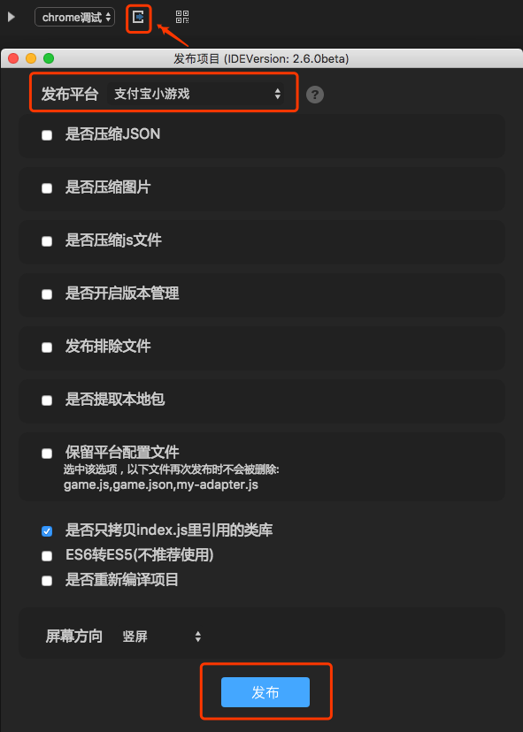
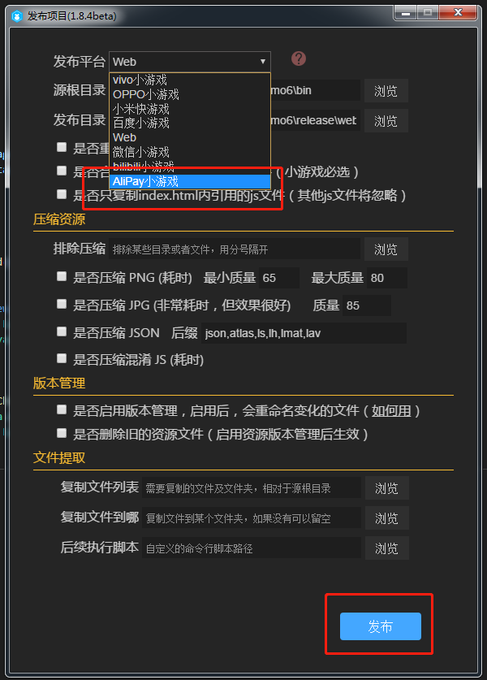
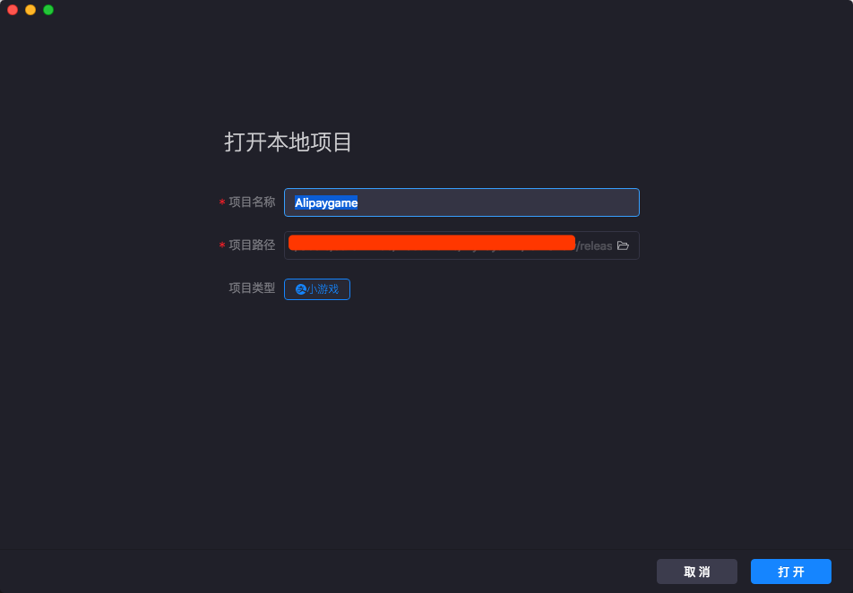

<<<<<<< HEAD
# 创建第一个支付宝小游戏
=======
# 创建阿里小游戏
>>>>>>> a76e0233452c46464dd63f3c09cbdc78f092144a

### 一、准备好开发环境

#### 1、下载并安装LayaAirIDE集成开发环境

LayaAirIDE是LayaAir引擎的集成开发环境，集成了LayaAir引擎与示例项目，UI、动画等可视化编辑，项目代码编写与管理等开发工具。**在LayaAirIDE_2.5.0以后的版本开发者可以发布支付宝小游戏项目。**

**官网下载地址** ：[https://ldc2.layabox.com/layadownload/?type=layaairide-LayaAir%20IDE%202.6.0beta](https://ldc2.layabox.com/layadownload/?type=layaairide-LayaAir IDE 2.6.0beta)

#### 2、下载并安装支付宝小程序开发者工具

支付宝小程序开发者工具主要用于小游戏产品的预览与调试、真机测试、上传提交等。是小游戏开发的必备工具。

**开发工具下载地址**：
https://opendocs.alipay.com/mini/ide/download

### 二、用LayaAirIDE创建和发布支付宝小游戏项目

#### 1、用LayaAirIDE发布支付宝小游戏游戏示例

2.0以上的引擎已经不需要做适配操作，只需将编译好的项目发布时候选择支付宝小游戏即可,如图点击红色小方块发布按钮，在发布平台栏目选择支付宝小游戏。

<<<<<<< HEAD

=======
### 二、用LayaAirIDE创建和发布阿里小游戏项目
>>>>>>> a76e0233452c46464dd63f3c09cbdc78f092144a

<<<<<<< HEAD
=======
 
>>>>>>> a76e0233452c46464dd63f3c09cbdc78f092144a

文件提取很关键，由于支付宝小游戏4M包体上传提交的限制。可以通过文件提取功能，只复制4M包内的文件到指定的支付宝小游戏项目目录此功能和微信小游戏一致。如下图所示。

 
(图：文件提取功能，点击浏览后，可筛选只复制勾选的4M包文件)

**Tips** ：

> 点击发布平台右侧的问号图标，可以查看各选项的详细介绍说明。

配置好发布需要的内容后。最终点击发布。即可生成支付宝小游戏项目。

### 三、用支付宝开发者工具创建小游戏项目

#### 1、创建项目

打开”支付宝开发者工具“，在弹出的面板里，点击右上角红框内的打开项目按钮，可以弹出小游戏项目导入面板。

 

​    最好是选择刚刚通过提取功能复制的本地包目录。如果对这个功能还不是太熟悉。只是为了跑通流程，也可以临时选择LayaAirIDE刚刚发布小游戏的目录，在项目的release文件夹下的alipaygame目录，选好后会看到如下图所示，开发工具会自动识别成小游戏项目。

  

#### 3、支付宝开发者工具的编译

完成小游戏项目的创建后，即可在工具内预览效果和调试。

 

更多关于支付宝开发工具的详情请访问https://opendocs.alipay.com/mini/ide