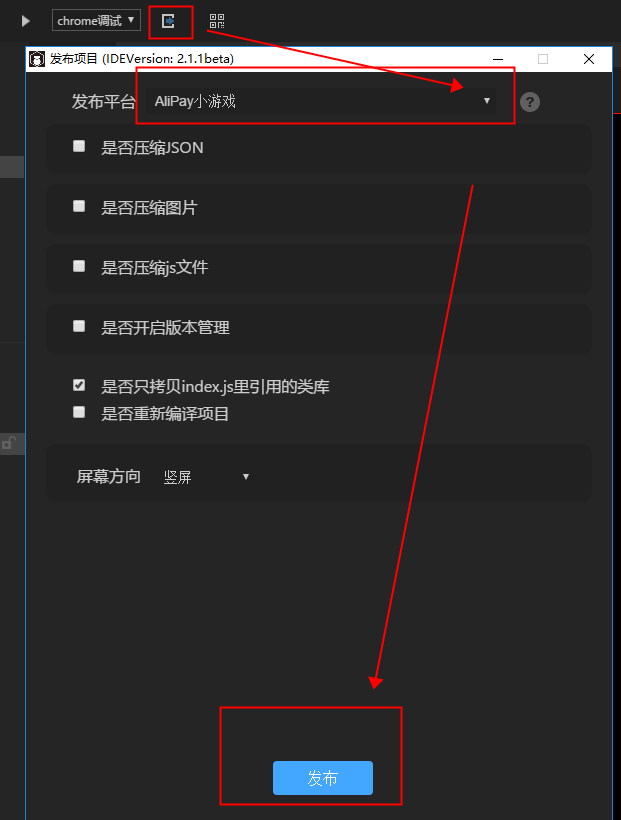
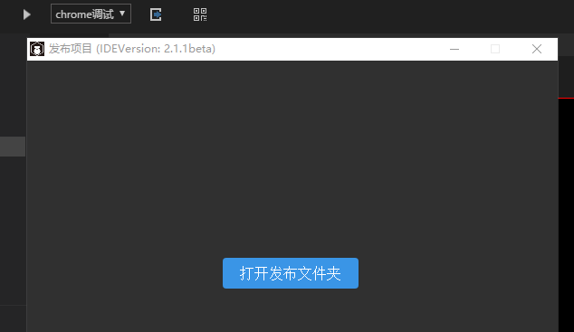
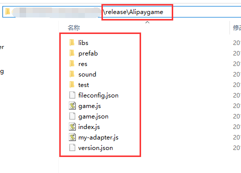
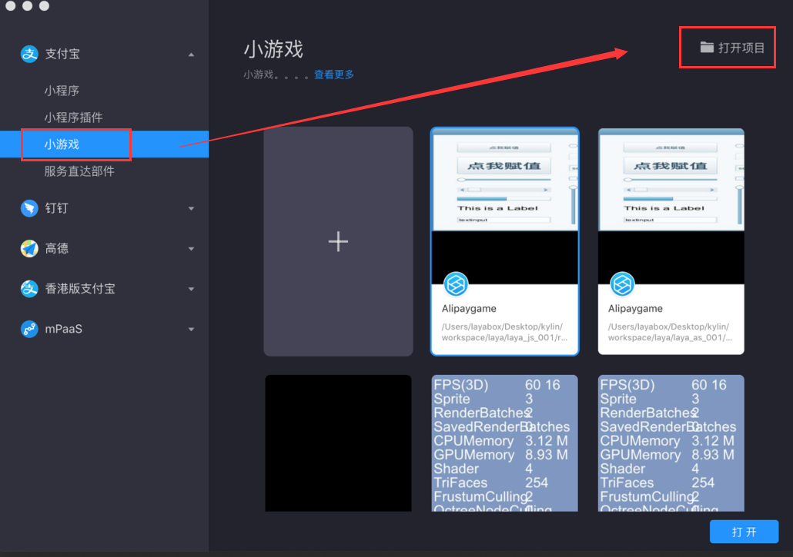
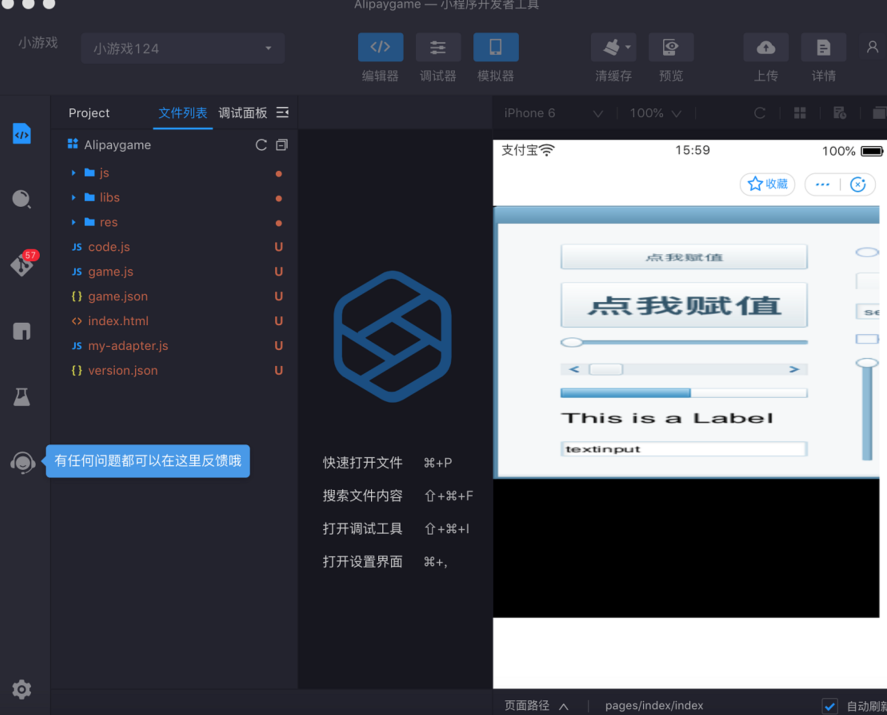

# Alipay小游戏发布流程

> 1、alipay小游戏发布是从LayaAir2.2.0开始适配，如果IDE低于该版本，请升级。
>
> 2、确保项目是可正常在浏览器运行的游戏(F6运行查看效果)

### 1、在LayaAirIDE中，将项目发布为Alipay小游戏项目 

打开LayaAirIDE，我们点击发布功能按钮，可以选择**Alipay小游戏** 然后，选择好相关发布功能的使用之后（基础发布功能说明，点击发布平台右侧的？号图标，可以查看说明文档），然后点击发布即可。如图1所示：

 

（图1）

点击发布之后，会显示编译界面，编译完成后，如图2所示。可以 `打开发布文件夹` 查看发布后的项目目录。如图3所示。

 

（图2）

 

（图3）

图3目录中，就是我们已发布成功的效果，此时，我们将该发布目录的项目copy到alipay开发者工具创建的项目即可。

### 2、在alipay开发者工具内导入项目

通常情况下，我们可以直接在alipay开发者工具里，通过工具右上角`打开项目`的功能，将我们发布的目录导入过去。如图4所示。

 

(图4)

导入成功后，如图5所示。说明我们可以在alipay开发者里调试和上线发布了。

 

(图5)