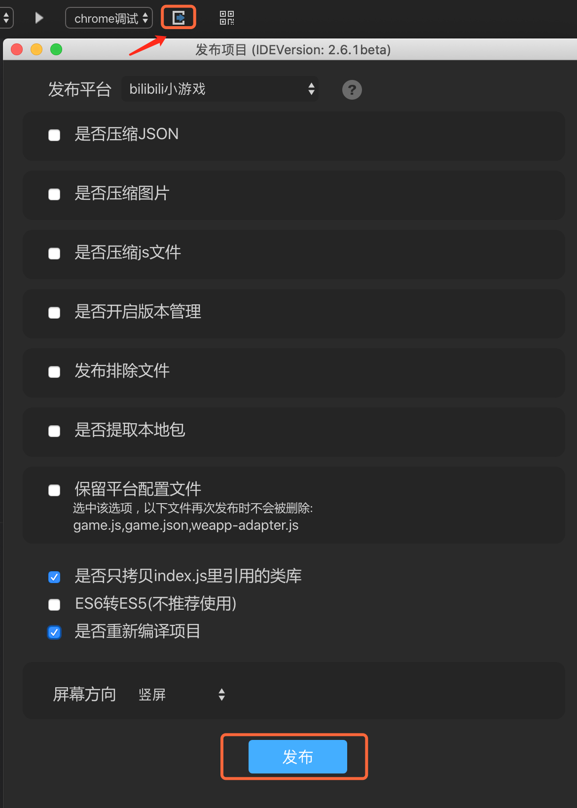
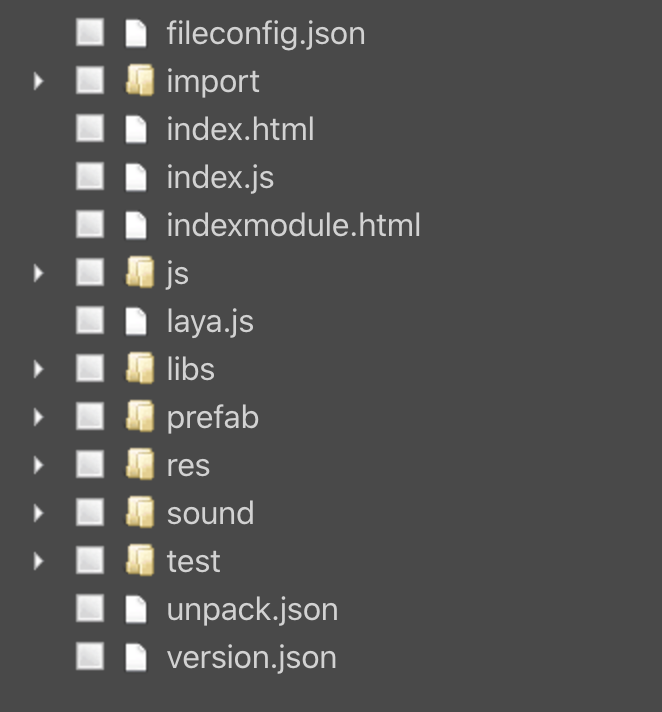
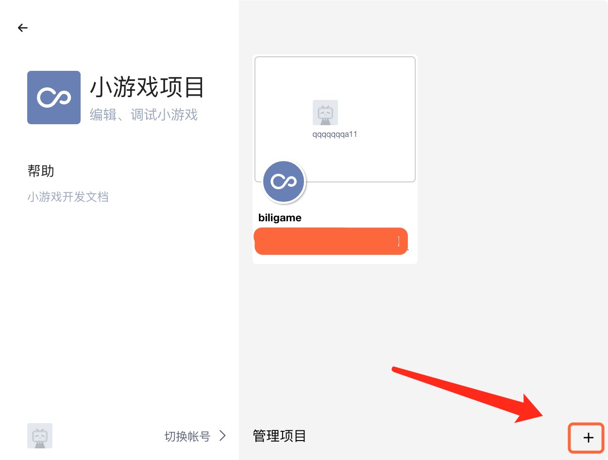
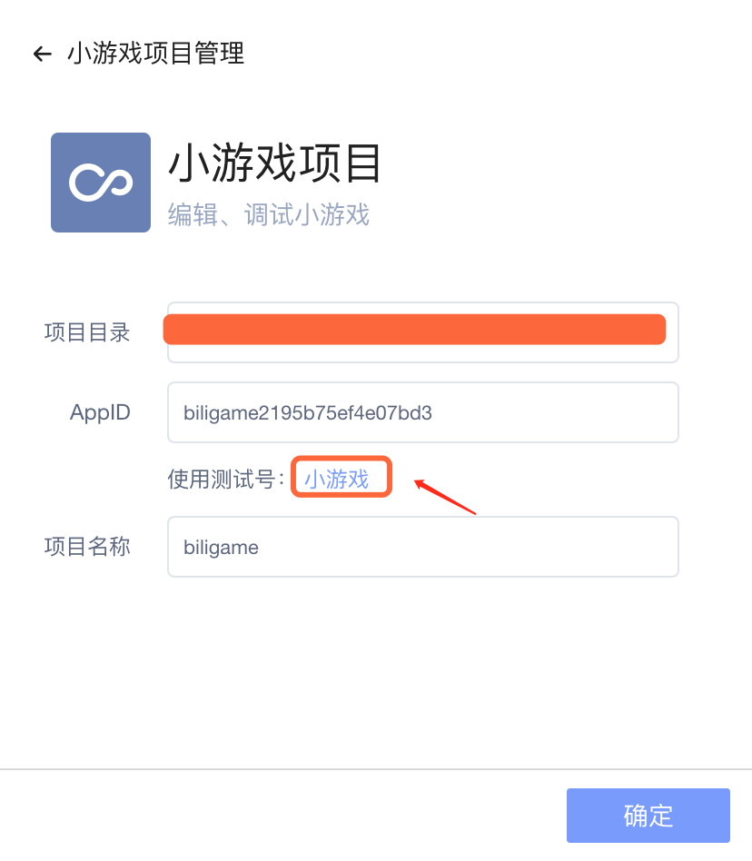
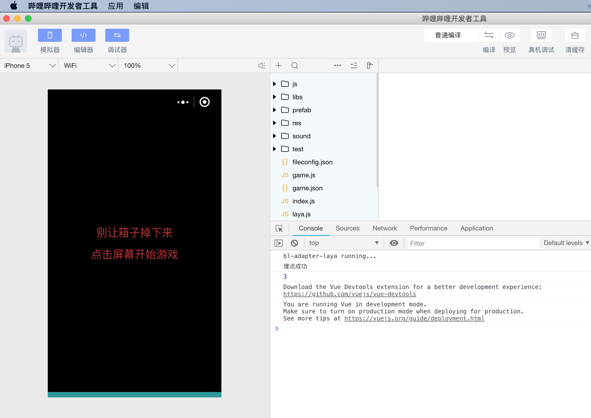

# 创建第一个bilibili小游戏
### 一、准备好开发环境

#### 1、下载并安装LayaAirIDE集成开发环境

LayaAirIDE是LayaAir引擎的集成开发环境，集成了LayaAir引擎与示例项目，UI、动画等可视化编辑，项目代码编写与管理等开发工具。**在LayaAirIDE_2.6.1以后的版本开发者可以发布bilibili小游戏项目。**

**官网下载地址** ：[https://ldc2.layabox.com/layadownload/?type=layaairide-LayaAir%20IDE%202.6.0beta](https://ldc2.layabox.com/layadownload/?type=layaairide-LayaAir IDE 2.6.0beta)


#### 2、下载并安装bilibili小游戏开发者工具

bilibili小游戏开发者工具主要用于小游戏产品的预览与调试、真机测试、上传提交等。是小游戏开发的必备工具。

开发者工具，目前只有MAC版，还不支持window版，未来会支持，关注B站官方。

**开发工具下载地址**：
http://miniapp.bilibili.com/small-game-doc/open/ide-update/


### 二、用LayaAirIDE创建和发布bilibili小游戏项目

#### 1、用LayaAirIDE发布bilibili小游戏游戏示例

1.0引擎需要手动自己初始化bilibili适配库，

在引擎初始化之前加上适配代码 ：

```typescript
as3: BLIMiniAdapter.init();   js或ts：Laya['BLIMiniAdapter'].init();
```

2.0以上的引擎已经不需要做适配操作，只需将编译好的项目发布时候选择bilibili小游戏即可,如图点击红色小方块发布按钮，在发布平台栏目选择bilibili小游戏。




文件提取很关键，由于bilibili小游戏4M包体上传提交的限制。可以通过文件提取功能，只复制4M包内的文件到指定的bilibili小游戏项目目录此功能和微信小游戏一致。如下图所示。

 
(图：文件提取功能，点击浏览后，可筛选只复制勾选的4M包文件)

**Tips** ：

> 点击发布平台右侧的问号图标，可以查看各选项的详细介绍说明。

配置好发布需要的内容后。最终点击发布。即可生成bilibili小游戏项目。


### 三、用bilibili开发者工具创建小游戏项目

#### 1、创建项目

打开”bilibili开发者工具“，在弹出的面板里，点击右下角红框内的 “ + ”，可以弹出小游戏目录选择面板。

 

  弹出小游戏项目管理面板，点击项目目录，会弹出小游戏目录选择菜单，选择在本项目的release文件夹下的biligame目录。

  

选择好目录后如下图所示：



AppID可以先选择“测试好” ，之后点击确定。

#### 3、bilibili开发者工具的编译

完成小游戏项目的创建后，即可在工具内预览效果和调试。

 

点击预览，用bilibiliApp扫描弹出的二维码可以真机预览效果：


更多关于bilibili开发工具的详情请访问http://miniapp.bilibili.com/small-game-doc/guide/intro/

