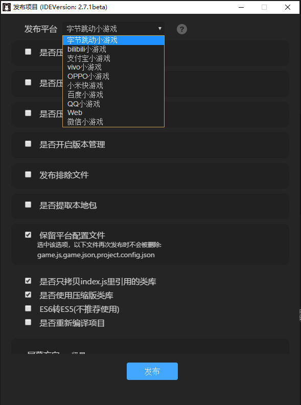

# 字节小游戏接入与发布调试指引

> Date:  2020-07-28   LayaAirIDE-Version >=  2.7.1

字节小游戏是基于字节跳动全产品矩阵开发，不需用户进行下载，点开即玩的全新游戏类型。

相较 APP，小游戏有着开发周期短、开发成本低等特性，能够让开发者更简单的参与到开发过程中。实现快速上线，快速变现。

小游戏有无需下载、玩法简单等特性，与图文、视频等场景有着天然的搭配性。字节跳动全产品矩阵以内容分发为核心，通过内容带动小游戏分发，由内容为小游戏带量以及裂变。

目前，小游戏支持流量广告变现及游戏内道具内购两种收入方式

## 1、流量入口概述

目前字节小游戏场景已十分丰富，具有今日头条、抖音、今日头条极速版核心流量入口

### 1.1 今日头条流量入口

##### 自然搜索

当小程序名称或配置的[搜索标签词](https://microapp.bytedance.com/dev/cn/mini-game/introduction/plugin-reference/publish-mini-app)被用户搜索到，会根据算法匹配，在搜索结果里展示相应的小游戏，用户可以点击该条搜索结果，直接打开小游戏。

##### 我的-小程序

- 当小游戏名称及近似名称被用户搜索到，会根据算法匹配，在 **搜索结果** 里展示相应的小游戏；

- 运营进行多维度的筛选，通过筛选的小游戏将获得 **首屏 banner、大家都在用、编辑精选、新品速递** 等数个展示位；

- 通过算法对小游戏进行排序，在 **猜你喜欢** 展示算法对小游戏的排序结果；

##### feed 流推广卡片位置

可将小游戏的宣传图分发至头条 feed 流中展示。由推荐算法根据用户行为属性推荐展示；

##### 头条号

头条号作者在个人主页可插入小游戏位。

##### 微头条入口

微头条有两种样式：一是直接分享微头条卡片，二是通过小游戏内的「发头条」入口发布，点击可进入。

##### 小视频入口

- 从游戏中分享的视频或者带有小游戏话题的视频将自动带有小视频流量入口
- 若开发者有制作好的视频，可点击游戏右上角**三横-分享**的方式将视频发布，此方法发布的视频亦会带上相应的小游戏入口；

##### 小游戏商店

今日头条官方小游戏商店，基于算法推荐的形式分发小游戏

##### 游戏频道

今日头条小游戏频道，基于算法推荐的形式分发小游戏

### 1.2 抖音流量入口

> 注意，抖音流量入口，仅限安卓APP。

##### 视频挂载

- 在小游戏中使用游戏自带的**录制**功能录制视频，发布后的视频会带上相应的小游戏入口；

- 若开发者有制作好的视频，可点击游戏右上角**三横-拍抖音**的方式将视频发布，此方法发布的视频亦会带上相应的小游戏入口；

- 视频详情入口为较大流量来源，随视频分发获量，精准触达用户需求。

##### 视频评论区

- 从小游戏中使用“拍抖音”和“分享”功能拍摄 or 录制视频，发布后的视频的评论区顶部会展示小游戏的入口；
- 评论顶部的小游戏入口有超高的转化率，让评论为小游戏赋能。

##### 企业主挂载小程序

企业主页可以在后台添加小游戏组件，显示在企业主页上，点击可打开对应小游戏。

##### 搜索展示

- 当小游戏名称或配置的搜索标签词被用户检索到，会根据算法匹配，在搜索结果里展示相应的小游戏，用户可以点击该条搜索结果，直接打开小游戏。
- 在发现页面顶部的搜索框，键入关键词，即可显示小游戏入口，强需求匹配，精准直达。

##### 最近使用

方便用户找到常用小程序，根据时间排序，常用的小程序展示的入口位置越靠前。点击**更多小程序**将展现过往用过的所有小程序

##### 小游戏商店

抖音官方小游戏商店，基于算法推荐的形式分发小游戏

### 1.3 今日头条极速版流量入口

##### 自然搜索结果

当小程序名称或配置的[搜索标签词](https://developer.toutiao.com/docs/intro/create.html#第三步：设置搜索关键词与分享)被用户检索到，会根据算法匹配，在搜索结果里展示相应的小游戏，用户可以点击该条搜索结果，直接打开小游戏。

##### feed 流推广卡片位置

可将小游戏的宣传图分发至头条 feed 流中展示。

## 2、开发环境准备

### 2.1 LayaAirIDE

LayaAirIDE是开发与发布成字节小游戏项目的基础，请下载大于或等于2.7.1的LayaAirIDE版本，下载地址为：

[https://ldc2.layabox.com/layadownload/?language=zh&type=layaairide](https://ldc2.layabox.com/layadownload/?language=zh&type=layaairide)

### 2.2 字节小游戏`开发者工具`

LayaAir引擎与IDE开发的项目，导出成字节小游戏项目后，需要到字节小游戏开发者工具里进行调试与发布上线。所以请继续下载字节小游戏开发者工具最新版。下载地址为：

[https://microapp.bytedance.com/dev/cn/mini-app/develop/developer-instrument/developer-instrument-update-and-download](https://microapp.bytedance.com/dev/cn/mini-app/develop/developer-instrument/developer-instrument-update-and-download)

> 注意，这里要使用本篇文档给的下载地址（或者在字节小程序文档中找到开发者工具下载地址），截至本篇文档撰写时，字节小游戏文档中指向的开发者工具下载地址较为老旧，不可使用。

## 3、LayaAirIDE的发布

在LayaAirIDE的2.7.1版本开始，IDE中可直接导出字节小游戏的项目。

发布流程和发布微信、发布百度基本一致。选择字节跳动小游戏即可，如下图所示。

 

与微信发布稍有不同的是，字节小游戏暂时还没有引擎插件的发布选项。也就是说当前暂不支持引擎插件。

至于其它的发布功能使用，与其它发布小游戏没有区别。可以查看LayaAirIDE发布功能使用的文档：

[https://ldc2.layabox.com/doc/?nav=zh-ts-3-0-6](https://ldc2.layabox.com/doc/?nav=zh-ts-3-0-6)

#### 注意

1、需要注意的是，如果字节跳动开发者工具的小游戏项目指向的是发布目录。发布的时候，需要先关闭小游戏项目的运行和调试界面。才可以正常发布。

2、不仅要升级IDE，引擎也要使用2.7.1版本或以上才可以。升级IDE不会自动切换引擎，一定要记得手工切换引擎类库。否则可能也会导致运行报错。

## 4、创建字节开发者平台的帐号

关于字节平台的帐号创建与登录，以及小游戏项目的创建，工具的使用，产品的发布，可以查看字节跳动的小游戏开发者文档：

https://microapp.bytedance.com/dev/cn/mini-game/introduction/plugin-reference/registration

## 5、调试

关于调试，字节跳动的工具，也分成PC调试，和真机调试。

PC调试方式与Chrome基本相同，

真机调试，需要在头条APP中进行。

更多关于字节开者工具的调试，可以阅读字节跳动开发者文档：

https://microapp.bytedance.com/dev/cn/mini-game/introduction/plugin-reference/develop-and-adjust

