## 对接上架字节跳动小游戏技术指南

>  Date：2021-01-13

小游戏发展至今天，游戏行业里已经无需去解释什么是小游戏了。

作为小游戏阵营的主流平台之一，字节跳动小游戏拥有着今日头条、抖音、今日头条极速版这样的核心流量入口，帮助众多游戏研发商，获得了非常可观的收益。

本篇来聊聊上架相关的流程，希望对于还没加入字节跳动小游戏平台的开发者，起到一些指引和避坑的目的。

[TOC]

### 1、使用LayaAir引擎来开发

下截引擎，下载IDE，以及引擎开发，这些基础就不在本文介绍了，

对LayaAir开发还不了解的可以查看官网的文档，https://ldc2.layabox.com/doc/ 。

本篇直接从LayaAirIDE中的项目发布开始。

### 2、用LayaAirIDE发布字节跳动小游戏项目

从LayaAir引擎与IDE的2.7.1版本开始，引擎与IDE完成了对字节跳动小游戏的适配。

这样开发者用LayaAir引擎开发完项目，就可以通过LayaAirIDE一键发布成已适配好的字节跳动小游戏项目。

使用大于2.7.0的LayaAir引擎稳定版本，和IDE版本。

开发完毕后，点击LayaAirIDE内的发布按钮，在弹出的发布项目窗口里，`发布平台`选择`字节跳动小游戏`，如图1-1所示。

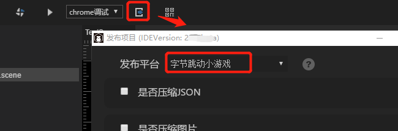 

(图1-1)

其它通用的发布功能就不在这里展开介绍了，有不明白的开发者可以点击发布平台那一栏右侧的帮助按钮查看使用文档。

配置完通用的发布功能后，要注意选择小游戏屏幕方向，默认是`竖屏`选项设置，如果是横屏的游戏，要改为`横屏`选项。最后点击`发布`按钮，如图1-2所示。即可进入最后的发布进度流程，等待发布完成即可。

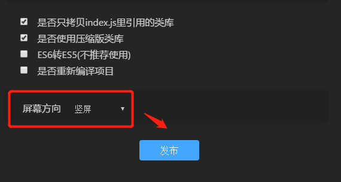 

(图1-2)

完成以上步骤，我们可以看到，通过LayaAirIDE，我们基本上是一键发布出一个适配好字节跳动小游戏的项目工程。

这个工程最终需要导入到字节跳动的开发者工具中，进行小游戏环境的调试和上架。

> #### 旧项目注意
>
> 当LayaAir引擎项目是2.7.1以下的版本，要发布字节跳动小游戏，需要升级引擎来适配，LayaAirIDE也要同步升级。有些开发者以为只升级IDE版本即可。其实升级IDE并不会自动切换引擎类库版本，一定要记得手工切换引擎类库。否则可能会导致运行报错。

### 3、开发字节小游戏的前置准备

#### 3.1 查阅文档、创建帐号、下载工具

如果是初次接触字节跳动小游戏，建议先去阅读一下字节跳动小程序文档，熟悉小游戏的接入流程，完成开发者平台的帐号注册，以及下载好开发者工具。

字节跳动小游戏接入指南：

[https://microapp.bytedance.com/docs/zh-CN/mini-game/introduction/plugin-reference/registration/](https://microapp.bytedance.com/docs/zh-CN/mini-game/introduction/plugin-reference/registration/)

字节跳动开发者工具：

[https://microapp.bytedance.com/docs/zh-CN/mini-app/develop/developer-instrument/developer-instrument-update-and-download](https://microapp.bytedance.com/docs/zh-CN/mini-app/develop/developer-instrument/developer-instrument-update-and-download)

#### 3.2 申请小游戏创建权限

如果开发者仅仅是创建个开发者平台帐号，下载了字节跳动小游戏开发者工具。即便是在开发者工具里登录并创建了小游戏项目，也无法调试和上传小游戏项目。每一个本地小游戏项目会与平台的开发权限严格对应。

##### 首次创建小游戏

对于首次创建小游戏的开发者，字节小游戏平台采用的是审核制，用于避免创建垃圾帐号。

所以要点击`创建一个小游戏`，在弹出的申请创建窗口里，再点`申请`，如图2-1所示，来申请创建字节跳动小游戏权限。

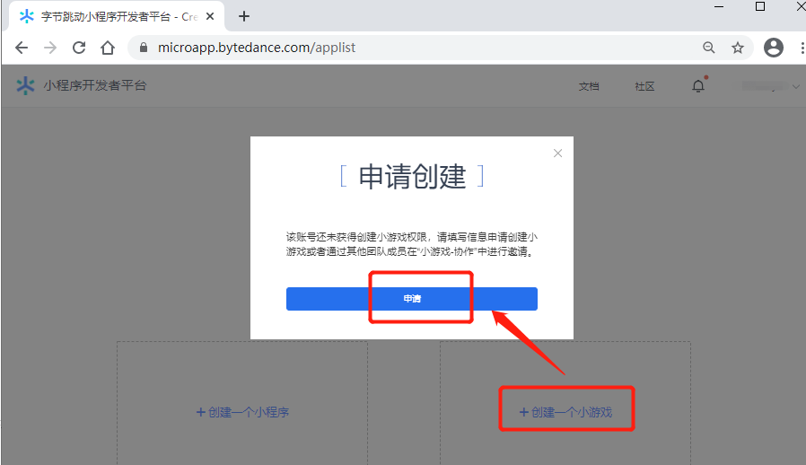 

(图2-1)

在首次申请的界面里，我们需要填写好，要创建的小游戏信息、以及开发者的公司信息和小游戏体验链接等信息，最后点击申请，如图2-2所示。等待字节跳动审核通过即可。

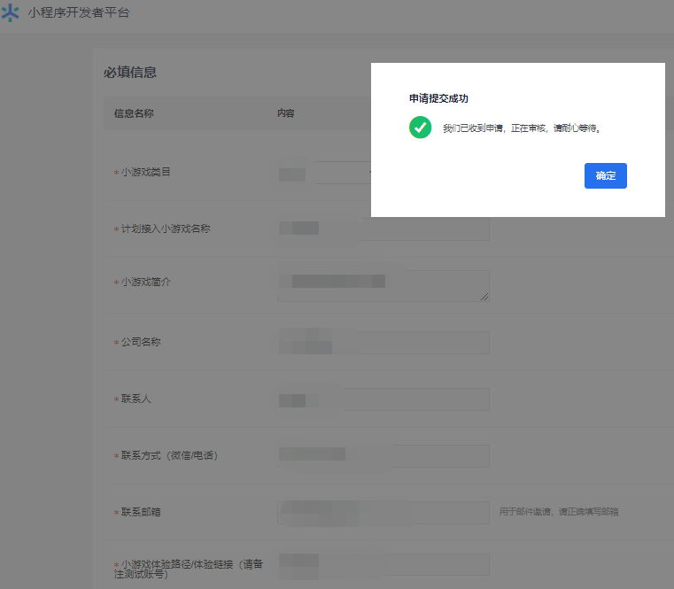 

(图2-2)

> 如果是个人开发者，公司名称那里可以填写开发者的姓名。

##### 非首次创建小游戏

只有真正的用自己帐号创建并通过小游戏申请审核，才算非首次创建小游戏。

作为协作者帐号，无论是拥有多少个字节跳动小游戏的开发调试权限，在创建新的小游戏项目时，仍然会被视为首次创建小游戏。

对于已经通过小游戏审核的开发者，再次创建小游戏，流程会变的简单许多，只需要填写小游戏名称与联系人信息即可，如图2-3所示。

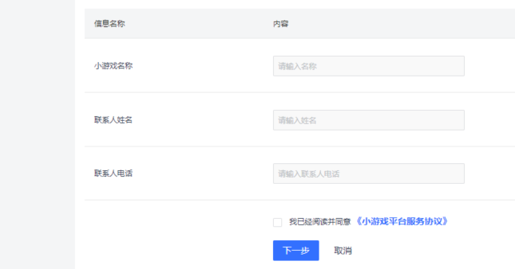 

(图2-3)

#### 3.3 添加协作者

如果通过了小游戏的创建审核，需要让团队内多个成员一起来调试和开发项目，可以在字节跳动小程序开发者平台的`团队协作`栏目里，`协作者`区域点击`添加`来分配协作者的权限，如图3所示，让协作者也可以参与该项目的调试与上传等操作。

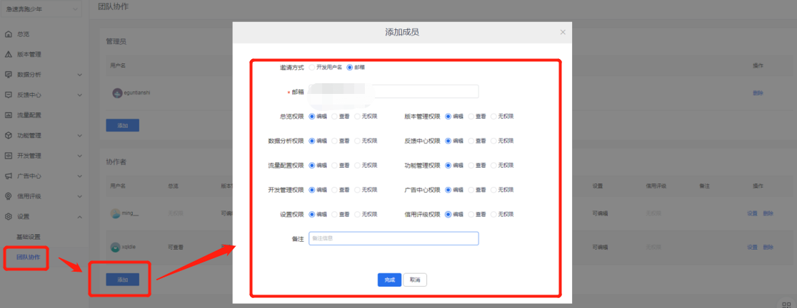 

(图3)

### 4、导入到字节跳动开发者工具

由于我们通过LayaAirIDE发布的就是完整的字节跳动小游戏项目，所以，无需通过字节跳动开发者工具去创建一个小游戏项目。

完成上文提到的准备工作，打开字节跳动开发者工具并登录后，直接在默认的小游戏栏目右下功能区，点击`导入`按钮，如图4-1所示，将LayaAirIDE发布的字节跳动小游戏项目导入进来即可。

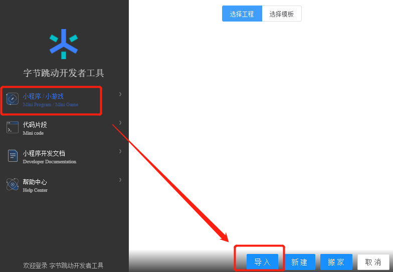 

(图4-1)

> 发布后的字节跳动小游戏项目默认在 `项目开发目录\release\bytedancegame`

导入字节跳动小游戏工程后的工具界面如图4-2所示，

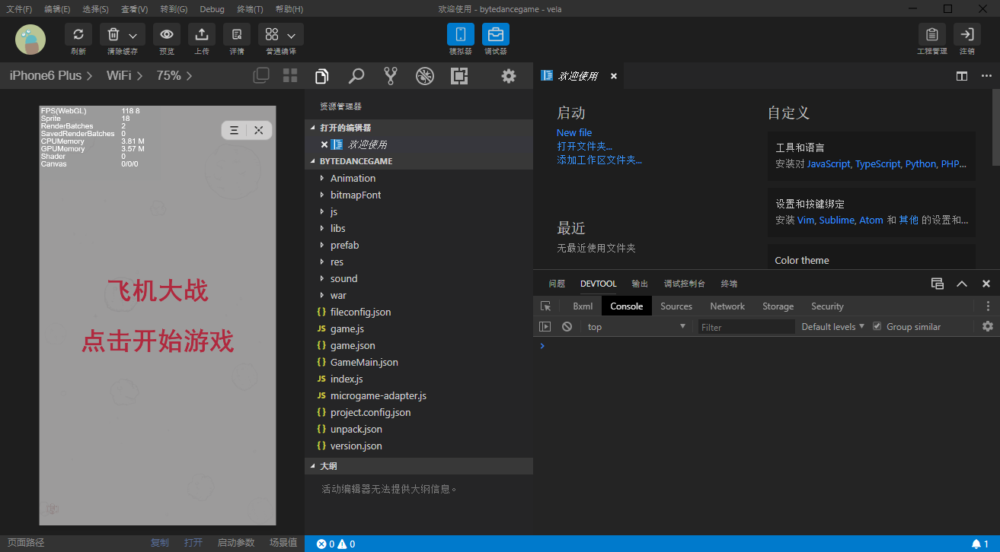 

(图4-2)

> 图4-2的字节跳动开发者工具版本为3.0.4，其它版本界面如有差异，以各自版本为准。

开发者通常在这个工具内对字节跳动小游戏进行PC调试、真机调试、小游戏工程配置、上传小游戏等操作。

### 5、预览与调试

在开发者工具内默认就可以预览和调试的，这里的预览和调试基本上与Chrome环境相同。例如用到了一些真机环境的，例如使用了纹理压缩资源，还是要通过真机进行预览效果和调试。

开发者工具中点击`预览`，经过工具编译后，会生成字节跳动小游戏的二维码，如图5-1所示。采用头条APP（7.2.9及以上版本）扫码即可真机预览。

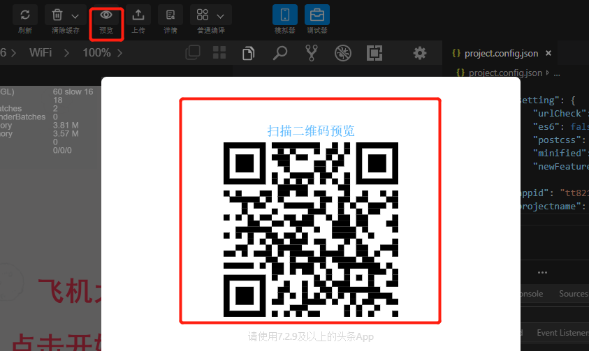 

（图5-1）

如果没能生成小游戏的二维码，并且在开发者工具的底部，弹出`“您没有权限预览当前小程序……”`的报错信息，如图5-2所示。说明开发者没有完成上文的权限流程，需要完成小游戏的创建申请或者让小游戏的创建者添加协作者权限。

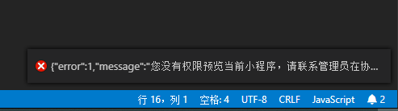 

（图5-2）

真机上的调试，通过点击右上角`...`弹出底部面板，再点击`打开调试`即可。如图5-3所示。

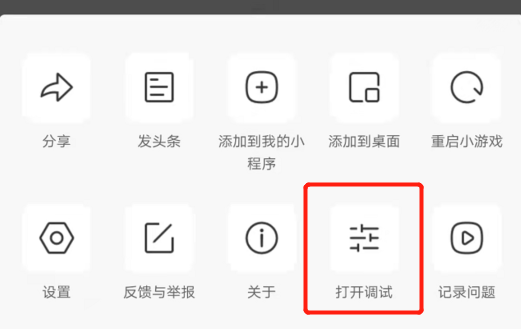  

（图5-3）

### 6、接入字节跳动小游戏的API

除了引擎适配好的游戏API外，上架字节跳动小游戏平台，通常需要接入广告、支付、登录、录屏与分享、等等API。

尤其是录屏功能，这是字节跳动小游戏的特色API之一，有着比较好的用户引流效果。我们以此API为例，简单介绍一下接入流程，其它API，开发者可以认真探索一下。

> 建议录屏点放在不会产生重复内容的地方，相同或相似的录屏分享效果会较差。

首先，我们在字节跳动小程序文档中找到录屏相关的API，如图6-1所示。

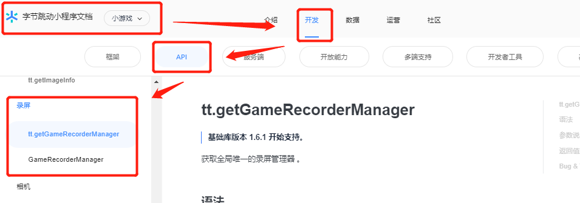 

（图6-1） 

链接为：

https://microapp.bytedance.com/docs/zh-CN/mini-game/develop/api/media/screen-recording/tt-get-game-recorder-manager/

在使用API的过程中，由于本地没有字节小游戏API的本地脚本库。所以，为了在开发的时候不报错，我们需要在LayaAir项目的libs目录下，自行创建一个字节跳动小游戏API的声名文件，例如`tt.d.ts`，如图6-2所示。

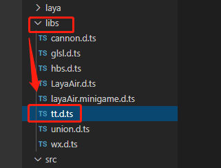 

（图6-2）

编写`tt.d.ts`声名文件的方式，如果不会，可以参考LayaAir官网的声名文件编写文档：

https://ldc2.layabox.com/doc/?nav=zh-ts-3-0-10

编写完成`tt.d.ts`声名文件之后，我们就可以直接在项目中使用字节跳动小游戏的API了。

> 需要注意的是，由于字节跳动小游戏的API只能是在字节跳动小游戏的环境下运行，API使用的时候需要加上环境判断，不能直接运行于浏览器环境下。

使用录屏API的TS示例代码如下：

```typescript
/**
 * 本示例省略代码若干，仅展示api从初始化到接口使用的基础流程
 */
import Browser = Laya.Browser;
export default class GameRecorderMgr {
    /**录屏实例**/
    private _recorder: any;
    static _instance: GameRecorderMgr;
    /**视频地址**/
    private _videoPath: String = "";

	constructor() {
        GameRecorderMgr.instance = this;

      //判断是否已初始化录屏对象
        if (!this._recorder) {
            //判断是否为字节小游戏环境
            if (Browser.onTTMiniGame) {
                //初始化录屏对象
                this._recorder = tt.getGameRecorderManager();
            }
        }
    }   

    static get instance(): GameRecorderMgr {
        if (!GameRecorderMgr._instance)
            GameRecorderMgr._instance = new GameRecorderMgr();
        return GameRecorderMgr._instance;
    }
    
  /**
     * 开始录屏
     * 开发者可以在任意想录屏的点调用该方法。
     * @param data{ duration:10} 
     * 这里的10表示为最短10秒后才可以调stop录屏,
     * 字节跳动API文档写的是最少3秒后，最大可设置300秒
     */
    public start(data: any = { duration: 10 }): void {
        //判断是否为字节小游戏环境
        if (Browser.onTTMiniGame && this._recorder) {
            //开始录屏，设置录屏的时间长度
            this._recorder.start({
                duration: data.duration
            });

            //监听录屏开始事件
            this._recorder.onStart((res)=>{
                console.log("录屏开始 res:" + JSON.stringify(res));
            });

            //监听录屏错误事件
            this._recorder.onError((errMsg)=>{
                console.log("录屏错误 errMsg:" + errMsg);
            });
        }
	}
    

    /**
     * 停止录屏，
     * 开发者根据需求，在不想录的时候主动调该方法。例如角色死亡或者关卡结束
     */
    public stop(): void {
        if (Browser.onTTMiniGame && this._recorder) {
            //监听录屏结束事件，停止后拿到生成的视频地址
            this._recorder.onStop((res) => {
                console.log("录屏结束 res.videoPath:" + res.videoPath);
                //设置视频地址路径
                this._videoPath = res.videoPath;
            });            
            
            //主动调停止录屏
            this._recorder.stop();
        }
    }

}
```

至此，接入字节小游戏的API流程也介绍完了，开发者可以举一反三，再接入其它的API。即可以进入提交上架流程。

### 7、提交上架

当完成字节小游戏的API的接入，也完成了真机调试。那就可以通过字节跳动开发者工具来提交上架。

提交步骤为，点击工具内的上传按钮，在弹出的窗口页里，填写好线上版本号，更新日志，点击确认，如图7-1所示。

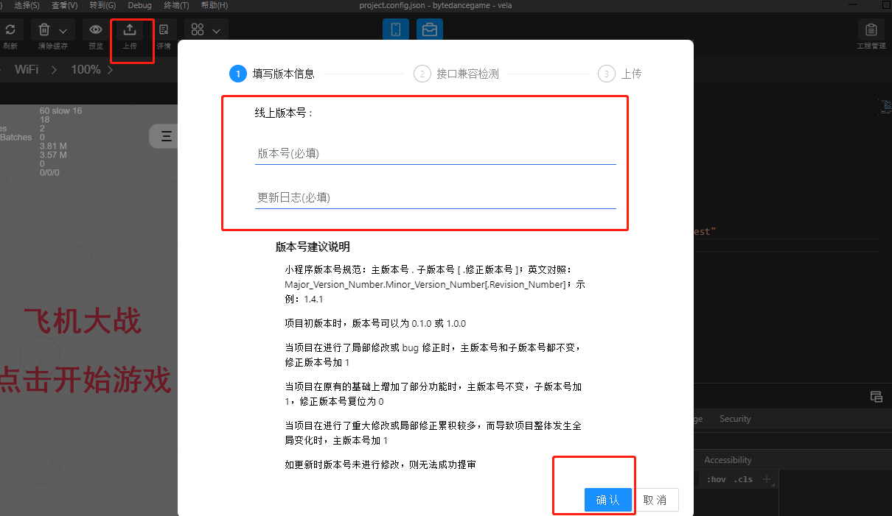 

（图7-1）

然后，接口兼容检测再点确认，就会进行上传。 

上传成功后，要进入网页上的字节跳动小程序开发者平台，选择进入相对的小游戏。

> 网址：https://microapp.bytedance.com/applist

进入对应的小游戏后台后，`版本管理`栏，会看到上传提交的测试版本，点击`提交审核`，如图7-2所示，即进入审核环节。耐心等待审核通过后即可上架。

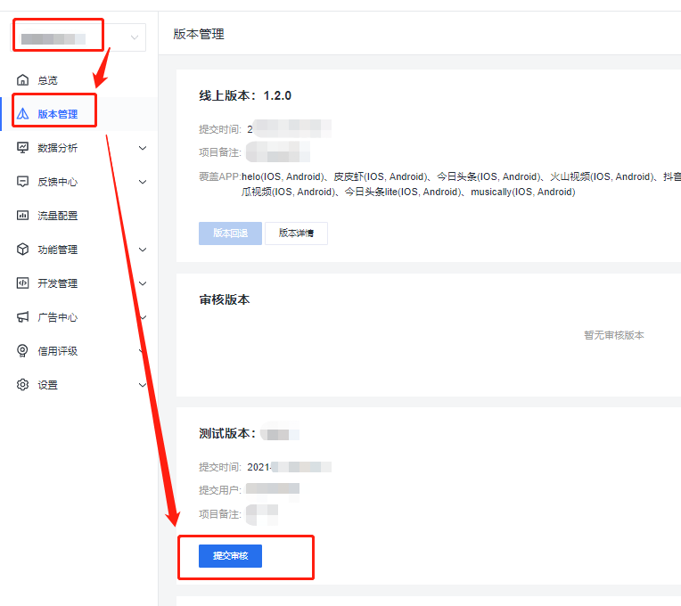  

（图7-2）

