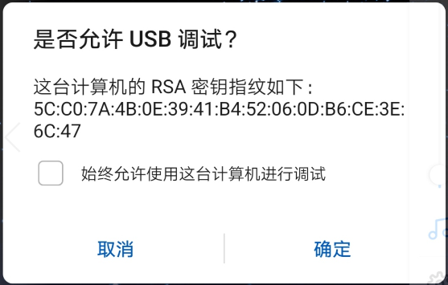
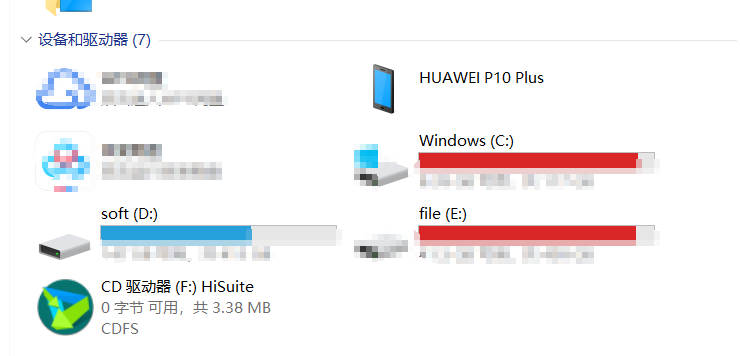
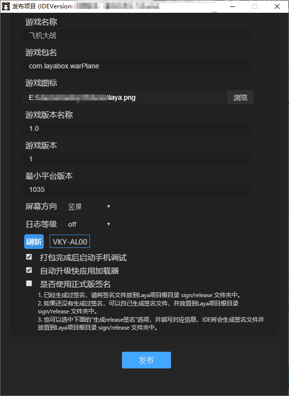
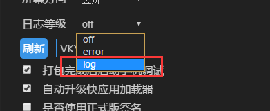
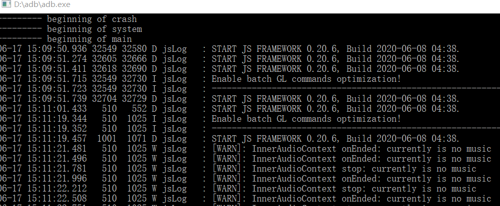

# 华为快游戏接入与发布调试指南

> Date:  2020-06-17   LayaAirIDE-Version >=  2.7.1

快应用是一种基于行业标准开发的新型免安装应用，其标准由主流手机厂商组成的快应用联盟联合制定。开发者开发一次即可将应用分发到所有支持行业标准的手机运行。

华为快游戏支持将现有H5游戏通过LayaAirIDE，直接打包成快应用形式进行发布。在华为GPU Turbo手机运行时速度更快，更省电。

[TOC]

## 了解华为快游戏

#### 优势与特点

华为快游戏Runtime版本具有免安装、速度快、省电、省内存、省空间的特点，并提供以下能力：

- **底层图形加速**

使游戏画质更高、画面更流畅，给游戏玩家带来极速体验

- **开放设备能力**

开发者可以方便使用位置、传感器、蓝牙、网络、电量等设备能力

- **网页跳转**

使游戏网站流量转换为可留存桌面的快游戏

#### **快游戏的资源**

- 应用市场首页快应用中心推荐
- 应用市场首页底部：即点即玩游戏
- 应用市场游戏页面底部：即点即玩，无需下载
- 游戏中心推荐页底部：即点即玩，无需下载
- 游戏中心分类页灯笼位置
- 精品快游戏专题
- 月度精品推荐 

**** 


## 华为快游戏发布、调试环境准备

1. 华为品牌的手机。

2. PC电脑的与手机数据连接线，并保障发布时处于连接状态。

   > 因为华为快游戏不会生成发布二维码，需要在发布的时候，就保障数据线是连通的，否则LayaAirIDE发布的时候，只会生成一个rpk的包，最终还是要联数据线，手工复制rpk包到相关路径下。

3. 安装nodejs 环境，必须要安装 10.x 稳定版本 ，如果不是的需要重新安装[node官网：https://nodejs.org/download/release/latest-v10.x/]

4. LayaAirIDE集中开发环境，LayaAir 2.7.1 或以上版本 [ 官网下载: https://ldc2.layabox.com/layadownload/?type=layaairide ]

5. 安装ADB

   华为快游戏发布时，是通过 ADB 把rpk包推到手机的games目录上去，所以这个必须要装。

   [ ADB官网下载: http://adbshell.com/downloads ]

   > 提示一下，下载 ADB Kits，下载后的压缩包，建议解压放到一个路径简单一些的目录（如: `D:\adb`）。要记得添加环境变量（不知如何添加环境变量的可自行百度）。


## 华为快游戏发布与接入完整流程

### 1、发布前的准备工作检查。

为了让发布华为快游戏顺利一些，有一些检查工作我们要做。

第一、PC里，node环境、ADB、LayaAirIDE这些，都必须要安装好。

第二、手机里，要允许USB调试。如下图所示。

  

> 也可以在华为的手机里，进入`设置-> 系统-> 开发人员选项->USB调试` ，查看并确认。

第三、将PC电脑与手机用USB数据线相连，电脑里，可以出现类似下图一样的界面。比如，点击下图 HUAWEI P10 Plus，就可以进入手机存储。

 

### 2、在LayaAirIDE里发布华为快游戏

LayaAirIDE的发布功能，内置了华为快游戏的发布功能，需要先将LayaAir引擎的项目，通过发布功能打成.rpk后缀的包。发布功能的发布平台，选择`华为快游戏`，最小平台版本当前选择1035（如有改变可以关注官方文档）。

在下图中，刷新那里，如果没连手机，显示`未发现手机，请检查设备连接`，如果连上了会识别出手机型号（华为识别出的手机型号可能与手机销售型号不符，只要能显示出来，就说明连上了）

 

其它关于发布功能的使用。由于有专门的发布功能介绍文档，这里不重复介绍了。不会的可以前往官网文档查看。

链接：https://ldc2.layabox.com/doc/?nav=zh-ts-3-0-6

### 3、真机运行与测试

当LayaAirIDE发布成功后，会自动在华为手机上调起该游戏的全屏运行界面，大家可以在真机上运行测试。如果退出游戏界面，也可以从`快应用加载器`APP进入后，直接点击游戏名称二次进入。如下图所示：

  


### 4、如何调试

华为快游戏，并没有提供快游戏环境调试工具，所以开发者需要先保障游戏的H5版本在浏览器端是没有问题的。再来调试华为快游戏。

调试华为快游戏一切靠日志，在LayaAirIDE的发布功能里，有一项是日志等级，如果想调试的时候，一定要打开。将日志等级设置为log，如下图所示。这样会包括console的log日志，以及报错日志。如果只是设置为error，则只显示报错日志，不会显示console日志。

 

这里需要注意的是，日志等级，在测试和调试的时候，才需要打开，要发布上线包的时候，不要开启。开启日志后，可能会对游戏运行的性能产生影响。

关于如何查看日志，我们推荐的方式是在PC的命令行中查看。

在命令行下输入

```
adb logcat -s jsLog
```

那发布运行后的所有日志，都会在命令行中进行显示出来。如下图所示。

 

通常情况下，日志在命令行中查看即可，如果开发者想把日志导出来，可以使用华为的快应用加载器PC助手，

下载地址为：

https://developer.huawei.com/consumer/cn/doc/development/quickApp-Guides/quickapp-pcassistant-user-guide