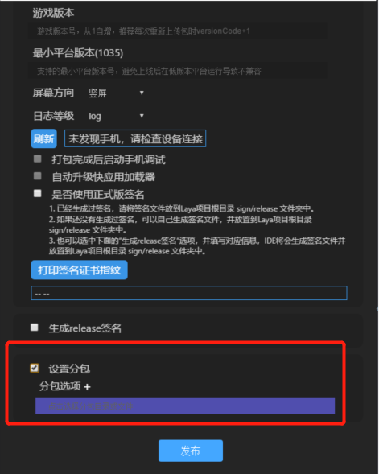
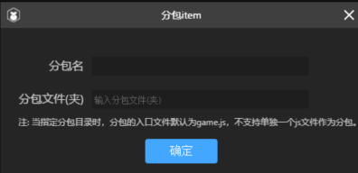

# 华为快游戏分包指南

> *update: 2020-08-20  LayaAirIDE-Version >= 2.8.1*

华为快游戏的分包加载，目的是为了缩短下载时间和减少下载流量。通过使用分包策略，开发者可以指定下载和加载特定分包，而不必将所有整包内容一次性下载和加载。

### 一、真的需要分包吗？

我们在打算分包之前，一定要分析一下自己的项目是真的有分包需求吗？其实对于当前大多数的产品而言，可以不用分包就可以上线快游戏产品。

#### **1、删除不必要的JS代码**

在没有分包的情况下，在 **index.js** 与 **html** 页里引用的JS都会被打包到最后的rpk中，除非是在项目中对js另有引用。没有使用的 js 文件可以直接删除掉，比如一些没有用到的引擎库js和第三方类库，这样也能有效减少包体大小。

#### 2、压缩与混淆

通过压缩混淆后的js代码，包体会明显减少很多。如果JS没超4M，可以不用分。资源等内容，完全可以走URL动态加载使用，在首次加载后，会存在物理缓存内，不超过50M的常用缓存内容，下次打开无需加载。


### 二、学习小游戏官方分包文档

在实战分包之前，官方的文档没看过的，一定要先仔细看一看。这非常有用，无论能理解到多少，先尽量看懂文档要点，才能更好的理解分包。链接如下，请先看过后再进行后面的步骤。

https://developer.huawei.com/consumer/cn/doc/development/quickApp-Guides/quickgame-develop-base


### 三、使用LayaAirIDE分包与加载分包代码

#### 1.LayaAirIDE的发布设置

当我们打算分包的时候，需要在发布的时候先勾选分包相关的选项，如下图所示：
 

然后，点击`分包选项＋` ，打开如下图所示面板。设置分包名和对应的分包文件夹即可。

 


#### 2.分包配置代码

除了发布的设置，在manifest.json文件中，也需要声明subpackages分包字段，声明格式如下：

> 注意：如果自己手动分包时，resource最后是以 “ / ” 结尾（ide分包可忽略该步骤）。同时对应目录下需要有 game.js 文件

```json
subpackages:[
    {
        "name":"subpackageName1",//对应分包名
        "resource":"subpackagePath1"//对应分包文件夹
    },
    {
        "name":"subpackageName2", //对应分包名
        "resource":"subpackagePath2"//对应分包文件夹
    }
]
```

华为快游戏有详细的manifest.json文件的介绍：https://developer.huawei.com/consumer/cn/doc/development/quickApp-Guides/quickgame-develop-runtime-game#h2-1579762192275


#### 3.分包使用的示例代码

使用分包的示例代码如下：

```javascript
var task = qg.loadSubpackage({
	subpackage:'subpackageName1',        
	success : function () {
   	 	console.log("loadSubpackage success" );
    },        
    fail:function(){
    	console.log("loadSubpackage fail");
    },        
    complete:function() {
   		console.log("loadSubpackage complete");
    }
});

task.onprogress(
    callback(res) {
    	console.log("onProgress" + JSON.stringify(res)); 
	}
);
```

