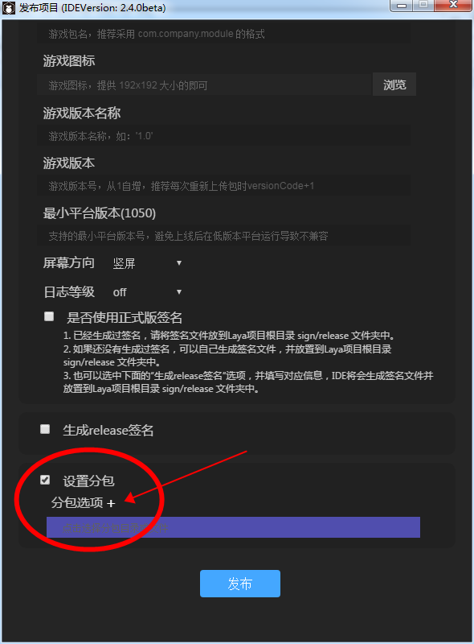
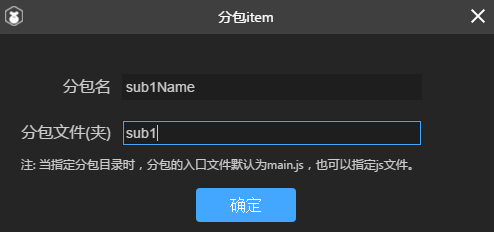
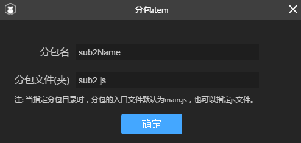
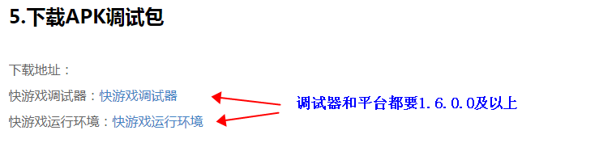

# 小米快游戏分包指南

> author: Aaron    update: 2019-12-23

对于一些大型游戏而言，小米快游戏的5M初始包远远不够用，因为光JS就会超过5M，所以在2.5.0beta的快游戏基础库推出之前，只能是不断的砍功能，一直砍到JS小于5M。(如果有新手不了解这是为什么？那先去了解一些基础之后，再来看本文。)快游戏基础库从2.5.0beta版本开始支持通过分包的形式，将上传的包体扩大到10M，那如何进行分包呢？

**本篇 会介绍分包的方式，帮助开发者理解快游戏的分包 。**

### 一、真的需要分包吗？

我们在打算分包之前，一定要分析一下自己的项目是真的有分包需求吗？其实对于当前大多数的产品而言，可以不用分包就可以上线快游戏产品。

#### 1、是否使用过UI加载或者分离模式？

LayaAir引擎的开发者，UI大多都是通过LayaAirIDE制作。

在F9的UI模式选项，以及项目管理器，右击每一个UI页面设置默认属性时的导出类型选项，都可以看到内嵌模式、加载模式、分离模式，三个选项。

 

**默认是内嵌模式**，这种模式下，导出UI的页面时，会将配置信息等内容导出为项目的代码文件。最终发布成快游戏的时候就是js文件。从而占用了一些宝贵的快游戏本地包体积。所以**，减少快游戏的包体大小，可以将导出UI的模式改变为加载模式或者分离模式。**这两种模式都会将页面配置信息等导出为json文件，json文件可以通过URL远程动态加载使用，而不会占用本地包空间。

> **Tips:**
>
> 1、加载模式与分离模式的区别是，加载模式是将所有的UI页面导出为一个json文件，分离模式是每一个UI页面导出为一个独立的json。
>
> 2、需要注意的是，加载模式与分离模式因为导出的是json，需要写代码加载后才可以使用。内嵌模式不需要。

总之，加载模式与分离模式可以减少包体JS的大小。如果能通过这种方式解决的，也许不必用分包来解决。具体情况视项目而定。

#### **2、删除不必要的JS代码**

在没有分包的情况下，在HTML页里引用的JS都会合并到一个js文件里（code.js），除非是在项目中对js另有引用。否则，不在HTML页内的其它js可以直接删除掉，比如一些没有用到的引擎库js。可以在项目目录下就直接删除，这样发布的时候也不会再出现了。

#### 3、压缩与混淆

通过压缩混淆后的js代码，包体会明显减少很多。如果JS没超5M，可以不用分。资源等内容，完全可以走URL动态加载使用，在首次加载后，会存在物理缓存内，不超过50M的常用缓存内容，下次打开无需加载。


### 二、学习快游戏官方分包文档

在实战分包之前，官方的文档没看过的，一定要先仔细看一看。这非常有用，无论能理解到多少，先尽量看懂文档要点，才能更好的理解分包。链接如下，请先看过后再进行后面的步骤。

[[https://dev.mi.com/console/doc/detail?pId=2067](https://dev.mi.com/console/doc/detail?pId=2067)]([https://dev.mi.com/console/doc/detail?pId=2067](https://dev.mi.com/console/doc/detail?pId=2067))


### 三、小米快游戏官方的分包方式

虽然很多开发者已经看过官方的分包文档，这里还是捡重点的再过一下。

#### 1、在manifest.json中配置分包名与分包路径的字段

```json
{
  ...
  "subpackages": [
    {
      "name": "sub1Name",
      "root": "sub1/" // 可以指定一个目录，目录根目录下的 main.js 会作为入口文件，目录下所有资源将会统一打包
    }, {
      "name": "sub2Name",
      "root": "sub2.js" // 也可以指定一个 JS 文件
    }
  ]
  ...
}
```

这个manifest.json是可以通过IDE的发布功能自动生成的，打开发布(2.5.0beta以上版本)可以看到设置分包选项，如图：


subpackages里，可以有多个name与root，每一组代表一个分包，单个分包，不能超过5M，全部游戏的初始包体不超过10M即可。

分包路径可以指定一个目录，录根目录下的 main.js 会作为入口文件，目录下所有资源将会统一打包，如图：



也可以指定一个JS文件。如图：




**这里设置的分包文件（夹）要与bin目录下的文件（夹）对应，这里设置只是自动生成manifest.json里的配置信息，并不会去创建文件夹和文件。一定要手动创建文件与文件夹**

下图为bin目录文件结构：


 

#### 2、快游戏官方的分包加载示例代码

快游戏官方提供了qg.loadSubpackage(Object object) API 来触发分包的下载，调用 qg.loadSubpackage 后，将触发分包的下载与加载，在加载完成后，通过 qg.loadSubpackage 的 success 回调来通知加载完成。示例代码如下：

```javascript
const loadTaskA = qg.loadSubpackage({
name: 'sub1Name',
success: function (data) {
console.info('加载分包 sub1Name 成功')
       },
       fail: function (err) {
              console.info('加载分包 sub1Name 失败', err)
       }
}
)
```

加载成功的同时，qg.loadSubpackage 会返回一个 [LoadSubpackageTask](https://developers.weixin.qq.com/minigame/dev/document/subpackages/LoadSubpackageTask.html)，可以通过 LoadSubpackageTask 获取获取分包加载状态。示例代码如下：

```javascript
loadTaskA.onProgressUpdate(res => {
				console.log('sub1Name 下载进度', res.progress)
				console.log('sub1Name 已经下载的数据长度', res.totalBytesWritten)
				console.log('sub1Name 预期需要下载的数据总长度', res.totalBytesExpectedToWrite)
			}
			);
```

如果有遇到这块问题的，可以在社区中提出。


### 四、分包要点

#### 1、基础库版本

**注意！开发者调试的时候需要调试器和平台都是1.6.0.0及以上，否则跟着本文操作，使用的是不支持分包的版本，调试就会出问题。**

调试器和平台下载地址：

 [https://dev.mi.com/console/doc/detail?pId=1738]( https://dev.mi.com/console/doc/detail?pId=1738)

如图：

 

（图2）


## 本文赞赏

如果您觉得本文对您有帮助，欢迎扫码赞赏作者，您的激励是我们写出更多优质文档的动力。

