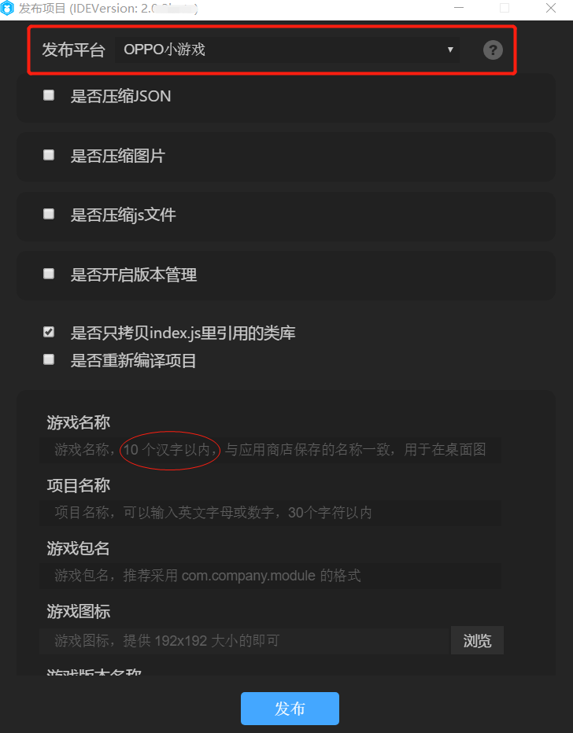

# OPPO小游戏接入文档

> OPOP小游戏的发布必须要使用LayaAirIDE，关于IDE的下载使用相关，请查看相关文档，不在本篇介绍范围内。

### 1、发布OPPO小游戏包

LayaAirIDE的发布功能，内置了OPPO小游戏的发布功能，如图1所示。

 

(图1)

具体的使用方式请点击发布平台选项右侧的问号来查看发布的详细说明。通过LayaAirIDE提供的发布功能，可生成一个.rpk后缀的小游戏包。

### 2、小游戏测试与调试环境准备

小游戏测试的方式，是通过在OPPO的手机上，安装XXX.apk测试APP。然后在测试APP上直接选择打开IDE生成的rpk游戏包。然后在PC的chrome浏览器上进行调试。具体要准备的环境清单如下：

1、OPPO品牌的手机。

2、下载安装OPPO的测试APP(地址：https://cdofs.oppomobile.com/cdo-activity/static/201810/26/quickgame/documentation/games/layaide.html)

3、PC电脑的chrome浏览器与手机数据连接线

4、安装nodejs 环境，建议安装 8.x 稳定版本 [node官网：<https://nodejs.org/en/>]

5、LayaAirIDE集中开发环境，2.0.3以上版本 [ 官网下载: <https://ldc2.layabox.com/layadownload/?type=layaairide> ]

### 3、调试方式说明

使用手机数据连接线把OPPO手机与电脑相连。

把ide打包后生成的rpk包放置到`手机根目录/games`下，必须放到根目录下的games文件夹下，如果没有该文件夹的，需要开发者手动创建。

放好后，打开快应用的OPPO小游戏，即可看到rpk对应的小游戏。

点击将小游戏运行起来。

在电脑PC的chrome浏览器下，输入以下地址，就可以在电脑端打开调试了。（注意调试手机需要与电脑在同一网段）

```
chrome-devtools://devtools/bundled/inspector.html?v8only=true&ws=[手机的ip地址]:12345/00010002-0003-4004-8005-000600070008
```

> 手机的ip地址需要开发者自己查看。
>
> 例如：chrome-devtools://devtools/bundled/inspector.html?v8only=true&ws=10.10.82.111:12345/00010002-0003-4004-8005-000600070008

<br>(图2)