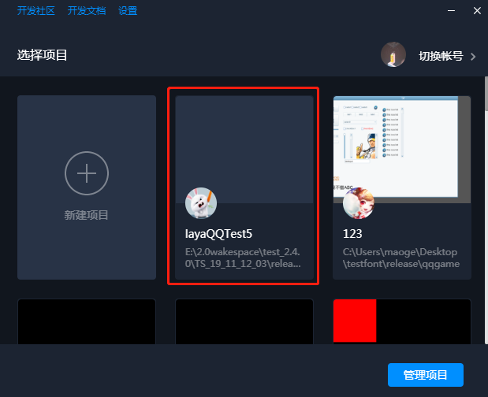
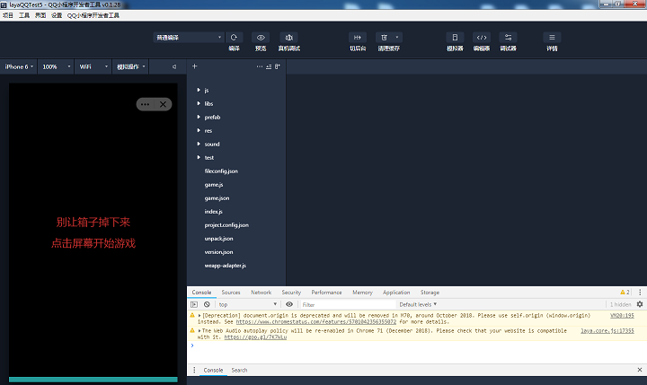

# QQ小游戏发布与调试指南

> update : 2019-11-12
>
> QQ小游戏的发布必须要使用LayaAirIDE，关于IDE的下载使用相关，请查看相关文档，不在本篇介绍范围内。

## 1、QQ小游戏发布、调试环境准备

1、安装了手机QQ客户端的手机

2、下载安装QQ小游戏的开发者工具。[[下载页面]](https://q.qq.com/wiki/tools/devtool/#%E8%AF%B4%E6%98%8E)

进入页面后，点击 立即下载 ，即可下载安装。

## 2、QQ小游戏发布与接入完整流程

### 1、发布QQ小游戏项目

LayaAirIDE的发布功能，内置了QQ小游戏的发布功能，需要先将LayaAir引擎的项目，通过发布功能生成手机QQ小游戏项目。关于发布功能的使用。这里不重复介绍了。不会的可以前往官网文档查看。

**注意** ：在QQ小游戏中默认 `Config.useRetinalCanvas = true` （使用物理像素模式）。

链接：[https://ldc2.layabox.com/doc/?nav=zh-ts-3-0-6](https://ldc2.layabox.com/doc/?nav=zh-ts-3-0-6)

### 2、打开在QQ的开发者工具中打开发布的项目

发布小游戏后，打开QQ开发者工具点击 ”新建项目“ 按钮，打开添加项目界面。

**项目目录**：将拷贝的路径填入项目目录中，或者点击右边的按钮选择自己的小游戏项目路径。

**AppID** ：开发者如果有自己的AppID，可以填写自己的AppID。没有的话可以点击使用 **小游戏测试号**。

**项目名称**：可以根据自己的需求调整。

点击确认后即可导入自己的小游戏项目了。

 

### 3、打开自己的项目

会返回项目选择界面，开发者点击自己刚才添加的项目即可打开项目。

 

 

至此，QQ小游戏从发布到启动完整流程已介绍完。如果想了解关于更多QQ小游戏的接入流程与文档介绍，可以前往QQ小游戏官方文档网站：

 https://q.qq.com/wiki/ 

## 本文赞赏

如果您觉得本文对您有帮助，欢迎扫码赞赏作者，您的激励是我们写出更多优质文档的动力。

