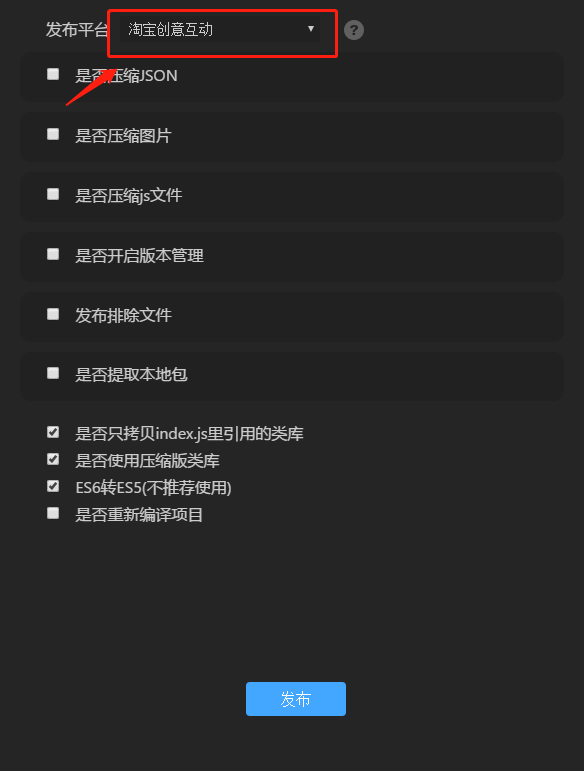
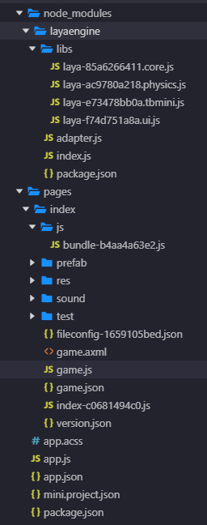
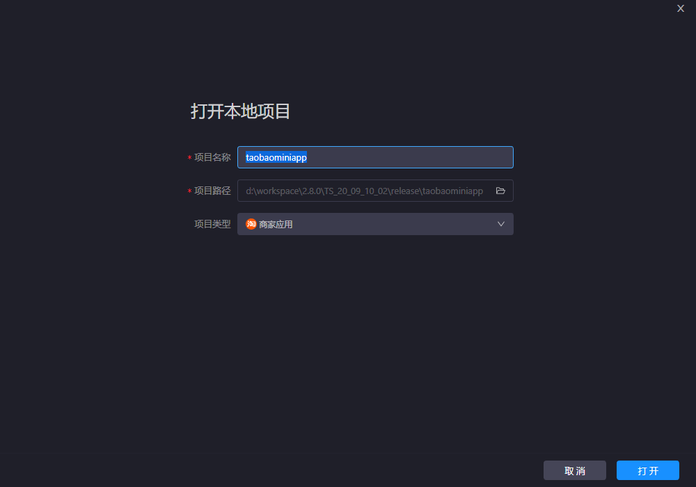
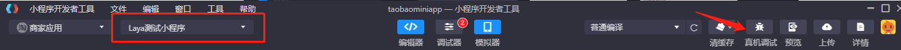
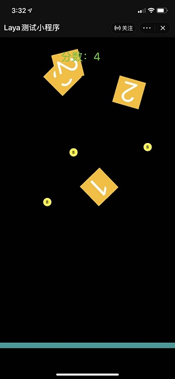
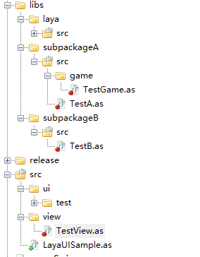

# 创建第一个淘宝创意互动项目
### 一、准备好开发环境

#### 1、下载并安装LayaAirIDE集成开发环境

LayaAirIDE是LayaAir引擎的集成开发环境，集成了LayaAir引擎与示例项目，UI、动画等可视化编辑，项目代码编写与管理等开发工具。

在**LayaAirIDE_2.8.0 Beta4** 以后的版本开发者可以发布 **淘宝创意互动项目**。

地址下载 : [地址](https://ldc2.layabox.com/layadownload/?language=zh&type=layaairide-LayaAir) 

#### 2、下载并安装淘宝创意互动开发者工具

开发者工具主要用于小游戏产品的预览与调试、真机测试、上传提交等。是小游戏开发的必备工具。

**开发工具下载地址**：[[地址]](https://miniapp.open.taobao.com/docV3.htm?spm=a21224.home.0.0.4acb18fcvRH16D&docId=117317&docType=1)


### 二、用LayaAirIDE创建和发布淘宝创意互动项目

#### 1、用LayaAirIDE发布淘宝创意互动项目示例

1.0引擎需要手动自己初始化淘宝创意互动适配库，

在引擎初始化之前加上适配代码 ：

```typescript
as3: TBMiniAdapter.init();   js或ts：Laya['TBMiniAdapter'].init();
```

2.0以上的引擎已经不需要做适配操作，只需将编译好的项目发布时候选择淘宝创意互动项目即可,如图点击红色小方块发布按钮，在发布平台栏目选择淘宝创意互动项目。

<br>

配置好发布需要的内容后。最终点击发布。即可生成淘宝创意互动项目。

项目结构：

<br>


- app.css ：应用的全局样式文件，一般不需要修改。[查看详细说明](https://miniapp.open.taobao.com/docV3.htm?docId=117171&docType=1&tag=dev)

- app.js：注册应用，获取应用的启动、显示、隐藏等消息。[查看详细说明](https://miniapp.open.taobao.com/docV3.htm?docId=117174&docType=1&tag=dev)

- app.json：应用的配置文件。[查看详细说明](https://miniapp.open.taobao.com/docV3.htm?docId=117457&docType=1&tag=dev)

- mini.project.json：用于配置项目用到的文件格式，如果用到了特殊的文件格式，需要在这配置

- package.json：项目描述文件

- node_modules/layaengine:导出项目所使用到的 Layaair 引擎。

- pages/index 文件夹：

  > 导出后，开发者的资源与项目JS，位于的淘宝创意互动的 `pages/index/` 目录下：

  - game.axml：入口的页面结构
  - game.json：界面相关json
  - game.js: 入口类
  - tools 文件夹：一些工具类，不要修改
  - 其他与开发者 `bin` 目录下保持一致


### 三、使用开发者工具打开项目

#### 1、创建项目

打开”小程序开发者工具“，在弹出的面板里，选择 “淘宝” => "商家应用"。并且点击页面右上角的 "打开项目"选项

 

 在弹出的页面中选择刚才发布的淘宝创意互动项目路径，选择好目录后如下图所示：

  

#### 2、小程序开发者工具的编译

完成小游戏项目的创建后，并且 “关联商家应用“ 即可在工具内预览效果和调试。

 <br>

**TIPS:**

> 在IDE内暂无预览效果，另外会有些报错信息，但是这些都没有影响。真机调试是可以正常运行的。s

点击 **真机调试/预览** ，用淘宝App扫描弹出的二维码可以真机预览效果：

<br>

更多关于开发工具的详情请访问：[官方地址](https://miniapp.open.taobao.com/docV3.htm?spm=a21224.home.0.0.4acb18fcvRH16D&docId=117317&docType=1)

### 四、注意事项

1.目前淘宝创意互动不支持ES6以上的代码，所以必须勾选ES6转ES5（或者开发者自行进行转换）。

2.加载的本地资源时默认的根目录为导出时的目录，即 `pages/index` 目录。开发者可以通过 `Laya.TBMiniAdapter.baseDir` 修改。

```typescript
//修改本地资源的目录为淘宝创意互动项目根目录
Laya.TBMiniAdapter.baseDir = "";
```

3.淘宝创意互动将在后续版本不再开放 request 相关功能（即XMLHTTPRequest），请开发者自行使用云函数代替。

4.没有全局作用域 `window` ，需要使用 `$global.window`。

5.淘宝创意互动 `Laya.stage.alignV`（@default : **top** ） 与 `Laya.stage.alignH`（@default : **left**） 都只支持默认值。

6.暂不支持实验版 TS 项目。

7.不支持横屏模式。

### 五.关于全局变量

淘宝创意互动项目没有全局作用域 `window`，引用时需要开发者修改代码。
例如有2个js，a.js 和 b.js

```javascript
//a.js 中的内容：
var a = function(){
    console.log("a")
}

//b.js 中的内容：
var b = function(){
    console.log("b")
}
```

然后我们引用 js，调用2个方法，在 H5 上是可以正常输出内容的。

```javascript
require("a.js")
require("b.js")

a(); //a
b(); //b
```

但是在淘宝创意互动项目中是不支持这种写法的，需要把这 2 个方法挂载到全局变量 `$global.window` 上，修改如下：

```javascript
//a.js 中的内容：
var a = function(){
    console.log("a")
}
$global.window.a = a;

//b.js 中的内容：
var b = function(){
    console.log("b")
}
$global.window.b = b;
```

然后我们引用 js，调用 2 个方法，也要通过全局变量引用

```javascript
require("a.js")
require("b.js")

$global.window.a(); //a
$global.window.b(); //b
```

**AS3项目特别注意！**

AS3编译出来的 js 代码会在window下补全 `package` 信息并且使用此 `package` 路径。

<br>

例如 `view/TestView.as` 可以通过 window.view.TestView 访问。

如果此时针对项目使用 module.def 分包，例如:

```
module:"a"
path:"../../libs/subpackageA/src"
module:"b"
path:"../../libs/subpackageB/src"
```

在外部包引用这两个分包里的代码时，会编译生成以下引用代码：

```javascript
//编译生成
var TestA=Laya.TestA,TestB=Laya.TestB,TestGame=game.TestGame;
```

如果直接运行会出现 `game is not defined` 报错，此时开发者需要自行补充对 game 的定义：

```javascript
//例如在该js的最开头,注意js的引用顺序，此时$global.window.game的game为package.game生成的对象
var game = $global.window.game
```

**注意**：LayaAirIDE会对src下的文件夹进行cache捕捉使用的对象，但是如果cache失败了，或者非src下的代码，还是会需要开发者自行补充定义。

