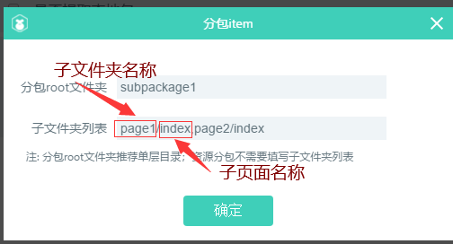
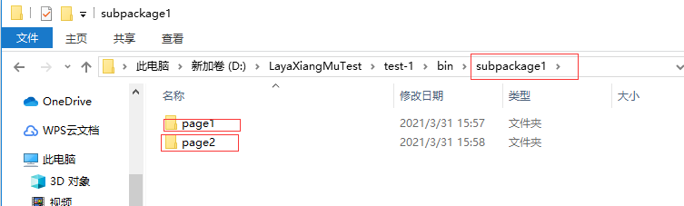
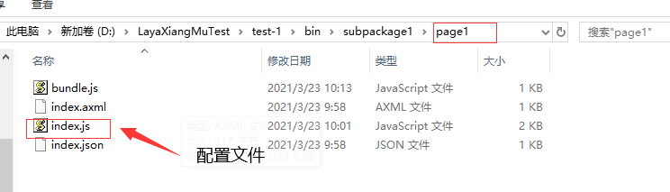
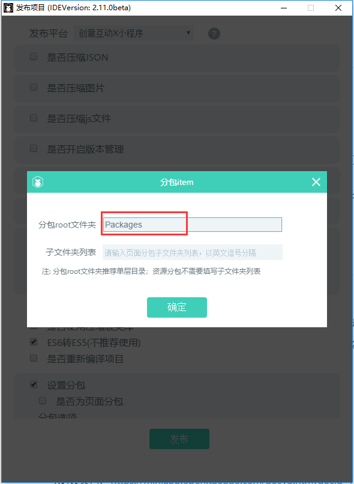
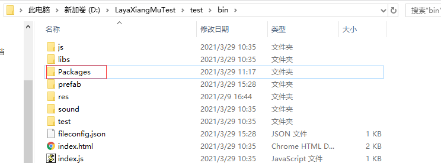
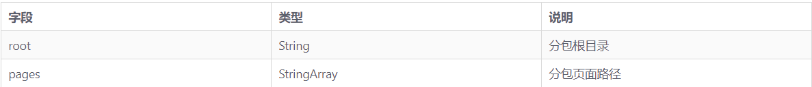
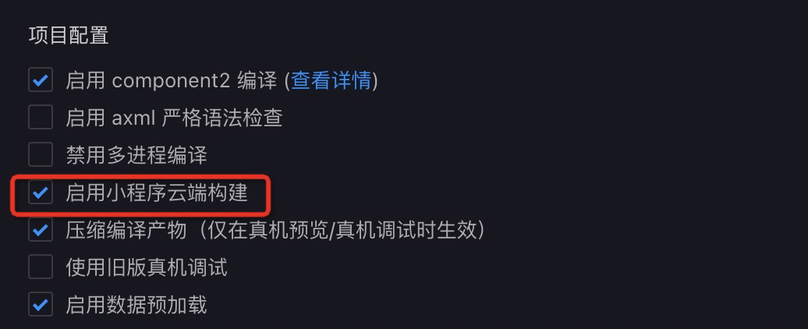

# 淘宝资源分包指南

> ***author：LZY update：2021-3***


## 一、判断是否需要分包

在我们打算分包之前，需要先分析下我们的项目是否真的有分包的需求，在这里大家可以根据下面的建议来判断是否需要进行分包。


### 使用建议

1. 对体积较大的小程序项目，或JS执行时间过长，建议使用此功能。
2. 主包只保留最常用的核心页面（首页、tabBar 页面和其他公共资源），将小程序中不经常使用的页面放到多个分包中，启动时只加载主包，使用时按需下载分包，不要一次性下载整个代码包，以提升首页启动速度。
3. 对于包含大量资源文件的互动类型小程序，可以将资源文件也进行分包，然后通过调用my.loadSubPackage接口加载分包资源，以提升用户体验。
4. 如果小程序由不同的团队协作开发，建议使用此功能。
5. 小程序最大限制是 2M，如果超过了可以进行代码优化，删除一些不必要的依赖包；或者把一些图片放到服务器中远程加载来减小包的大小。以上手段均已尝试，且仍然超过了大小限制，则可以使用小程序分包。
6. 希望大家能先认真阅读了淘宝的分包加载文档之后再开始着手分包，链接如下：[淘宝分包加载](https://open.taobao.com/docV3.htm?spm=a219a.7386797.0.0.7f6c669aQkYiVg&source=search&docId=119146&docType=1#ss2)


## 二、分包的使用方法

### 1  IDE中的准备

#### 1.1 页面分包

在进行页面分包的时候，我们需要注意，我们需要提前在工程的bin文件夹下自己新建上与分包root文件夹名字相同的文件夹。在有多个子文件夹的时候，我们需要在子文件夹中将子分包名称和自分包下的配置文件名称都写出来，中间加“ / ”号来连接，每一个子分包名称要用英文逗号隔开。如下图所示

例：

  

------



 

------

 


#### 1.2 资源分包

在进行资源分包前，我们需要注意。在发布面板上的分包选项中，我们需要提前在工程的bin文件夹下自己新建上与分包root文件夹名字相同的文件夹。

比如说在发布面板上我们在root文件夹里使用的名称是“Packages”，那么，相应的在bin文件夹下，我们应该新建一个同名的“Packages”资源文件。

例：

  


> **`在资源分包的时候是不需要填写子文件夹的，所以即使填写上了，程序运行的时候也会忽略掉。`**
>
> **`资源分包和页面分包在工程中只能二选一。`**


### 2、配置分包文件方法

#### 2.1 页面分包

页面分包适合页面数量较多的小程序，将页面合理拆分到若干个分包后，容器层会负责在合理的时机加载分包，无需开发者主动加载。

一个淘宝页面分包的小程序目录如下：

```
├── app.acss 
├── app.js 
├── app.json 
├── packageA 
│     └── pages 
│             ├── page1 
│             └── page2 
├── packageB 
│     └── pages 
│             ├── page3 
│             └── page4 
└── pages  
      ├── common  
      └── index
```

我们LayaIDE中已经在 `app.json` 文件的 `subPackages` 字段中声明小程序的分包结构：

```
{  
    "pages": [  
      "pages/index",
      "pages/common"  
    ],  
    "subPackages": [  
      {  
        "root": "packageA",
        "pages": [  
           "pages/page1",  
           "pages/page2"  
        ] 
      }, 
      {  
        "root": "packageB", 
        "pages": [ 
           "pages/page3",
           "pages/page4"
        ]  
      } 
   ] 
}
```

`subPackages` 字段的配置说明如下：




开发者需要自己去加载分包和资源 

```
onConfigLoaded(): void {
		Laya.stage.on(Laya.Event.CLICK, this, this.toPage2)
	}
	
	toPage2(): void {
		my.redirectTo({
			url: "/subpackage1/page2/index",
			success: function () {
				console.log("success")
			},
			fail: function (err) {
				console.log("2222", err)
			}

		})
	}
```

注意：在加载资源的时候，分包文件夹名称前也需要加“ / ”


#### 2.2 资源分包

资源分包适合页面数量较多的小程序，将页面合理拆分到若干个分包后，容器层会负责在合理的时机加载分包，无需开发者主动加载。

一个淘宝资源分包的小程序目录如下：

```
├── app.acss 
├── app.js 
├── app.json 
├── packageA 
│     ├── xxx1.png 
│     └── xxx2.png 
├── packageB 
│     ├── yyy1.png 
│     └── yyy2.png 
└── pages  
      ├── common  
      └── index
```


我们LayaIDE中已经在 `app.json` 文件的 `subPackages` 字段中声明小程序的分包结构：

```
{  
    "pages": [ 
       "pages/index",  
       "pages/common"  
    ],  
    "subPackages": [ 
      { 
        "root": "packageA" // 这里只需要填写root，和调用加载分包api中的name对应 
      }, 
      {  
         "root": "packageB" 
      }  
    ], 
    "subPackageBuildType": "shared" //必须 
}
```

> **分包接口中一定要注意只需要填写root，必须要和加载分包api中的name对应**

在 `mini.project.json` 文件中声明如下：

```
"enableEnhancedBuild": true, // 必须 
"include":["packageA/**","packageB/**"] //必须 
```

开发者需要自己去加载分包和资源 

```
my.loadSubPackage({  
    name: 'packageA',  
    success: (res) => {
        this.setData({
            subpackageReady:true
        })
        console.log("download success")
    },
    fail: function (res) {
        console.log(res)
        console.log("download fail")
    }
}) 
```


## 四、分包构建

完成上述分包配置后，开发者需要在淘宝开发者平台 -> 「项目配置」 勾选 「启用小程序云端构建」

> 注意：一定要勾选启用小程序云端构建，否则分包无效。




## 五、分包大小限制

- 整个小程序所有分包大小不超过 **20MB**。
- 单个分包或主包大小不能超过 **2MB**。


